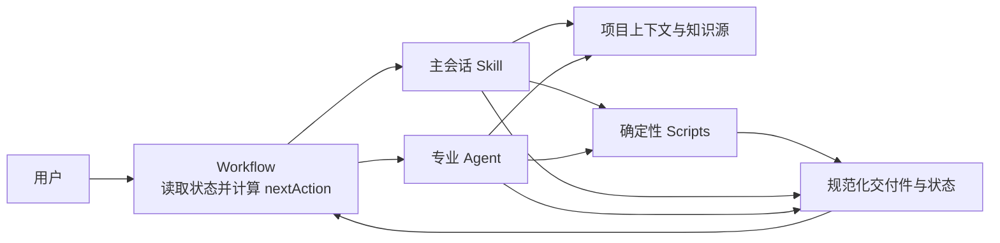

# scc-dev-sphere

`scc-dev-sphere` 是一个面向 Feature 交付的 Claude Code Plugin：它用主会话 Skill、专业 Agent、人工批准和确定性脚本，把需求提案逐步推进为 Requirement、Design Baseline、Implementation Plan、代码变更和验证交付件。

项目当前只实现 Feature 工作流，不提供独立 Agent Runtime，也不替代 Claude Code 的会话、Agent 调用、权限和工具执行机制。

## 目录

- [项目简介](#项目简介)
- [核心能力](#核心能力)
- [工作原理](#工作原理)
- [快速开始](#快速开始)
- [Feature 交付流程](#feature-交付流程)
- [Agent、Skill 与脚本](#agentskill-与脚本)
- [知识查询与知识源配置](#知识查询与知识源配置)
- [项目结构](#项目结构)
- [本地开发与验证](#本地开发与验证)
- [当前边界](#当前边界)
- [详细文档](#详细文档)
- [贡献与许可证](#贡献与许可证)

## 项目简介

这个插件用于需要保留需求、设计、批准、实现和验证依据的软件 Feature 交付场景。它解决的重点不是“自动生成所有内容”，而是让 Claude Code 在可恢复的任务工作区中：

- 先澄清目标、范围和验收，再进入设计；
- 在主会话中协作完成业务、方案、实现和测试设计；
- 通过结构 Lint、隔离 Checklist Review 和人工批准保护正式 Baseline；
- 将已批准设计交给开发 Agent 规划、实现和验证；
- 在需要外部事实时，按问题语义查询已配置的知识源；
- 用磁盘上的状态和交付件计算下一项合法动作。

流程状态和交付件保存在目标项目的 `.devsphere/` 中，可用于继续会话、检查进度和追溯批准依据。

## 核心能力

- **Feature 初始化**：保存原始需求提案，创建任务工作区并设为当前任务。
- **需求澄清**：收敛问题、目标、范围和验收，经独立 Review 与用户批准后发布 Requirement Baseline。
- **协作式设计**：依次完成 Business、Solution、Implementation 和 Test Design；每次设计都经历分析、Draft、Lint、隔离 Review、人工批准和 Baseline 发布。
- **总体设计批准**：确认当前 Feature 所需的全部 Design Baseline 后，才允许进入实现规划。
- **实现规划与开发**：由 `dev` Agent 生成 Implementation Plan、执行代码变更并记录范围偏差和 diff 摘要。
- **实现验证**：运行计划中的本地检查并生成测试交接材料；只有验证阶段可以把任务标记为 `completed`。
- **知识查询**：`knowledge-query` Agent 从 Skill、Local、Repo、MCP 和 Web 来源中按需选取相关来源并返回带最小来源的自然语言结论。
- **知识源配置**：`knowledge-config` Skill 查询、修改或新增项目级知识源配置。
- **流程导航**：`workflow` 计算下一项动作，`status` 只读展示任务、Baseline、Review、批准和后续建议。

## 工作原理



- **Workflow** 读取当前 Feature 的持久化状态，由 resolver 返回 `nextAction.skill`、执行者和所需交付件；它不自行执行设计或代码工作。
- **Agent** 定义专业角色、职责边界和工具权限。当前实现规划、开发和验证由 `dev` 承担，设计评审与知识查询使用隔离 Agent。
- **Skill** 定义可复用的工作方法、人工闸口、输入输出和完成标准。没有 Agent 的阶段直接在主会话执行；需要 `dev` 的阶段由 Workflow 委派。
- **Scripts** 处理适合机器判断的状态读写、下一步解析、配置管理、hash、结构 Lint、Review/Approval 绑定和 Baseline 发布。
- **Artifact** 是跨阶段消费的正式事实载体；`work/` 中的 Draft 和临时 Review 只服务于当前阶段恢复与校验。

## 快速开始

### 环境要求

- **Claude Code**：负责加载 Plugin、执行 Skill 和调用 Agent。仓库未声明最低版本。
- **Node.js**：运行仓库中的 CommonJS 脚本和 `node:test` 合同测试。仓库未声明最低版本，也没有第三方运行时依赖或安装步骤。

当前仓库只有插件清单 `.claude-plugin/plugin.json`，没有 marketplace 清单、发布地址或经过仓库固化的安装命令。开发态请把仓库根目录作为本地 Claude Code Plugin 加载；具体加载参数以所用 Claude Code 版本的本地插件机制为准。加载后可先在仓库根目录验证结构：

```bash
claude plugin validate --strict .
```

### 启动第一个 Feature

在已经加载插件的 Claude Code 会话中，进入需要交付 Feature 的目标项目，然后依次调用：

```text
/scc-dev-sphere:feature-init
/scc-dev-sphere:workflow
/scc-dev-sphere:status
```

`feature-init` 会在会话中收集需求描述和任务 ID，并创建 `.devsphere/tasks/feature/<task-id>/`。之后反复调用 `workflow`；它会根据当前状态展示并确认下一项合法动作。`status` 只读查看当前进度，不推进流程。

如果项目还没有活动 Feature，直接调用 `workflow` 也会提示先使用 `feature-init`。

## Feature 交付流程


| 阶段 | 目标 | 执行者 | 主要交付件 |
|---|---|---|---|
| 初始化 | 保存原始提案并建立 Feature 工作区 | 主会话 `feature-init` | `inputs/proposal.md`、`state.json` |
| 需求澄清 | 形成可独立理解且获批的 Requirement Baseline | 主会话 `feature-clarify`，独立 Reviewer Subagent | `inputs/requirement-draft.md`、`inputs/requirement.md` |
| 协作式设计 | 完成当前专业设计，并通过 Lint、隔离 Review 和人工批准 | 主会话 `feature-design`、`design-reviewer` | `work/<design-slug>/draft.md`、`artifacts/<design-slug>.md` |
| 总体设计批准 | 批准当前 Feature 所需的 Baseline 集合 | 主会话 `feature-approve` | `approvals/design-final-approval.json` |
| 实现规划 | 绑定代码仓并形成可执行计划 | `dev` Agent + `feature-plan-implementation` | `implementation/implementation-plan.md`、`links/repos.json` |
| 开发实现 | 按批准计划修改代码、验证并记录 diff | `dev` Agent + `feature-implement` | 代码变更、`implementation/implementation-log.md` |
| 实现验证 | 汇总本地检查并准备测试交接 | `dev` Agent + `feature-verify` | `verification/test-handoff.md` |

默认 Feature 要求四类 Design Baseline。外层 Workflow 按以下顺序选择尚未完成的类型，并在进入下一类型前校验上游 Baseline：

```text
Requirement → Business Design → Solution Design → Implementation Design → Test Design
```

顶层状态依次覆盖 `initialized`、`clarified`、`designing`、`design_ready`、`approved_for_implementation`、`implementation_planned`、`implementing`、`verification_ready` 和 `completed`；无法继续时可以进入 `blocked`。完整路由以 [`scripts/workflows/feature-workflow.js`](scripts/workflows/feature-workflow.js) 为准。

## Agent、Skill 与脚本

### Agent

| Agent | 核心职责 | 在当前流程中的调用点 |
|---|---|---|
| [`dev`](agents/dev.md) | 实现计划、代码落地、本地验证和开发风险反馈 | Workflow 在实现规划、开发实现和验证阶段委派 |
| [`cie`](agents/cie.md) | 部署、配置、流水线和环境风险评估 | 按风险需要使用，不在默认 Workflow 派发链路中 |
| [`design-reviewer`](agents/design-reviewer.md) | 对冻结 Design Draft 串行执行全部适用 Checklist，并维护临时 Review 摘要 | `feature-design` 在 Draft 通过 Lint 后调用 |
| [`knowledge-query`](agents/knowledge-query.md) | 只读查询相关知识源，返回可追溯的自然语言结果 | 主会话或 `design-reviewer` 在事实不足时调用 |

这些 Agent 的 frontmatter 当前都没有预加载 Skill；Workflow 或调用方把 Skill 名称、任务上下文和交付件路径传给对应 Agent。`dev` 再根据实现影响面使用开发专项 Skill 的方法。

### Skill

| 类别 | 当前 Skill |
|---|---|
| 工作流入口 | [`workflow`](skills/workflow/SKILL.md)、[`status`](skills/status/SKILL.md) |
| Feature 生命周期 | [`feature-init`](skills/feature-init/SKILL.md)、[`feature-clarify`](skills/feature-clarify/SKILL.md)、[`feature-design`](skills/feature-design/SKILL.md)、[`feature-approve`](skills/feature-approve/SKILL.md)、[`feature-plan-implementation`](skills/feature-plan-implementation/SKILL.md)、[`feature-implement`](skills/feature-implement/SKILL.md)、[`feature-verify`](skills/feature-verify/SKILL.md) |
| 开发专项 | [`backend-development`](skills/backend-development/SKILL.md)、[`frontend-development`](skills/frontend-development/SKILL.md)、[`fullstack-change-planning`](skills/fullstack-change-planning/SKILL.md) |
| 知识配置 | [`knowledge-config`](skills/knowledge-config/SKILL.md) |

三个开发专项 Skill 不是默认 Workflow 阶段，也没有在 `dev` frontmatter 中预加载；`dev` 根据后端、前端或全栈变更影响面按需采用。

### 确定性脚本

[`scripts/`](scripts/) 中的 Node.js 脚本负责：

- 创建 `.devsphere` 工作区并读写顶层状态；
- 按 Feature 状态计算下一项 Skill 和执行者；
- 检查 Design Draft 结构、hash、Review、Approval 和 Baseline 一致性；
- 维护 Evidence、Decision 和知识源配置；
- 为关键入口、Evidence 和配置写入提供 Hook 守卫；
- 通过 [`scripts/test/`](scripts/test/) 中的合同测试验证上述行为。

## 知识查询与知识源配置

### 查询行为

`knowledge-query` 先读取当前生效配置，再根据自然语言问题和每个来源的 `description` 选择一个或多个最相关来源。若已有结果仍有缺口，它只扩展到描述明确相关的其他来源，不固定遍历全部来源。

支持的来源类型为：

| 类型 | 目标 |
|---|---|
| `skill` | 知识查询 Skill 名称 |
| `local` | 本地知识目录 |
| `repo` | 代码仓或项目路径 |
| `mcp` | 当前环境可用的 MCP 查询能力名称 |
| `web` | 外部公开信息，无单独 target |

查询结果使用自然语言表达，并为事实保留足以定位依据的最小来源。不同来源发生冲突时并列呈现，不替调用方裁决。Agent 禁止写文件、调用其他 Agent 或维护查询运行时状态；是否采用结论，以及是否登记为 Evidence，由外层主会话决定。

### 配置与生效规则

- 插件默认配置：[`config/knowledge-sources.json`](config/knowledge-sources.json)
- 项目配置：`.devsphere/config/knowledge-sources.json`
- 项目配置不存在时，读取插件默认配置。
- 第一次修改或新增来源时，脚本以默认配置创建完整的项目配置，再应用变更。
- 项目配置一旦存在，它就是唯一生效配置，不与默认配置逐项合并。
- 非 Web 来源只有在启用且至少包含一个带非空 `description` 的有效目标时才实际生效；Web 需要启用且具有非空 `description`。

在 Claude Code 中可调用：

```text
/scc-dev-sphere:knowledge-config
```

然后用自然语言要求它“查询当前配置”“禁用已有 Repo 来源”或“新增一个 Skill 来源”。Skill 会通过确定性脚本修改配置并回读验证。

在插件仓库根目录调试脚本时，可以把当前目录作为目标项目执行以下真实命令：

```bash
# 查询当前生效配置
node scripts/knowledge-query.js show-config "$PWD"

# 修改来源类型的启用状态
node scripts/knowledge-query.js update-config "$PWD" sources.repo.enabled false

# 新增 Repo 来源；同一 type + target 已存在时更新其 description
node scripts/knowledge-query.js upsert-source "$PWD" repo . "当前项目的代码、测试和文档"
```

这些写操作会创建或更新当前目录下的 `.devsphere/config/knowledge-sources.json`。完整的交互约束见 [`knowledge-config` Skill](skills/knowledge-config/SKILL.md)，CLI 行为见 [`scripts/knowledge-query.js`](scripts/knowledge-query.js)。

## 项目结构

```text
.
├── .claude-plugin/        # Claude Code Plugin 元数据
├── agents/                # 专业 Agent 定义与工具权限
├── skills/                # 工作流、Feature 生命周期和专项方法
├── scripts/               # 状态、路由、配置和合同校验脚本
│   ├── workflows/         # taskType 对应的确定性 resolver
│   └── test/              # Node.js 合同测试
├── hooks/                 # 高风险入口和受保护写入的 Hook 配置
├── config/                # 插件默认知识源配置
├── docs/                  # 工作流、设计、治理和研究文档
└── README.md              # 项目入口与使用导航
```

目标项目中的运行时工作区不属于插件源码，结构如下：

```text
.devsphere/
├── current-task.json
├── config/knowledge-sources.json
└── tasks/feature/<task-id>/
    ├── state.json
    ├── inputs/
    ├── work/
    ├── artifacts/
    ├── approvals/
    ├── implementation/
    ├── verification/
    ├── links/
    ├── decisions/
    └── evidence/
```

## 本地开发与验证

仓库没有 `package.json`、构建命令、lint/format 脚本或第三方依赖安装步骤。修改插件后，在仓库根目录运行：

```bash
node --test scripts/test/*.test.js
claude plugin validate --strict .
git diff --check
git status --short --untracked-files=all
```

前三项分别验证脚本合同、插件结构和补丁格式；最后一项用于确认修改范围，不是质量门禁。

## 当前边界

- 插件依赖 Claude Code 的 Plugin、Skill、Agent、Hook 和会话能力；仓库没有声明其他宿主的兼容性。
- Workflow resolver 当前只支持 `feature` taskType，不支持通用任务编排。
- 插件不实现独立 Agent Runtime、Agent 生命周期或后台调度服务。
- Requirement、各 Design Baseline、总体设计、首次代码变更和部分高风险计划仍需要人工确认。
- Knowledge Query 只提供只读事实查询和冲突呈现，不裁决哪个来源正确，也不自动把查询结果登记为 Evidence。
- `frontend-development` 提供页面、组件、交互、状态和 API 适配上下文；仓库没有独立的多模态 UI 设计流程或交付件合同。
- `cie` 是按需角色，当前默认 Workflow 不会自动派发它。

## 详细文档

- [完整中文使用指南](docs/guides/scc-dev-sphere-user-guide.md)：面向实际使用者的工作空间、Feature 生命周期、阶段输入输出、人工闸口、恢复、故障处理和端到端示例。
- [SDLC Agentic Workflow](docs/workflows/sdlc-agentic-workflow.md)：Feature 主流程、Review、批准和失败处理概览。
- [Feature Design Skill-first 重构设计规格](docs/design-refactor/06-skill-first-feature-design-refactor.md)：主会话协作设计、职责边界和恢复模型。
- [Feature Design Evidence/Decision 维护规格](docs/design-refactor/08-feature-design-evidence-decision-maintenance.md)：Evidence 与 Decision 的准入和维护边界。
- [Artifact Contract](docs/governance/artifact-registry-contract.md)：正式 Artifact 的标识、依赖和 hash 合同。
- [Feature Design 领域语言](docs/matt/CONTEXT.md)：当前设计术语和语义边界。
- [Knowledge Config Skill](skills/knowledge-config/SKILL.md)：知识源配置的查询、修改和新增方法。
- [Agent 定义](agents/) 与 [Skill 定义](skills/)：各角色和方法的当前可执行契约。

`docs/raw/` 和 `docs/superpowers/` 包含历史需求、研究或实施计划，不应代替当前 Agent、Skill 和脚本作为运行时事实来源。

## 贡献与许可证

仓库当前没有单独的 `CONTRIBUTING.md`、Issue 模板或已配置的公开反馈地址。提交改动前，请先运行[本地开发与验证](#本地开发与验证)中的命令，并确保变更没有把历史设计重新引入当前运行时契约。

本仓库根目录的 [`LICENSE`](LICENSE) 是 [Apache License 2.0](https://www.apache.org/licenses/LICENSE-2.0)。
