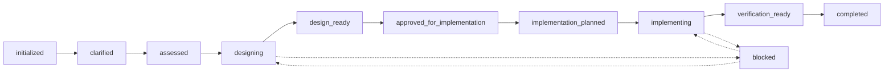
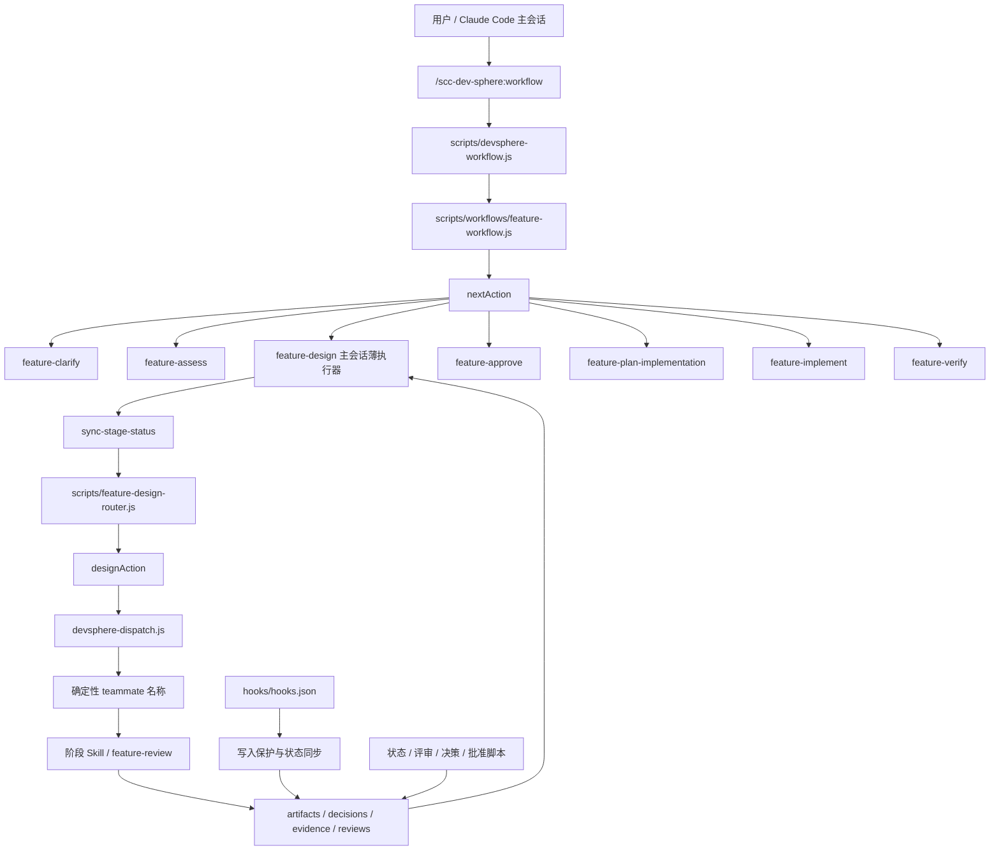
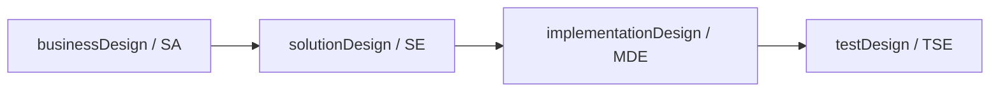
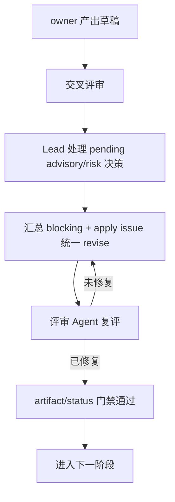

# scc-dev-sphere

> 面向 Claude Code 的可编排、可审计、人机协同研发流程插件。

`scc-dev-sphere` 将需求研发过程拆成可持久化的任务状态、设计产物、决策、证据、评审和批准记录，再使用 Claude Code 原生的 Skills、Agents、Hooks 与 Node.js 脚本推进流程。

它不是独立的 Agent runtime，也不是一个 npm 应用：

- Claude Code 负责承载主会话、teammate 和用户交互。
- Skills 负责领域方法和执行契约。
- Agents 负责 SA、SE、MDE、DEV、TSE、CIE 等角色视角。
- Hooks 负责写入保护、决策门禁和事实同步。
- Node.js 脚本负责状态读写、路由、评审矩阵和确定性校验。

当前仓库已经实现 Feature 研发 golden path；`taskType` 是后续接入 Bugfix 等研发流程的扩展边界。

## 设计目标

### 产物与状态驱动

流程不依赖某个 Agent 是否“感觉完成”。需求、设计文档、评审矩阵、决策和批准记录落盘后，workflow resolver 根据持久化事实计算下一步动作。

### 分层编排

任务级 workflow 与设计阶段 workflow 是两层不同的编排：

- 任务级 workflow 决定当前任务应该进入澄清、评估、设计、批准、实现计划、实现还是验证。
- 设计 workflow 只在任务进入 `designing` 后启动，负责业务、方案、实现、测试四个设计阶段及其评审修订循环。

主干 workflow 不选择具体设计子阶段，也不生成设计 teammate prompt；设计 workflow 也不替代任务级状态路由。

### 人机协同门禁

自动化只覆盖可以确定性判断的部分。需求最终确认、工作流模式选择、设计批准、风险接受和首次代码变更等动作保留在主会话，由 Lead 使用 `AskUserQuestion` 完成。teammate 不能直接向用户提问，需要把决策记录交给 Lead 代问。

### 可追溯闭环

每个重要结论都应能回溯到用户确认、知识证据、设计决策、评审 issue 或批准记录。评审问题使用稳定的 issue ID，修订后由评审 Agent 复评并关闭原 issue，不通过创建影子 issue 维护状态。

## 当前 Feature 生命周期

正常任务生命周期为：



异常或不可继续时进入 `blocked`，处理阻塞原因后再回到允许的阶段。顶层 resolver 当前支持的 Feature 状态包括：

| 状态 | 下一步 | 主要产物或前置条件 |
| --- | --- | --- |
| `initialized` | `feature-clarify` | 原始需求已创建 |
| `clarified` | `feature-assess` | `inputs/requirement.md` 已完成用户确认 |
| `assessed` | 主会话运行 `feature-design` | `workflowMode` 已确认 |
| `designing` | 主会话继续运行 `feature-design` | 四个设计阶段按序推进 |
| `design_ready` | `feature-approve` | 集成设计和评审矩阵已满足批准前置条件 |
| `approved_for_implementation` | DEV 生成实现计划 | 最终设计批准记录 |
| `implementation_planned` | DEV 开始实现 | 实现计划和 repo 绑定 |
| `implementing` | 继续实现或补充验证 | 代码和实现日志 |
| `verification_ready` | `feature-verify` | 代码实现完成 |
| `completed` | 无 | 转测交付包已生成 |

## 架构分层



### 组件职责

| 组件 | 负责 | 不负责 |
| --- | --- | --- |
| `skills/workflow` | 主入口、任务列表/切换、执行 `nextAction` | 生成设计内容、维护 Agent ID |
| `scripts/devsphere-workflow.js` | 按 `taskType` 选择 resolver | 选择设计子阶段 |
| `scripts/workflows/feature-workflow.js` | 计算 Feature 任务级 `nextAction` | 直接派发设计 owner |
| `skills/feature-design` | 在主会话执行设计子编排循环 | 自行判断阶段路由 |
| `scripts/feature-design-router.js` | 根据 state、matrix、decisions 生成唯一 `designAction` | 直接调用 Agent 或写状态 |
| `skills/feature-design-*` | 具体领域设计方法，生成设计产物 | 跨阶段 workflow 决策 |
| `skills/feature-review` | 角色化评审、记录和复评 issue | 调用 `AskUserQuestion`、接受风险 |
| `agents/` | 提供角色上下文和评审视角 | 充当 workflow 主干 |
| `scripts/` | 状态、决策、矩阵、批准、派发 prompt 和守卫 | 生成业务或技术设计内容 |
| `hooks/` | 保护关键写入、校验 decisions、同步 artifact 事实 | 替代人工判断 |
| `templates/` | 定义任务产物和交付文件结构 | 维护流程状态 |

## 设计阶段 workflow

设计阶段固定按以下顺序推进：



每个阶段均遵循：



### 设计阶段 owner 与评审者

| 阶段 | owner | 主产物 | 默认评审者 |
| --- | --- | --- | --- |
| `businessDesign` | SA | `artifacts/business-design.md` | SE |
| `solutionDesign` | SE | `artifacts/solution-design.md` | SA、MDE、TSE |
| `implementationDesign` | MDE | `artifacts/implementation-design.md` | SE、DEV、TSE |
| `testDesign` | TSE | `artifacts/test-design.md` | SA、SE、MDE |
| `integrated-design` | 主会话流程 | `artifacts/integrated-design.md` | SA、SE、MDE、TSE |

当 `state.ciCdRisk === true` 时，设计阶段评审会按需追加 CIE，检查部署、配置、环境、流水线、数据迁移和发布风险。

### workflow mode

`feature-assess` 根据复杂度和风险推荐模式，用户在主会话确认后写入 `state.json`：

| 模式 | 设计阶段行为 | 人工决策边界 |
| --- | --- | --- |
| `auto-design` | 评审通过后自动推进非人工门禁阶段 | Agent 可自主处理设计决策；最终设计批准和代码首次修改仍需人工 |
| `collaborative-design` | `humanGateStages` 中的阶段需要人工批准，其余阶段自动推进 | 仅指定阶段的 gated decision 交由 Lead 代问 |
| `strict-human-loop` | 所有设计阶段均为人工门禁 | gated decision 和阶段批准均由 Lead 处理 |

workflow mode 由编排层使用；设计领域 Skill 只关心本阶段的输入、方法、产物和交接契约，不自行实现 workflow 分支。

### designAction

`feature-design-router.js` 是设计阶段的确定性决策点。它只读当前任务数据，每次返回一个动作：

| action | 含义 |
| --- | --- |
| `produce_draft` | owner 生成初稿、续稿或按 `reviewItems` 修订 |
| `ask_gated` | 存在 gated decision，Lead 逐项向用户确认 |
| `dispatch_reviews` | 按评审矩阵并行派发评审 teammate |
| `ask_review` | advisory/risk pending，Lead 代评审 Agent 向用户询问处理意见 |
| `human_approve` | 当前阶段产物通过评审，请用户批准阶段 |
| `design_phase_complete` | 四个设计阶段完成，进入集成设计或后续任务级流程 |
| `design_blocked` | 修订达到配置上限或 state 配置非法，停止并展示原因 |

router 输出的 `dispatchCmd` 交给 `devsphere-dispatch.js` 渲染为确定性 prompt，再由 Claude Code 以稳定 teammate 名称派发。router 不保存 agentId；恢复或重新拉起由主会话按 teammate 名称处理。

### review issue 闭环

评审矩阵中的 issue 类型和职责如下：

| 类型 | 评审含义 | 后续处理 |
| --- | --- | --- |
| `blocking` | 必须处理的问题 | 保持 open 会阻断 artifact 和 stage 通过；修订后由评审 Agent 复评 |
| `advisory` | 建议项 | Lead 询问用户 `apply` 或不处理；`apply` 的 open issue 进入统一 revise |
| `risk_candidate` | 风险候选 | Lead 询问用户是否修复或接受；需要修复的 open issue 进入统一 revise |

所有人工决定都写回原 issue，不创建新的 blocking 影子 issue。设计 Agent 只处理 router 给出的统一 `payload.reviewItems`，评审 Agent 负责复评：

- 已修复：使用原 issue ID 执行 `close --status closed`。
- 未修复：保持 open，并通知 Lead 继续 revise。
- Lead：记录 advisory/risk 的人工决定，以及 artifact 状态和阶段状态推进。

`set-status reviewed` 和阶段状态门禁会阻断以下情况：

- 存在 open blocking；
- 存在 pending advisory/risk；
- 存在仍为 open 且人工决定为 `apply` 的修订项。

### 修订循环上限

任务级 `state.json` 可配置设计修订上限：

```json
{
  "workflowMode": "auto-design",
  "humanGateStages": [],
  "designRevisionLimit": 25
}
```

- 新任务默认写入 `25`。
- 历史任务缺少该字段时按 `25` 兼容运行。
- 必须为正整数；非法值会使 router 返回配置阻断。
- 当前轮次仍由 artifact 中 open blocking issue 的最大 `round` 推导，未引入额外 revision counter。

## 角色模型

| Agent | 主要职责 | 典型产物/视角 |
| --- | --- | --- |
| SA | 业务分析、业务设计、业务一致性评审 | 业务规则、范围、术语、异常流程 |
| SE | 方案设计、系统架构评审 | 系统边界、接口、数据模型、集成约束 |
| MDE | 模块级实现设计、模块影响评审 | 调用链、模块拆解、实现可行性 |
| DEV | 实现计划、代码实现、验证和开发风险评审 | repo 绑定、实现日志、代码变更、验证结果 |
| TSE | 测试设计、可测性和回归风险评审 | 验收标准、测试策略、回归范围 |
| CIE | 按风险触发的部署、配置、CI/CD 评审 | 环境准备、发布、回滚和流水线检查清单 |

teammate 共享 `devsphere-teammate-conduct`：不能直接调用 `AskUserQuestion`，不能用 Write/Edit/Bash 直接写 `decisions/` 或设计关键产物，决策和 issue 必须通过对应 CLI 记录。

## 任务工作区与审计链

活跃任务由 `.devsphere/current-task.json` 指向，任务内容位于：

```text
.devsphere/
├── current-task.json
└── tasks/feature/<task-id>/
    ├── state.json                         # 任务状态、模式、阶段和修订上限
    ├── inputs/requirement.md               # 原始需求与澄清结论
    ├── artifacts/                         # 四阶段设计和 integrated-design
    ├── decisions/                         # gated/autonomous 决策记录
    ├── evidence/
    │   ├── evidence-registry.json         # 证据索引与缺口
    │   ├── knowledge/                     # EV 快照
    │   └── repository/                    # 代码仓证据
    ├── reviews/
    │   ├── review-matrix.json             # issue、reviewer、artifact 状态
    │   └── <artifact>/                    # 评审叙述文件
    ├── approvals/                         # 最终设计/计划批准
    ├── implementation/                    # implementation-plan/log
    ├── verification/                     # test-handoff
    ├── links/                             # repo 绑定
    └── quality-gates/                     # 可选的模板/质量门禁结果
```

### 关键状态层次

| 层次 | 事实源 | 写入职责 |
| --- | --- | --- |
| 任务状态 | `state.json.status` | workflow/feature Skill 按阶段推进 |
| 阶段状态 | `state.json.stages.*.status` | `sync-stage-status` 和 Lead 的阶段批准动作 |
| 人工/自主决策 | `decisions/*.json` | `devsphere-decisions.js` |
| review issue | `reviews/review-matrix.json` | `devsphere-review-matrix.js` |
| artifact review 状态 | review matrix artifact entry | Lead 在所有 issue 门禁满足后设置 |
| 最终批准 | `approvals/*.json` | `feature-approve` 或实现计划批准流程 |
| 验证交付 | `verification/test-handoff.md` | `feature-verify` |

`knowledge-query` 的采用事实需要保存 EV 快照并登记到 `evidence/evidence-registry.json`；知识不足时记录 gap，不把未经确认的推断伪装成事实。

## Hooks 与安全边界

`hooks/hooks.json` 当前配置了以下生命周期保护：

- `UserPromptExpansion`：进入 `feature-implement` 和 `feature-approve` 时检查任务前置条件。
- `PreToolUse Write|Edit`：人工门禁阶段禁止在 gated decision 未解决时写主设计产物，并校验 decisions JSON 内容格式。
- `PreToolUse Bash`：禁止用 Bash 直接写 `decisions/` 和 `artifacts/`，对应 CLI 调用保留豁免。
- `TeammateIdle`：teammate 空闲时再次扫描 decisions 文件，发现非法内容则阻止静默结束。
- `PostToolUse Write|Edit`：根据 artifact 是否存在同步阶段的确定性事实。

这些 Hook 是安全兜底，不替代 Lead 对风险、建议项和最终设计的判断。

## 使用方式

### 日常入口

在 Claude Code 中，推荐从主 workflow 推进：

```text
/scc-dev-sphere:feature-init
/scc-dev-sphere:workflow
/scc-dev-sphere:status
```

`workflow` 支持：

```text
/scc-dev-sphere:workflow list
/scc-dev-sphere:workflow switch <task-id>
```

任务级 workflow 会根据当前状态给出唯一的下一步。正常情况下不需要手动选择 SA、SE、MDE 或 TSE；设计阶段由 `feature-design-router` 决定 owner、评审者和动作。

### 专项入口

以下入口用于 workflow 自动推进、专家干预或故障恢复：

```text
/scc-dev-sphere:feature-clarify
/scc-dev-sphere:feature-assess
/scc-dev-sphere:feature-review --target <artifact>
/scc-dev-sphere:feature-approve
/scc-dev-sphere:feature-plan-implementation
/scc-dev-sphere:feature-implement
/scc-dev-sphere:feature-verify
/scc-dev-sphere:knowledge-query
/scc-dev-sphere:design-quality-gate --target <artifact>
/scc-dev-sphere:design-template-check --target <artifact>
```

`feature-design` 是主会话中的薄执行器；`feature-design-business`、`feature-design-solution`、`feature-design-implementation` 和 `feature-design-test` 通常由 router 派发给对应 teammate，不建议绕过编排器直接执行。

设计 teammate 依赖 Claude Code Agent Teams，需启用：

```bash
export CLAUDE_CODE_EXPERIMENTAL_AGENT_TEAMS=1
```

### 底层脚本诊断

仓库没有 `package.json`、构建步骤或独立服务。Node.js 脚本既可 CLI 调用，也可被其他脚本 `require()`：

```bash
# 读取任务级 nextAction
node scripts/devsphere-workflow.js <workspace-root>

# 查询当前任务和状态
node scripts/devsphere-state.js read-current-task <workspace-root>
node scripts/devsphere-state.js read-state <task-path>

# 设计阶段同步与路由
node scripts/workflows/feature-workflow.js sync-stage-status <workspace-root>
node scripts/feature-design-router.js <workspace-root>

# 创建任务工作区
node scripts/devsphere-workspace.js create-feature-task <workspace-root> <task-id> [workflow-mode]

# 决策和评审矩阵
node scripts/devsphere-decisions.js read <task-path> <artifact-slug>
node scripts/devsphere-review-matrix.js read <task-path>
node scripts/devsphere-review-matrix.js list <task-path>

# 门禁检查
node scripts/devsphere-guard.js check-implement <workspace-root>
node scripts/devsphere-guard.js check-approve <workspace-root>
node scripts/devsphere-guard.js check-advance <workspace-root> <target-status>
```

创建任务后，可以直接编辑该任务的 `state.json` 调整 `designRevisionLimit`，但必须使用正整数；缺失字段按默认值 `25` 处理。

## 项目结构

```text
.claude-plugin/plugin.json       # Claude Code 插件清单
agents/                          # SA / SE / MDE / DEV / TSE / CIE
hooks/hooks.json                 # 生命周期 Hook 配置
references/                      # AskUserQuestion 交互规范
scripts/                         # 状态、路由、评审、批准、派发和守卫
scripts/workflows/               # taskType 专属 resolver
scripts/test/                    # Node.js node:test 测试
skills/                          # slash command 与阶段 Skill
templates/                       # artifacts / decisions / reviews / approvals / verification
docs/governance/                 # 运行时治理契约
docs/superpowers/                # 设计规格与实施计划
docs/raw/                        # 原始 PRD、技术方案和澄清记录
docs/backup/                     # 历史架构、评估和 roadmap 文档
```

## 开发与验证

修改脚本或 Skill 后运行完整测试：

```bash
node --test scripts/test/*.test.js
```

常用校验：

```bash
git diff --check
node scripts/devsphere-workflow.js <workspace-root>
node scripts/feature-design-router.js <workspace-root>
```

本项目的可验证对象主要是：

- resolver 是否只返回合法的下一步动作；
- state、stage、artifact、review issue 和 decision 的门禁是否一致；
- 三种 workflow mode 的人工门禁是否符合 `humanGateStages`；
- 评审修订是否复用原 issue ID，并阻止未完成项提前通过；
- Hook 是否阻止绕过 CLI 或绕过人工决策直接写入关键文件。

## 当前范围与限制

- 当前真正注册并可运行的 taskType 只有 `feature`；Bugfix 等流程仍是扩展方向。
- 知识证据能力依赖运行环境提供可用的知识库 MCP；没有知识库时应记录 evidence gap，而不是编造事实。
- `feature-design` 需要 Claude Code Agent Teams；不具备该能力时无法按当前 teammate 协议执行设计并行协作。
- `docs/superpowers/` 和 `docs/backup/` 中的计划、规格与历史文档用于设计追溯；运行时行为以当前 `skills/`、`agents/`、`hooks/` 和 `scripts/` 实现为准。
- 插件不负责目标业务仓库的具体实现逻辑；代码变更由 DEV 按已批准的实现计划在绑定的 repo 中执行。

## License

[MIT](LICENSE)
