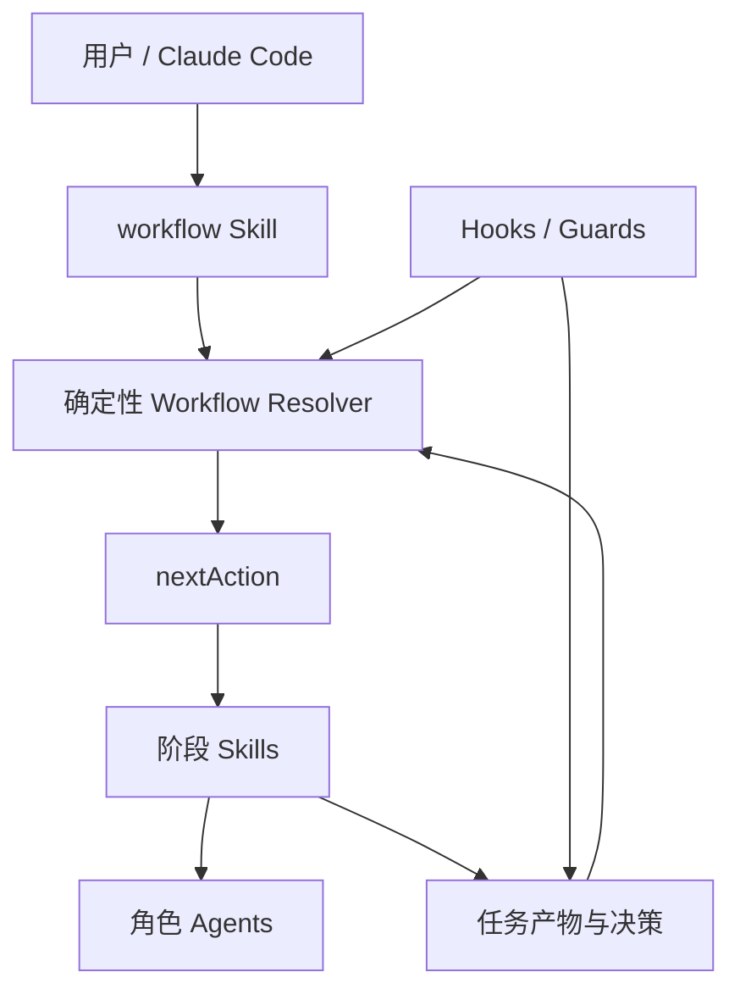

# scc-dev-sphere

> 面向 Claude Code 的可编排、可审计、人机协同研发流程插件。

`scc-dev-sphere` 基于 **harness engineering** 理念，将团队研发过程拆为明确的角色、产物、状态和门禁，并组合 Claude Code 原生的 Skills、Agents、Hooks 与 Node.js 脚本来推进流程。它不是新的 Agent runtime：模型负责理解、生成与评审，确定性脚本负责状态、路由和规则校验。

当前 MVP 已实现 `feature` 的研发 golden path；架构以 `taskType` 为扩展单元，后续可接入 Bugfix 等其他研发流程。

## 为什么需要它

通用 Agent 能快速产出内容，却容易在多阶段研发中失去边界、决策依据和推进条件。scc-dev-sphere 将这些问题收敛为可观察的工程对象：

- **产物与状态驱动**：阶段输出落盘，workflow 根据任务状态、产物、评审和批准记录计算唯一下一步。
- **确定性路由**：脚本输出稳定的 `nextAction` 契约；Skill 的主观完成感受不是状态迁移依据。
- **人机协同门禁**：风险接受、关键决策、最终设计批准和首次代码修改均保留人工控制权。
- **角色化交叉评审**：业务、架构、模块、开发、测试与 CI/CD 风险从不同视角交叉校验。
- **可追溯证据链**：需求、evidence、decision、review、approval 和验证转测产物共同保留研发过程。

## 当前能力：Feature 工作流


Feature 任务的稳定状态为：

```text
initialized → clarified → assessed → designing → design_ready
→ approved_for_implementation → implementation_planned → implementing
→ verification_ready → completed
```

设计阶段覆盖业务设计、方案设计、实现设计和测试设计。每个设计产物先经 AI 评审；发现 blocking 问题即返回对应 owner 修订。集成设计通过后，仍须人工最终批准才能进入代码阶段。

### 协作模式

| 模式 | 推进方式 | 适用场景 |
| --- | --- | --- |
| `auto-design` | AI 在评审通过后推进设计阶段；代码前仍需人工批准 | 简单、低风险需求 |
| `collaborative-design` | 仅指定阶段要求人工批准 | 需要选择性人工介入的复杂需求 |
| `strict-human-loop` | 每个设计阶段均需人工批准 | 高风险、合规或关键路径需求 |

## 架构



| 组件 | 职责 | 不负责 |
| --- | --- | --- |
| `skills/` | 提供可调用的阶段工作单元，生成或更新约定产物 | 决定跨阶段状态推进 |
| `agents/` | 提供 SA、SE、MDE、DEV、TSE、CIE 等角色上下文 | 充当工作流主干 |
| `hooks/` | 执行硬门禁、状态同步与一致性检查 | 替代人工判断或自动接受风险 |
| `scripts/` | 管理状态、评审矩阵、批准记录和确定性路由 | 生成设计内容或调度 Agent |
| `templates/` | 定义任务产物、评审、批准和转测交付的结构 | 充当独立流程引擎 |

`workflow` 是统一入口：它读取当前任务的 `taskType`，调用对应 resolver，并将输出的 `nextAction` 转化为下一次 Claude Code 交互。当前仅注册 `feature` resolver；未知 task type 会被明确提示为 MVP 尚未实现。

## 任务工作区与审计链

活跃任务由 `.devsphere/current-task.json` 指向，任务内容位于：

```text
.devsphere/tasks/<taskType>/<task-id>/
├── state.json           # 任务状态、协作模式、阶段状态
├── inputs/              # 原始需求与澄清结论
├── artifacts/           # 业务、方案、实现、测试和集成设计
├── decisions/           # 已确认的决策与假设
├── evidence/            # 知识库与代码库证据快照
├── reviews/             # 评审矩阵和评审结果
├── approvals/           # 阶段及最终人工批准
├── implementation/      # 实现计划与实现日志
└── verification/        # 验证结果和转测包
```

这条链路使每个结论可追溯到用户确认或 evidence，每个风险、评审意见和批准动作都有持久化记录。

## 使用方式

在 Claude Code 中，常规使用只需以下入口：

```text
/scc-dev-sphere:feature-init    # 创建 Feature 任务并记录原始需求
/scc-dev-sphere:workflow        # 读取状态并引导当前任务的合法下一步
/scc-dev-sphere:status          # 查看任务、阶段、待确认项和风险
```

`workflow` 还支持任务查看和切换：

```text
/scc-dev-sphere:workflow list
/scc-dev-sphere:workflow switch <task-id>
```

`feature-assess`、`feature-design-*`、`feature-review`、`feature-approve`、`feature-plan-implementation`、`feature-implement` 与 `feature-verify` 等命令可用于专家干预、修订、恢复或调试；日常推进优先使用 `workflow`。

## 扩展流程

`taskType` 是流程扩展边界，而不是把所有场景塞进 Feature 状态机。接入 Bugfix 或其他流程时，需要：

1. 为该类型定义任务初始化和工作区约定。
2. 新增 taskType 专属 resolver，并注册到统一 workflow router。
3. 提供对应的阶段 Skills、角色上下文、模板、状态与门禁规则。
4. 复用已有的 `nextAction`、证据、决策、评审和批准契约。

因此，新流程接入的是同一套编排与审计骨架，无需实现另一套 Agent runtime。Bugfix 等流程目前尚未实现。

## 开发与验证

这是 Claude Code 插件，而非传统 npm 应用：没有 `package.json`、构建步骤或独立服务。确定性逻辑均以 Node.js 脚本提供，例如：

```bash
node scripts/devsphere-workflow.js <workspace-root>
node scripts/devsphere-state.js read-state <task-path>
node scripts/devsphere-guard.js check-implement <workspace-root>
node scripts/devsphere-workspace.js create-feature-task <workspace-root> <task-id> [workflow-mode]
```

运行仓库测试：

```bash
node --test scripts/test/*.test.js
```

## 项目结构

```text
.claude-plugin/plugin.json  # Claude Code 插件清单
skills/                     # Slash-command 工作单元
agents/                     # 角色化子 Agent 定义
hooks/                      # 生命周期守卫与状态同步
scripts/                    # 状态、审批、评审与 workflow resolver
templates/                  # 产物、评审、批准和验证模板
references/                 # 交互规范
docs/                       # 设计规格、治理文档与研发记录
```

## 范围说明

- 当前已实现并支持的是 Feature 流程；README 不宣称 Bugfix 或其他 task type 已可用。
- 本仓库未定义 marketplace、npm 或远程安装渠道；请根据实际分发方式配置 Claude Code 插件。
- 发布、运维、复盘与知识入库等全生命周期能力已在设计中定义，尚未全部作为独立可执行流程交付。

## License

[MIT](LICENSE)
