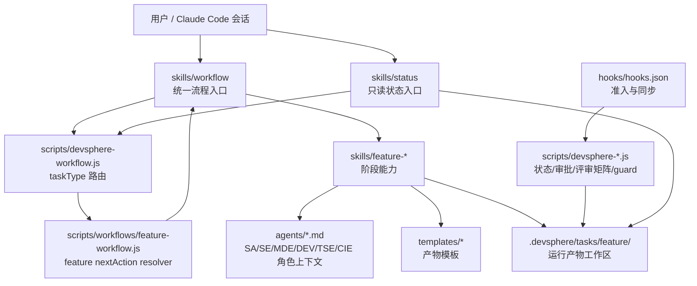

# 当前仓库现状诊断

## 1. 诊断范围

本诊断基于当前仓库文件读取结果，重点覆盖：

- `.claude-plugin/plugin.json`
- `CLAUDE.md`
- `agents/`
- `skills/`
- `scripts/`
- `hooks/hooks.json`
- `templates/`
- 既有 `docs/`、`docs/superpowers/specs/`、`docs/superpowers/plans/`

本仓库当前没有 `README.md`、`AGENTS.md`、`package.json`。`CLAUDE.md` 处于未跟踪状态，但内容已成为当前仓库最完整的运行说明；本次诊断把它作为事实参考，同时在风险中标记“关键说明未纳入版本控制”。

## 2. 当前 MVP 架构概览

**说明**

当前 MVP 没有自建 Agent runtime，而是组合 Claude Code 插件机制：Skill 作为 slash-callable 入口，Agent 作为角色上下文，Hook/Script 作为确定性 guard 和状态工具。运行时产物不在插件包内，而是在目标工作空间 `.devsphere/tasks/feature/<task-id>/` 下生成。

## 3. 当前已实现能力

| 能力 | 当前实现 | 诊断 |
|---|---|---|
| 插件 manifest | `.claude-plugin/plugin.json` | 有基本元数据，无声明式组件索引 |
| 角色上下文 | `agents/sa.md`、`se.md`、`mde.md`、`dev.md`、`tse.md`、`cie.md` | 职责较清晰，CIE 按需触发 |
| Skill 入口 | `skills/feature-*`、`workflow`、`status`、`knowledge-query` | 覆盖 feature 主路径 |
| 任务工作区 | `scripts/devsphere-workspace.js` | 能创建目录与 `state.json`、`current-task.json` |
| 状态读写 | `scripts/devsphere-state.js` | 基础 I/O 完成，但缺版本和事件记录 |
| 主 workflow resolver | `scripts/devsphere-workflow.js` | 支持 taskType 分发，当前只实现 feature |
| feature 状态机 | `scripts/workflows/feature-workflow.js` + `devsphere-guard.js` | 有整体状态，子阶段细分逻辑仍偏提示词化 |
| 评审矩阵 | `scripts/devsphere-review-matrix.js` | 有基础 reviewer matrix 和 blocking 统计 |
| 审批校验 | `scripts/devsphere-approval.js` | 有 design_ready 基础校验和 hash 工具 |
| Hook | `hooks/hooks.json` | 阻断 approve/implement 入口，Write/Edit 后同步 artifact 存在性 |
| 模板 | `templates/artifacts/*` | 阶段文档模板齐全，但缺机器可读元数据 |
| 知识库 | `skills/knowledge-query` + `evidence/` 约定 | 只到 evidence snapshot 约定，未形成知识萃取闭环 |
| 测试/发布 | 无自动测试套件，无发布文档 | 当前缺插件自身 DT、回归和发布流程 |

## 4. 三层架构是否已经成立

### 4.1 Agent 层

已成立，但更准确地说是“角色上下文层”，不是流程控制层。

当前 Agent 定义包括：

- SA：业务分析、业务规则、需求边界、术语。
- SE：系统方案、架构一致性、接口契约。
- MDE：模块级实现设计、影响面和可行性。
- DEV：实现计划、编码、本地验证、开发风险。
- TSE：测试策略、验收标准、回归风险。
- CIE：部署、配置、流水线、环境风险，按需触发。

优点是职责与产物责任基本绑定。主要风险是 Agent 名称仍带较强组织缩写，外部通用 SDLC 语义需要映射。

### 4.2 Skill 层

已成立，是当前最完整的一层。Skill 覆盖初始化、评估、设计、评审、批准、实现计划、实现、验证、状态展示和知识查询。

问题是部分 Skill 仍承载过多流程判断。例如 `feature-design` 作为子编排器的阶段路由规则写在 `SKILL.md` 中，而 `scripts/workflows/feature-workflow.js` 的 `resolveDesigning()` 目前只是把设计阶段委托给 `feature-design`。这意味着部分流程控制仍依赖模型遵循提示词，而不是确定性 resolver。

### 4.3 Docs 层

部分成立。仓库有 PRD、技术方案、澄清 QA、设计计划和模板；运行时有 `.devsphere` 工作区和 evidence/decision/review/approval 约定。

但 Docs 还没有完全成为流程驱动事实源：

- 没有统一 `docs/index.md` 或 knowledge index。
- 产物模板缺 artifactId、version、status、dependsOn、evidenceRefs、decisionRefs。
- 运行产物缺 artifact registry。
- 知识库只停留在查询 evidence，没有候选、审批、入库、老化机制。

## 5. 职责边界是否清晰

| 边界 | 当前情况 | 结论 |
|---|---|---|
| Agent vs Skill | 文档明确“Agent 决定视角，Skill 决定方法” | 基本清晰 |
| Skill vs Resolver | Skill 生成产物，resolver 算 nextAction 的原则已写入文档 | 实现不完全一致，设计阶段细分仍在 Skill |
| Hook vs Skill | Hook 定位为 guard + registry + consistency checker | 原则清晰，Hook 实现较少 |
| Docs vs Chat | 文档强调批准、证据、决策必须落盘 | 原则清晰，但缺 trace 强制机制 |
| Knowledge vs Evidence | evidence 是当时查询快照，knowledge 是长期知识库 | 当前只实现 evidence 约定，未实现 knowledge 演进 |

## 6. 流程是否真正做到产物驱动

**结论：半成立。**

已经做到：

- `state.json` 驱动任务整体状态。
- `reviews/review-matrix.json` 驱动 blocking/advisory/risk 数量。
- `approvals/design-final-approval.json` 作为最终批准事实。
- artifact 文件存在可触发阶段从 `not_started` 到 `drafted`。
- review matrix 中 blocking 为 0 可触发 `drafted` 到 `ai_review_passed`。

尚未做到：

- 没有 artifact registry，workflow 无法判断 artifact 版本、hash、依赖和失效。
- 没有 schema 校验，文档章节完整性主要靠提示词。
- 没有 requirement -> design -> implementation -> test -> verification 的 trace matrix。
- 没有质量门禁结果作为机器事实。
- 没有工作流事件日志，无法复盘“为什么推进到了这个状态”。

## 7. 是否具备可追溯能力

**结论：具备基础过程件追溯，不具备完整执行追溯。**

已有追溯对象：

- requirement input
- design artifacts
- reviews
- decisions
- approvals
- evidence snapshots
- implementation plan/log
- verification handoff

缺失追溯对象：

- 用户每次输入的结构化记录。
- Agent 决策和读取 docs 的记录。
- Skill 实际使用记录。
- Hook/quality gate 输出。
- 失败原因、重试次数、上下文缺失、知识命中率。
- artifact 版本 hash 与依赖关系。

## 8. 是否具备知识萃取与知识库更新闭环

**结论：尚未具备。**

当前 `knowledge-query` 能描述查询策略和 evidence 保存规则，但没有：

- Q&A 记录结构。
- 隐性知识候选识别。
- 候选知识去重、冲突、置信度、审批。
- 主知识库目录结构。
- 知识引用和老化机制。
- “任务完成后回写知识库”的质量门禁。

风险是 Agent 在每次任务中重复发现同样知识，或者把未经审批的中间结论直接沉淀成长期知识。

## 9. 是否具备 SDLC 全生命周期扩展基础

**结论：具备扩展骨架，不具备全生命周期实现。**

具备的基础：

- taskType-based resolver。
- feature task workspace。
- 状态机和 nextAction 结构。
- Agent/Skill 分层。
- Hook/Script 校验入口。

不足：

- 目前只有 feature workflow。
- 需求发现、知识萃取、发布设计、运维设计、复盘沉淀没有独立阶段和产物。
- bugfix/refactor/performance 仅文档中预留，没有 resolver/schema/template。
- 缺插件自身测试、DT 和发布治理。

## 10. 最大风险清单

### 10.1 架构风险

1. **流程语义分散**：PRD、技术方案、Skill 提示词、脚本中都有流程规则，容易漂移。
2. **子阶段路由不够确定性**：`resolveDesigning()` 委托给 `feature-design`，Agent 可能解释不一致。
3. **Docs 尚未成为系统记录**：缺索引、元数据、版本和校验。
4. **没有 trace 数据模型**：后续无法系统评估 Agent 成功率和失败模式。

### 10.2 流程风险

1. **状态推进依赖人工/模型手动写状态**：缺统一 state transition API 和 gate result。
2. **advisory/risk/assumption 处理未完全脚本化**：可能遗漏人工确认。
3. **修订后下游失效影响弱**：目前文档要求重置下游阶段，但缺确定性影响分析。
4. **CIE 按需触发规则未落地**：review matrix 支持基础 reviewer，风险增强尚未脚本化。

### 10.3 文档风险

1. **关键说明未入正式 tracked baseline**：当前 `CLAUDE.md` 未跟踪。
2. **中文/英文术语混杂**：Agent、Skill、workflow、command 等术语容易误读。
3. **模板不够机器可读**：缺 frontmatter 和 checklist。
4. **缺 V1 级别目标架构文档**：已有 MVP 方案，但缺下一阶段建设路线。

### 10.4 实现风险

1. **没有测试套件**：Node scripts 缺单元测试和集成测试。
2. **Hook 命令路径依赖 `CLAUDE_PLUGIN_ROOT}/..`**：在不同安装位置下可能解析到错误 workspace。
3. **`devsphere-approval.js` 的 design_ready 校验简化**：未完整检查 integrated review、accepted_risk、hash、版本。
4. **review matrix 只存计数**：缺 issue 级别 ID、状态、owner、round、关闭依据。

## 11. V1 优先补强方向

P0 优先级应是：

1. Artifact schema + artifact registry。
2. Trace / episode / workflow run 数据结构。
3. Quality gate 脚本和 gate result。
4. Review issue 结构化模型。
5. Knowledge candidate -> approval -> knowledge base 的闭环。
6. 将 feature 设计子阶段 routing 下沉到 deterministic resolver。

