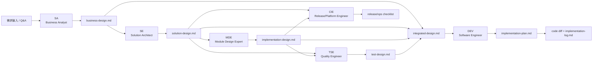

# SDLC 角色模型与 Agent 建模建议

## 1. 设计原则

当前仓库使用 SA、SE、MDE、DEV、TSE、CIE 等团队内部角色。V1 不应机械保留缩写，而应先分析它们承担的 SDLC 职能，再决定是保留为 Agent、下沉为 Skill，还是只作为模板/checklist。

判断标准：

1. 是否有稳定职责视角。
2. 是否拥有明确输入和输出产物。
3. 是否有独立质量门禁。
4. 是否需要隔离上下文。
5. 是否经常参与多阶段评审。

## 2. 角色映射表

| 内部角色 | 当前仓库职责描述 | 等价 SDLC 职能角色 | Agentic SDLC 中的 Agent 能力 | 输入产物 | 输出产物 | 质量门禁 | 保留独立 Agent | 下沉为 Skill | 仅模板/检查清单 |
|---|---|---|---|---|---|---|---|---|---|
| SA | 业务流程、业务规则、需求边界、术语一致性；负责 `business-design.md`；评审方案和测试设计 | Business Analyst / Product Analyst / Requirements Analyst | 需求澄清、业务规则建模、隐性知识挖掘、业务一致性评审 | requirement、历史业务知识、Q&A、业务 evidence | business-design、业务决策、知识候选 | 需求完整性、范围边界、术语一致、业务规则可验证 | 是 | 否 | 否 |
| SE | 系统方案、架构一致性、接口契约、跨模块边界；负责 `solution-design.md` | Solution Architect / Software Architect | 架构方案设计、接口契约设计、架构评审、跨模块影响分析 | business-design、架构规范、接口 evidence、历史 ADR | solution-design、架构决策、接口契约 | 架构边界、兼容性、NFR、决策可追溯 | 是 | 否 | 否 |
| MDE | 模块级实现设计、影响面分析、功能点拆解；负责 `implementation-design.md` | Component Owner / Module Architect / Lead Developer | 模块影响分析、实现可行性、代码结构映射、实现单元拆解 | solution-design、repo evidence、代码模式 | implementation-design、模块影响图、实现风险 | 文件/模块范围明确、调用链证据、实现可行 | 是，V1 保留 | 部分能力可沉淀为 `module-impact-analysis` Skill | 否 |
| DEV | 实现计划、编码、本地验证、实现风险反馈；按需启用前端/后端/全栈上下文 | Software Engineer / Implementation Engineer | 生成实现计划、执行代码变更、验证、diff 摘要、开发风险反馈 | approved design、implementation-plan、repo evidence | implementation-plan、code diff、implementation-log | 计划与批准设计一致、测试通过、范围偏差记录 | 是 | 前端/后端/全栈作为 Skill | 否 |
| TSE | 测试策略、验收标准、测试场景、回归风险；负责 `test-design.md` | QA Engineer / Test Architect / Quality Engineer | 测试设计、验收标准抽取、可测性评审、回归风险分析 | business/solution/implementation design、测试规范、缺陷 evidence | test-design、测试场景、转测建议 | 验收标准可执行、关键路径覆盖、回归范围明确 | 是 | 否 | 否 |
| CIE | 构建部署、CI/CD、环境、配置、发布风险；按需触发 | DevOps Engineer / Release Engineer / Platform Engineer / SRE Liaison | 发布影响评审、配置/环境/CI 风险识别、回滚和部署检查 | solution/implementation design、repo/CI evidence、环境规范 | deployment checklist、release risk、CIE review | 配置可控、回滚可行、环境准备、CI 影响明确 | 按需 Agent，不进默认主链 | `release-readiness` / `ci-impact-check` Skill | 低风险场景可用 checklist |
| TEST | 原始设想中的测试工程师，当前仓库实际使用 TSE | 待确认；可能等价 TSE | 待确认 | 待确认 | 待确认 | 待确认 | 否，避免与 TSE 重复 | 否 | 如团队仍使用 TEST，可作为别名说明 |
| Security | 当前仓库未定义，安全只在风险评估条件中出现 | Security Engineer / AppSec Reviewer | 安全设计评审、权限/审计/数据风险识别 | requirements、solution design、security policy | security review、risk decisions | 权限、审计、敏感数据、威胁建模 | V1 暂不固定；P2 风险触发 Agent | 可先沉淀为 security checklist Skill | 是，P1 可先 checklist |
| SRE/Ops | 当前仓库未定义，CIE 覆盖部分运维 | SRE / Operations Engineer | 可观测性、SLO、告警、runbook、生产就绪 | release design、ops standards | operations design、runbook、PRR checklist | SLO、监控、告警、回滚、应急响应 | P2 可独立，V1 先由 CIE 覆盖 | `operational-readiness` Skill | V1 用模板/checklist |

## 3. 是否保留 MDE 作为独立 Agent

建议 V1 继续保留 MDE，但重新命名解释为 **Module Design Expert / Component Implementation Architect**，避免被理解为普通开发岗位复刻。

保留理由：

- 当前流程中 `solution-design` 与 `implementation-design` 有明确产物边界。
- MDE 的输入是系统方案和 repo evidence，输出是模块级实现设计，与 DEV 的实现计划不同。
- MDE 是把抽象架构转成可编码模块方案的关键缓冲层。

约束：

- MDE 不写代码。
- MDE 不重复 SE 的架构方案。
- MDE 不替 DEV 做实现计划。
- 模块影响分析和调用链查询方法应沉淀为 Skill，MDE 只是执行视角。

## 4. 角色到产物责任图

**说明**

每个 Agent 只对特定产物或评审视角负责。集成设计不是新角色所有，而是对业务、方案、实现、测试之间一致性的批准视图。

## 5. Agent / Skill / Docs 建模规则

### 5.1 应保留为独立 Agent 的条件

满足以下至少 3 项才保留：

- 有独立 SDLC 职能角色。
- 有长期稳定产物责任。
- 有独立评审视角。
- 需要隔离上下文读取大量资料。
- 输出会影响 workflow gate。

### 5.2 应下沉为 Skill 的条件

满足以下条件之一应优先下沉：

- 是可复用动作而非角色，例如 code review、repo impact analysis、release readiness。
- 可被多个 Agent 使用。
- 主要是步骤、模板、脚本、checklist。
- 不需要独立身份进行 judgment。

### 5.3 只作为模板或 checklist 的条件

满足以下条件之一不建 Agent/Skill：

- 低频使用。
- 只是一组检查问题。
- 没有明确状态推进。
- 不需要上下文隔离。
- 自动化收益低于维护成本。

## 6. 命名建议

为了对外通用，文档应同时保留内部缩写和通用职能：

- SA：Business Analyst。
- SE：Solution Architect。
- MDE：Module Design Expert / Component Implementation Architect。
- DEV：Software Engineer。
- TSE：Quality Engineer / Test Architect。
- CIE：Release / Platform / DevOps Engineer。

在 Skill 和 state 中可以继续使用短名，但用户文档、质量门禁和目标架构中应使用通用 SDLC 职能名。

