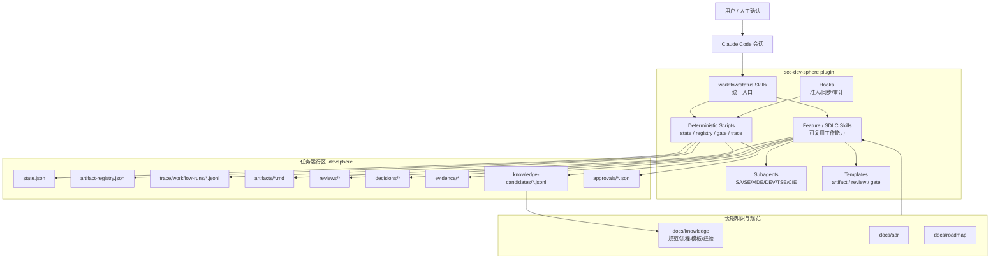
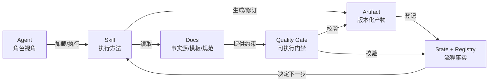
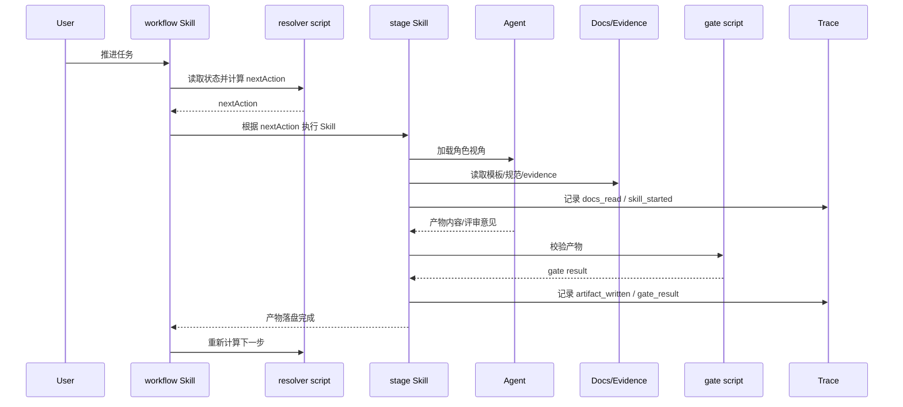

# scc-dev-sphere 目标架构

## 1. 架构目标

`scc-dev-sphere` 的 V1 目标不是自建 Agent runtime，而是把 Claude Code plugin 能力组织成一个可控、可追溯、可渐进自动化的 Agentic SDLC harness。

目标架构应满足：

1. Agent、Skill、Docs 三层职责清晰。
2. workflow 由产物和状态驱动，不由聊天上下文驱动。
3. 所有关键产物、状态、证据、决策、批准、质量门禁和知识更新可追溯。
4. 人工确认点有明确落盘记录。
5. 后续 bugfix、refactor、performance、release、operations 等 workflow 可按 taskType 扩展。

## 2. 总体架构



**说明**

插件本体只提供能力、规则和模板；`.devsphere` 保存每个任务运行时事实；`docs/knowledge` 和 `docs/adr` 保存长期组织知识。Workflow 通过 deterministic scripts 读取状态和注册表，计算下一步动作；Skill 生成或更新产物；Agent 提供职责视角；Hook 只做确定性准入、同步和审计。

## 3. Agent -> Skill -> Docs 分层职责

### 3.1 Agent 负责什么

Agent 负责专业视角和判断边界：

- 解释输入材料时采用对应 SDLC 职能视角。
- 生成或评审某类产物时关注自身质量属性。
- 识别本职责范围内的风险、缺口和待确认问题。
- 在输出中引用 evidence、decision、artifact。
- 不直接推进跨阶段状态。

Agent 不应负责：

- 选择全局 workflow 下一步。
- 修改状态机规则。
- 自动接受风险、假设或建议项。
- 把未经审批的知识写入长期知识库。
- 绕过 quality gate 或 approval。

### 3.2 Skill 负责什么

Skill 负责可复用工作方法：

- 定义某类活动的输入、输出、步骤、约束和失败处理。
- 读取模板和相关 docs。
- 生成或更新约定产物。
- 调用确定性脚本完成校验、登记、状态更新。
- 在需要人工判断时暂停并把确认结果写入指定过程件。

Skill 不应负责：

- 自行决定跨阶段流程推进。
- 维护复杂全局状态。
- 承载大量长期知识正文。
- 变成大而全脚本或单体 workflow。
- 直接修改主知识库。

### 3.3 Docs 负责什么

Docs 是长期事实源和可复用知识库：

- 产品/业务/架构/测试/发布/运维规范。
- Artifact 模板和质量门禁规则。
- ADR 和决策历史。
- 经验沉淀、知识条目、术语、领域规则。
- Workflow 设计说明和任务拆解。

Docs 不应只是静态说明。V1 中 Docs 必须通过以下机制参与流程驱动：

- 被 artifact frontmatter 引用。
- 被 evidence registry 记录为来源。
- 被 quality gate 校验引用完整性。
- 被 knowledge candidate 审批流程更新。
- 被 trace 记录实际读取和使用。

## 4. Agent / Skill / Docs 关系图



**说明**

Agent 不直接从 Docs 生成最终流程结论，而是通过 Skill 的方法约束完成某个明确任务。Artifact 和 State 是 workflow 的事实输入。Gate 把 Docs 中的规则转成可执行校验，避免 Docs 只成为说明。

## 5. 核心模块设计

### 5.1 Workflow Resolver

职责：

- 读取 `current-task.json`、`state.json`、`artifact-registry.json`、review matrix、approval、gate result。
- 根据 taskType 选择 resolver。
- 输出单步 `nextAction`。
- 不生成业务正文，不调用 Agent，不修改语义产物。

V1 需要增强：

- 把 feature 设计子阶段 routing 从 `feature-design/SKILL.md` 下沉到 `scripts/workflows/feature-workflow.js`。
- 读取 quality gate result 和 artifact dependency。
- 输出阻塞原因和修复建议。

### 5.2 Artifact Registry

职责：

- 记录每个 artifact 的 ID、类型、路径、版本、hash、owner、状态、依赖、上游/下游、质量门禁结果。
- 支撑变更影响分析。
- 支撑批准时锁定 artifact version。

示例：

```json
{
  "artifacts": [
    {
      "artifactId": "ART-001",
      "type": "business-design",
      "path": "artifacts/business-design.md",
      "version": 3,
      "hash": "sha256:...",
      "status": "ai_review_passed",
      "ownerAgent": "sa",
      "dependsOn": ["REQ-001"],
      "evidenceRefs": ["EV-001"],
      "decisionRefs": ["DEC-001"],
      "qualityGate": {
        "gateId": "QG-BD-001",
        "status": "pass",
        "checkedAt": "2026-07-08T00:00:00+08:00"
      }
    }
  ]
}
```

### 5.3 Trace / Episode / Workflow Run

职责：

- 记录用户输入、Agent 决策、Skill 使用、Docs 读取、产物生成、门禁结果、人工确认、失败和修正。
- 支撑后续分析 Agent 成功率、失败模式、知识命中率、返工率。

Trace 不要求记录全部模型思考，只记录可审计事件和摘要。

### 5.4 Quality Gate Engine

职责：

- 把每个阶段的 checklist 变成可执行校验。
- 输出 `gate-results/*.json`。
- 对无法自动判断的项目给出 `requires_human`。

质量门禁不是替代人工评审，而是把“明显缺字段、缺证据、缺决策、状态不合法、引用断裂”自动挡住。

### 5.5 Knowledge Evolution Loop

职责：

- 在需求澄清和设计过程中记录 Q&A。
- 识别知识候选。
- 去重、冲突检查、置信度标记。
- 人工审批后更新 `docs/knowledge`。
- 对过期知识执行老化和废弃。

## 6. 上下文传递机制



**说明**

上下文传递不依赖口头总结，而依赖 artifact、evidence、decision、trace 和 registry。每次 workflow 重新计算下一步，必须读取当前落盘事实。

## 7. 避免职责膨胀的规则

### 7.1 避免 Agent 膨胀

- 每个 Agent 只拥有一组质量属性，不拥有流程。
- 新角色必须有独立输入、输出和质量门禁，否则下沉为 Skill 或 checklist。
- CIE、Security、Data、SRE 等专业角色默认按风险触发，不固定进入每个任务。

### 7.2 避免 Skill 大而全

- 一个 Skill 只服务一个阶段或一类动作。
- Skill 可以调用脚本，但不把脚本逻辑复制到提示词。
- 超过一个 artifact family 的 Skill 必须拆分，除非它是只读编排入口。
- Skill 的完成标准必须能被脚本或人工 gate 检查。

### 7.3 避免 Docs 静态化

- 每个关键 docs 页面必须有 owner、lastReviewed、status。
- 可执行规则要进入 scripts/gates，不只留在 Markdown。
- 知识条目必须能被 evidence/decision/artifact 引用。
- 过期知识必须能被 trace 或 doc-gardening 流程发现。

## 8. V1 边界

V1 应实现：

- Feature workflow 的完整 artifact-driven orchestration。
- Artifact registry、trace、quality gates、knowledge candidates。
- SDLC 全生命周期文档化和模板化。
- 发布/运维设计的轻量门禁。
- 插件自身脚本测试和端到端 DT。

V1 不应实现：

- 自建 Agent runtime。
- 企业级知识库服务。
- 云端 agent 调度。
- 完整 IDP 门户。
- 自动合并或自动发布。

