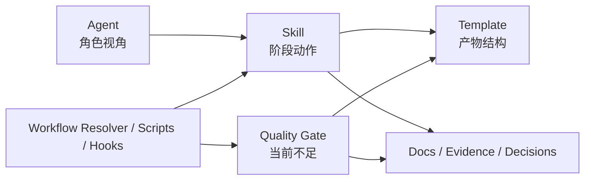

# 当前 Agent / Skill / Template 诊断

## 1. 诊断范围

本诊断基于当前仓库只读检查，重点读取：

- Agent：`agents/sa.md`、`agents/se.md`、`agents/mde.md`、`agents/tse.md`、`agents/dev.md`、`agents/cie.md`
- Skill：`skills/feature-design-*`、`skills/feature-review`、`skills/knowledge-query`、`skills/feature-plan-implementation`、`skills/feature-implement`、`skills/feature-verify`、`skills/workflow`、`skills/feature-design`、`skills/status`
- Template：`templates/artifacts/*`、`templates/reviews/review-template.md`、`templates/verification/test-handoff-template.md`
- 运行机制：`CLAUDE.md`、`references/interaction-guidelines.md`、`scripts/devsphere-*.js`、`scripts/workflows/feature-workflow.js`、`hooks/hooks.json`

当前仓库未发现 `README.md`、`AGENTS.md`、`package.json`、根目录 `plugin.json`；插件 manifest 位于 `.claude-plugin/plugin.json`。

## 2. 总体诊断

当前 MVP 的 Agent -> Skill -> Template/Docs 分层已经成立，但专业化不足。

说明：

- Agent 层：角色定位清楚，但多数定义仍像岗位简介，缺少输入输出、质量责任、失败模式、协作触发和禁止事项。
- Skill 层：入口、入参、输出有骨架，但多数执行步骤偏薄，仍停留在“读取输入 + 查询知识 + 按模板生成文档”。
- Template 层：五类设计模板已存在，但章节只给标题和简短注释，缺专业方法、ID、traceability、门禁和下游派生规则。
- Harness 层：有 state、review matrix、approval、hook，但 artifact registry、trace、quality gate、review issue identity 仍未落地。

## 3. Agent 诊断

| Agent | 当前定位 | 当前产物/职责 | 主要问题 | 目标建议 |
|---|---|---|---|---|
| SA | `agents/sa.md` 定义为业务分析师，负责业务规则、范围、术语、异常流程 | 拥有 `artifacts/business-design.md` 和 `decisions/business-design-decisions.md`；调用 `feature-design-business`、`feature-review`、`knowledge-query` | 未声明 `feature-assess` 中复杂度/风险评估责任；缺少 Q&A、需求追溯矩阵、隐性知识萃取职责；评审 integrated-design 未明确 | 升级为“需求工程与业务建模 Agent”，保留业务判断和评审视角，具体建模步骤下沉到 Skill |
| SE | `agents/se.md` 定义为系统架构师，负责架构、API、数据、集成 | 拥有 `solution-design.md` 和 `solution-design-decisions.md`；评审 business/implementation/test | “评审所有设计产物”过宽；未系统覆盖 C4、4+1、质量属性、ATAM、STRIDE、接口 contract | 升级为“系统方案与架构设计 Agent”，方法落在 `feature-design-solution` 和模板/gate |
| MDE | `agents/mde.md` 定义为模块开发专家，负责模块级实现设计和影响面分析 | 拥有 `implementation-design.md` 和决策文件；评审 solution/test | 与 DEV 边界不够硬；未声明不写代码、不生成实现计划；repo evidence 规则偏粗 | 升级为“模块级详细设计 Agent”，模块影响/调用链查询下沉为 Skill 或脚本 |
| TSE | `agents/tse.md` 定义为测试工程师，负责测试策略、验收、回归风险 | 拥有 `test-design.md` 和决策文件；评审 solution/implementation | 风险驱动测试、测试金字塔、需求到测试追溯、不可测项、test-handoff 复核缺失 | 升级为“风险驱动测试设计 Agent”，测试矩阵和门禁下沉到 Skill/Template |
| DEV | `agents/dev.md` 定义为统一开发工程师，负责实现计划、代码、验证、转测 | 调用 `feature-plan-implementation`、`feature-implement`、`feature-verify` | 未明确拥有 `implementation-plan.md`、`implementation-log.md`、`test-handoff.md`；首次代码确认在 Agent/Skill/Hook 之间重复 | 升级为“设计到代码执行 Agent”，保留编码执行和偏差反馈，前置门禁交给脚本/Hook |
| CIE | `agents/cie.md` 定义为按需构建部署工程师 | 部署、配置、CI/CD、环境风险评审 | 缺稳定输出模板、触发写入规则、release/ops readiness gate | 升级为“部署发布与运维就绪 Agent”，V1 保留按需触发，P2 建 release/ops 模板 |

### Agent 职责过薄的具体表现

1. 多数 Agent 只有“核心职责 + 知识查询 + 人机交互规范”，缺少输入、输出、协作触发、失败模式、自检清单和质量责任。
2. AskUserQuestion 规则在 6 个 Agent 中重复，应该只保留“遵循全局交互规范”，细节集中在 `references/interaction-guidelines.md`。
3. evidence 保存规则散落在 Agent、设计 Skill、`knowledge-query`，存在单一事实源漂移。
4. CIE 触发条件存在，但没有对应 artifact、review matrix 扩展和 gate result。

## 4. Skill 诊断

| Skill | 当前入口/输出 | 当前问题 | 增强方向 |
|---|---|---|---|
| `feature-design-business` | `/scc-dev-sphere:feature-design-business [--mode revise]`；输出 business-design 和 evidence | 输出要求写 evidence registry，但约束又说只修改 artifact/decision；缺 stakeholder、业务事件、异常矩阵、决策表、RTM、知识萃取 | 升级为需求工程与业务建模 Skill |
| `feature-design-solution` | 输出 solution-design 和 evidence | 缺 C4、4+1、质量属性场景、ATAM、接口版本/错误语义/兼容、STRIDE、迁移/回滚 | 升级为系统方案与架构设计 Skill |
| `feature-design-implementation` | 输出 implementation-design 和 repository evidence | 缺文件级接口、调用链证据、事务/并发/幂等、配置/feature flag、日志指标、回滚策略 | 升级为模块级详细设计 Skill |
| `feature-design-test` | 输出 test-design 和 evidence | 缺 risk-based testing、test pyramid、需求/风险/接口/模块到测试追溯、不可测项和 residual risk | 升级为风险驱动测试设计 Skill |
| `feature-review` | `/scc-dev-sphere:feature-review --target <artifact>`；输出 reviews 和 review matrix | review matrix 只有计数，缺 issue ID、round、owner、closure evidence；多角色评审清单不够专业 | 升级为多角色设计评审 Skill |
| `knowledge-query` | 查询 MCP 知识库，保存 evidence | 只覆盖知识 evidence；缺 MCP 不可用、冲突、过期、repository evidence 统一规则；缺 knowledge candidate 闭环 | 保留查询职责，补 evidence schema 和知识候选流程 |
| `feature-plan-implementation` | 输出 implementation-plan 和 repo binding | 可作为下游派生目标，但当前依赖的 implementation-design 结构不足 | 后续消费更强的 implementation-design |
| `feature-implement` | 执行代码，首次代码变更确认 | 仍要求输入 `YES`，与 AskUserQuestion 规范不一致；状态更新描述未强制走 guard | 代码前门禁交给 Hook/guard，Skill 只负责执行和偏差记录 |
| `feature-verify` | 运行验证并生成 test-handoff | 转测包由 DEV 生成，TSE 复核不明确；失败原因 schema 不足 | 增加验证结果、未测项、accepted risk 和 TSE 按需复核 |
| `feature-design` | 设计阶段子编排器 | 声明 main session 执行，但 `feature-workflow.js` 在 `assessed` 返回 `agents: ['sa']`，可能错误派发 | P0 修复：设计子阶段路由下沉 resolver，或 `feature-design` 永远 `agents: []` |

## 5. Template 诊断

| Template | 当前结构 | 主要缺口 |
|---|---|---|
| `business-design.md` | 业务目标、范围、现状、规则、术语、流程、干系人、假设、问题、证据 | 缺 REQ/BR/EV/DEC/ASM/RISK ID、决策表、状态模型、业务事件、验收标准、RTM、知识候选 |
| `solution-design.md` | 架构概览、边界接口、数据模型、组件、API、兼容、NFR、风险、决策、证据 | 缺 C4、4+1、质量属性场景、ATAM、STRIDE、OpenAPI/AsyncAPI contract、迁移/回滚、可测性交接 |
| `implementation-design.md` | 模块影响、功能拆解、技术方案、依赖、文件映射、调用链、约束、风险 | 缺函数/类/接口设计、DTO/Entity、事务并发、幂等、日志指标、测试钩子、回滚、对 DEV 交接契约 |
| `test-design.md` | 测试策略、验收、功能/集成/边界、回归、数据、环境、不可测风险 | 缺风险驱动测试、测试金字塔、需求/风险/接口/模块追溯矩阵、自动化策略、残余风险 |
| `integrated-design.md` | 摘要、阶段引用、一致性、冲突、风险、范围、审批清单 | 缺 artifact version/hash、business->solution->implementation->test trace、open issue、gate result、可开发/可测试/可发布结论 |

## 6. 风险清单

| 风险 | 严重度 | 说明 | 建议优先级 |
|---|---|---|---|
| `feature-design` 派发契约不一致 | 高 | 子编排器可能被错误派发给 SA | P0 |
| artifact 无 ID/version/hash/frontmatter | 高 | 无法做变更影响分析和 approval 锁定 | P0 |
| review matrix 只有计数 | 高 | 无法追踪 issue、round、owner、closure | P0 |
| quality gate 仍是文档设计 | 高 | 模板完整性和证据引用无法稳定约束 | P0 |
| evidence/decision/assumption ID 不统一 | 高 | 跨阶段追溯断链 | P0 |
| 模板缺专业设计方法 | 中 | 输出质量依赖模型临场发挥 | P1 |
| CIE 无输出闭环 | 中 | 发布/配置/环境风险无法沉淀 | P2 |
| 知识萃取未闭环 | 中 | 隐性知识仍留在对话中 | P2 |

