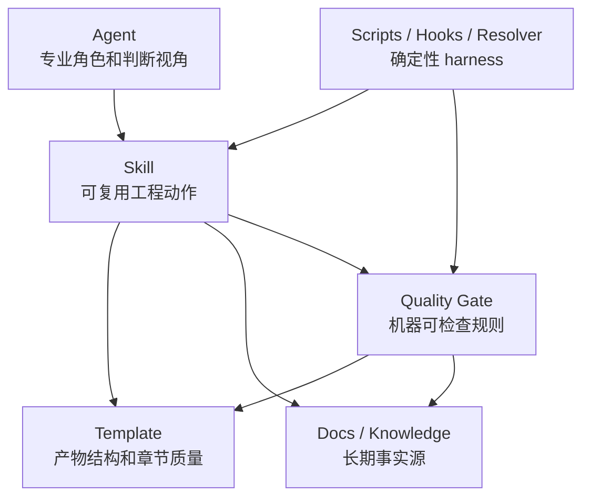

# Agent / Skill / Template 职责边界模型

## 1. 边界原则

说明：

- Agent 回答“谁以什么专业视角负责判断”。
- Skill 回答“如何执行这个工程动作”。
- Template 回答“产物必须长什么样，每章达到什么标准”。
- Quality Gate 回答“哪些内容可机器检查，什么条件能进入下一阶段”。
- Docs / Knowledge 回答“长期事实、规范、证据、决策在哪里”。
- Scripts / Hooks / Resolver 回答“状态、路由、hash、registry、gate、trace 如何确定性执行”。

## 2. 职责边界表

| 能力项 | Agent | Skill | Template | Quality Gate | Docs / Knowledge | 当前落点 | 目标落点 | 迁移建议 |
|---|---|---|---|---|---|---|---|---|
| 业务规则识别 | SA 判断规则重要性 | business skill 执行识别步骤 | business rules 表 | 规则必须编号且可验证 | 业务规则库 | SA + business template | SA + Skill + Template + Gate | 增加 BR ID、evidence/assumption |
| 隐性知识挖掘 | SA 判断问题优先级 | Q&A、一次一问、candidate 识别 | Q&A/knowledge candidate 结构 | candidate 来源和审批检查 | docs/knowledge | 原则存在，闭环缺失 | Skill + Docs + Gate | P2 建候选审批 |
| 业务流程建模 | SA | business skill | flow/exception/alternative sections | 关键路径和异常路径检查 | 流程规范 | business template | Skill + Template | Mermaid + 图后说明 |
| 状态机建模 | SA/SE/MDE 按领域判断 | 对应设计 skill | 状态模型章节 | 状态转移完整性 | 状态建模规范 | 基本缺失 | Template + Gate | business/implementation 加状态机 |
| 方案设计 | SE | solution skill | solution-design | 架构完整性 | 架构规范/ADR | SE + solution skill | SE + Skill + Template | 引入 C4/4+1/ADR |
| 4+1 视图 | SE | solution skill 选择视图 | solution 视图章节 | 中高风险视图覆盖 | 架构图规范 | 未显式落地 | Skill + Template + Gate | 按风险裁剪 |
| C4 视图 | SE | solution skill | C4 sections | 图层级/边界检查 | 架构图规范 | 未显式落地 | Skill + Template + Gate | Context/Container/Component 优先 |
| 接口契约设计 | SE | solution skill | contract section / contract artifact | 版本、错误、兼容、示例 | API 标准 | solution template | SE + Template + Gate | OpenAPI/AsyncAPI 按需 |
| 数据模型设计 | SE，CIE 按迁移风险参与 | solution skill | data model/data flow | 迁移、回滚、兼容 | 数据规范 | solution template | SE + Gate + CIE | 数据变更触发 CIE |
| 质量属性场景 | SE 主责，TSE/CIE 评审 | solution/review skill | quality attribute table | 可量化 NFR | 架构质量规范 | NFR 简写 | Skill + Template + Gate | QAW/ATAM 轻量化 |
| 实现影响面分析 | MDE | implementation skill | module/file map | repo evidence 必须存在 | repo evidence | MDE + template | MDE + Skill + Gate | 不让 MDE 写代码 |
| 调用链分析 | MDE | implementation skill | sequence/data flow | 跨模块无图 fail/warn | repository evidence | implementation template | Skill + Template + Gate | 证据只记录路径/符号 |
| 测试策略设计 | TSE | test skill | test-design | 测试层级/范围完整性 | 测试规范 | TSE + template | TSE + Skill + Gate | Test pyramid |
| 风险驱动测试 | TSE | test skill | risk coverage table | 高风险无测试 fail | 缺陷/风险库 | 弱 | Skill + Template + Gate | risk -> test -> residual risk |
| 设计评审 | 各 Agent 提供视角 | feature-review 编排 | review template | required reviewer/issue closure | review 规范 | feature-review | Skill + Gate | issue 结构化 |
| 跨阶段一致性 | 各 Agent 评审 | design-integration-check | integrated-design | trace gap fail | traceability docs | integrated template | Skill + Template + Gate | integrated 是批准视图 |
| evidence 保存 | Agent 只引用 | knowledge/evidence skill 或脚本 | evidence refs | ID 存在性和可信度 | evidence registry | 散落 | Script + Gate + Template | 统一 EV ID |
| decision 记录 | Agent 判断取舍 | stage skill 写入 | decision refs | 关键取舍必须有 DEC | decisions | 部分存在 | Skill + Docs + Gate | 统一 DEC schema |
| assumption 确认 | Agent 判断是否阻断 | stage skill 发起确认 | assumption table | 未确认高风险 assumption fail | Q&A/decisions | business 有表 | 所有阶段 | ASM ID + confidence |
| artifact 状态更新 | 不由 Agent 更新 | skill 调脚本 | frontmatter status | state/frontmatter 一致 | artifact registry | state 文件 | Script + Registry | P0 实现 |
| 质量门禁 | Agent 不执行最终裁决 | gate skill 调脚本 | gate mapping | pass/warn/fail | gate docs | 文档化 | Gate + Script | P0 实现 |
| 人工确认触发 | Agent 识别条件 | Skill 使用 AskUserQuestion | confirmation section | 确认记录存在 | approvals/decisions | 多处重复 | Skill + Approval | 统一落盘 |
| 下游任务派生 | DEV/TSE 消费 | implementation/test planning skill | handoff contract | 可派生字段完整性 | backlog/plan docs | 弱 | Template + Gate | 每阶段有交接契约 |

## 3. 不应放入 Agent 的内容

1. 全局 workflow 路由和状态推进。
2. 具体模板章节定义和格式检查。
3. evidence ID 分配、hash、registry 更新。
4. review matrix issue merge 和 round counter。
5. 质量门禁 pass/fail 的最终机器判断。
6. 长期知识正文。

## 4. 不应放入 Skill 的内容

1. 长期知识正文。
2. 角色身份的大段方法论说明。
3. 全局状态机规则的唯一实现。
4. 可由脚本确定性执行的 JSON 写入和 hash 计算。
5. 业务风险的自动接受。

## 5. 不应放入 Template 的内容

1. Agent 的角色职责。
2. Workflow 路由逻辑。
3. 质量门禁执行逻辑。
4. 未经审批的长期知识。
5. 只能靠模型判断的业务取舍。

