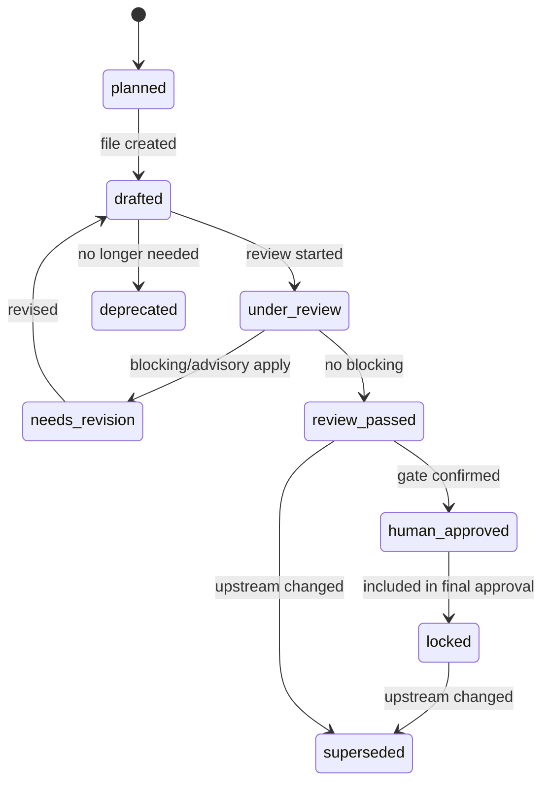
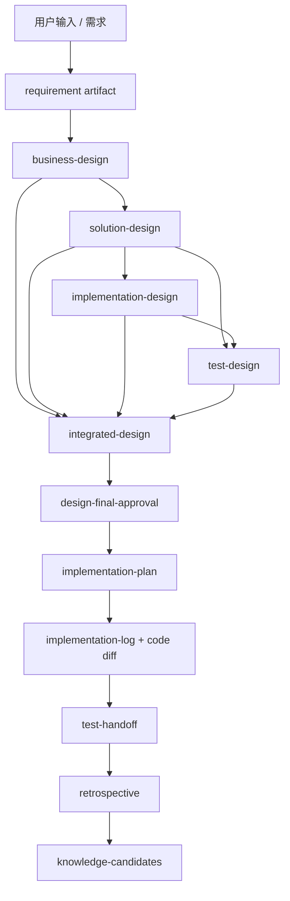
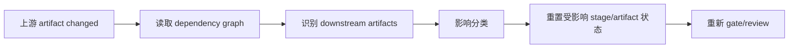

# 产物驱动流程编排设计

## 1. 设计目标

产物驱动编排的目标是让 workflow 只相信可检查事实，而不是相信模型声称“已完成”。V1 中，流程推进必须基于：

- `state.json`
- `artifact-registry.json`
- 具体 artifact 文件
- review matrix / review issue
- decision / approval
- evidence registry
- quality gate result
- trace event

## 2. 产物类型定义

| 类型 | 路径示例 | 说明 | owner |
|---|---|---|---|
| requirement | `inputs/requirement.md` | 初始需求输入 | SA |
| qa-log | `qa/requirement-qa.jsonl` | 需求澄清 Q&A | SA |
| business-design | `artifacts/business-design.md` | 业务设计 | SA |
| solution-design | `artifacts/solution-design.md` | 方案/架构设计 | SE |
| implementation-design | `artifacts/implementation-design.md` | 模块级实现设计 | MDE |
| test-design | `artifacts/test-design.md` | 测试设计 | TSE |
| integrated-design | `artifacts/integrated-design.md` | 最终批准视图 | workflow |
| review | `reviews/<target>/<agent>-review.md` | 评审意见 | reviewer Agent |
| decision | `decisions/*-decisions.md` | 人机决策 | stage owner |
| evidence | `evidence/knowledge/EV-*.md` | 查询快照 | skill |
| implementation-plan | `implementation/implementation-plan.md` | 开发执行计划 | DEV |
| implementation-log | `implementation/implementation-log.md` | 实现日志和 diff 摘要 | DEV |
| verification-handoff | `verification/test-handoff.md` | 转测包 | DEV/TSE |
| release-design | `release/release-design.md` | 发布设计 | CIE |
| ops-readiness | `operations/ops-readiness.md` | 运维就绪 | CIE/SRE |
| knowledge-candidate | `knowledge-candidates/*.jsonl` | 待审批知识 | SA/SE/TSE |

## 3. Artifact Frontmatter

V1 所有关键 Markdown artifact 必须带 frontmatter：

```yaml
---
artifactId: ART-001
artifactType: business-design
taskId: FEAT-20260708-001
version: 1
status: drafted
ownerAgent: sa
dependsOn:
  - REQ-001
evidenceRefs:
  - EV-001
decisionRefs:
  - DEC-001
qualityGateRefs:
  - QG-BD-001
createdAt: 2026-07-08T10:00:00+08:00
updatedAt: 2026-07-08T10:30:00+08:00
---
```

Frontmatter 是脚本可读事实；正文是人工和 Agent 可读内容。两者必须一致，quality gate 负责校验。

## 4. Artifact Registry

`artifact-registry.json` 是 workflow 的产物索引。

```json
{
  "schemaVersion": 1,
  "taskId": "FEAT-20260708-001",
  "artifacts": [
    {
      "artifactId": "ART-001",
      "type": "business-design",
      "path": "artifacts/business-design.md",
      "version": 1,
      "hash": "sha256:abc",
      "status": "drafted",
      "ownerAgent": "sa",
      "dependsOn": ["REQ-001"],
      "downstream": ["ART-002", "ART-005"],
      "evidenceRefs": ["EV-001"],
      "decisionRefs": ["DEC-001"],
      "reviewRefs": ["REV-001"],
      "qualityGateRefs": ["QG-BD-001"],
      "approvedIn": [],
      "lastChangedAt": "2026-07-08T10:30:00+08:00"
    }
  ]
}
```

## 5. 产物状态模型



**说明**

artifact 状态比 stage 状态更细。Stage 状态只服务 workflow，artifact 状态服务版本、审批和影响分析。最终批准后的 artifact 应进入 `locked`，后续修改必须产生新 version 并触发影响分析。

## 6. 状态机设计



**说明**

图中的箭头是依赖关系，不一定表示执行顺序。Workflow 每次只推进一个 `nextAction`，但 artifact registry 必须知道上游变化会影响哪些下游产物。

## 7. 版本管理

规则：

1. 每次 artifact 内容变化，version + 1。
2. hash 基于正文和 frontmatter 中关键字段计算。
3. review、approval、quality gate 必须引用 artifactId + version + hash。
4. 已批准版本不可原地覆盖；修订必须生成新 version，并标记旧 version `superseded`。
5. `integrated-design.md` 必须引用各阶段 artifact 的锁定版本。

## 8. 产物依赖关系

依赖分三类：

- `derivesFrom`：由上游内容推导，例如 solution-design derivesFrom business-design。
- `verifies`：验证关系，例如 test-design verifies business rules。
- `implements`：实现关系，例如 implementation-plan implements design artifact。

示例：

```json
{
  "from": "ART-004",
  "to": "ART-002",
  "relation": "implements",
  "rationale": "implementation-design realizes solution-design module map"
}
```

## 9. 校验规则

V1 应新增 `scripts/devsphere-quality-gate.js`，至少支持：

```bash
node scripts/devsphere-quality-gate.js validate-artifact <task-path> <artifact-type>
node scripts/devsphere-quality-gate.js validate-task <task-path>
node scripts/devsphere-quality-gate.js impact-analysis <task-path> <artifact-id>
```

自动校验项：

- frontmatter 必填字段。
- artifact registry 是否同步。
- evidence/decision/review 引用是否存在。
- 必填章节是否存在。
- artifact 状态与 stage 状态是否一致。
- approval 是否引用当前 hash。
- locked artifact 是否被修改。

人工校验项：

- 业务规则是否正确。
- 架构取舍是否合理。
- 风险是否可接受。
- 发布窗口是否合适。

## 10. 评审规则

Review issue 需要结构化：

```json
{
  "issueId": "RI-001",
  "artifactId": "ART-002",
  "artifactVersion": 2,
  "reviewerAgent": "tse",
  "type": "blocking",
  "status": "open",
  "summary": "缺少失败路径测试设计",
  "evidence": ["artifacts/test-design.md#3"],
  "createdAt": "2026-07-08T10:00:00+08:00",
  "closedBy": null,
  "closedAt": null
}
```

规则：

- blocking 必须关闭才能通过。
- advisory 必须人工决策。
- risk_candidate 必须人工决定 reject 或 accepted_risk。
- 关闭 issue 必须引用修订版本或人工决策。

## 11. 变更影响分析



**说明**

影响分类：

- `none`：无下游影响，仅记录。
- `minor`：下游需复核，不重写。
- `major`：下游 artifact 回到 drafted。
- `critical`：最终 approval 失效，回到 designing。

## 12. 产物到任务映射

开发任务必须从批准 artifact 派生：

```json
{
  "taskId": "IMPL-001",
  "sourceArtifacts": [
    {"artifactId": "ART-003", "version": 2},
    {"artifactId": "ART-004", "version": 1}
  ],
  "scope": ["src/order/service.ts", "tests/order/service.test.ts"],
  "acceptanceCriteria": ["AC-001", "AC-002"],
  "verification": ["npm test -- order"]
}
```

## 13. 产物到知识库沉淀规则

可沉淀：

- 被多次问答确认的业务规则。
- 明确适用范围的术语和领域规则。
- 复盘中确认的流程改进。
- 发布/运维中确认的标准检查项。

不可直接沉淀：

- 单次任务中的临时假设。
- 未经人工审批的 Agent 推断。
- 只适用于一次变更的实现细节。
- 已废弃或冲突未解决的规则。

