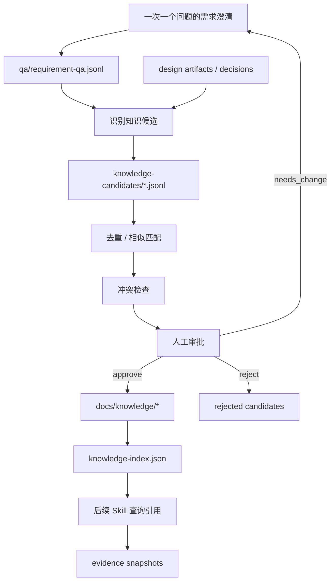
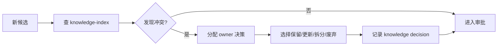

# 知识库持续更新机制

## 1. 设计目标

需求设计过程中最有价值的知识往往来自追问：业务例外、历史约束、术语边界、审批规则、系统现状和团队经验。V1 需要把这些隐性知识从聊天中提取出来，经过候选、去重、冲突处理、人工审批后进入长期知识库。

核心原则：

1. Agent 不直接写主知识库。
2. 所有知识先成为候选。
3. 候选必须有来源和适用范围。
4. 入库必须人工审批。
5. 知识必须能老化、废弃和追溯。

## 2. 知识萃取闭环



**说明**

知识库更新不是每次任务结束时把所有内容复制进去，而是把可复用、已确认、有来源的知识条目纳入主知识库。后续任务使用知识库时仍要保存 evidence snapshot，保证可复盘。

## 3. 隐性知识类型

| 类型 | 示例 | 是否可入库 |
|---|---|---|
| 业务规则 | “退款金额超过 X 需要二级审批” | 可，需 owner 审批 |
| 术语定义 | “活跃用户定义为 30 天内有支付行为” | 可 |
| 例外流程 | “企业客户不走普通风控队列” | 可 |
| 系统现状 | “当前订单服务不支持幂等重试” | 可，但需 evidence |
| 架构约束 | “跨域调用必须走 gateway” | 可 |
| 测试经验 | “支付回调必须覆盖重复通知” | 可 |
| 发布经验 | “配置开关需灰度 24 小时” | 可 |
| 临时决策 | “本次先不支持导出” | 不入主库，可进 decision |
| 未验证假设 | “用户大概率不会使用旧入口” | 不入主库 |

## 4. 挖掘问题策略

需求澄清应一次只问一个问题。问题优先级：

1. 目标和成功标准。
2. 范围边界。
3. 关键业务规则。
4. 异常和例外流程。
5. 存量系统行为。
6. 权限、安全、审计。
7. 数据、兼容性、迁移。
8. 测试和验收。
9. 发布、配置、运维。

问题格式：

```json
{
  "questionId": "Q-001",
  "stage": "requirement-discovery",
  "askedBy": "sa",
  "question": "当审批人离职或不可用时，当前业务期望如何处理？",
  "reason": "业务流程存在异常路径缺口",
  "relatedArtifact": "inputs/requirement.md",
  "status": "answered"
}
```

## 5. Q&A 记录结构

`qa/requirement-qa.jsonl`：

```json
{
  "qaId": "QA-001",
  "taskId": "FEAT-001",
  "questionId": "Q-001",
  "question": "当审批人离职或不可用时，当前业务期望如何处理？",
  "answer": "转交给该审批人的直属主管，超过 24 小时未处理则升级给部门负责人。",
  "answeredBy": "human",
  "answeredAt": "2026-07-08T10:00:00+08:00",
  "confidence": "high",
  "candidateKnowledge": true,
  "artifactRefs": ["ART-001"],
  "decisionRefs": ["DEC-001"]
}
```

## 6. 知识候选结构

`knowledge-candidates/KC-*.jsonl`：

```json
{
  "candidateId": "KC-001",
  "taskId": "FEAT-001",
  "type": "business-rule",
  "title": "审批人不可用时的升级规则",
  "content": "审批人离职或不可用时，审批任务转交直属主管；超过 24 小时未处理则升级部门负责人。",
  "sourceRefs": ["QA-001", "ART-001", "DEC-001"],
  "proposedBy": "sa",
  "scope": {
    "domain": "approval",
    "systems": ["workflow-service"],
    "appliesTo": ["expense-approval"]
  },
  "confidence": "high",
  "status": "pending_review",
  "reviewer": "business-owner",
  "createdAt": "2026-07-08T10:10:00+08:00"
}
```

## 7. 候选识别规则

候选识别条件：

- 回答描述了跨任务可复用规则。
- 解释了领域术语。
- 明确了现有系统行为。
- 形成了后续设计约束。
- 被多个 artifact 引用。
- 解决了一个 recurring open question。

排除条件：

- 只针对本次任务的一次性选择。
- 置信度低且无 evidence。
- 与现有知识冲突但未解决。
- 涉及敏感信息且无脱敏策略。

## 8. 去重规则

去重分三层：

1. **ID/标题匹配**：同标题同 domain 先判为可能重复。
2. **语义相似**：内容相似但适用范围不同，合并或拆分。
3. **来源关系**：来自同一 Q&A 或同一决策的重复候选合并。

去重结果：

- `new`：新知识。
- `update_existing`：更新已有条目。
- `duplicate`：重复，归档。
- `split_required`：范围混杂，需拆分。

## 9. 冲突处理

冲突类型：

- 内容冲突：新规则与旧规则相反。
- 范围冲突：同一规则适用范围重叠但结论不同。
- 时效冲突：旧知识可能过期。
- 来源冲突：证据来源可信度不同。

处理流程：



## 10. 可信度标记

| 级别 | 条件 |
|---|---|
| high | 人工 owner 明确确认，或有权威文档 evidence |
| medium | 任务 owner 确认，但未找到长期规范 |
| low | Agent 推断或单次上下文，必须待确认 |
| deprecated | 曾经有效但已废弃 |
| disputed | 存在冲突，不能作为设计依据 |

## 11. 审批机制

知识入库审批必须包含：

- 审批人。
- 审批时间。
- 适用范围。
- 来源引用。
- 冲突处理结果。
- 生效状态。
- 下次复审时间。

审批记录：

```json
{
  "approvalId": "KAPP-001",
  "candidateId": "KC-001",
  "decision": "approve",
  "approvedBy": "business-owner",
  "approvedAt": "2026-07-08T11:00:00+08:00",
  "targetPath": "docs/knowledge/business/approval-rules.md",
  "notes": "适用于费用审批域"
}
```

## 12. 知识库目录结构

```text
docs/knowledge/
  index.md
  knowledge-index.json
  business/
    glossary.md
    business-rules.md
    processes.md
  architecture/
    principles.md
    integration-standards.md
    api-contracts.md
  engineering/
    coding-standards.md
    testing-standards.md
    release-standards.md
  operations/
    observability.md
    incident-response.md
    rollback.md
  deprecated/
    index.md
```

## 13. 知识索引机制

`knowledge-index.json`：

```json
{
  "entries": [
    {
      "knowledgeId": "KN-001",
      "title": "审批人不可用升级规则",
      "path": "docs/knowledge/business/business-rules.md#审批人不可用升级规则",
      "type": "business-rule",
      "domain": "approval",
      "status": "active",
      "confidence": "high",
      "owner": "business-owner",
      "sourceCandidates": ["KC-001"],
      "lastReviewedAt": "2026-07-08T11:00:00+08:00",
      "reviewAfter": "2026-10-08"
    }
  ]
}
```

## 14. 引用与追溯机制

Artifact 引用知识时必须保存 evidence snapshot：

1. 查询 `docs/knowledge`。
2. 将实际采用条目保存到 `evidence/knowledge/EV-*.md`。
3. 在 artifact 中引用 `依据：EV-xxx`。
4. 在 `evidence-registry.json` 中记录来源知识 ID。

这样即使知识库后来更新，仍能复盘当时设计依据。

## 15. 知识老化与废弃

每个知识条目必须有：

- `owner`
- `status`
- `lastReviewedAt`
- `reviewAfter`
- `supersededBy`

状态：

- `active`
- `needs_review`
- `deprecated`
- `disputed`

老化触发：

- 到达 `reviewAfter`。
- 引用该知识的任务产生缺陷或返工。
- 新候选与旧知识冲突。
- 人工标记不再适用。

