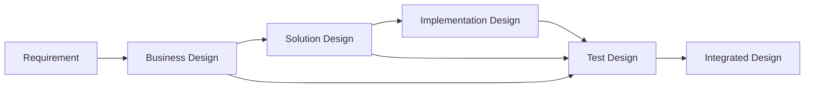

# 目标 Skill 模型

## 1. 通用 Skill 契约

每个设计 Skill 必须具备以下结构：

| 契约项 | 要求 |
|---|---|
| 入口 | slash command、参数、mode |
| 输入 | 必读 artifact、evidence、decision、state、template |
| 输出 | 主产物、evidence、decision、gate result、review handoff |
| 前置条件 | active task、状态、上游产物、禁止覆盖条件 |
| 执行步骤 | 必须执行的专业动作，不只写“按模板生成” |
| 专业方法 | 例如 C4、4+1、QAW、ATAM、STRIDE、risk-based testing |
| 图示要求 | Mermaid 图类型、适用条件、图后说明 |
| evidence/decision/assumption | ID、引用、缺口和确认规则 |
| 质量门禁 | gate ID、pass/warn/fail/requires_human |
| 失败处理 | 信息不足、证据冲突、工具失败、人工阻塞 |
| 修订模式 | 修订原因、影响分析、下游状态重置 |
| 状态流转 | 哪些事实允许进入 drafted/review/human_approved |
| 写入范围 | 允许和禁止修改的路径 |
| 完成标准 | 可检查，不使用“文档已生成”作为唯一标准 |
| 下游交接 | 给 review、下一设计阶段、DEV/TSE/CIE 的契约 |

## 2. `feature-design-business`

目标：从“读取需求 + 查询知识 + 生成 business-design”升级为“需求工程与业务建模 Skill”。

必执行动作：

1. 解析 `inputs/requirement.md`，生成初始 REQ/BR/NFR 候选。
2. 识别业务目标、干系人、用户角色、In Scope / Out of Scope。
3. 查询当前业务现状、存量业务规则、历史需求 evidence。
4. 隐性知识挖掘：一次只问一个问题，Q&A 落盘。
5. 建模正常流、异常流、替代流、状态模型、决策表、领域术语。
6. 生成业务规则清单、验收标准、需求追溯矩阵。
7. 标记 assumption、open question、decision。
8. 对 solution-design 生成交接契约。
9. 运行 `design-template-check` 和 `design-quality-gate --target business-design`。
10. revise 模式记录影响，并重置受影响下游阶段。

完成标准：

- 每条关键业务规则有 BR ID、来源 evidence 或 assumption。
- Scope 清晰，异常和替代流不为空或有“不适用”理由。
- 验收标准可测试。
- 对 solution-design 的交接契约明确。

## 3. `feature-design-solution`

目标：升级为“系统方案与架构设计 Skill”。

必执行动作：

1. 解析 business-design 和 business decisions。
2. 识别架构目标、约束、需求到架构追溯。
3. 生成系统上下文图、C4 Context/Container/Component 视图。
4. 按复杂度生成 4+1 logical/development/process/physical/scenario 视图覆盖矩阵。
5. 设计系统边界、模块边界、接口契约、数据模型、数据流、集成。
6. 设计兼容性、迁移、回滚、质量属性场景。
7. 执行轻量 ATAM：候选方案、敏感点、trade-off、风险。
8. 处理安全、性能、可靠性、扩展性、维护性。
9. 记录架构决策和风险。
10. 生成对 implementation-design 和 test-design 的交接契约。

完成标准：

- 业务规则被方案承接。
- 接口、数据、NFR、风险可被实现和测试。
- 关键取舍有 DEC ID。
- 涉及部署/配置/迁移时触发 CIE。

## 4. `feature-design-implementation`

目标：升级为“模块级详细设计 Skill”。

必执行动作：

1. 解析 solution-design 的接口、数据、NFR、风险。
2. 查询代码仓影响面：模块结构、路径、符号、调用链、既有模式。
3. 保存 repository evidence，只记录路径、符号、调用关系，不复制大段源码。
4. 设计模块职责、文件影响、类/接口/函数、DTO/VO/Entity/配置对象。
5. 绘制关键流程时序图、数据流图、状态机。
6. 设计算法/规则实现、API 适配、数据库变更、配置变更。
7. 覆盖错误处理、并发事务、幂等性、性能、安全、兼容、日志监控、测试钩子、回滚。
8. 记录实现风险、对 DEV 实现计划的交接契约、对 test-design 的测试输入。

完成标准：

- 文件/模块影响来自 repo evidence。
- DEV 能直接派生 implementation-plan。
- TSE 能派生实现风险测试。
- 与 solution contract 无冲突。

## 5. `feature-design-test`

目标：升级为“风险驱动测试设计 Skill”。

必执行动作：

1. 解析 business、solution、implementation 三类设计。
2. 建立业务规则、架构风险、实现风险到测试的追溯。
3. 定义测试目标、范围、策略、测试金字塔映射。
4. 设计 unit、contract、integration、e2e、regression、boundary、negative、permission/security、performance、compatibility 测试。
5. 明确测试数据、测试环境、Mock/Stub、自动化建议。
6. 标记不可测项、风险接受候选、转测准入标准。
7. 运行 gate，并输出对 verification/test-handoff 的交接契约。

完成标准：

- 关键业务规则和高风险项无孤儿。
- 不可测项有原因和缓解。
- 转测准入可执行。

## 6. `feature-review`

目标：升级为“多角色设计评审 Skill”。

能力：

- 支持 business/solution/implementation/test/integrated 评审。
- 评审者视角包括 SA、SE、MDE、TSE、DEV、CIE。
- 输出结构化 issue：`blocking`、`advisory`、`risk_candidate`。
- 每个 issue 必须包含 ID、artifact version/hash、位置、原因、预期修复、owner、round、status。
- blocking 不归零不能进入下一阶段。
- advisory/risk_candidate 必须经人工确认，risk_candidate 不得自动变 accepted_risk。

## 7. `design-quality-gate`

新增 Skill，统一执行设计质量门禁。

检查对象：

- business-design、solution-design、implementation-design、test-design、integrated-design
- evidence、decision、assumption、traceability、diagram、non-functional、review closure

输出：

- `quality-gates/QG-*.json`
- `pass | warn | fail | requires_human`
- 失败定位和恢复路径

禁止：

- 不修改正文。
- 不接受风险。
- 不关闭 review issue。
- 不直接推进 `design_ready`。

## 8. `design-template-check`

新增 Skill，检查模板结构和必填章节。

检查项：

- 必填章节
- Mermaid 图示
- evidence/decision/assumption/risk/requirement/test ID 格式
- traceability matrix
- 空洞内容和占位符残留
- 下游交接契约

## 9. `design-integration-check`

新增 Skill，执行跨阶段一致性检查并生成/刷新 integrated-design。

检查链路：

说明：

- integrated-design 是批准视图，不是新事实来源。
- accepted_risk 只能来自 decisions。
- 任一上游 artifact 新 version/hash 后，integrated-design 和 approval 必须失效或刷新。

