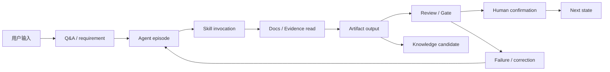

# 可追溯与可观测机制

## 1. 设计目标

V1 必须让每一次 Agent 工作都能复盘：谁发起、读了什么、用了什么 Skill、生成了什么产物、通过了什么门禁、哪里失败、如何修正。Trace 不记录模型完整思维链，只记录可审计事件和摘要。

## 2. 可追溯链路



**说明**

每个节点都必须能落到一个文件或 JSON event。最终可从需求追到设计、实现、测试、批准、知识更新，也能从缺陷反向追溯到相关需求和决策。

## 3. 数据模型

### 3.1 Workflow Run

一次用户通过 `/workflow` 推进任务，生成一个 run。

```json
{
  "workflowRunId": "WR-20260708-0001",
  "taskId": "FEAT-001",
  "taskType": "feature",
  "startedAt": "2026-07-08T10:00:00+08:00",
  "endedAt": "2026-07-08T10:05:00+08:00",
  "trigger": {
    "type": "user_prompt",
    "summary": "/scc-dev-sphere:workflow"
  },
  "initialState": "designing",
  "finalState": "designing",
  "nextAction": {
    "kind": "run_skill",
    "skill": "feature-design-solution",
    "agents": ["se"]
  },
  "status": "completed",
  "episodeIds": ["EP-001"],
  "gateResultIds": ["QG-001"]
}
```

### 3.2 Episode

Episode 是一次 Agent/Skill 工作片段。

```json
{
  "episodeId": "EP-001",
  "workflowRunId": "WR-20260708-0001",
  "taskId": "FEAT-001",
  "agent": "se",
  "skill": "feature-design-solution",
  "stage": "solutionDesign",
  "startedAt": "2026-07-08T10:01:00+08:00",
  "endedAt": "2026-07-08T10:04:00+08:00",
  "inputs": ["ART-001", "EV-001"],
  "docsRead": ["docs/knowledge/architecture/principles.md"],
  "outputs": ["ART-002"],
  "decisions": ["DEC-002"],
  "status": "success",
  "failure": null
}
```

### 3.3 Trace Event

Trace event 用 JSONL 保存，路径：`trace/workflow-runs/<workflowRunId>.jsonl`。

```json
{
  "eventId": "TE-001",
  "timestamp": "2026-07-08T10:01:00+08:00",
  "workflowRunId": "WR-20260708-0001",
  "episodeId": "EP-001",
  "eventType": "docs_read",
  "actor": "se",
  "details": {
    "paths": ["docs/knowledge/architecture/principles.md"],
    "reason": "support solution-design architecture constraints"
  }
}
```

## 4. 事件类型

| eventType | 说明 |
|---|---|
| user_input_received | 用户输入或确认 |
| workflow_resolved | resolver 输出 nextAction |
| skill_started | Skill 开始 |
| agent_started | Agent 工作开始 |
| docs_read | 读取 docs/knowledge/templates |
| evidence_created | evidence snapshot 创建 |
| artifact_written | artifact 创建或修订 |
| registry_updated | artifact/evidence/decision registry 更新 |
| review_created | 评审创建 |
| gate_executed | 质量门禁执行 |
| human_confirmation_requested | 请求人工确认 |
| human_confirmation_recorded | 人工确认落盘 |
| state_transition | 状态变化 |
| failure_detected | 失败或阻塞 |
| correction_applied | 修正动作 |
| knowledge_candidate_created | 知识候选创建 |
| knowledge_approved | 知识入库审批 |

## 5. 失败归因结构

```json
{
  "failureId": "FAIL-001",
  "category": "missing_context",
  "stage": "solutionDesign",
  "detectedBy": "quality-gate",
  "summary": "solution-design 声明现有 API 兼容性但缺 evidence 引用",
  "rootCause": "architecture knowledge not queried",
  "recoverable": true,
  "recommendedAction": "run knowledge-query for API compatibility and update evidence registry",
  "resolvedBy": "EP-002",
  "resolvedAt": "2026-07-08T11:00:00+08:00"
}
```

分类：

- `missing_context`
- `invalid_state`
- `artifact_schema_error`
- `review_blocking`
- `human_decision_required`
- `tool_failure`
- `test_failure`
- `scope_drift`
- `knowledge_conflict`
- `unknown`

## 6. 指标体系

### 6.1 Agent 成功率

- episode success rate by agent。
- blocking issues per artifact by agent。
- average revision rounds。
- human escalation rate。

### 6.2 失败模式

- missing evidence 次数。
- artifact schema 失败次数。
- state transition 失败次数。
- review blocking top categories。
- scope drift 次数。

### 6.3 上下文缺失

- docs_read count。
- evidence not_found count。
- assumption count。
- Q&A count before design ready。

### 6.4 知识库命中率

- knowledge query count。
- evidence created count。
- not_found ratio。
- knowledge candidate approval ratio。
- reused knowledge entries。

### 6.5 产物返工率

- artifact version count。
- downstream invalidation count。
- review rounds。
- final approval rework count。

## 7. Trace 文件布局

```text
.devsphere/tasks/feature/<task-id>/
  trace/
    workflow-runs/
      WR-20260708-0001.json
      WR-20260708-0001.jsonl
    episodes/
      EP-001.json
    failures/
      FAIL-001.json
    metrics/
      summary.json
```

## 8. 可观测性规则

1. 每次 resolver 计算必须记录 `workflow_resolved`。
2. 每次 Skill 开始和结束必须记录 episode。
3. 每次 quality gate 必须输出 gate result。
4. 每次人工确认必须记录 request 和 recorded 两个事件。
5. 每次状态变化必须记录 from/to、原因和触发事件。
6. 每个 artifact 版本必须能追到生成它的 episode。

## 9. 隐私与最小记录

Trace 不记录：

- 模型完整思维链。
- 未经脱敏的密钥、token、个人敏感信息。
- 大段源码。

Trace 记录摘要、路径、ID、hash 和决策理由，必要时引用 evidence snapshot。

