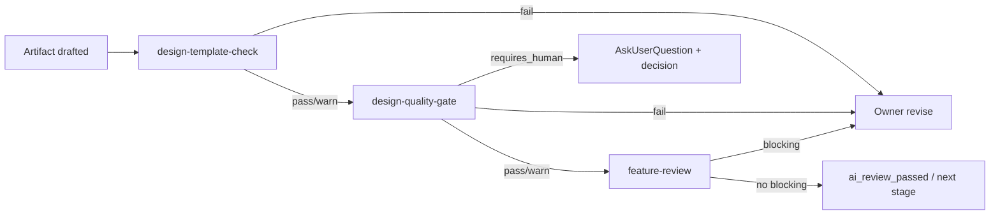

# 设计质量门禁体系

## 1. 目标

设计质量门禁用于回答：一个设计产物是否具备进入正式评审、下游设计、最终批准、实现计划或转测的条件。

门禁只负责可检查规则，不替代专业评审：

- Gate 检查结构、引用、完整性、一致性、状态。
- Review 检查业务、架构、实现、测试专业判断。
- Human approval 接受风险、确认建议项和批准范围。

## 2. Gate 状态

| 状态 | 含义 | 处理 |
|---|---|---|
| pass | 满足进入下一步的结构性要求 | 可进入 formal review 或下游 |
| warn | 有非阻塞问题 | 可进入 review，但 review 必须关注 |
| fail | 缺失关键结构或追溯 | 返回 owner Skill 修订 |
| requires_human | 机器无法判断，需人确认 | 暂停，使用 AskUserQuestion 并落盘 |

## 3. Gate Catalog

| Gate ID | 阶段 | 检查对象 | 规则 | 通过条件 | 警告条件 | 失败条件 | 自动修复建议 | 人工介入 | 责任 Agent | 执行 Skill | 输出位置 |
|---|---|---|---|---|---|---|---|---|---|---|---|
| QG-TPL-001 | all | artifact frontmatter | artifactId/type/taskId/version/status/owner/refs 存在 | 字段完整 | 非关键 refs 空 | 缺基础字段 | 提示补 frontmatter | 字段语义冲突 | owner | design-template-check | quality-gates/TPL-*.json |
| QG-TPL-002 | all | 章节结构 | 必填章节存在且非空 | 完整 | 次要章节简略 | 缺关键章节或只剩注释 | 列出缺失章节 | 模板本身冲突 | owner | design-template-check | quality-gates/TPL-*.json |
| QG-EV-001 | all | evidence refs | 存量事实必须引用 EV | 事实均可追溯 | 低风险事实缺证据但标 assumption | 关键事实无 EV/ASM | 提示转 assumption 或补 evidence | 证据冲突 | owner | design-quality-gate | quality-gates/QG-*.json |
| QG-DEC-001 | all | decision refs | 关键取舍必须有 DEC | 关键取舍完整 | 小取舍仅 rationale | 重大取舍无 DEC | 生成 decision 草案 | 方案选择 | owner | design-quality-gate | quality-gates/QG-*.json |
| QG-ASM-001 | all | assumption | ASM 有 confidence/needsConfirmation | 全部明确 | 低风险未确认 | 高风险未确认仍推进 | 生成确认问题 | 高风险 assumption | owner | design-quality-gate | quality-gates/QG-*.json |
| QG-BD-001 | business | 需求背景/目标 | 背景和目标可追溯 | 有 REQ/EV | 目标不可量化但可评审 | 无背景/目标 | 补 REQ 摘要 | 目标冲突 | SA | design-quality-gate | QG-BD-*.json |
| QG-BD-004 | business | 范围边界 | In/Out of Scope 都存在 | 明确 | out-of-scope 简略 | 范围缺失 | 补 scope 表 | 边界争议 | SA | design-quality-gate | QG-BD-*.json |
| QG-BD-006 | business | 业务规则 | BR 有 ID、来源、验证方式 | 关键规则完整 | 次要规则待证据 | 关键规则无来源/不可测 | 补 BR 表 | 规则冲突 | SA | design-quality-gate | QG-BD-*.json |
| QG-BD-008 | business | 流程/状态 | 主流程、异常流、必要状态 | 完整 | 小任务说明不适用 | 只有 happy path | 补 Mermaid flow/state | 流程争议 | SA | design-quality-gate | QG-BD-*.json |
| QG-TR-001 | business | REQ->BR->AC | 需求有业务承接 | 无孤儿关键需求 | 次要需求 deferred | 关键需求孤儿 | 生成 RTM 缺口 | scope 决策 | SA | design-quality-gate | QG-BD-*.json |
| QG-SD-002 | solution | C4 Context | 跨系统有上下文图 | 图和说明完整 | 单系统文字替代 | 跨系统无图 | 补 Mermaid 图 | 系统边界争议 | SE | design-quality-gate | QG-SD-*.json |
| QG-SD-004 | solution | 4+1 | 中高风险覆盖受影响视图 | 视图覆盖矩阵完整 | 低风险裁剪有理由 | 高风险缺受影响视图 | 补矩阵 | 风险等级确认 | SE | design-quality-gate | QG-SD-*.json |
| QG-API-001 | solution | 接口契约 | 对外/API 变更有 request/response/error/auth/version | 完整 | 内部接口简化 | 对外接口无契约 | 补 contract 表 | 兼容性取舍 | SE | design-quality-gate | QG-SD-*.json |
| QG-DATA-001 | solution | 数据模型 | schema/data flow/migration/rollback | 完整 | 无迁移但理由简略 | 数据变更无迁移/回滚 | 补数据影响表 | 数据风险接受 | SE/CIE | design-quality-gate | QG-SD-*.json |
| QG-NFR-001 | solution | 质量属性 | NFR 用场景描述并可验证 | source/stimulus/measure 完整 | 次要 NFR 空泛 | 关键 NFR 不可验证 | 补质量属性场景 | NFR 取舍 | SE/TSE | design-quality-gate | QG-SD-*.json |
| QG-SEC-001 | solution | 安全 | 涉权/PII/外部输入有 trust boundary/STRIDE | 威胁和缓解完整 | 低风险说明不适用 | 高风险无安全分析 | 补 STRIDE 表 | 安全风险接受 | SE/CIE | design-quality-gate | QG-SD-*.json |
| QG-ID-002 | implementation | 模块影响 | 模块/文件影响来自 repo evidence | 全部可追溯 | 局部 assumption | 无 repo evidence | 补 repo query | repo 不可读 | MDE | design-quality-gate | QG-ID-*.json |
| QG-ID-006 | implementation | 调用链/数据流/状态机 | 跨模块/状态变更有图示 | 完整 | 单模块文字替代 | 复杂变更无图 | 补 sequence/data/state | 实现不确定 | MDE | design-quality-gate | QG-ID-*.json |
| QG-ID-009 | implementation | 并发/事务/幂等/错误 | 高风险项有策略 | 完整 | 低风险说明不适用 | 涉数据一致性无策略 | 补策略表 | 技术取舍 | MDE/DEV | design-quality-gate | QG-ID-*.json |
| QG-TD-002 | test | 测试策略 | 测试金字塔层级明确 | 层级和理由完整 | 小任务简化 | 只有人工/E2E | 补层级表 | 测试成本取舍 | TSE | design-quality-gate | QG-TD-*.json |
| QG-TR-003 | test | 需求/风险到测试 | 关键 REQ/BR/API/MOD/RISK 有 TEST | 无关键孤儿 | 次要项有理由 | 关键项无测试 | 补 RTM | 风险接受 | TSE | design-quality-gate | QG-TD-*.json |
| QG-TD-007 | test | 测试数据/环境 | 数据、账号、环境、Mock 明确 | 可准备 | 部分依赖待确认 | 必要环境缺失 | 补准备表 | 环境不可用 | TSE/DEV | design-quality-gate | QG-TD-*.json |
| QG-RISK-003 | test | 不可测项 | 不可测项有原因、影响、缓解 | 完整 | 低风险未确认 | 高风险未确认 | 转 risk_candidate | 风险接受 | TSE | design-quality-gate | QG-TD-*.json |
| QG-IG-001 | integrated | 阶段状态 | 阶段 artifact/version/hash/gate/review 都可查 | 全部 ready | 非关键 warn | 任一阶段未 ready | 回对应阶段 | 状态冲突 | workflow | design-integration-check | QG-IG-*.json |
| QG-TR-004 | integrated | business->solution | BR/REQ 被方案承接 | 无关键缺口 | 次要缺口有 DEC | 关键缺口 | 回 solution | scope 决策 | SE/SA | design-integration-check | QG-IG-*.json |
| QG-TR-005 | integrated | solution->implementation | API/data/module 被实现承接 | 无缺口 | 次要缺口说明 | 关键缺口 | 回 implementation | 实现不可行 | MDE/SE | design-integration-check | QG-IG-*.json |
| QG-TR-006 | integrated | implementation->test | MOD/RISK 被测试承接 | 高风险覆盖 | 低风险未覆盖有理由 | 高风险孤儿 | 回 test | 测试成本 | TSE/MDE | design-integration-check | QG-IG-*.json |
| QG-REV-001 | review | review closure | required reviewers 完成，blocking=0 | 全部完成 | advisory 待确认 | blocking 未关闭 | 回 owner revise | 冲突/建议项 | all | feature-review | reviews/review-matrix.json |
| QG-APP-001 | approval | final design approval | artifact hash、accepted risk、advisory 确认完整 | 可批准 | 有 warn 需说明 | hash/gate/review 缺失 | 展示缺口 | 批准/拒绝 | human | feature-approve | approvals/*.json |

## 4. 门禁执行顺序



说明：

1. Template check 先检查结构。
2. Quality gate 检查引用、完整性、traceability 和状态。
3. Formal review 只在 gate 可接受后执行。
4. Human approval 只接受风险和批准范围，不替代 gate 或 review。

## 5. QG 结果 JSON Schema

每次 gate 执行输出统一结构 JSON。`design-template-check` → `quality-gates/TPL-<target>.json`；`design-quality-gate` → `quality-gates/QG-<target>.json`。

```json
{
  "gateId": "QG-BD-006",
  "target": "business-design",
  "status": "pass",
  "checks": [
    {
      "rule": "BR 有 ID、来源、可验证表达",
      "result": "warn",
      "detail": "BR-002 缺来源 evidence",
      "location": "§业务规则清单",
      "recovery": "补 EV 或标 ASM"
    }
  ]
}
```

字段：

- `gateId`：catalog 中的 Gate ID（模板检查为 `TPL-001` 等）。
- `target`：被检查的 artifact。
- `status`：`pass | warn | fail | requires_human`，取 checks 中最严重者。
- `checks[]`：逐条规则判定。`requires_human` 的 check 在 `detail` 中给出待确认问题。

## 6. P0 执行方式与规则强度

- P0 由 AI 按 `design-template-check` / `design-quality-gate` Skill 契约执行检查并产出上述 JSON。
- **fail 规则强度 = §3 catalog 各 gate 的"失败条件"列**（不新增更严 fail，遵循"先 warn 后 fail"）。
- 未来 `scripts/devsphere-quality-gate.js` 自动化确定性检查（**P0 不实现**）。

## 7. 设计阶段 gate 调用点

每个 `feature-design-*` Skill 在产物起草后按序触发：先 `design-template-check`，pass/warn 后 `design-quality-gate --target <artifact>`，再进入 `feature-review`（见各 Skill 的"质量门禁"章节）。

> `design-integration-check`（QG-IG-* / 跨阶段一致性）与 integrated-design 刷新在 target-skill-model §9 定义，P0 暂由 `feature-review --target integrated-design` 承担跨阶段一致性评审；独立 Skill 列入后续任务。

