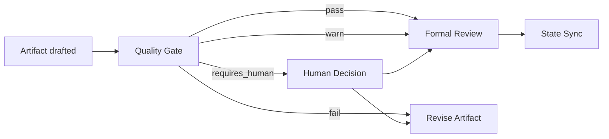

# 质量门禁体系

## 1. 设计原则

质量门禁分为两类：

- **自动门禁**：结构、引用、状态、hash、章节、证据、review issue 等可由脚本判断。
- **人工门禁**：业务正确性、风险接受、架构取舍、发布窗口等需要人类判断。

门禁结果必须落盘，不能只存在于聊天中。

## 2. 门禁结果结构

```json
{
  "gateId": "QG-BD-001",
  "taskId": "FEAT-001",
  "artifactId": "ART-001",
  "gateType": "business-design",
  "status": "pass",
  "checkedAt": "2026-07-08T10:00:00+08:00",
  "checks": [
    {
      "checkId": "BD-REQ-001",
      "name": "业务目标存在",
      "status": "pass",
      "message": "OK"
    }
  ],
  "requiresHuman": false
}
```

状态：

- `pass`
- `warn`
- `fail`
- `requires_human`

## 3. 阶段门禁矩阵

| 门禁 | 检查项 | 通过条件 | 警告条件 | 失败条件 | 自动修复策略 | 人工介入条件 |
|---|---|---|---|---|---|---|
| 需求质量门禁 | 目标、范围、用户、成功标准、开放问题 | 必填字段完整，开放问题已标记 | 仍有低风险开放问题 | 目标/范围/验收缺失 | 生成缺失问题列表 | 范围或优先级冲突 |
| 架构质量门禁 | 系统边界、接口、数据、NFR、兼容性、ADR | 每个关键决策有 rationale 和影响 | NFR 只定性未量化 | 接口/数据/兼容性缺失 | 标出缺章节和引用 | 架构取舍、风险接受 |
| 详细设计门禁 | 模块影响、文件范围、调用链、依赖、实现风险 | 模块和文件范围明确，有 repo evidence | 部分调用链不完整 | 无代码证据却声明现状 | 要求补 evidence | 实现方案多选一 |
| 代码生成前门禁 | design approval、implementation plan、repo 绑定、首次确认 | 批准和计划均存在，hash 匹配 | 测试命令不完整 | 未批准或计划缺失 | 无；阻断 | 首次代码修改确认 |
| 代码评审门禁 | diff 范围、测试、架构偏移、安全、可维护性 | 无 blocking，测试记录齐全 | advisory 未处理 | blocking open 或范围严重偏移 | 生成修复清单 | 是否接受偏差 |
| 测试设计门禁 | 验收标准、功能场景、异常路径、回归、数据、环境 | 场景覆盖需求，未测项有原因 | 回归范围偏泛 | 无验收标准或关键路径未覆盖 | 生成缺口列表 | 测试取舍 |
| 发布前门禁 | 部署、配置、迁移、回滚、CI、发布窗口 | 回滚和配置策略明确 | 缺少低风险环境说明 | 迁移/回滚缺失 | 生成 release checklist | 发布窗口、风险接受 |
| 知识入库门禁 | 来源、范围、去重、冲突、审批人、状态 | 审批完成，索引更新 | 复审日期缺失 | 无来源或冲突未解决 | 生成候选修正项 | owner 审批 |
| Agent 输出门禁 | 是否引用输入、是否标 assumption、是否越权 | 输出符合角色职责 | 低置信推断多 | 未引用证据却声明事实 | 提示补证据/标 assumption | 专业判断 |
| Skill 执行门禁 | 输入存在、输出路径、完成标准、状态合法 | 产物存在且校验通过 | 输出非关键章节为空 | 缺必需产物或状态非法 | 重跑校验和同步 registry | 状态冲突 |

## 4. 需求质量门禁

检查项：

- 需求目标。
- 业务价值。
- 范围内/范围外。
- 关键用户或角色。
- 验收标准。
- 未决问题。

失败处理：

- 不进入 business-design。
- 由 SA 继续一次一个问题追问。
- 问答写入 `qa/requirement-qa.jsonl`。

## 5. 架构质量门禁

检查项：

- 是否引用 business-design。
- 系统边界是否明确。
- 接口契约是否可测试。
- 数据模型和迁移影响。
- NFR：性能、安全、可靠性、兼容性。
- 架构决策是否记录。

失败处理：

- 回到 `solutionDesign` drafted。
- blocking 写入 review matrix。
- 若涉及发布/配置，追加 CIE reviewer。

## 6. 详细设计质量门禁

检查项：

- 模块/文件影响清单。
- 调用链或数据流。
- 复用模式和依赖。
- 风险与回滚。
- repo evidence。

失败处理：

- 要求 MDE 补 repository evidence。
- 对不确定实现标 assumption 或 open question。

## 7. 代码生成前门禁

检查项：

- `state.status` 必须是 `implementation_planned` 或 `implementing`。
- 存在 `design-final-approval.json`。
- approval 引用的 artifact hash 与当前 locked artifact 一致。
- 存在 `implementation-plan.md`。
- 存在 repo binding。
- 首次代码修改前有人工确认。

失败处理：

- Hook/guard 阻断 `feature-implement`。
- 输出缺失项和恢复路径。

## 8. 知识入库门禁

检查项：

- candidate 有 sourceRefs。
- scope 明确。
- confidence 不为 low，或 low 已升级为人工确认。
- 去重完成。
- 冲突处理完成。
- owner approve。
- `knowledge-index.json` 更新。

失败处理：

- candidate 保持 `pending_review` 或 `needs_change`。
- 不写主知识库。

## 9. Gate 执行方式

建议新增：

```bash
node scripts/devsphere-quality-gate.js validate-requirement <task-path>
node scripts/devsphere-quality-gate.js validate-artifact <task-path> <artifact-type>
node scripts/devsphere-quality-gate.js validate-approval <task-path>
node scripts/devsphere-quality-gate.js validate-knowledge-candidate <task-path> <candidate-id>
```

Gate 输出写入：

```text
quality-gates/
  QG-*.json
```

## 10. 门禁与状态关系



**说明**

Gate 不替代 formal review。Gate 先过滤结构性错误，formal review 处理业务、架构和质量判断。

