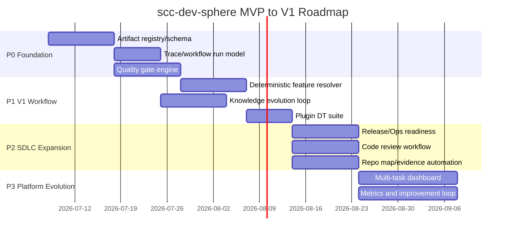

# MVP 到 V1 路线图

## 1. 路线图目标

当前 MVP 已能表达 feature workflow 的主路径，但 V1 要从“可跑通”升级到“可控、可追溯、可扩展”。路线图按风险优先组织：

- P0：先控制架构和状态事实。
- P1：补齐 V1 必需的 SDLC 产物和闭环。
- P2：增强自动化和角色扩展。
- P3：长期演进为组织级 Agentic SDLC harness。

## 2. 里程碑

**说明**

时间只是建议排期。真实推进应以 P0 gate 是否完成为准；没有 artifact registry 和 trace，就不应扩展新 workflow。

## 3. P0：架构可控基础

目标：

- 所有关键产物有机器可读元数据。
- workflow 能读取 registry 和 gate result。
- 每次执行有 trace。
- 基础质量门禁可脚本化。

交付：

- `artifact-registry.json`
- artifact frontmatter
- `trace/workflow-runs/*.jsonl`
- `quality-gates/*.json`
- `scripts/devsphere-artifact.js`
- `scripts/devsphere-trace.js`
- `scripts/devsphere-quality-gate.js`

风险：

- 直接改动 Skill 输出格式会影响现有使用方式。
- 需要迁移旧任务工作区。

## 4. P1：V1 必需闭环

目标：

- feature workflow 子阶段 routing 进入 deterministic resolver。
- knowledge candidates 形成候选、审批、入库闭环。
- review issue 结构化。
- 插件自身 DT 和回归验证可执行。

交付：

- feature resolver 完整决策表。
- structured review issues。
- knowledge candidate files。
- `docs/knowledge` 目录与 index。
- `tests/plugin-dt/*`。

风险：

- 评审矩阵从计数升级到 issue 结构需要兼容旧格式。
- 知识入库审批如果设计过重，会拖慢流程。

## 5. P2：增强能力

目标：

- 发布/运维设计进入流程。
- 代码评审 gate 和 scope drift 检测。
- repository evidence 自动化增强。
- CIE/Security/SRE 风险触发机制。

交付：

- `release/release-design.md` 模板。
- `operations/ops-readiness.md` 模板。
- `feature-review-code` Skill。
- `repo-map.json` 或轻量 evidence generator。
- risk-enhanced reviewer rules。

风险：

- 角色过多导致流程变重。
- 发布/运维标准需要结合团队实际环境。

## 6. P3：长期演进

目标：

- 多 taskType：bugfix、refactor、performance。
- 指标 dashboard。
- doc-gardening agent。
- 与外部知识库/需求系统/CI/CD 集成。

交付：

- new resolvers。
- metrics summary。
- MCP connectors。
- recurring knowledge review workflow。

风险：

- 超出 Claude Code plugin 简洁边界。
- 需要组织级流程和权限配合。

## 7. 成功标准

V1 达成条件：

1. 从需求输入到转测包的 feature workflow 能端到端跑通。
2. 每个关键产物都有 registry、version、hash、gate result。
3. 每次 workflow 推进都有 trace event。
4. 审批锁定 artifact version。
5. 知识候选能从 Q&A/设计中生成，并经审批进入 `docs/knowledge`。
6. 插件 DT 至少覆盖 init、workflow、design、review、approve、implement guard、verify 主路径。

