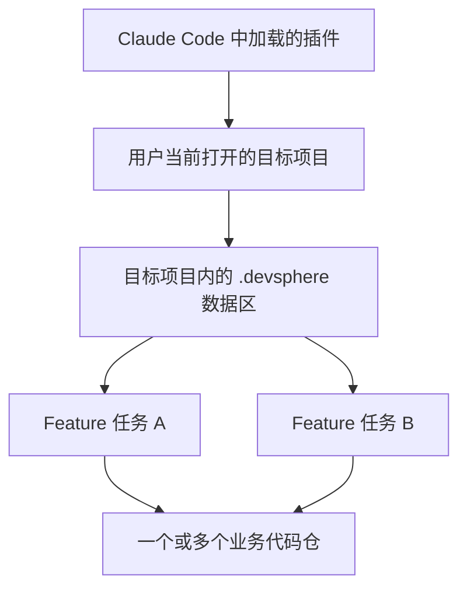
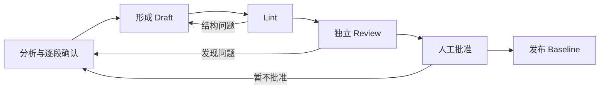

# scc-dev-sphere 中文使用指南

> 面向实际使用者的 Feature 端到端交付指南
> 适用版本：`0.1.0`
> 核验日期：2026-07-23

## 1. 关于本指南

### 1.1 适用对象

本指南适合负责 Feature 交付的 SA、SE、MDE、TSE、架构师、开发人员和端到端负责人。

读完后，你应该能够：

- 在目标项目中创建并继续一个 Feature；
- 理解 Requirement、Design、Approval、Implementation 和 Verification 之间的关系；
- 知道每个阶段需要提供什么、确认什么、会生成什么；
- 在会话中断、Review 失败或验证失败后继续工作；
- 识别当前版本尚未实现或支持不完整的能力。

### 1.2 使用前提

开始前确认：

1. `scc-dev-sphere` 已经加载到当前 Claude Code 会话；
2. Claude Code 当前打开的是你要交付 Feature 的目标项目根目录；
3. Claude Code 可以在该项目中创建 `.devsphere/`；
4. 进入实现阶段时，Claude Code 可以访问目标代码仓并运行项目测试。

本指南只讲插件如何使用，不包含插件安装、发布或开发态校验方法。

### 1.3 当前范围

- 当前只实现 `feature` taskType；
- 插件依赖 Claude Code 的主会话、Skill、Agent、权限和工具能力；
- 插件不提供独立 Agent Runtime；
- `.devsphere/` 中的状态和文件用于恢复与追溯，但不会保存完整聊天记录。

## 2. 先理解三个层次

### 2.1 插件、目标项目和 `.devsphere`



- **插件**提供 Workflow、Skill、Agent 和辅助脚本。
- **目标项目**是你启动 Claude Code、准备交付 Feature 的项目根目录。
- **`.devsphere/`** 是目标项目内的持久化数据区，保存任务、状态、正式产物和过程文件。
- **业务代码仓**可以就是目标项目，也可以在实现规划时绑定其他仓。

不要把插件源码仓当成业务 Feature 的工作空间。运行时数据应写在目标项目的 `.devsphere/` 中。

### 2.2 一个工作空间可以有多个 Feature

```text
.devsphere/
├── current-task.json
└── tasks/
    └── feature/
        ├── FEAT-A/
        └── FEAT-B/
```

每个 Feature 有独立的 Requirement、Design、Approval、实现和验证材料。创建新 Feature 不会删除旧 Feature。

### 2.3 当前任务指针不是任务事实

`.devsphere/current-task.json` 只负责指出“当前操作哪个任务”。

真正的任务状态在：

```text
.devsphere/tasks/feature/<task-id>/state.json
```

而一个阶段是否真正完成，还要同时看对应的正式产物和批准记录。

因此：

- 指针正确，不等于任务状态正确；
- 状态写成下一阶段，不等于缺失的产物已经完成；
- 文件已经生成，也不等于它已经 Review 或获批。

### 2.4 常用术语

| 术语 | 用户需要知道的含义 |
|---|---|
| Proposal | 初始化时原样保存的需求输入 |
| Requirement Draft | 需求澄清中的候选版本 |
| Requirement Baseline | 用户批准后供后续设计使用的正式需求 |
| Design Draft | 当前设计的候选版本 |
| Review | 对 Draft 的独立检查 |
| Approval | 人工批准当前内容或产物集合 |
| Design Baseline | Review 和人工批准后发布的正式设计 |
| Evidence | 被采用、且实际支持设计判断的外部或知识来源结论 |
| Decision | 用户确认的重要取舍或风险接受 |
| Work | 用于当前设计协作和恢复的过程材料 |

## 3. 开始和管理 Feature

### 3.1 创建 Feature

在目标项目的 Claude Code 会话中运行：

```text
/scc-dev-sphere:feature-init
```

插件会：

1. 请你提供完整需求描述；
2. 根据需求生成默认任务 ID，也允许自定义；
3. 创建任务目录；
4. 原样保存需求到 `inputs/proposal.md`；
5. 初始化 `state.json`；
6. 把新任务设为当前任务。

创建成功后，状态为：

```text
initialized
```

接下来运行：

```text
/scc-dev-sphere:workflow
```

### 3.2 任务 ID 已存在

已有同名任务时，插件不会覆盖。

- 如果这是要继续的任务，不要重新初始化；
- 如果是另一个 Feature，使用新的任务 ID；
- 不要为复用 ID 直接删除旧目录，当前没有安全归档或删除恢复能力。

### 3.3 什么时候继续、拆分或新建

**继续当前 Feature：**

- 目标、范围和验收没有实质变化；
- 只是继续澄清、关闭 Review 问题、修复实现或重新验证。

**拆分或新建 Feature：**

- 新诉求可以独立批准、实现或发布；
- 目标、范围或验收发生实质改变；
- 两部分需要不同的风险接受或回退边界；
- 已进入实现后又发生重大需求变化。

### 3.4 查看当前状态

运行：

```text
/scc-dev-sphere:status
```

`status` 只读展示：

- 当前任务和顶层状态；
- 已有 Design Baseline；
- 未完成的 Work、Draft、Review 和 Approval；
- 总体设计批准；
- 下一步建议。

它不会推进状态。

### 3.5 多任务与切换限制

当前 Skill 文本提供：

```text
/scc-dev-sphere:workflow list
/scc-dev-sphere:workflow switch <task-id>
```

但这两个动作使用的路径与真实 `tasks/feature/<task-id>` 目录不一致，当前版本不能把它们当作可靠能力。

使用多个任务时：

- 每次先用 `status` 确认当前任务；
- 不要盲目使用 `switch`；
- 如果当前指针异常，应先核对真实任务目录，再修复指针；
- 修复指针不能同时修改任务状态或伪造阶段完成。

### 3.6 工作空间级配置

#### 知识源

运行：

```text
/scc-dev-sphere:knowledge-config
```

可以用自然语言要求：

- “查看当前知识源配置”；
- “新增一个查询当前代码仓的 Repo 来源”；
- “禁用现有 Web 来源”；
- “更新某个 Skill 来源的说明”。

项目配置位于：

```text
.devsphere/config/knowledge-sources.json
```

项目配置一旦存在，就完整覆盖插件默认配置，不会逐项合并。

#### 测试设计模式

新任务创建时会读取：

```text
.devsphere/config/test-design.json
```

支持两种模式：

```json
{
  "mode": "builtin"
}
```

```json
{
  "mode": "external",
  "externalSkillId": "ai-test-designer"
}
```

当前插件默认是 external。模式在任务创建时冻结；之后修改配置只影响新任务，不会改变已有任务。

## 4. Feature 生命周期

### 4.1 主流程


推荐用法很简单：

1. 使用 `feature-init` 创建任务；
2. 之后重复运行 `workflow`；
3. 每次阅读下一步说明并确认是否继续；
4. 中断或有疑问时运行 `status`；
5. 需要人工批准时，先检查内容再明确确认。

### 4.2 顶层状态

| 状态 | 表示什么 |
|---|---|
| `initialized` | Feature 已创建，等待需求澄清 |
| `clarified` | Requirement Baseline 已批准并发布 |
| `designing` | 正在完成内置设计 |
| `design_ready` | 当前任务要求的内置设计已就绪 |
| `external_test_design_ready` | 外部测试设计已执行完成，仅 external 模式使用 |
| `approved_for_implementation` | 总体设计已获批准 |
| `implementation_planned` | 实现计划已完成 |
| `implementing` | 正在实现或修复 |
| `verification_ready` | 实现完成，等待最终验证 |
| `completed` | 验证通过且转测材料已生成 |
| `blocked` | 当前无法继续，需要人工处理 |

### 4.3 顶层状态和会话进度不是一回事

Claude Code 可能在会话中显示“澄清需求”“形成 Draft”“执行 Review”等进度任务。它们只帮助当前会话按步骤工作。

跨会话恢复仍以 `.devsphere/` 中的状态和文件为准。

## 5. 端到端使用流程

### 5.1 需求澄清

状态为 `initialized` 时运行 `/scc-dev-sphere:workflow`，确认开始 Requirement Clarification。

你需要说明并确认：

- 真实问题、受影响用户和期望结果；
- 本次范围、明确不做的内容；
- 可以判断是否成功的验收结果；
- 需要后移的事项及其风险；
- 最终 Requirement。

插件会形成 `inputs/requirement-draft.md`，完成独立 Review，并在你批准后发布 `inputs/requirement.md`。状态随之进入 `clarified`。

中断后先运行 `status`，再运行 `workflow`。已写入 Draft 的内容可以恢复；只存在于聊天中的分析可能需要重新确认。

### 5.2 三类内置设计

Workflow 当前按 Business → Solution → Implementation 的顺序推进。

| 阶段 | 正式输入 | 主要讨论 | 正式输出 | 你要重点确认 |
|---|---|---|---|---|
| Business Design | `inputs/requirement.md` | 业务概念、场景、规则、状态、异常和业务验收 | `artifacts/business-design.md` | 没有静默扩大 Requirement，规则可以唯一判断 |
| Solution Design | `artifacts/business-design.md` | 目标架构、接口、数据、集成、质量属性和技术取舍 | `artifacts/solution-design.md` | 架构责任清楚，限制、风险和回退已明确 |
| Implementation Design | `artifacts/solution-design.md` | 实际模块、代码结构、接口、控制流、错误处理、迁移和测试行为 | `artifacts/implementation-design.md` | 设计能够落到真实代码并覆盖受影响模块 |

每份 Design Baseline 都有对应的 `approvals/<design-slug>.json`。

### 5.3 每类内置 Design 如何完成

Business、Solution、Implementation 和 builtin Test Design 都使用同一个循环：



用户实际需要关注：

1. 插件给出的事实、推荐、替代方案和代价是否合理；
2. 每个重要设计段落是否可以确认；
3. Review 问题是否真正关闭；
4. 残余风险是否可以接受；
5. 最终 Draft 是否可以作为正式 Baseline。

不要直接修改 Approval 或状态来跳过 Review。

### 5.4 Test Design：builtin 与 external

#### builtin

builtin 模式把 Test Design 当作第四类内置设计。输入为 `artifacts/implementation-design.md`，输出为 `artifacts/test-design.md` 和 `approvals/test-design.json`，同样需要 Review 和人工批准。

#### external

external 模式只要求三类内置 Design Baseline。三类设计完成后，Workflow 调用配置的外部 Skill。

外部 Skill 读取 Requirement 和三类 Design Baseline，输出到 `artifacts/test-design/`。

如果外部 Skill 不可用、报错或中断：

- 状态保持 `design_ready`；
- 不得宣称测试设计已完成；
- 修复 Skill 可用性后重新运行 `workflow`。

当前完成检查只记录外部 Skill ID 和完成时间，不检查输出目录中必须有哪些文件，也不绑定输出 hash。因此进入总体批准前，用户必须人工检查外部测试设计是否完整、可执行。

### 5.5 总体设计批准

所有所需设计完成后，Workflow 进入 Overall Design Approval。

你需要检查：

- 当前 Requirement 和全部正式 Design Baseline；
- external 模式下的外部测试设计输出；
- 关键取舍、残余风险和限制；
- 设计是否已经具备实现条件。

批准后生成 `approvals/design-final-approval.json`，状态进入 `approved_for_implementation`。

### 5.6 实现规划

Workflow 会把实现规划交给 `dev` Agent。

你需要提供或确认：

- 实际目标代码仓；
- 分支或工作区限制；
- 不可修改的范围；
- 项目的测试、构建和检查命令；
- 发布、迁移和回退要求。

插件会生成 `links/repos.json` 和 `implementation/implementation-plan.md`。高风险任务还需要 `approvals/implementation-plan-approval.json`。

计划应至少说明修改范围、实施顺序、测试命令、风险和回退方式。没有可执行计划时不要开始代码修改。

### 5.7 代码实现

首次代码修改前，插件会展示：

- 目标仓库；
- 预计修改内容；
- 验证命令；
- 关键风险。

只有你明确输入 `YES` 后，才应开始修改代码。

实现过程中：

- 按实现计划执行；
- 运行计划中的测试和检查；
- 发现计划外变更时先说明影响；
- 明显范围偏差需要再次确认；
- 完成前记录实际 diff 摘要。

主要过程产物是 `implementation/implementation-log.md`。完成后状态进入 `verification_ready`。

### 5.8 验证与转测

Workflow 会让 `dev` Agent：

- 运行实现计划中的测试、lint、构建或其他检查；
- 区分通过、失败和未执行项；
- 汇总代码变化、影响范围和已知风险；
- 给出测试环境、数据和回归建议；
- 生成测试交接材料。

正式输出为 `verification/test-handoff.md`。

结果处理：

| 结果 | 后续 |
|---|---|
| 检查通过且转测材料完整 | 状态进入 `completed` |
| 失败但可以修复 | 返回 `implementing` |
| 失败且当前无法恢复 | 进入 `blocked` |

`completed` 表示本地验证和转测交付完成，不等于生产发布或线上业务验收已经完成。

## 6. 工作空间文件速查

### 6.1 主要目录

```text
.devsphere/
├── current-task.json
├── config/
└── tasks/feature/<task-id>/
    ├── state.json
    ├── inputs/
    ├── work/
    ├── artifacts/
    ├── approvals/
    ├── links/
    ├── implementation/
    ├── verification/
    ├── evidence/
    └── decisions/
```

### 6.2 用户最需要关注的文件

| 文件或目录 | 用途 | 是否建议手工修改 |
|---|---|---|
| `current-task.json` | 当前任务指针 | 通常不要；仅用于明确的指针修复 |
| `state.json` | 顶层任务状态和任务配置 | 不要直接修改以绕过流程 |
| `inputs/proposal.md` | 原始需求输入 | 不建议修改 |
| `inputs/requirement-draft.md` | 需求澄清 Draft | 通过会话协作修改 |
| `inputs/requirement.md` | 正式 Requirement Baseline | 不要直接修改 |
| `work/<slug>/` | 当前设计的 notes、Draft 和临时 Review | 通过 `feature-design` 维护 |
| `artifacts/*.md` | 正式 Design Baseline | 不要直接修改 |
| `approvals/` | 各类人工批准 | 不要手工伪造或改 hash |
| `links/repos.json` | Feature 与代码仓绑定 | 在实现规划中维护 |
| `implementation/` | 实现计划和实现日志 | 通过 Planning/Implement 维护 |
| `verification/test-handoff.md` | 验证与转测交付件 | 通过 Verify 更新 |
| `evidence/` | 被采用的知识证据 | 由插件维护 |
| `decisions/` | 重要设计取舍 | 由插件维护 |

### 6.3 哪些是正式事实

下游应优先读取：

- `inputs/requirement.md`；
- `artifacts/` 下的 Design Baseline；
- `approvals/` 下的批准记录；
- `links/repos.json`；
- `implementation/implementation-plan.md`；
- `implementation/implementation-log.md`；
- `verification/test-handoff.md`；
- `state.json`。

`work/` 中的 notes、Draft 和临时 Review 主要用于当前设计协作与恢复，不应代替正式 Baseline。

### 6.4 是否提交 Git

插件没有强制规定。团队可以根据审计、协作和敏感信息政策决定。

一般建议：

- 提交 Requirement、Design Baseline、Approval、Implementation Plan 和 Test Handoff；
- 谨慎处理包含敏感信息的 Proposal、Evidence 和 Decision；
- 多人协作时单独决定是否提交 `current-task.json`；
- 不要假设插件提供并发编辑锁或自动冲突合并。

## 7. 中断、变更和恢复

### 7.1 会话中断

重新进入同一目标项目后：

```text
/scc-dev-sphere:status
/scc-dev-sphere:workflow
```

先检查：

- 当前 taskId 是否正确；
- 顶层状态是否符合预期；
- 是否存在未完成 Draft；
- Baseline 和 Approval 是否齐全；
- 实际代码 diff 是否与实现日志一致。

插件不会保存完整聊天和每条命令的执行位置，因此必要时要重新确认上下文。

### 7.2 Review 发现问题

- blocking 问题必须关闭；
- advisory 和 risk 需要明确处理结论；
- Design 语义修改后需要重新 Lint、完整 Review 和批准；
- 不要直接修改 Review 或 Approval 中的 hash。

### 7.3 需求中途变化

如果变化会改变目标、范围或验收：

- 停止当前推进；
- 判断是否应新建 Feature；
- 不要只修改现有 Design 来掩盖 Requirement 已失效。

当前没有 Requirement Baseline reopen 或整任务 reopen 能力。

### 7.4 单个 Design reopen

底层设计流程可以重开一个已经发布的 Design：

- 旧 Baseline 保存到历史目录；
- 新 Draft 提升主版本；
- 重新 Review 和批准；
- 在仍处于设计或总体批准阶段时，可重新同步到 `designing`。

这不是完整的用户级回退功能。进入实现规划后，当前没有自动退回设计阶段的流程。

### 7.5 实现或验证失败

- 实现测试失败：保持 `implementing`，修复后继续；
- 验证发现可修复问题：返回 `implementing`；
- 根因是设计错误：评估重开相关 Design 或新建 Feature；
- 外部条件无法恢复：进入 `blocked`。

当前没有标准 unblock 命令。不能只改 `state.json` 恢复。

## 8. 场景使用示例

本章中的业务内容仅用于演示，不是插件内置功能。实际对话会根据你的需求变化，不需要逐字照抄。

### 8.0 如何阅读本章中的 Skill 链路

日常使用时，你主要手动调用四个入口：

```text
/scc-dev-sphere:feature-init
/scc-dev-sphere:workflow
/scc-dev-sphere:status
/scc-dev-sphere:knowledge-config
```

`workflow` 会根据当前状态派发对应的生命周期 Skill。示例中的写法：

```text
/scc-dev-sphere:workflow
→ feature-clarify
```

表示你输入的是 `/scc-dev-sphere:workflow`，确认继续后，由 Workflow 执行 `feature-clarify`；并不是要求你跳过 Workflow 手动调用后者。

### 8.1 示例一：从模糊需求完成一次端到端交付

#### 适用情况

你只有一个比较模糊的诉求，例如：

> 现有查询功能需要增加异步批量导出，避免用户等待太久。

#### Skill 链路

```text
feature-init
→ workflow（feature-clarify）
→ workflow（feature-design：Business）
→ workflow（feature-design：Solution）
→ workflow（feature-design：Implementation）
→ workflow（builtin feature-design 或 external Test Skill）
→ workflow（feature-approve）
→ workflow（feature-plan-implementation）
→ workflow（feature-implement）
→ workflow（feature-verify）
→ status
```

#### 第一步：创建 Feature

输入：

```text
/scc-dev-sphere:feature-init
```

当插件询问需求描述时，可以回答：

```text
现有订单查询只支持页面展示。运营人员需要导出大量查询结果，
当前没有批量导出能力。希望增加异步批量导出，导出完成后用户可以下载文件。
```

确认任务 ID，例如：

```text
FEAT-异步批量导出
```

创建完成后，再输入：

```text
/scc-dev-sphere:workflow
```

此时 Workflow 应显示下一步为需求澄清，并在你确认后派发 `feature-clarify`。

#### 第二步：澄清需求

插件会逐步询问目标、范围和验收。你可以按下面的方式提供信息：

```text
目标用户是运营人员。

本次只覆盖订单查询结果导出，不包含定时导出和邮件发送。

单次导出最多 50 万条。用户提交后不需要停留在当前页面等待。

导出成功后，用户可以在导出记录中下载文件；
失败时能够看到失败状态并重新发起。
```

当插件展示最终 Requirement 时，重点检查：

- 目标是否仍是解决大量数据导出问题；
- 是否明确排除了定时导出、邮件通知等附加能力；
- 成功和失败是否都有可判断结果。

确认无误后明确回复：

```text
我批准这份 Requirement Baseline。
```

完成后运行：

```text
/scc-dev-sphere:status
```

确认状态为 `clarified`，且 `inputs/requirement.md` 已生成。

#### 第三步：完成三类设计

继续输入：

```text
/scc-dev-sphere:workflow
```

Workflow 会派发 `feature-design` 完成 Business Design。在对话中，你可能需要确认：

```text
导出任务归属于发起用户。
只有任务发起人可以查看和下载自己的导出文件。
任务状态采用：等待处理、处理中、成功、失败、已过期。
```

再次运行 `workflow` 进入 Solution Design。你可能需要决定：

```text
接受使用异步任务队列。
查询服务只负责创建任务和查询状态，
导出 Worker 负责生成文件，对象存储负责保存结果。
```

再次运行 `workflow` 进入 Implementation Design。你需要结合真实项目确认：

```text
查询服务仓库是 /work/order-query-service。
导出 Worker 位于同一仓库的 export-worker 模块。
对象存储沿用项目已有的 StorageClient，不新增另一套客户端。
```

每类设计都要等 Draft 完成 Review，再明确批准最终版本。

每完成一类设计后，可以运行：

```text
/scc-dev-sphere:status
```

检查对应 Baseline 和 Approval，再运行 `/scc-dev-sphere:workflow` 进入下一类。

#### 第四步：完成测试设计

如果任务是 builtin：

```text
/scc-dev-sphere:workflow
```

继续完成内置 Test Design，并确认数据规模、失败重试、权限隔离和文件过期等测试场景。

如果任务是 external，Workflow 会显示并调用 `state.externalTestDesign.skillId` 指定的 Skill。你确认启动后，等待它正常结束，再人工检查 `artifacts/test-design/`，确认其中包含可执行的测试范围、场景、数据和环境说明。

#### 第五步：批准总体设计

继续运行：

```text
/scc-dev-sphere:workflow
```

Workflow 会派发 `feature-approve`。检查 Requirement、全部 Design Baseline、关键风险和限制。确认无误后回复：

```text
批准当前总体设计进入实现规划。
```

#### 第六步：生成实现计划

再次运行 `/scc-dev-sphere:workflow`，Workflow 会通过 `dev` Agent 派发 `feature-plan-implementation`，并要求提供代码仓信息。可以回答：

```text
目标仓库：/work/order-query-service
目标分支：feature/async-export
后端测试命令：npm test
集成测试命令：npm run test:integration
本次不允许修改现有同步查询接口的返回结构。
```

检查生成的 Implementation Plan 是否列出了：

- 实际修改模块；
- 实施顺序；
- 测试命令；
- 数据或接口兼容风险；
- 回滚方式。

#### 第七步：实现和验证

继续运行 `/scc-dev-sphere:workflow`，由 `dev` Agent 执行 `feature-implement`。首次修改代码前，确认展示的仓库和变更范围正确，再输入：

```text
YES
```

实现完成后，再次运行：

```text
/scc-dev-sphere:workflow
```

Workflow 会派发 `feature-verify`，执行最终验证并生成 `verification/test-handoff.md`。

最后运行：

```text
/scc-dev-sphere:status
```

确认状态为 `completed`，并检查 Requirement、Design、实现日志和测试交接材料是否齐全。

### 8.2 示例二：基于已有 PRD 启动 Feature

#### 适用情况

你已经有一份 PRD，但不确定其中哪些内容是需求、哪些只是方案设想。

#### Skill 链路

```text
feature-init
→ workflow（feature-clarify）
→ workflow（feature-design）
→ workflow（后续批准、实现和验证）
```

#### 具体操作

1. 运行 `/scc-dev-sphere:feature-init`。
2. 当插件询问需求时，把 PRD 中的需求内容作为本次需求描述提交。
3. 创建成功后运行 `/scc-dev-sphere:workflow`，确认进入 `feature-clarify`。
4. 在澄清阶段明确哪些内容必须保留，哪些只是候选方案。

可以这样说明：

```text
这份 PRD 中“支持批量导出”是已确认需求。
“使用 Kafka”和“文件保存 30 天”目前只是产品草案中的建议，
请在设计阶段评估，不要直接写成 Requirement 约束。
```

当插件形成 Requirement Draft 时，检查：

- 是否保留了真正的业务目标和验收；
- 是否把技术建议留给后续设计；
- 是否明确了 PRD 中互相冲突或缺失的内容。

确认后明确回复：

```text
这份 Requirement 已正确区分需求承诺和方案建议，我批准发布 Baseline。
```

然后使用 `/scc-dev-sphere:status` 检查 `inputs/requirement.md`，再重复运行 `/scc-dev-sphere:workflow`。后续 `feature-design` 只应把 PRD 中的技术建议作为候选方案，而不是不可改变的约束。

如果设计需要查询 PRD 引用的其他项目资料，可以先运行：

```text
/scc-dev-sphere:knowledge-config
```

为相关本地目录或 Repo 添加带说明的知识源，然后回到 `/scc-dev-sphere:workflow` 继续当前设计。

### 8.3 示例三：存量功能增强并要求向后兼容

#### 适用情况

现有系统已经有同步导出接口，现在要增加异步导出，但旧客户端暂时不能迁移。

#### Skill 链路

```text
feature-init
→ workflow（feature-clarify）
→ workflow（Business/Solution/Implementation Design）
→ workflow（feature-approve）
→ workflow（feature-plan-implementation）
→ workflow（feature-implement）
→ workflow（feature-verify）
```

#### 具体操作

创建 Feature 时可以输入：

```text
现有 POST /exports 会同步返回文件。
本次增加异步批量导出，但旧接口在两个版本周期内必须继续可用。
新旧接口不能共享会导致行为变化的默认参数。
```

在 Requirement 阶段确认：

```text
本次包含新异步接口和旧接口兼容，
不包含立即下线旧接口。
验收需要覆盖旧客户端行为不变。
```

在 Solution Design 中重点确认：

- 新旧接口的职责边界；
- 兼容期限；
- 数据和错误码是否变化；
- 迁移和回退策略。

在 Implementation Planning 中补充：

```text
请把旧接口回归测试列为必须执行项，
并在计划中列出新旧接口共存期间的观测指标。
```

每一步的实际调用方式是：

```text
/scc-dev-sphere:workflow
```

第一次进入 `feature-clarify`，后续依次进入三类 `feature-design`。总体设计批准后，再通过 Workflow 进入 `feature-plan-implementation`。

首次实现前输入 `YES` 时，先检查计划中是否明确保留旧接口。最终 `feature-verify` 生成 Test Handoff 后，检查其中是否列出：

- 旧接口回归结果；
- 新旧接口并存场景；
- 兼容期限内的观测项；
- 未覆盖项及原因。

### 8.4 示例四：一个 Feature 涉及多个代码仓

#### 适用情况

同一个业务结果需要同时修改查询服务、任务服务和前端管理台。

#### Skill 链路

```text
feature-init
→ knowledge-config（可选：配置多个 Repo 知识源）
→ workflow（feature-clarify）
→ workflow（三类 feature-design）
→ workflow（feature-plan-implementation：绑定 repos）
→ workflow（feature-implement）
→ workflow（feature-verify）
```

#### 具体操作

先运行 `/scc-dev-sphere:feature-init`，把跨仓需求作为一个业务 Feature 创建。不要在原始需求中只列三个仓库名称，还要说明它们共同完成的用户结果。

如果设计阶段需要查询多个仓的现状，运行：

```text
/scc-dev-sphere:knowledge-config
```

可以依次提出：

```text
新增 Repo 来源 /work/query-service，说明为“查询接口、任务创建和权限实现”。
新增 Repo 来源 /work/job-service，说明为“异步任务执行、文件生成和状态持久化”。
新增 Repo 来源 /work/admin-web，说明为“管理台导出交互和状态展示”。
```

然后运行 `/scc-dev-sphere:workflow` 完成 Requirement 和三类 Design。

在 Requirement 和 Business Design 中先描述一个完整业务目标，不需要一开始就把任务拆成三个技术 Feature。

进入 Implementation Design 时可以提供：

```text
查询服务：/work/query-service
任务服务：/work/job-service
管理台前端：/work/admin-web

查询服务负责创建导出任务；
任务服务负责执行和保存结果；
管理台负责提交任务、展示状态和下载文件。
```

进入 Implementation Planning 时进一步确认：

```text
请分别列出三个仓库的修改文件、测试命令和实施顺序。
先稳定后端接口契约，再修改前端。
同时给出跨仓联调和回滚顺序。
```

计划生成后，检查 `links/repos.json` 是否绑定了正确仓库，并逐项核对：

- 仓库和分支；
- 接口依赖关系；
- 合并和部署顺序；
- 每个仓的验证命令；
- 某一仓失败时如何停止或回退。

确认计划后，再运行 `/scc-dev-sphere:workflow` 进入 `feature-implement`。每次 Workflow 派发的 `dev` Agent 应按计划处理仓库；如果实际修改顺序或仓库范围发生变化，先暂停并确认。

实现完成后由 `feature-verify` 汇总各仓验证结果。不要只验证其中一个仓就批准 `completed`。

### 8.5 示例五：Review 发现阻塞问题

#### 适用情况

Design Review 指出：

> 下载权限只描述了正常流程，没有说明管理员代查和已离职用户数据的处理。

#### Skill 链路

```text
workflow（feature-design）
→ design-reviewer 返回 blocking finding
→ 当前 feature-design 修订 Draft
→ design-reviewer 完整复评
→ 用户批准 Baseline
→ status
```

#### 具体操作

不要直接要求继续发布。你可以回复：

```text
请说明这个问题会影响哪些业务场景和安全边界，
并给出推荐方案与可选方案。
```

阅读分析后作出明确决定，例如：

```text
采用“仅任务发起人可下载”的方案。
管理员只能查看任务元数据，不能直接下载文件。
用户离职后文件立即失效。
请按这个决定修订设计并重新 Review。
```

插件会修订 Draft、重新 Review，并再次请求批准。只有阻塞问题关闭后，才批准新的 Design Baseline。

批准后运行：

```text
/scc-dev-sphere:status
```

确认当前 Design 已有 Baseline 和 Approval。然后再运行 `/scc-dev-sphere:workflow` 进入下一阶段。

如果你在看到 finding 后退出了会话，重新进入项目后使用：

```text
/scc-dev-sphere:status
/scc-dev-sphere:workflow
```

Workflow 应恢复当前 `feature-design`，而不是创建新的 Feature。

### 8.6 示例六：会话中断后继续

#### 适用情况

你在 Solution Design 或代码实现过程中退出了 Claude Code。

#### Skill 链路

```text
status
→ workflow（根据持久化事实恢复 feature-design / feature-implement / feature-verify）
```

#### 具体操作

重新打开同一目标项目后，先输入：

```text
/scc-dev-sphere:status
```

检查当前任务、状态和未完成内容。然后输入：

```text
/scc-dev-sphere:workflow
```

如果插件发现多个未完成 Design，明确告诉它要继续哪一个：

```text
继续 solutionDesign。
business-design 已经批准，不要重新开始；
testDesign 是之前误创建的空工作目录。
```

如果是在实现阶段中断，先核对实际代码变化：

```text
请先对照 implementation-plan.md、implementation-log.md 和当前 git diff，
说明哪些步骤已经完成、哪些尚未执行，再继续修改。
```

不要仅根据聊天记忆判断进度。

根据 `status` 的结果：

- 状态是 `designing`：运行 `workflow`，恢复 `feature-design`；
- 状态是 `implementation_planned`：运行 `workflow`，进入 `feature-implement`，首次修改仍需 `YES`；
- 状态是 `implementing`：运行 `workflow`，先核对现有 diff 后继续；
- 状态是 `verification_ready`：运行 `workflow`，执行 `feature-verify`。

恢复后不要重复创建同名 Feature，也不要为了“对齐进度”手工修改 `state.json`。

### 8.7 示例七：Requirement 不变，只调整设计

#### 适用情况

Feature 的目标、范围和验收没有变化，只是设计结论需要调整。例如：

- 原计划由查询服务直接生成文件，改为独立 Export Worker；
- 原计划使用本地文件系统，改为沿用已有对象存储；
- 原方案新增消息队列，调查后决定复用项目已有任务调度能力；
- Review 发现服务责任或接口设计需要调整。

这种情况不需要重新创建 Feature，但操作方式取决于 Design Baseline 是否已经发布。

#### 先看结论：什么时候可以不新建 Feature

满足下面两个条件时，可以在当前 Feature 内完成设计变更：

1. Requirement 的目标、范围和验收标准没有变化；
2. Feature 仍处于 `designing`，或虽然已到 `design_ready`，但还没有完成 external Test Design、总体设计批准和后续实现。

如果要修改的 Design 已经发布，不能只运行 `/scc-dev-sphere:workflow` 并说“修改设计”。`workflow` 的职责是推进下一项尚未完成的活动，不会主动选择并重开一个已发布的 Baseline。此时必须显式调用：

```text
/scc-dev-sphere:feature-design <说明要 reopen 的 Design 和变更内容>
```

设计重新发布后，再使用 `/scc-dev-sphere:workflow` 恢复 Feature 生命周期。

#### 第一步：查看设计当前处于什么位置

输入：

```text
/scc-dev-sphere:status
```

重点检查：

- 顶层状态是 `designing`、`design_ready`，还是已经进入总体批准或实现；
- 要修改的是 Business、Solution 还是 Implementation Design；
- 目标 Design 只有 Work/Draft，还是已经有正式 Baseline；
- 是否已经存在依赖它的下游 Design Baseline。

#### 情况 A：当前 Design 还没有发布 Baseline

这是最简单的情况。Skill 链路为：

```text
status
→ workflow（恢复当前 feature-design）
→ 修订当前设计
→ Lint
→ Review
→ 人工批准
→ 发布 Baseline
→ status
```

运行：

```text
/scc-dev-sphere:workflow
```

Workflow 恢复当前 `feature-design` 后，明确说明原设计、新信息和希望调整的内容。例如：

```text
Requirement 没有变化，仍然是用户提交异步导出并下载结果。

需要调整当前 Solution Design：
原设计由查询服务直接生成文件；
现在确认项目已有统一任务调度平台，应改为查询服务创建任务，
Export Worker 生成文件。

请分析这个变化对接口、状态流转、失败重试和部署的影响，
与我确认后更新当前 Design Draft。
```

插件应回到当前设计讨论，修订已确认设计，重新生成 Draft，并重新执行 Lint、Review 和人工批准。

完成后输入：

```text
/scc-dev-sphere:status
```

确认新的 Design Baseline 和 Approval 已生成。由于旧 Baseline 尚未发布，不涉及版本重开，也没有旧批准需要失效。

#### 情况 B：目标 Design Baseline 已经发布

如果仍处于 `designing`，或者刚进入 `design_ready`、尚未运行 external Test Design 和 Overall Design Approval，可以在当前 Feature 中重开这一个 Design。

Skill 链路为：

```text
status
→ feature-design（明确请求 reopen 指定 Design）
→ 确认重开
→ 修订 Draft
→ Lint
→ 完整 Review
→ 人工批准
→ 发布新版本 Baseline
→ status
→ workflow（处理受影响的下游 Design）
```

直接调用 `feature-design`，并在同一条命令中写清 Design 类型、变更原因和 Requirement 不变。例如：

```text
/scc-dev-sphere:feature-design 当前 Feature 的 Requirement 不变。请重开
solutionDesign。原 Baseline 由查询服务直接生成导出文件；新事实是项目
已有统一任务调度和 Worker 框架，需要改为查询服务创建任务、Export
Worker 生成文件。请先说明对下游 Implementation Design 和 Test Design
的影响，再执行 reopen、修订、Review、批准和重新发布。
```

当插件询问是否确认重开时，检查目标 Design 类型和影响范围，再明确回复：

```text
确认重开 solutionDesign。
Requirement 保持不变。
```

重开后会发生：

- 旧 Baseline 保存到 `artifacts/history/`；
- 新 Draft 使用新的主版本；
- 旧 Design Approval 不再有效；
- 新 Draft 必须重新 Lint、完整 Review 和人工批准；
- 如果改变了一个重要取舍，插件应新增 Decision 记录，而不是改写旧决定。

新 Baseline 发布后输入：

```text
/scc-dev-sphere:status
```

确认目标 Design 已发布新版本。

这里的 `feature-design` 只负责这一次设计活动，不负责修改 Feature 的顶层状态。因此，不要在它完成后直接进入实现；必须继续处理下游影响，并最终回到 `/scc-dev-sphere:workflow`。

#### 第三步：处理下游影响

Design reopen 不会自动替你判断所有下游内容是否仍有效。按“从上游到下游”的顺序检查：

| 被修改的 Design | 至少需要重新检查 |
|---|---|
| Business Design | Solution、Implementation、Test Design |
| Solution Design | Implementation、Test Design |
| Implementation Design | Test Design |

例如 Solution Design 改为新增 Export Worker 后，先用 `/scc-dev-sphere:status` 检查 Implementation Design：

- 如果 Implementation Design 尚未发布，运行 `/scc-dev-sphere:workflow`，让 Workflow 继续相应的 `feature-design`；
- 如果 Implementation Design 已有 Baseline，再次直接运行 `/scc-dev-sphere:feature-design`，明确要求重开它。

请求重开时可以输入：

```text
新的 Solution Design 已改变服务责任。
现有 Implementation Design 仍基于旧方案，
请重开 implementationDesign，
按新的查询服务和 Export Worker 职责重新设计、Review 并发布。
```

之后再检查测试设计：

- builtin：重开并重新批准 `testDesign`；
- external：重新运行 external Test Skill，并人工检查新输出；
- 如果测试设计确认不受影响，也要在总体批准前明确核对依据。

#### 第四步：基于新设计完成总体批准

所有受影响 Design 都更新完成后，再运行：

```text
/scc-dev-sphere:workflow
```

Workflow 应汇总当前 Baseline 集合并进入 `feature-approve`。这次总体批准必须绑定变更后的 Baseline 集合；如果工作区中存在任何针对旧版本的总体批准结论，都不能继续沿用。

最后运行：

```text
/scc-dev-sphere:status
```

确认：

- 目标和受影响的下游 Design 都是当前版本；
- external Test Design 已按新设计重新执行（如适用）；
- `design-final-approval.json` 对应当前 Baseline 集合；
- 下一步重新回到 Implementation Planning。

#### 已进入实现阶段时怎么办

如果状态已经是以下任一状态：

```text
approved_for_implementation
implementation_planned
implementing
verification_ready
completed
```

当前版本没有完整的“撤销总体批准和实现计划、自动回到设计”的用户级 Skill 流程。此时不要直接重开 Design 后继续原计划，因为下游批准、计划和代码可能仍指向旧版本。

先运行 `/scc-dev-sphere:status` 停止推进，再判断：

- 尚未开始实现且能够由团队人工撤销旧批准/计划：在明确治理下处理；
- 已经产生代码、验证或交付影响：创建新的 Feature 通常更安全。

### 8.8 示例八：external Test Skill 或最终验证失败

#### external Test Skill 不可用

Skill 链路：

```text
status
→ workflow（重新派发 externalSkillId）
→ workflow（feature-approve）
```

当 Workflow 报告外部 Skill 不可用时：

1. 运行 `/scc-dev-sphere:status`，确认状态仍是 `design_ready`；
2. 修复或加载对应 Skill；
3. 再次运行 `/scc-dev-sphere:workflow`；
4. 确认 Workflow 显示的 external Skill ID 正确；
5. 执行成功后人工检查 `artifacts/test-design/`；
6. 再次运行 `/scc-dev-sphere:workflow`，进入 `feature-approve`。

不要因为目录里已有部分文件就认为测试设计完成。

#### 最终验证失败

Skill 链路：

```text
workflow（feature-verify）
→ 可修复失败：状态回到 implementing
→ workflow（feature-implement）
→ workflow（feature-verify）
→ status
```

如果验证报告某个集成测试失败，可以这样要求：

```text
先把失败命令、错误现象和受影响范围写入实现日志。
如果是可修复实现问题，请返回实现阶段修复；
修复后重新运行完整验证，不要把本次失败标记为通过。
```

如果失败来自 Requirement 或 Design 错误，先停止代码修补，评估是否需要重开相关 Design 或新建 Feature。

如果是实现问题，完成修复后按下面的顺序继续：

```text
/scc-dev-sphere:workflow
# 恢复 feature-implement，完成修复并回到 verification_ready

/scc-dev-sphere:workflow
# 再次执行 feature-verify

/scc-dev-sphere:status
# 确认最终状态和 test-handoff.md
```

## 9. 常见问题

### 9.1 没有活动任务

首次使用时运行：

```text
/scc-dev-sphere:feature-init
```

如果已经有任务，检查 `current-task.json` 是否指向：

```text
.devsphere/tasks/feature/<task-id>
```

### 9.2 阶段无法推进

依次检查：

1. 当前任务是否正确；
2. 当前状态是否符合阶段入口；
3. 上游正式 Baseline 是否存在；
4. Approval 是否对应当前内容；
5. 必需的人工确认是否完成；
6. external Skill、代码仓和测试环境是否可用。

### 9.3 Baseline 文件存在但仍被判定缺失

可能原因：

- 文件为空或格式无效；
- Artifact ID 或版本不正确；
- 对应 Approval 缺失；
- Approval 对应的是旧版本；
- Draft 在 Review/批准后又被修改。

正确做法是重新完成当前阶段，不是手工修改状态或批准记录。

### 9.4 当前状态和磁盘事实不一致

先运行 `status`。设计阶段可以根据正式 Artifact 和 Approval 重新同步。

实现规划、实现和验证阶段更多依赖 Agent/Skill 正确维护文件和状态；当前没有统一的一键修复命令。

### 9.5 external 测试设计有文件但状态没有完成

目录中出现文件不等于 external Skill 已正常结束。应修复外部 Skill 调用并重新通过 Workflow 完成，不要手工写 `completedAt`。

### 9.6 任务进入 blocked

先确定阻塞属于：

- 设计问题；
- 实现问题；
- 验证问题；
- 外部权限、环境或工具问题。

当前没有标准解阻命令。修复事实后再由相应流程恢复，不能直接改状态绕过。

## 10. 最佳实践

### 10.1 每次推进都从 Workflow 开始

```text
/scc-dev-sphere:workflow
```

需要检查时使用：

```text
/scc-dev-sphere:status
```

不要把内部脚本命令作为日常入口。

### 10.2 给插件高质量输入

- 说明当前问题和期望结果；
- 指出受影响用户和已有行为；
- 明确包含与不包含的范围；
- 给出可判断的验收结果；
- 标记事实来源和不确定信息；
- 在多仓场景中明确仓、分支、所有权和联调顺序。

### 10.3 认真对待人工闸口

| 闸口 | 重点检查 |
|---|---|
| Requirement 批准 | 目标、范围和验收是否闭环 |
| Design 段落确认 | 推荐、替代方案和代价是否合理 |
| Design 最终批准 | Review 问题和残余风险是否处理 |
| Overall Design Approval | 所需设计是否完整且能进入实现 |
| Implementation Plan 批准 | 修改范围、测试、风险和回退是否可执行 |
| 首次代码修改 | 实际目标仓和预计变更是否正确 |
| Test Handoff | 通过、失败和未执行项是否如实 |

### 10.4 不要直接修改流程事实

以下内容不应通过手工修改来绕过：

- `state.json.status`；
- Design/Overall Approval；
- Review hash；
- Baseline 内容；
- external 完成时间；
- 实现或验证结果。

## 11. 入口速查

### 11.1 常用入口

| 入口 | 用途 |
|---|---|
| `/scc-dev-sphere:feature-init` | 创建 Feature |
| `/scc-dev-sphere:workflow` | 推进下一阶段 |
| `/scc-dev-sphere:status` | 只读查看当前状态 |
| `/scc-dev-sphere:knowledge-config` | 查询和维护知识源 |

其余 Feature Skill 正常由 Workflow 调用，不建议作为日常主入口。
