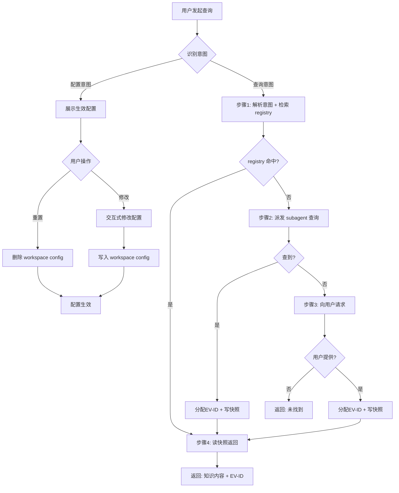

# Knowledge Query Skill 优化 Implementation Plan

> **For agentic workers:** REQUIRED SUB-SKILL: Use superpowers:subagent-driven-development (recommended) or superpowers:executing-plans to implement this plan task-by-task. Steps use checkbox (`- [ ]`) syntax for tracking.

**Goal:** 为 knowledge-query skill 补充 Mermaid 流程图、新增确定性脚本 `scripts/knowledge-query.js`（9 命令）、优化 SKILL.md 描述文案。

**Architecture:** 2 个任务 — Task 1 创建脚本（纯 CommonJS，双用途 CLI + require），Task 2 更新 SKILL.md（流程图插入 + 描述优化 + 工作流重命名 + 脚本引用）。

**Tech Stack:** Node.js 内置模块（fs, path），无外部依赖。

## Global Constraints

- 代码风格: 纯 CommonJS (`require`/`module.exports`)，与 `devsphere-state.js`、`feature-clarify.js` 一致
- 脚本双用途: CLI `node knowledge-query.js <cmd> <args...>` + `require()` 模块导出
- evidence 归档格式不变（EV 快照 + registry）
- 两层配置 fallback 机制不变
- 返回格式契约不变

---

### Task 1: 创建 `scripts/knowledge-query.js`

**Files:**
- Create: `scripts/knowledge-query.js`

**Interfaces:**
- Consumes: 无
- Produces:
  - 模块导出: `readJSON`, `writeJSON`, `ensureDir`, `getEffectiveConfig`, `readConfig`, `showConfig`, `updateConfig`, `addConfigItem`, `removeConfigItem`, `resetConfig`, `nextEvId`, `registerEvidence`, `readEvidence`
  - CLI 命令: `read-config`, `show-config`, `update-config`, `add-config-item`, `remove-config-item`, `reset-config`, `next-ev-id`, `register-evidence`, `read-evidence`

- [ ] **Step 1: 创建脚本文件（框架 + I/O 工具函数）**

```javascript
#!/usr/bin/env node
'use strict';

const fs = require('fs');
const path = require('path');

const REPO_ROOT = path.join(__dirname, '..');
const SKILL_DEFAULT_CONFIG = path.join(REPO_ROOT, 'skills', 'knowledge-query', 'knowledge-sources.json');

// --- Core I/O ---

function readJSON(filePath) {
  try {
    const raw = fs.readFileSync(filePath, 'utf-8');
    return JSON.parse(raw);
  } catch (e) {
    if (e.code === 'ENOENT') return null;
    throw e;
  }
}

function writeJSON(filePath, data) {
  const dir = path.dirname(filePath);
  if (!fs.existsSync(dir)) {
    fs.mkdirSync(dir, { recursive: true });
  }
  fs.writeFileSync(filePath, JSON.stringify(data, null, 2), 'utf-8');
}

function ensureDir(dir) {
  if (!fs.existsSync(dir)) fs.mkdirSync(dir, { recursive: true });
}
```

- [ ] **Step 2: 在终端确认脚本骨架可运行**

```bash
node scripts/knowledge-query.js
```

Expected: 输出 usage 信息 "Usage: knowledge-query.js <command> <workspaceRoot> [args...]"

- [ ] **Step 3: 实现配置读取函数**

在 `// --- Core I/O ---` 之后添加配置读取函数：

```javascript
// --- Config paths ---

function getWorkspaceConfigPath(workspaceRoot) {
  return path.join(workspaceRoot, 'config', 'knowledge-sources.json');
}

// --- Config operations ---

// 两层 fallback: workspace config > skill default
function getEffectiveConfig(workspaceRoot) {
  const defaultCfg = readJSON(SKILL_DEFAULT_CONFIG);
  const workspaceCfg = readJSON(getWorkspaceConfigPath(workspaceRoot));

  const effective = {
    sources: {},
    priority: [],
    _source: {}  // 标注每个字段的来源
  };

  // Merge sources: workspace overrides default per-source
  const sources = ['mcp', 'skill', 'local', 'repo', 'web'];
  for (const src of sources) {
    const wsSrc = workspaceCfg && workspaceCfg.sources && workspaceCfg.sources[src];
    const defSrc = defaultCfg && defaultCfg.sources && defaultCfg.sources[src];
    if (wsSrc !== undefined) {
      effective.sources[src] = wsSrc;
      effective._source[`sources.${src}`] = 'workspace';
    } else if (defSrc !== undefined) {
      effective.sources[src] = defSrc;
      effective._source[`sources.${src}`] = 'skill-default';
    }
  }

  // priority: workspace overrides default
  const wsPriority = workspaceCfg && workspaceCfg.priority;
  const defPriority = defaultCfg && defaultCfg.priority;
  if (wsPriority && Array.isArray(wsPriority)) {
    effective.priority = wsPriority;
    effective._source['priority'] = 'workspace';
  } else if (defPriority && Array.isArray(defPriority)) {
    effective.priority = defPriority;
    effective._source['priority'] = 'skill-default';
  }

  return effective;
}

function readConfig(workspaceRoot) {
  return getEffectiveConfig(workspaceRoot);
}

function showConfig(workspaceRoot) {
  const cfg = getEffectiveConfig(workspaceRoot);
  const lines = ['当前生效数据源配置：', ''];

  lines.push('优先级: ' + cfg.priority.join(' → ') + '');
  lines.push('  来源: ' + cfg._source['priority']);
  lines.push('');

  for (const [name, src] of Object.entries(cfg.sources)) {
    const status = src && src.enabled ? '启用' : '禁用';
    const detail = src ? JSON.stringify(Object.assign({}, src, { enabled: undefined })) : '{}';
    const source = cfg._source[`sources.${name}`] || '-';
    lines.push(`${name}: ${status}  来源: ${source}`);
    if (src) {
      const names = src.names || src.dirs || src.paths;
      if (names && names.length) {
        lines.push(`  ${names.join(', ')}`);
      }
    }
  }

  return lines.join('\n');
}
```

- [ ] **Step 4: 手动测试 read-config 和 show-config**

```bash
node scripts/knowledge-query.js read-config /tmp/test-workspace
node scripts/knowledge-query.js show-config /tmp/test-workspace
```

Expected: read-config 输出 JSON（含 `_source` 标注），show-config 输出带来源标注的文本。

- [ ] **Step 5: 实现配置修改函数**

在 `showConfig` 之后添加：

```javascript
// dot-notation key → nested set
function setNested(obj, key, value) {
  const parts = key.split('.');
  let current = obj;
  for (let i = 0; i < parts.length - 1; i++) {
    if (!current[parts[i]]) {
      current[parts[i]] = {};
    }
    current = current[parts[i]];
  }
  // Parse value: try boolean, number, string
  let parsed = value;
  if (value === 'true') parsed = true;
  else if (value === 'false') parsed = false;
  else if (!isNaN(Number(value)) && value !== '') parsed = Number(value);
  current[parts[parts.length - 1]] = parsed;
  return obj;
}

function updateConfig(workspaceRoot, key, value) {
  if (!workspaceRoot || !key || value === undefined) {
    throw new Error('Usage: update-config <workspaceRoot> <key> <value>');
  }
  const wsPath = getWorkspaceConfigPath(workspaceRoot);
  let wsCfg = readJSON(wsPath);
  if (!wsCfg) {
    // Clone from default config
    wsCfg = JSON.parse(JSON.stringify(readJSON(SKILL_DEFAULT_CONFIG)));
  }
  setNested(wsCfg, key, value);
  writeJSON(wsPath, wsCfg);
  return { updated: true, key, value, file: wsPath };
}

function addConfigItem(workspaceRoot, field, item) {
  if (!workspaceRoot || !field || item === undefined) {
    throw new Error('Usage: add-config-item <workspaceRoot> <field> <item>');
  }
  const wsPath = getWorkspaceConfigPath(workspaceRoot);
  let wsCfg = readJSON(wsPath);
  if (!wsCfg) {
    wsCfg = JSON.parse(JSON.stringify(readJSON(SKILL_DEFAULT_CONFIG)));
  }
  const parts = field.split('.');
  let current = wsCfg;
  for (const part of parts) {
    if (!current[part]) {
      current[part] = [];
    }
    current = current[part];
  }
  // current is now the array
  const arr = parts.reduce((obj, p) => obj[p], wsCfg);
  if (!Array.isArray(arr)) {
    throw new Error(`Field ${field} is not an array`);
  }
  if (!arr.includes(item)) {
    arr.push(item);
  }
  writeJSON(wsPath, wsCfg);
  return { added: true, field, item, file: wsPath };
}

function removeConfigItem(workspaceRoot, field, item) {
  if (!workspaceRoot || !field || item === undefined) {
    throw new Error('Usage: remove-config-item <workspaceRoot> <field> <item>');
  }
  const wsPath = getWorkspaceConfigPath(workspaceRoot);
  let wsCfg = readJSON(wsPath);
  if (!wsCfg) {
    throw new Error('No workspace config to remove from');
  }
  const arr = field.split('.').reduce((obj, p) => obj[p], wsCfg);
  if (!Array.isArray(arr)) {
    throw new Error(`Field ${field} is not an array`);
  }
  const idx = arr.indexOf(item);
  if (idx !== -1) {
    arr.splice(idx, 1);
  }
  writeJSON(wsPath, wsCfg);
  return { removed: idx !== -1, field, item, file: wsPath };
}

function resetConfig(workspaceRoot) {
  const wsPath = getWorkspaceConfigPath(workspaceRoot);
  if (fs.existsSync(wsPath)) {
    fs.unlinkSync(wsPath);
    return { reset: true, deleted: wsPath };
  }
  return { reset: false, reason: 'No workspace config to delete' };
}
```

- [ ] **Step 6: 手动测试配置修改命令**

```bash
mkdir -p /tmp/test-workspace/config
node scripts/knowledge-query.js update-config /tmp/test-workspace sources.mcp.enabled true
node scripts/knowledge-query.js show-config /tmp/test-workspace
node scripts/knowledge-query.js add-config-item /tmp/test-workspace sources.local.dirs /data/docs
node scripts/knowledge-query.js show-config /tmp/test-workspace
node scripts/knowledge-query.js remove-config-item /tmp/test-workspace sources.local.dirs /data/docs
node scripts/knowledge-query.js reset-config /tmp/test-workspace
```

Expected: show-config 反映每次修改，reset 后 show-config 显示来源被删 "No workspace config to delete"。

- [ ] **Step 7: 实现 evidence 函数**

在 `resetConfig` 之后添加：

```javascript
// --- Evidence paths ---

function getRegistryPath(workspaceRoot) {
  return path.join(workspaceRoot, 'evidence', 'evidence-registry.json');
}

function getEvidenceDir(workspaceRoot) {
  return path.join(workspaceRoot, 'evidence', 'knowledge');
}

function readRegistry(workspaceRoot) {
  const registryPath = getRegistryPath(workspaceRoot);
  let registry = readJSON(registryPath);
  if (!registry) {
    registry = { evidences: [] };
    writeJSON(registryPath, registry);
  }
  if (!registry.evidences) {
    registry.evidences = [];
  }
  return registry;
}

// --- Evidence operations ---

function nextEvId(workspaceRoot) {
  const registry = readRegistry(workspaceRoot);
  const maxId = registry.evidences.reduce((max, ev) => {
    const num = parseInt((ev.id || '').replace('EV-', ''), 10);
    return num > max ? num : max;
  }, 0);
  const nextNum = maxId + 1;
  const nextId = 'EV-' + String(nextNum).padStart(3, '0');
  return { nextId };
}

function sanitizeDescription(desc) {
  return desc.replace(/[^a-zA-Z0-9一-鿿_-]/g, '-').replace(/-+/g, '-').replace(/^-|-$/g, '') || 'evidence';
}

function registerEvidence(workspaceRoot, description, contentFile) {
  if (!workspaceRoot || !description || !contentFile) {
    throw new Error('Usage: register-evidence <workspaceRoot> <description> <contentFile>');
  }
  if (!fs.existsSync(contentFile)) {
    throw new Error('Content file not found: ' + contentFile);
  }

  const { nextId } = nextEvId(workspaceRoot);
  const safeDesc = sanitizeDescription(description);
  const snapshotName = `${nextId}-${safeDesc}.md`;
  const snapshotPath = path.join(getEvidenceDir(workspaceRoot), snapshotName);

  // Copy content from file to snapshot
  const content = fs.readFileSync(contentFile, 'utf-8');
  const snapshotContent = `# ${nextId}: ${description}\n\n**Registered:** ${new Date().toISOString()}\n\n${content}`;

  ensureDir(getEvidenceDir(workspaceRoot));
  fs.writeFileSync(snapshotPath, snapshotContent, 'utf-8');

  // Update registry
  const registry = readRegistry(workspaceRoot);
  registry.evidences.push({
    id: nextId,
    description: description,
    file: path.relative(workspaceRoot, snapshotPath),
    registeredAt: new Date().toISOString()
  });
  writeJSON(getRegistryPath(workspaceRoot), registry);

  return { evId: nextId, snapshotPath };
}

function readEvidence(workspaceRoot, evId) {
  if (!workspaceRoot || !evId) {
    throw new Error('Usage: read-evidence <workspaceRoot> <evId>');
  }
  const registry = readRegistry(workspaceRoot);
  const entry = registry.evidences.find(ev => ev.id === evId);
  if (!entry) {
    throw new Error('Evidence not found: ' + evId);
  }
  const snapshotPath = path.join(workspaceRoot, entry.file);
  if (!fs.existsSync(snapshotPath)) {
    throw new Error('Snapshot file not found: ' + snapshotPath);
  }
  return fs.readFileSync(snapshotPath, 'utf-8');
}
```

- [ ] **Step 8: 手动测试 evidence 函数**

```bash
mkdir -p /tmp/test-workspace/evidence/knowledge
echo "这是测试内容" > /tmp/test-workspace/test-content.txt
node scripts/knowledge-query.js next-ev-id /tmp/test-workspace
node scripts/knowledge-query.js register-evidence /tmp/test-workspace "测试证据" /tmp/test-workspace/test-content.txt
node scripts/knowledge-query.js read-evidence /tmp/test-workspace EV-001
```

Expected: next-ev-id 返回 `{"nextId":"EV-001"}`，register-evidence 返回 `{"evId":"EV-001","snapshotPath":"..."}`，read-evidence 返回快照内容。

- [ ] **Step 9: 实现 CLI 入口**

在文件末尾添加：

```javascript
// --- CLI ---

function main() {
  const args = process.argv.slice(2);
  const command = args[0];
  const workspaceRoot = args[1];

  if (!command) {
    console.error('Usage: knowledge-query.js <command> <workspaceRoot> [args...]');
    console.error('');
    console.error('Configuration commands:');
    console.error('  read-config <workspaceRoot>');
    console.error('  show-config <workspaceRoot>');
    console.error('  update-config <workspaceRoot> <key> <value>');
    console.error('  add-config-item <workspaceRoot> <field> <item>');
    console.error('  remove-config-item <workspaceRoot> <field> <item>');
    console.error('  reset-config <workspaceRoot>');
    console.error('');
    console.error('Evidence commands:');
    console.error('  next-ev-id <workspaceRoot>');
    console.error('  register-evidence <workspaceRoot> <description> <contentFile>');
    console.error('  read-evidence <workspaceRoot> <evId>');
    process.exit(0);
  }

  try {
    let result;
    switch (command) {
      case 'read-config':
        result = readConfig(workspaceRoot);
        console.log(JSON.stringify(result, null, 2));
        break;
      case 'show-config':
        result = showConfig(workspaceRoot);
        console.log(result);
        break;
      case 'update-config':
        result = updateConfig(workspaceRoot, args[2], args[3]);
        console.log(JSON.stringify(result));
        break;
      case 'add-config-item':
        result = addConfigItem(workspaceRoot, args[2], args[3]);
        console.log(JSON.stringify(result));
        break;
      case 'remove-config-item':
        result = removeConfigItem(workspaceRoot, args[2], args[3]);
        console.log(JSON.stringify(result));
        break;
      case 'reset-config':
        result = resetConfig(workspaceRoot);
        console.log(JSON.stringify(result));
        break;
      case 'next-ev-id':
        result = nextEvId(workspaceRoot);
        console.log(JSON.stringify(result));
        break;
      case 'register-evidence':
        result = registerEvidence(workspaceRoot, args[2], args[3]);
        console.log(JSON.stringify(result));
        break;
      case 'read-evidence':
        result = readEvidence(workspaceRoot, args[2]);
        console.log(result);
        break;
      default:
        console.error('Unknown command: ' + command);
        process.exit(1);
    }
  } catch (e) {
    console.error('Error: ' + e.message);
    process.exit(1);
  }
}

if (require.main === module) {
  main();
}

module.exports = {
  readJSON,
  writeJSON,
  ensureDir,
  getEffectiveConfig,
  readConfig,
  showConfig,
  updateConfig,
  addConfigItem,
  removeConfigItem,
  resetConfig,
  nextEvId,
  registerEvidence,
  readEvidence,
};
```

- [ ] **Step 10: 完整验收脚本所有命令**

```bash
# 配置类
node scripts/knowledge-query.js read-config /tmp/test-workspace
node scripts/knowledge-query.js show-config /tmp/test-workspace
node scripts/knowledge-query.js update-config /tmp/test-workspace sources.mcp.enabled true
node scripts/knowledge-query.js add-config-item /tmp/test-workspace sources.local.dirs /data/docs
node scripts/knowledge-query.js remove-config-item /tmp/test-workspace sources.local.dirs /data/docs
node scripts/knowledge-query.js reset-config /tmp/test-workspace
# 证据类
node scripts/knowledge-query.js next-ev-id /tmp/test-workspace
echo "查询到：用户表结构为 users(id, name, email)" > /tmp/test-workspace/test-content.txt
node scripts/knowledge-query.js register-evidence /tmp/test-workspace "用户表结构" /tmp/test-workspace/test-content.txt
node scripts/knowledge-query.js read-evidence /tmp/test-workspace EV-001
```

Expected: 所有命令正常执行，无报错。

- [ ] **Step 11: Commit**

```bash
git add scripts/knowledge-query.js
git commit -m "feat(knowledge-query): add deterministic config and evidence management script"
```

---

### Task 2: 更新 `skills/knowledge-query/SKILL.md`

**Files:**
- Modify: `skills/knowledge-query/SKILL.md`

**Interfaces:**
- Consumes: `scripts/knowledge-query.js` 的命令名（Task 1 已产出）
- Produces: 更新后的 SKILL.md

- [ ] **Step 1: 用新内容重写 SKILL.md**

Write 以下完整内容到 `skills/knowledge-query/SKILL.md`：

```markdown
---
name: knowledge-query
description: 统一知识查询入口。支持多数据源（skill、本地目录、代码仓、MCP、WebSearch），自动检索已有 evidence、派发子 Agent 发现新知识、记录 evidence 快照。
---

# Knowledge Query — 知识查询

多数据源统一知识查询入口。自动判断配置/查询意图，4 步查询流（registry 检索 → subagent 搜索 → 用户请求 → 快照返回），查询结果以 EV-ID 追踪。

## 配置

两层 fallback：

```
<workspace>/config/knowledge-sources.json        ← 用户配置，优先
    ↓ 字段缺失 fallback
skills/knowledge-query/knowledge-sources.json    ← skill 默认
```

默认数据源及优先级：skill → 本地目录 → 代码仓 → MCP → WebSearch。skill 和本地/代码仓默认启用（需配置具体名称/路径），MCP 和 WebSearch 默认关闭。

## 处理流程



## 配置工作流

配置读取/修改/重置 使用 `scripts/knowledge-query.js`。

自然语言自动识别配置意图：

- "当前数据源有哪些？" → 展示生效配置（标注来源：workspace config / skill default）
- "把 data/docs/ 加到本地数据源" → 交互式修改 → 写入 `<workspace>/config/knowledge-sources.json`
- "恢复默认数据源配置" → 删除 workspace config，回退到 skill 默认

交互式修改：展示当前配置 → 逐项询问启用/禁用/加路径/调优先级 → 确认 → 写入。

## 查询工作流

### 步骤1 — 解析意图 + 检索 registry

读取 `evidence-registry.json` + 已有快照摘要。registry 检索由 `scripts/knowledge-query.js` 确定性执行。判断是否覆盖本次查询。

- 匹配 → EV-ID 列表 → 跳步骤4
- 未匹配 → 进入步骤2

### 步骤2 — 内部 subagent 查询自动源

1. 读取 `subagent-prompt.md` 模板
2. 拼接当前生效的数据源配置（workspace config > skill default fallback 后的最终值）+ 查询主题
3. 通过 `Agent` 工具派发一次性 `general-purpose` Task

子 Agent 按优先级逐个查询自动源，每层命中且置信度足够即停止。

- 查到 → 子 Agent 分配 EV-ID + 写快照 + 更新 registry → 返回 EV-ID → 跳步骤4

evidence 写入（分配 EV-ID + 写快照 + 更新 registry）由 `scripts/knowledge-query.js register-evidence` 确定性执行。

- 未查到 → 进入步骤3

### 步骤3 — 向用户请求

- 可用 AskUserQuestion → 问用户 → 分配 EV-ID + 写快照 + 更新 registry → 跳步骤4
- 不可用 → 返回「未找到」

### 步骤4 — 读快照返回

按 EV-ID 列表读取 `evidence/knowledge/EV-xxx-*.md` 快照，返回知识内容 + EV-ID。

## 返回格式（subagent 调用场景的契约）

调用方通过 Agent 派发本 skill 时，返回文本遵循此结构：

```
## 查询结果：<主题>

### 已有证据
- [EV-012] <摘要>：<reliability>
  <内容>

### 本次发现
- [EV-028] <摘要>：<reliability>
  <内容>

### 未找到
（如有）<gap 说明>
```
```

- [ ] **Step 2: 验证 SKILL.md 格式正确**

```bash
# 确认 frontmatter 有效
head -5 skills/knowledge-query/SKILL.md
# 确认 mermaid 块完整
grep -c '```mermaid' skills/knowledge-query/SKILL.md
grep -c '```' skills/knowledge-query/SKILL.md
```

Expected: frontmatter 正确闭合，mermaid 代码块有配对的三反引号（两个 ` ```mermaid` 和对应的 ` ``` `）。

- [ ] **Step 3: 验证子文件无意外变更**

```bash
git diff --stat
# 确认只有 scripts/knowledge-query.js 和 skills/knowledge-query/SKILL.md 有变更
```

- [ ] **Step 4: Commit**

```bash
git add skills/knowledge-query/SKILL.md
git commit -m "feat(knowledge-query): add flowchart, optimize descriptions, reference deterministic scripts"
```

---

### 自审

| 检查项 | 结果 |
|--------|------|
| Spec 覆盖 | 2 个 task 对应 spec 3 项变更（Task 2 覆盖流程图 + 描述优化 + 工作流重命名） |
| 占位符扫描 | 无 TBD/TODO/占位符 |
| 类型一致性 | Task 2 引用的命令名（register-evidence, read-evidence, next-ev-id）与 Task 1 CLI switch 完全匹配 |
| 路径正确性 | `scripts/knowledge-query.js`、`skills/knowledge-query/SKILL.md`、`skills/knowledge-query/knowledge-sources.json` 全部使用相对 repo root 路径 |
