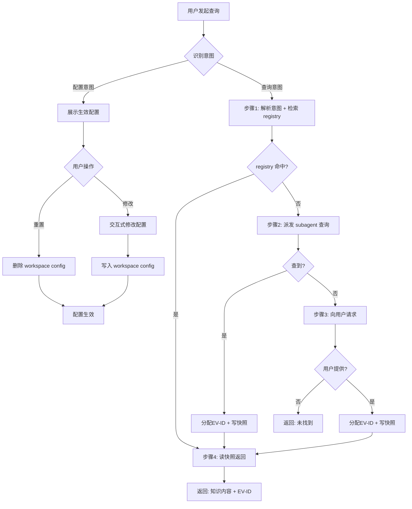

# Knowledge Query Skill 优化

- **状态:** 已确认
- **日期:** 2026-07-15
- **范围:** `skills/knowledge-query/SKILL.md`（更新）、`scripts/knowledge-query.js`（新增）
- **关联:** `docs/superpowers/specs/2026-07-15-knowledge-query-multi-source.md`（本次优化基于此 spec 的已实现内容）
- **驱动:** 用户反馈 — 补充流程图、脚本化确定性操作、优化描述

## 1. 目标

对 knowledge-query skill 进行三项优化：

1. **补充完整处理流程图**（Mermaid），置于工作流之前
2. **脚本化**配置查询/修改、evidence 快照记录，使用确定性 `scripts/knowledge-query.js`
3. **优化 skill 内部描述**，更准确反映 multi-source 能力

## 2. 变更一：Mermaid 流程图

### 2.1 位置

SKILL.md 中"## 配置" section 之后、"## 配置"（工作流一）之前。

### 2.2 流程图内容



### 2.3 覆盖要点

- 入口判型：配置意图 vs 查询意图
- 配置流：展示 → 修改/重置 → 写入
- 查询流：4 步完整链路，每个决策点有分支
- 两路最终状态明确

## 3. 变更二：`scripts/knowledge-query.js`（新增）

### 3.1 设计约束

- **双用途**: CLI 可调用 + `require()` 模块导出
- **代码风格**: 纯 CommonJS，与 `devsphere-state.js`、`feature-clarify.js` 一致
- **错误处理**: 参数校验 + 文件缺失友好报错
- **无外部依赖**: 仅使用 Node.js 内置模块

### 3.2 配置路径约定

| 配置层 | 路径 |
|--------|------|
| Workspace 用户配置 | `<workspaceRoot>/config/knowledge-sources.json` |
| Skill 默认配置 | `<repoRoot>/skills/knowledge-query/knowledge-sources.json` |

Fallback 策略：workspace config 缺失或字段缺失 → 回退 skill default。`read-config` 输出中标注每个字段来源。

### 3.3 Evidence 路径约定

沿用现有结构（由 `devsphere-workspace.js` 创建 `evidence/knowledge/` 目录）：

| 文件 | 路径 |
|------|------|
| 快照 | `<workspaceRoot>/evidence/knowledge/EV-xxx-<描述>.md` |
| Registry | `<workspaceRoot>/evidence/evidence-registry.json` |

Registry 结构：
```json
{
  "evidences": [
    {
      "id": "EV-001",
      "description": "...",
      "file": "evidence/knowledge/EV-001-xxx.md",
      "registeredAt": "2026-07-15T..."
    }
  ]
}
```

Registry 不存在时自动初始化为空 `evidences` 数组。

### 3.4 命令清单（9 个）

#### 配置类（6）

| 命令 | 参数 | 功能 | 输出 |
|------|------|------|------|
| `read-config <workspaceRoot>` | — | 两层 fallback 读取生效配置 | JSON |
| `show-config <workspaceRoot>` | — | 格式化展示 + 标注来源 | 文本 |
| `update-config <workspaceRoot> <key> <value>` | key 如 `sources.mcp.enabled` | 修改一个字段 | JSON |
| `add-config-item <workspaceRoot> <field> <item>` | field 如 `sources.local.dirs` | 向数组字段追加 | JSON |
| `remove-config-item <workspaceRoot> <field> <item>` | — | 从数组字段移除 | JSON |
| `reset-config <workspaceRoot>` | — | 删除 workspace config | JSON |

#### 证据类（3）

| 命令 | 参数 | 功能 | 输出 |
|------|------|------|------|
| `next-ev-id <workspaceRoot>` | — | 返回下一个可用 EV 编号 | JSON: `{ nextId }` |
| `register-evidence <workspaceRoot> <description> <contentFile>` | contentFile 为内容文件路径 | 分配 ID + 写快照 + 更新 registry | JSON: `{ evId, snapshotPath }` |
| `read-evidence <workspaceRoot> <evId>` | — | 按 ID 读取快照 | 文本 |

注意：`register-evidence` 的第三个参数是文件路径而非内容字符串，避免 shell 转义问题。

### 3.5 SKILL.md 中的引用方式

在工作流关键步骤中引用脚本：

- **配置工作流**: "配置读取/修改/重置 使用 `scripts/knowledge-query.js`"
- **查询工作流 步骤1**: "registry 检索由 `scripts/knowledge-query.js next-ev-id` 和 `read-evidence` 确定性执行"
- **查询步骤2**: "evidence 写入（分配 EV-ID + 写快照 + 更新 registry）由 `scripts/knowledge-query.js register-evidence` 确定性执行"
- **查询步骤4**: "读取快照由 `scripts/knowledge-query.js read-evidence` 执行"

## 4. 变更三：SKILL.md 描述优化

### 4.1 Frontmatter description

```
旧: 统一知识查询入口。自然语言触发，自动检索已有证据、从多数据源发现知识、记录新 evidence。
新: 统一知识查询入口。支持多数据源（skill、本地目录、代码仓、MCP、WebSearch），自动检索已有 evidence、派发子 Agent 发现新知识、记录 evidence 快照。
```

### 4.2 正文开头能力概述

```
旧: 统一知识查询入口。自然语言触发，步骤1 自动判断进入配置流还是查询流。
新: 多数据源统一知识查询入口。自动判断配置/查询意图，4 步查询流（registry 检索 → subagent 搜索 → 用户请求 → 快照返回），查询结果以 EV-ID 追踪。
```

### 4.3 工作流重命名

| 旧名称 | 新名称 |
|--------|--------|
| `工作流一：数据源配置` | `配置工作流` |
| `工作流二：知识查询` | `查询工作流` |

### 4.4 保持不变

- section 层级结构不变
- 返回格式（subagent 调用契约）不变
- `subagent-prompt.md` 不变
- `knowledge-sources.json` 不变

## 5. 实施范围

| 做 | 不做 |
|----|------|
| 新增 `scripts/knowledge-query.js` | 修改 evidence registry 结构 |
| 更新 `skills/knowledge-query/SKILL.md` | 修改 `subagent-prompt.md` |
| 补充 Mermaid 流程图 | 修改 `knowledge-sources.json` |
| 优化描述文案 | 修改调用方（feature-clarify 等） |

## 6. 不变式

- evidence 归档格式不变（EV 快照 + registry）
- 子 Agent 派发机制不变（general-purpose + 模板注入）
- 两层配置 fallback 机制不变
- 4 步查询流程逻辑不变
- 返回格式契约不变
