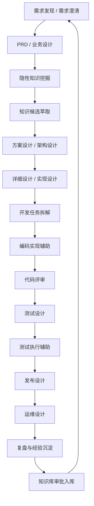
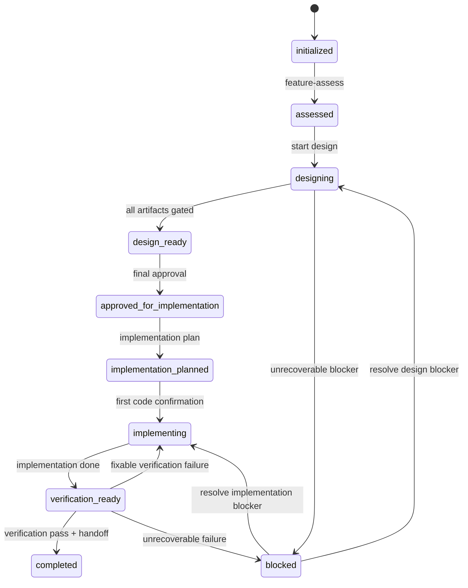
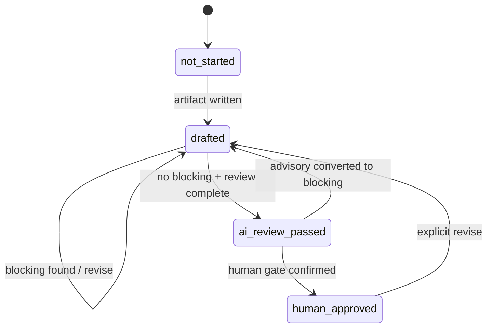

# SDLC 全生命周期 Agentic 工作流

## 1. 总体流程

**说明**

V1 不要求所有阶段都自动执行，但必须定义每个阶段的产物、状态和门禁。Feature workflow 是第一条 golden path；发布、运维和复盘先以模板和 quality gate 进入，后续可拆成独立 taskType。

## 2. 阶段定义

| 阶段 | 阶段目标 | 参与 Agent | 使用 Skill | 输入产物 | 输出产物 | 质量门禁 | 状态流转 | 失败处理 | 人工确认 | 自动化程度 |
|---|---|---|---|---|---|---|---|---|---|---|
| 需求发现 / 需求澄清 | 收集目标、范围、用户、约束、成功标准；一次只问一个问题 | SA | `feature-init`、`requirement-discovery`（V1 新增） | 用户描述、历史需求、业务知识 | `inputs/requirement.md`、`qa/requirement-qa.jsonl` | 需求目标、范围、验收口径不为空；开放问题标记 | none -> initialized | 信息不足则继续提问，不进入 blocked | 是 | 中 |
| PRD / 业务设计 | 把需求转成业务规则、流程、范围和术语 | SA，SE 评审 | `feature-design-business` | requirement、Q&A、业务 evidence | `artifacts/business-design.md`、业务 decision | 业务规则可验证；assumption 标记；evidence 引用 | initialized/assessed -> designing; stage not_started -> drafted | 缺证据则补查；歧义进入 Q&A | 根据模式 | 中 |
| 隐性知识挖掘 | 从澄清和设计中发现组织知识、领域规则、例外流程 | SA | `knowledge-extract-candidates`（V1 新增） | Q&A、business-design、decisions | `knowledge-candidates/*.jsonl` | 候选条目有来源、适用范围、置信度 | drafted -> candidate_generated | 不确定则标 `needs_review` | 是 | 中 |
| 知识萃取与知识库更新 | 去重、冲突处理、审批、入库 | SA，SE，人工 owner | `knowledge-approve`（V1 新增） | knowledge candidates、现有 docs/knowledge | `docs/knowledge/*` 更新、`knowledge-index.json` | 审批人、来源、冲突处理、状态齐全 | candidate -> approved/rejected/deprecated | 冲突则暂停给 owner | 必须 | 低到中 |
| 方案设计 / 架构设计 | 设计系统边界、接口、数据、NFR、兼容性 | SE；SA/MDE/TSE 评审 | `feature-design-solution`、`feature-review` | business-design、架构知识、ADR | `artifacts/solution-design.md` | 接口契约、NFR、兼容性、决策可追溯 | stage not_started -> drafted -> ai_review_passed/human_approved | blocking 返回 SE 修订 | 根据模式 | 中 |
| 详细设计 / 实现设计 | 模块影响、文件范围、调用链、实现拆解 | MDE；SE/DEV/TSE 评审 | `feature-design-implementation`、`module-impact-analysis`（V1 可新增） | solution-design、repo evidence | `artifacts/implementation-design.md` | 模块边界、证据、实现可行、风险 | drafted -> ai_review_passed/human_approved | 影响不清则补 repo evidence | 根据模式 | 中 |
| 开发任务拆解 | 将批准设计转成可执行步骤、验证命令、回滚策略 | DEV，必要时 CIE | `feature-plan-implementation` | approved integrated-design、repo evidence | `implementation/implementation-plan.md`、`links/repos.json` | 与批准设计一致；测试命令；回滚；范围清单 | approved_for_implementation -> implementation_planned | 范围偏差则回设计或人工确认 | 高风险必须 | 中 |
| 编码实现辅助 | 执行代码修改、补测试、本地验证 | DEV | `feature-implement`、frontend/backend/fullstack skills | implementation-plan、codebase | code diff、`implementation-log.md` | 首次修改确认；diff summary；测试结果 | implementation_planned -> implementing -> verification_ready | 测试失败回 implementing；范围偏差暂停 | 首次代码修改必须 | 中到高 |
| 代码评审 | 发现代码质量、架构偏移、安全、可维护性风险 | DEV、SE、TSE，必要时 Security | `feature-review-code`（V1 新增） | diff、implementation-log、approved design | `reviews/code-review/*.md`、review matrix | blocking 关闭；advisory 决策 | implementing / verification_ready | blocking 回实现；重大架构偏移回设计 | 根据风险 | 中 |
| 测试设计 | 明确验收、场景、数据、环境、回归范围 | TSE；SA/SE/MDE 评审 | `feature-design-test` | business/solution/implementation design | `artifacts/test-design.md` | 验收标准可执行；覆盖关键路径；未测项记录 | drafted -> ai_review_passed/human_approved | 覆盖不足回 TSE 修订 | 根据模式 | 中 |
| 测试执行辅助 | 运行测试、记录结果、生成转测包 | DEV，TSE 可参与 | `feature-verify` | code diff、test-design、implementation-log | `verification/test-handoff.md` | 命令、结果、失败项、未测原因齐全 | verification_ready -> completed/implementing/blocked | 可修复回实现；不可恢复需人工处理 | 失败风险需确认 | 中 |
| 发布设计 | 定义部署、配置、迁移、回滚、发布窗口 | CIE，SE/DEV | `release-design`（V1 新增或 checklist） | solution/implementation design、CI evidence | `release/release-design.md` | 回滚、配置、迁移、兼容、CI 影响 | verification_ready -> release_ready（P2 状态） | 发布风险回设计或计划 | 高风险必须 | 低到中 |
| 运维设计 | 定义监控、日志、告警、SLO、runbook | CIE/SRE，DEV | `operational-readiness`（V1 新增或 checklist） | release-design、NFR、ops standards | `operations/ops-readiness.md`、runbook | 可观测性、告警、应急、容量、数据恢复 | release_ready -> ops_ready（P2 状态） | 缺失则阻断发布 | 高风险必须 | 低到中 |
| 复盘与经验沉淀 | 分析返工、失败、知识缺口、流程改进 | 所有关联 Agent，人工 owner | `retrospective`（V1 新增） | trace、reviews、test results、incidents | `retrospectives/*.md`、knowledge candidates、backlog items | 根因、改进项、owner、入库候选 | completed -> learned | 无法归因则记录 unknown | 是 | 中 |

## 3. Feature 主路径状态流转

**说明**

任务级状态只记录稳定阶段，不记录每个交互细节。交互细节进入 trace、decision、review 和 Q&A。阶段细分状态仍在 `state.stages.*` 中表达。

## 4. 设计阶段子状态

**说明**

`ai_review_passed` 不是最终批准，只表示 AI 评审无 blocking。代码落地必须依赖 `approved_for_implementation` 和 implementation plan。

## 5. 失败处理原则

1. **缺信息不 blocked**：进入 Q&A 或 assumption，不进入任务级 blocked。
2. **缺证据不通过 gate**：返回对应设计阶段补 evidence。
3. **评审 blocking 不跨阶段推进**：返回原 owner 修订。
4. **advisory 需要人工决策**：apply/no_change/convert_to_blocking。
5. **risk_candidate 不能自动接受**：人工接受后才转 accepted_risk。
6. **状态异常由 resolver 处理**：重新读取当前事实计算 nextAction。
7. **不可恢复才 blocked**：例如目标仓库不可访问且无法替代、批准记录损坏且无法重建。

## 6. 人工确认点

| 确认点 | 必须落盘位置 |
|---|---|
| workflow mode 选择 | `state.json` + decision |
| 阶段人工批准 | `state.stages.*.status` + `decisions/*` 或 review 明细 |
| advisory 决策 | `reviews/advisory-confirmation.json` |
| risk acceptance | `decisions/*` + `integrated-design.md` |
| assumption 确认 | `decisions/*` |
| 最终设计批准 | `approvals/design-final-approval.json` |
| 实现计划批准 | `approvals/implementation-plan-approval.json` |
| 首次代码修改确认 | `implementation/implementation-log.md` |
| 发布/运维高风险确认 | `approvals/release-approval.json` 或 `decisions/*` |

## 7. 自动化程度分层

- **高自动化**：状态读取、artifact 存在性、hash、schema、引用完整性、review blocking 计数。
- **中自动化**：需求整理、设计草稿、测试场景、实现计划、代码修改建议。
- **低自动化**：风险接受、需求优先级、业务例外、架构取舍、发布窗口、知识入库审批。

