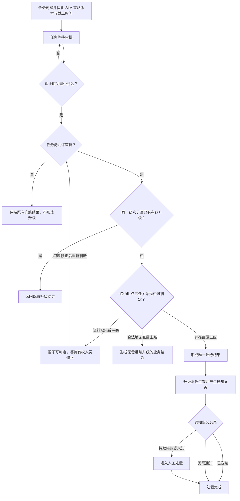
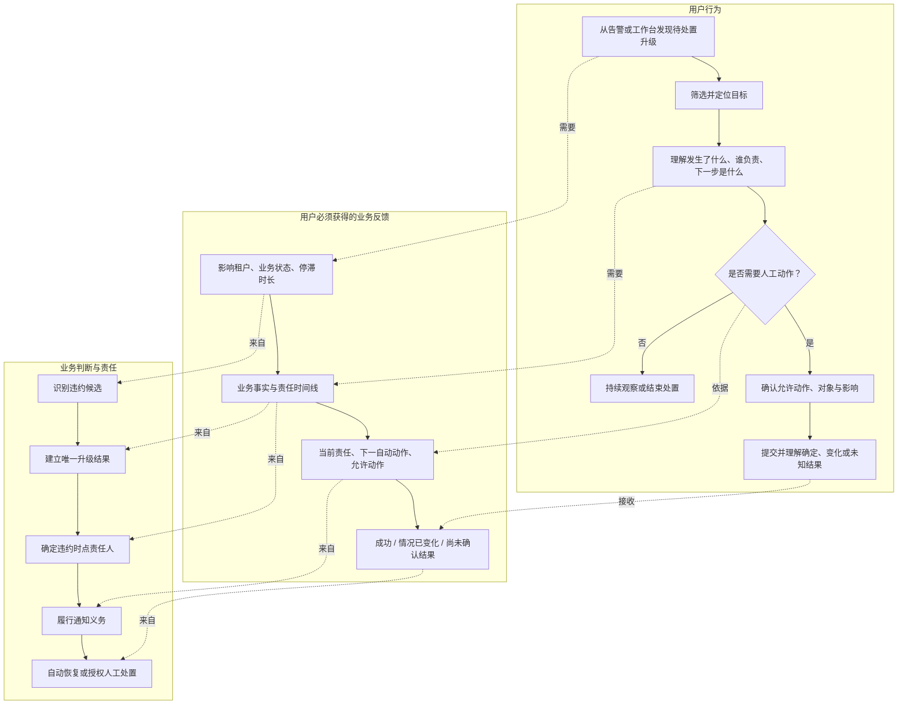
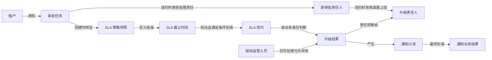
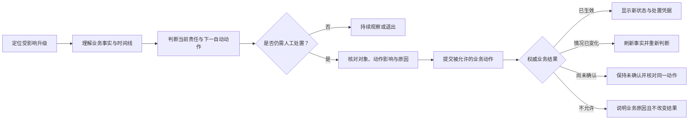
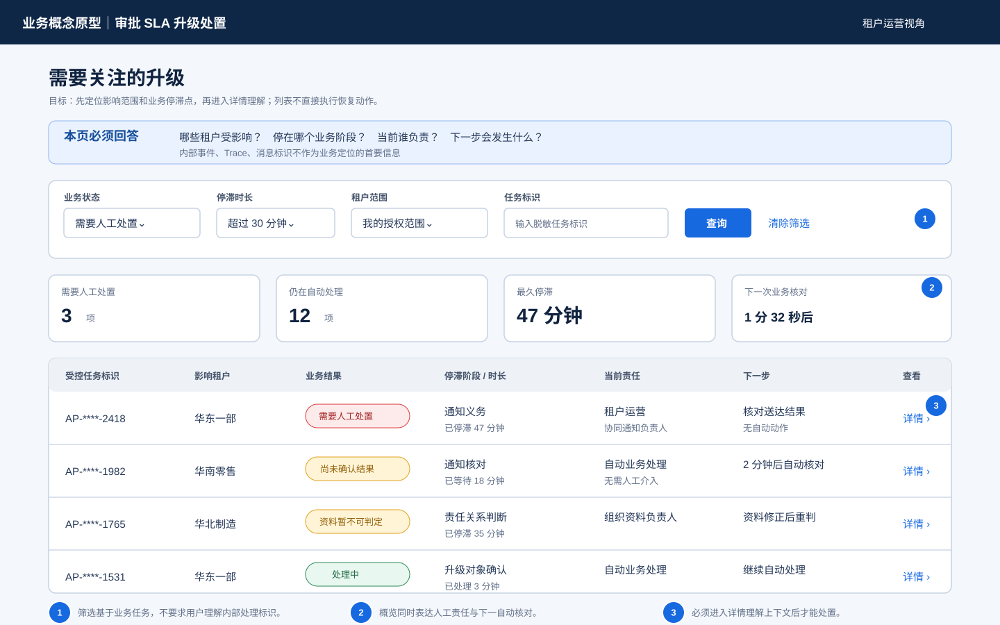
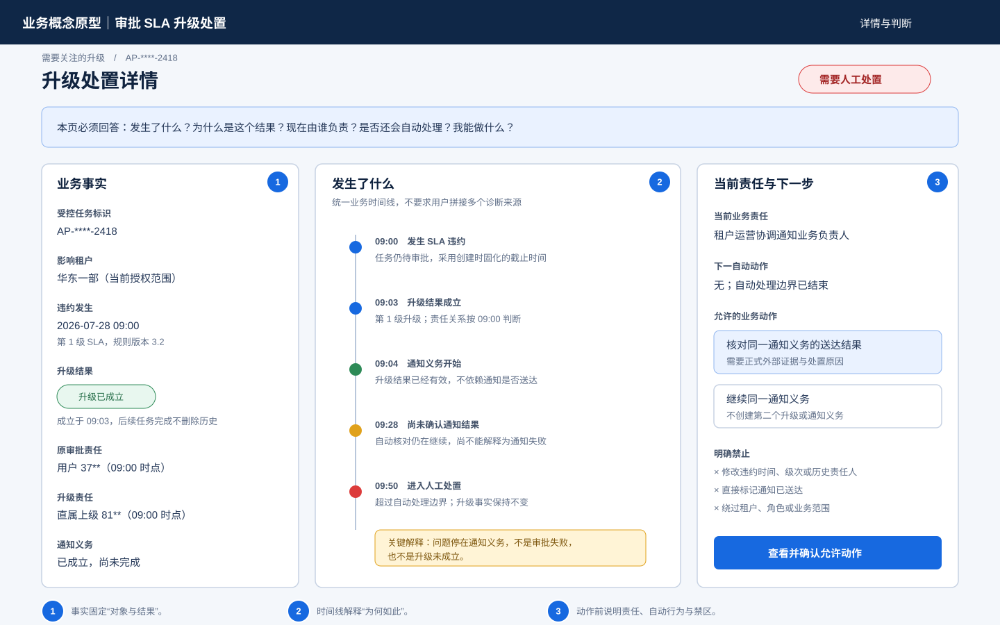
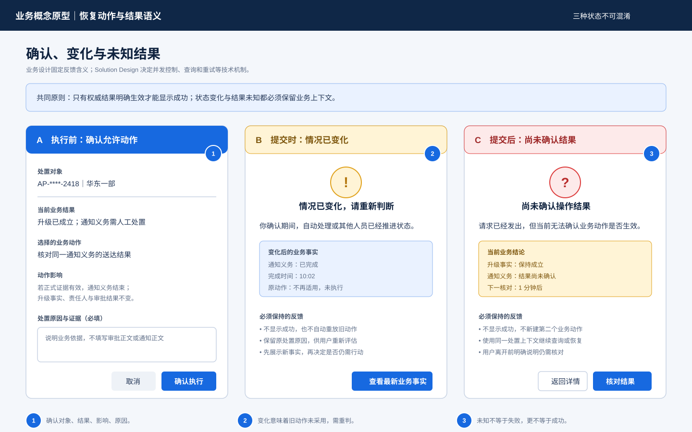
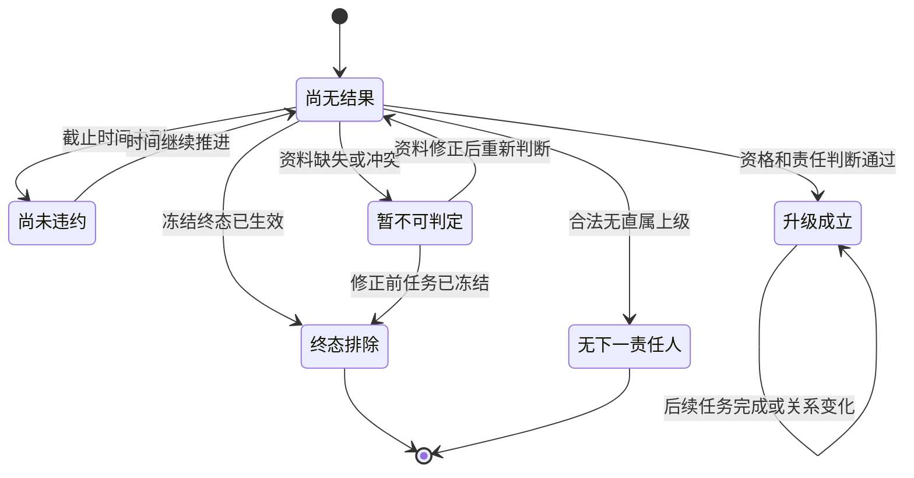
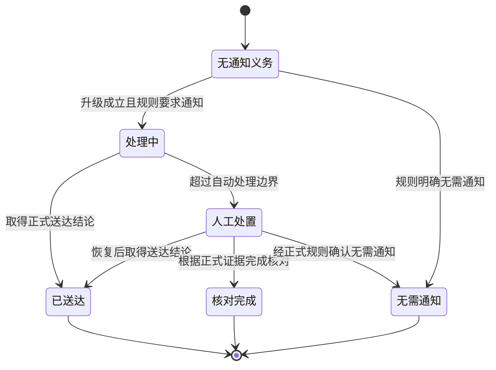

# Business Design

**Feature：审批任务 SLA 自动升级**

> 本文件是业务设计黄金样例。样例假定第 14 章列出的需求、业务规范和现状证据已经正式确认；其中的业务事实用于展示文档应达到的设计深度，不代表任何真实项目结论。

## 1. 概述

### 1.1 文档目的与目标读者

本文定义审批任务超过 SLA 截止时间后的完整业务语义目标态，使产品负责人、审批业务负责人、租户运营人员、Solution Design、Test Design 和业务验收人员能够使用同一套概念、规则、状态、场景和结果判据。

本文回答：

- 什么样的审批任务在什么时点构成 SLA 违约；
- 违约后何时形成业务升级，何时不得升级；
- 同一任务重复判断、任务撤回和责任关系变化时采用什么结果；
- 升级责任人如何从业务关系中确定；
- 升级成立、通知送达和人工处置之间是什么业务关系；
- 参与者能够看到什么结果，谁有权修正什么业务资料；
- 下游设计和测试不得改变哪些业务结论；
- 核心用户通过什么业务信息、判断、动作与反馈完成升级处置。

本文不选择系统、服务、接口、消息、数据库、任务调度、事务、重试、补偿、部署或页面组件实现。本文通过业务概念原型确定核心用户任务、必要信息、决策顺序、允许动作和反馈语义；具体信息架构、控件、视觉规范、客户端状态与服务端机制由 Solution Design 和交互设计细化。

### 1.2 Feature 范围

本次范围包括：

- 对已经启用 SLA 的审批任务判断是否发生违约；
- 为符合条件的违约形成唯一的升级业务结果；
- 按违约发生时有效的责任关系确定升级责任人；
- 使申请人、原审批人、升级责任人和授权运营人员能够理解业务结果；
- 对重复判断、终态、撤回、责任关系缺失或冲突、通知未送达和人工修正定义确定结果；
- 定义升级处置工作台必须支持的用户任务、业务信息、操作边界和结果反馈；
- 细化 Requirement Acceptance，使下游可以直接验证业务正确性。

本次不包括：

- 新建或修改 SLA 策略配置能力；
- 改变审批流程节点、审批权限或通过/拒绝规则；
- 维护组织架构、直属上级关系、代理关系或跨组织升级策略；
- 定义通知渠道、模板内容和供应商路由；
- 允许运营人员跳过审批规则、伪造升级结果或直接标记通知已送达；
- 确定升级处置界面的最终布局、组件、视觉规范和 Design Token。

### 1.3 正式输入与关键约束

本文采用 `REQ-SLA-BASELINE-1.0` 作为 Requirement Baseline，并把 `UCD-SLA-001` 作为处置工作台的正式用户研究输入，遵守以下已确认约束：

- 每个审批任务在创建时已经绑定 SLA 策略版本和各升级级次的截止时间；
- 既有“已通过、已拒绝、已撤回、已终止”业务结果保持冻结；
- 直属上级关系由组织业务域定义，本 Feature 只消费其业务含义；
- SLA 策略后续变更不追溯改变已经创建任务的截止时间；
- 通知是否送达不改变审批任务是否已经发生业务升级；
- 同一业务事实必须得到唯一、可解释且可追溯的业务结果。

## 2. 需求基线与业务设计范围

### 2.1 已批准需求与验收承诺

| 需求编号 | 已批准业务需求 | Requirement Acceptance |
|---|---|---|
| REQ-SLA-001 | 可升级审批任务超过任务创建时固化的 SLA 截止时间后，应在五分钟内被识别 | 正常负载下，99% 的逾期任务在截止时间后五分钟内形成候选 |
| REQ-SLA-002 | 同一任务、SLA 策略版本、升级级别和截止时间只能形成一个有效升级事实 | 重复扫描和并发提交不产生第二个升级记录 |
| REQ-SLA-003 | 升级事实创建前任务已完成、撤回或终止时不得升级；创建后任务完成不能删除历史升级事实 | 竞态场景具有唯一、可审计的最终结果 |
| REQ-SLA-004 | 升级对象是 SLA 违约发生时任务当前处理人的直属上级 | 组织关系查询使用 `breachedAt` 作为生效时间 |
| REQ-SLA-005 | 通知最终必须进入“已送达、无需通知或人工处置”之一，不允许永久停留在未知状态 | 所有未完成状态都有自动恢复或人工出口 |
| REQ-SLA-006 | 全链路保持租户隔离，不在事件、日志和指标中泄露审批正文或无关组织信息 | 跨租户访问被拒绝，敏感信息符合最小化原则 |
| REQ-SLA-007 | 能够在不停机滚动升级期间安全启用和回退 | 新旧实例共存时不产生重复升级或不可消费事件 |
| REQ-SLA-008 | 授权运维人员能够在处置工作台定位停滞升级、理解处理时间线，并安全执行允许的恢复动作 | 列表、详情、异常状态和高危操作均有确定交互；越权、版本冲突和未知提交结果不会产生误导性成功反馈 |
| NFR-SLA-001 | 规模基线为 120 万活跃任务，峰值五分钟内 3 万个 SLA 违约；故障恢复时允许五倍瞬时消费压力 | 扫描、事件发布和消费容量通过基线与五倍恢复压力验证 |
| NFR-SLA-002 | 健康依赖条件下，95% 的升级在违约后五分钟内进入通知服务，99% 在十分钟内进入 | 指标可直接计算端到端延迟并用于 SLO 告警 |
| NFR-SLA-003 | 升级审计保留 365 天，运行日志不保存审批正文和通知正文 | 保留、脱敏和删除策略通过安全检查 |
| NFR-SLA-004 | 处置工作台在公司支持的桌面浏览器中可由键盘和读屏软件完成查询、理解状态及恢复操作 | 核心流程满足 WCAG 2.2 AA；正常网络下列表和详情可交互时间 p95 不超过 2 秒 |

### 2.2 业务功能点清单

| 功能点 | 关联需求 | 变更类型 | 业务目标与边界 | 详细设计位置 |
|---|---|---|---|---|
| FP-BIZ-01 判定 SLA 违约资格 | REQ-SLA-001、NFR-SLA-001 | 修改 | 把现有“逾期提示”细化为具有明确范围、时点和排除条件的业务判断 | 6.2 |
| FP-BIZ-02 形成唯一升级结果 | REQ-SLA-002、REQ-SLA-003、REQ-SLA-007 | 新增、修改 | 形成唯一、冻结、可解释的业务升级结果；不决定技术唯一性机制 | 6.3 |
| FP-BIZ-03 确定升级责任人 | REQ-SLA-004、REQ-SLA-005、REQ-SLA-006 | 新增 | 按违约发生时的有效直属上级关系确定责任并形成通知义务；不维护组织关系或通知渠道 | 6.4 |
| FP-BIZ-04 反馈结果并完成业务处置 | REQ-SLA-005、REQ-SLA-008、NFR-SLA-002、NFR-SLA-003、NFR-SLA-004 | 新增 | 使相关参与者理解结果，并让授权人员及时、安全、可访问地处理允许修正的异常 | 6.5 |

### 2.3 存量变化边界

| 业务区域 | 当前设计 | 本次变化 | 变化后完整结论 |
|---|---|---|---|
| SLA 截止时间 | 任务创建时固化，逾期后展示超时提示 | 保持不变并补全业务时间语义 | 截止时间继续来自任务固化快照，并作为违约发生时间 |
| 审批任务结果 | 通过、拒绝、撤回和终止为冻结结果 | 保持不变，补充与升级的优先级 | 冻结结果一旦先于升级成立生效，任务不得升级 |
| 逾期处理 | 主要依赖人工发现和责任调整，没有独立升级结果 | 新增正式升级业务结果 | 逾期提示不能代替升级结果；责任调整也不能冒充升级 |
| 责任人确定 | 人工处置通常查看当前直属上级 | 改为按违约发生时点判断 | 历史有效直属上级是权威业务依据 |
| 重复处置 | 缺少统一业务身份，可能产生多次人工动作 | 新增唯一性业务规则 | 相同任务、策略版本、截止时间和级次只形成一个有效升级 |
| 通知结果 | 通知失败可能被误解为升级失败 | 明确业务结果边界 | 升级成立与通知送达分别判断，通知失败不撤销升级 |
| 运营处置 | 可以人工调整责任，但缺少允许动作边界 | 增加受控业务处置 | 运营人员可以修正资料和恢复通知，不得改写已成立升级 |
| 能力启用与回退 | 依赖人工逾期处置，没有新旧处理规则并存 | 新增可渐进启用和安全回退约束 | 新旧处理能力并存期间，同一业务事实仍只有一个有效结果；停止新处理不删除既有结果或未完成义务 |

保持不变的业务承诺：

- 申请、审批、通过、拒绝、撤回和终止的核心业务含义不变；
- 审批人是否有权处理任务仍由既有审批规则决定；
- 组织业务域继续负责直属上级关系的真实性和历史有效性；
- 通知业务域继续负责各渠道送达规则；
- 本 Feature 不新增跨级寻找替代责任人、代理审批或自动通过/拒绝。

非目标：

- 重新计算历史任务的 SLA；
- 把历史人工责任调整批量转换为升级结果；
- 修改已经冻结的审批结果；
- 根据技术可用性改变业务规则。

### 2.4 授权后移事项

以下内容不改变业务结果，允许由下游设计决定：

- 如何持续发现可能违约的任务；
- 如何保证重复处理只产生一个升级结果；
- 如何取得违约时点的历史责任关系；
- 如何发出通知并恢复暂时失败；
- 如何保存、查询和展示业务历史；
- 如何实现权限校验、审计、性能和可靠性目标。

不存在允许推迟到 Solution Design 的业务语义问题。尤其是唯一业务身份、撤回优先级、历史关系时点、通知与升级的关系、人工处置边界必须以本文为准。

## 3. 业务目标态总览

### 3.1 目标业务能力与价值结果

目标态增加“审批 SLA 违约升级”业务能力。它不改变审批决定本身，而是在任务未按时处理时形成新的责任升级结果，使相关参与者能够回答：

1. 任务是否在适用范围内；
2. 是否已经发生 SLA 违约；
3. 是否形成了升级，形成的是哪一级；
4. 原责任人和升级责任人分别是谁；
5. 为什么采用该责任人和该规则版本；
6. 通知是否完成，若未完成由谁继续处置；
7. 重复判断、撤回或资料修正后最终采用什么结果。

成功的业务结果不是“执行过一次自动动作”，而是所有适用任务最终都具有唯一、可解释的结论：

- 已形成升级；
- 因冻结终态而不升级；
- 尚未到达截止时间；
- 因业务资料缺失或冲突暂不可判定；
- 合法地不存在下一责任人；
- 已形成升级但通知需要人工处置。

### 3.2 端到端目标业务运行



这条业务主线由四个功能点共同完成：

- FP-BIZ-01 判断任务是否具备违约和升级资格；
- FP-BIZ-02 判断是否形成新的唯一升级结果；
- FP-BIZ-03 确定升级责任人或给出不可判定、无下一责任人的业务结论；
- FP-BIZ-04 向相关参与者反馈结果并关闭通知或人工处置。

### 3.3 业务处置服务蓝图

下图把用户可见行为、业务判断和支撑责任放在同一条业务链上。它用于确认每一步由谁提供什么业务结果，不规定系统或服务拆分。



蓝图揭示两个必须在本层解决的问题：其一，运营人员不能靠拼接多个技术来源理解业务事实；其二，任何恢复动作都必须在展示当前责任、下一自动行为和可能影响之后发生。具体由哪些页面、接口或组件承载属于下游设计空间。

### 3.4 目标态成立的业务原则

- **先判断资格，再形成升级**：超过截止时间不等于一定升级。
- **一个业务事实只有一个有效结果**：重复判断不产生第二个升级。
- **冻结结果优先得到保护**：终态先成立时不再升级。
- **责任关系使用历史时点**：不得用后来的组织变化改写当时责任。
- **不猜测业务事实**：资料缺失、冲突和合法无上级必须区分。
- **升级结果与通知结果分离**：通知失败不撤销已经成立的升级。
- **人工处置不能改写历史**：只能修正允许修正的资料或完成既有义务。

## 4. 业务概念、对象与度量语义

### 4.1 核心概念

| 概念 | 业务定义 | 不属于本概念的内容 |
|---|---|---|
| 审批任务 | 等待一个或多个有权参与者作出业务决定的工作对象 | 技术任务、通知任务、扫描批次 |
| SLA 策略快照 | 审批任务创建时绑定的业务时限、升级级次及规则版本 | 后续修改后的当前策略 |
| SLA 截止时间 | 某升级级次应当完成处理的业务时刻；到达该时刻构成违约判断起点 | 实际被发现或处理的时间 |
| SLA 违约 | 任务在截止时间到达时仍满足违约适用条件的业务事实 | 任何技术延迟或通知失败 |
| 升级级次 | 同一任务责任逐级上移的业务顺序，从 1 开始连续递增 | 重试次数、通知次数 |
| 升级业务身份 | 由租户、任务、SLA 策略版本、截止时间和升级级次共同标识的一次潜在升级 | 操作时间、处理人员、运行批次 |
| 升级结果 | 违约资格、任务状态和责任关系完成判断后形成的正式业务结论 | 单纯的逾期提示或人工改派 |
| 原审批责任人 | 违约发生时对当前审批处理承担责任的参与者 | 判断执行时的当前处理人 |
| 升级责任人 | 违约发生时原审批责任人的有效直属上级 | 任意更高层管理者或临时代理人 |
| 通知义务 | 升级成立后应向规定参与者反馈业务结果的责任 | 升级成立条件 |
| 暂不可判定 | 关键业务资料缺失或冲突，当前不能得到唯一结果但允许修正后重新判断 | 合法无直属上级 |
| 人工处置 | 自动业务处理无法结束时，由授权参与者按允许动作完成资料修正或通知义务 | 直接修改升级历史或审批结果 |

### 4.2 概念关系



关系约束：

- 一个审批任务可以随不同截止时间和级次形成多个升级结果，但同一升级业务身份最多一个有效结果；
- 每个已成立升级结果只有一个原审批责任人；
- 每个已成立升级结果最多一个升级责任人；
- 合法无直属上级时可以形成“无需继续升级”的结论，但不能形成虚假升级责任人；
- 通知义务依附于已成立升级结果，不反向决定升级是否成立。

### 4.3 度量与时间口径

| 度量 | 定义 | 单位与边界 |
|---|---|---|
| 违约发生时间 `breachedAt` | 当前升级级次固化的 SLA 截止时间 | 精确到秒；不是判断执行时间 |
| 升级成立时间 `establishedAt` | 升级结果正式生效的业务时间 | 不早于 `breachedAt` |
| 违约识别时长 | `establishedAt - breachedAt`，仅对已成立升级计算 | 秒；正常业务规模下 99% 不超过五分钟；暂不可判定期间继续累计并单独标识 |
| 通知完成时间 | 通知进入已送达、无需通知或人工处置完成的时间 | 精确到秒；不改变 `establishedAt` |
| 升级次数 | 同一审批任务已经成立的不同升级级次数量 | 只计有效升级结果，不计重复判断 |
| 待人工处置时长 | 进入人工处置至完成或正式关闭的时间 | 秒；用于运营管理，不改变审批结果 |

空值语义：

- 没有升级责任人必须带有原因分类：`NO_SUPERIOR`、`RELATION_MISSING` 或 `RELATION_CONFLICT`；
- 没有通知完成时间表示通知义务尚未结束，不能解释为通知失败或无需通知；
- 没有升级结果表示尚未完成业务判断，不能解释为任务未违约；
- 时间无法确定属于业务资料缺口，不得以当前时间或发现时间代替。

## 5. 业务参与者、责任与适用范围

### 5.1 参与者与结果责任

| 参与者 | 业务责任 | 可以确认或修正 | 不得执行 |
|---|---|---|---|
| 申请人 | 发起审批并观察审批、升级结果 | 不能修正升级资料 | 不能选择升级责任人或改写结果 |
| 原审批人 | 在违约前承担当前处理责任，升级后理解责任变化 | 可以对责任关系资料提出异议 | 不能撤销已经成立的升级历史 |
| 升级责任人 | 升级成立后承担对应级次的审批处理责任 | 按既有审批权限处理任务 | 不能修改 SLA 截止时间或升级级次 |
| 审批业务负责人 | 定义升级规则并承担业务正确性责任 | 批准规则版本和特殊业务处理原则 | 不能以个案操作代替正式规则 |
| 组织资料负责人 | 维护人员及直属上级关系的真实性和历史有效性 | 修正缺失或冲突的组织关系 | 不能直接创建审批升级结果 |
| 租户运营人员 | 发现异常、协调资料修正并完成允许的业务处置 | 在租户范围内发起重新判断或通知恢复 | 不能跨租户查看、伪造责任人或标记已送达 |
| 审计人员 | 核验升级依据、责任变化和处置历史 | 不能修改业务资料 | 不能执行恢复动作 |

### 5.2 权利与可见性

| 业务信息或动作 | 申请人 | 原审批人 | 升级责任人 | 租户运营 | 审计人员 |
|---|---:|---:|---:|---:|---:|
| 查看任务是否升级 | 是 | 是 | 是 | 租户范围内 | 审计范围内 |
| 查看升级级次和成立时间 | 是 | 是 | 是 | 租户范围内 | 是 |
| 查看完整责任关系依据 | 否 | 仅本人相关 | 仅本人相关 | 按职责授权 | 是 |
| 查看通知业务结果 | 本人相关 | 本人相关 | 本人相关 | 租户范围内 | 是 |
| 修正组织资料 | 否 | 否 | 否 | 仅发起或协调 | 否 |
| 请求重新判断暂不可判定结果 | 否 | 否 | 否 | 是 | 否 |
| 请求恢复通知义务 | 否 | 否 | 否 | 是 | 否 |
| 直接修改已成立升级 | 否 | 否 | 否 | 否 | 否 |

所有参与者只能在其租户、审批业务范围和角色权限内观察结果。未获授权者不得通过任务标识、人员标识或共享链接推断对象是否存在。

### 5.3 适用与排除条件

适用对象同时满足：

- 审批任务所属业务已经启用 SLA；
- 任务创建时存在有效 SLA 策略快照；
- 当前级次具有固化截止时间；
- 截止时间到达时任务仍处于允许审批的状态；
- 当前升级级次尚未形成有效升级结果。

排除对象：

- 未启用 SLA 的任务；
- 仅用于演示、草稿或尚未正式提交的审批对象；
- 截止时间到达前已经通过、拒绝、撤回或终止的任务；
- 已经完成同一升级级次的任务；
- 本 Feature 正式启用前已经冻结的历史任务，除非另有经过批准的迁移规则；
- 不属于当前租户或业务范围的对象。

### 5.4 UCD 依据、用户任务与可用性目标

本黄金样例假定正式输入 `UCD-SLA-001` 已完成 4 名 SRE、4 名租户运营人员的情境访谈，以及 3 次历史升级故障处置 walkthrough。研究覆盖告警触发后的定位、状态解释、责任判断和恢复操作，不把研发人员的系统模型直接当成用户心智模型。

| 用户研究发现 | 对业务设计的影响 |
|---|---|
| 操作者通常从告警进入，首先判断“影响哪个租户、停在哪个业务阶段、系统还会不会自动恢复” | 必须先呈现影响范围、业务阶段、停滞时长、当前责任和下一业务动作，内部处理标识不是首要信息 |
| 当前处置需要在多个诊断来源之间切换，难以还原一致时间线 | 必须用一条按业务时间排序的时间线解释违约、升级成立、责任变化、通知义务和人工处置 |
| 操作者最担心自动恢复刚完成后又重复执行高危动作 | 业务动作必须在当前状态仍适用时才生效；情况变化后不得显示成功，必须重新理解和确认 |
| 值班人员会使用键盘操作并在高缩放比例下查看页面 | 定位、理解和处置必须可由键盘及读屏软件完成，不能仅以颜色表达状态 |

核心用户任务不是“操作某个系统”，而是完成以下闭环：

1. 在有权查看的业务范围内定位目标升级；
2. 解释违约是否成立、停滞在哪个业务阶段以及当前由谁负责；
3. 判断业务是否仍会自动恢复，是否真的需要人工介入；
4. 在充分理解对象、影响和边界后选择被允许的业务动作；
5. 区分动作已经成功、情况已经变化、结果尚未确认和操作被拒绝；
6. 保留可追溯的处置原因，并安全返回持续观察。

可用性目标：

- 操作者从 P1 告警进入后，三分钟内能够找到目标升级，并说出停滞阶段、当前恢复责任和下一自动动作；
- 未参与系统开发的租户运营人员能够正确区分 `MANUAL_INTERVENTION` 与“审批业务失败”；
- 任何参与者都不能把并行变化或请求结果未知误判为恢复成功；
- 仅使用键盘和读屏软件可以完成筛选、查看业务时间线、确认动作、理解错误并安全退出；
- 正常网络下，列表和详情的可交互时间 p95 不超过两秒。

## 6. 业务功能点与业务场景设计

### 6.1 功能点及场景索引

| 功能点 | 正常场景 | 关键边界场景 | 权威规则 |
|---|---|---|---|
| FP-BIZ-01 判定 SLA 违约资格 | S-01 到期且仍待审批 | S-02 未到期、S-03 已终态、S-04 快照缺失 | BR-SLA-001～004 |
| FP-BIZ-02 形成唯一升级结果 | S-05 首次升级 | S-06 重复判断、S-07 撤回竞态、S-08 已进入更高级次 | BR-SLA-005～008 |
| FP-BIZ-03 确定升级责任人 | S-09 存在有效直属上级 | S-10 合法无上级、S-11 关系缺失、S-12 关系冲突 | BR-SLA-009～012 |
| FP-BIZ-04 反馈结果并完成业务处置 | S-13 通知完成 | S-14 通知失败、S-15 资料修正、S-16 越权处置 | BR-SLA-013～017 |

### 6.2 FP-BIZ-01：判定 SLA 违约资格

#### 6.2.1 关联需求、业务目标与结果责任

关联 `REQ-SLA-001`、`NFR-SLA-001`。

业务目标是把“截止时间已经到达”转换为具有明确适用范围的违约资格结论，避免把任何逾期显示、技术延迟或已结束任务误判为可升级任务。

审批业务负责人对适用范围和状态规则负责；SLA 策略负责人对任务创建时固化的截止时间和策略版本负责。

#### 6.2.2 当前业务设计与依据

现行业务规范只规定“任务超过 SLA 后显示逾期”，没有完整定义：

- 逾期显示与业务违约是否相同；
- 任务在截止时刻已经撤回或完成时是否仍算违约；
- SLA 策略后来调整是否改变既有任务；
- 缺少 SLA 快照或截止时间时应当采用什么业务结果；
- 多次发现同一逾期任务是否代表多次违约。

当前运行事实表明，运营人员需要结合任务状态、策略配置和组织资料人工判断是否升级。同一事实可能因操作者理解不同得到不同结果，因此不能直接沿用。

#### 6.2.3 本次业务变化

- 新增“违约发生时间”和“违约资格”概念；
- 明确任务创建时的 SLA 策略快照是判断依据；
- 明确冻结终态、未到期、快照缺失和重复判断的业务结果；
- 保持既有 SLA 截止时间计算和审批终态含义不变；
- 删除“只要显示逾期就可以人工升级”的隐含规则。

#### 6.2.4 目标态业务行为

1. 取得任务创建时固化的租户、业务范围、SLA 策略版本、当前升级级次和截止时间。
2. 判断任务是否属于已启用 SLA 的正式审批对象。
3. SLA 未启用或对象不在正式范围内时，结论为“不适用”，不进入升级判断。
4. 缺少策略版本或截止时间时，结论为“业务资料缺失”，进入待修正状态，不以当前策略或当前时间补齐。
5. 当前业务时间早于截止时间时，结论为“尚未违约”。
6. 截止时间已经到达时，以截止时间作为 `breachedAt`，而不是实际执行判断的时间。
7. 判断任务在 `breachedAt` 是否已经进入冻结终态。冻结终态已生效时，结论为“终态排除”。
8. 其他符合条件的任务形成“具备违约升级资格”的结论，交由 FP-BIZ-02 判断是否创建新升级结果。

本功能点只判断资格，不产生升级责任人，不代表通知已经发生，也不因重复执行产生新的业务事实。

#### 6.2.5 适用规则、状态和时间语义

本功能点依次应用 `BR-SLA-001` 至 `BR-SLA-004`：先确定任务快照，再判断到期条件和冻结终态；无法取得完整依据时转为暂不可判定。规则全文以第 7.1 节为准。

`breachedAt` 固定等于本级 SLA 截止时间。晚发现不改变违约发生时间；提前判断不能把未来截止时间认定为已经违约。

#### 6.2.6 异常、边界与可观察结果

| 条件 | 业务结论 | 可观察反馈 | 是否进入 FP-BIZ-02 |
|---|---|---|---:|
| SLA 未启用 | 不适用 | 任务不属于自动升级范围 | 否 |
| 当前时间早于截止时间 | 尚未违约 | 展示剩余业务时限 | 否 |
| 截止时间已到且任务允许审批 | 具备升级资格 | 展示违约时间和适用规则版本 | 是 |
| 截止时间前已通过、拒绝、撤回或终止 | 终态排除 | 展示冻结结果及其生效时间 | 否 |
| SLA 快照或截止时间缺失 | 暂不可判定 | 展示缺失资料类型和责任方 | 否，修正后重新判断 |
| 同一任务被重复判断 | 返回相同资格结论 | 不增加违约次数 | 按原结论 |

#### 6.2.7 业务验收实例

- `AC-BIZ-01`：到期且仍待审批的任务进入升级资格判断。
- `AC-BIZ-02`：未到期任务不产生违约或升级结果。
- `AC-BIZ-03`：截止时间前已经撤回的任务保持撤回结果。
- `AC-BIZ-04`：策略后来调整不改变既有任务的截止时间。
- `AC-BIZ-05`：快照缺失时明确显示暂不可判定，不使用当前策略代替。

### 6.3 FP-BIZ-02：形成唯一升级结果

#### 6.3.1 关联需求、业务目标与结果责任

关联 `REQ-SLA-002`、`REQ-SLA-003`、`REQ-SLA-007`。

业务目标是把一次符合条件的 SLA 违约转化为唯一、冻结、可追溯的升级结果。重复判断、多人同时处置和任务状态竞态必须得到同一个最终业务结论。

审批业务负责人对唯一身份、结果优先级和历史保留规则负责。

#### 6.3.2 当前业务设计与依据

当前只有逾期提示和人工责任调整：

- 逾期提示没有升级级次和稳定业务身份；
- 普通责任调整无法证明是由哪次 SLA 违约引起；
- 多名运营人员可能围绕同一逾期任务进行重复处置；
- 任务完成、撤回和人工升级相邻发生时没有正式优先级；
- 后续责任调整可能覆盖当时信息，无法解释历史。

因此，现状不能满足“同一事实唯一结果”和“结果可追溯”的需求。

#### 6.3.3 本次业务变化

| 变化类型 | 内容 |
|---|---|
| 新增 | 由租户、任务、策略版本、截止时间和升级级次构成的升级业务身份 |
| 新增 | 独立于逾期提示和普通责任调整的升级结果 |
| 新增 | 结果成立时间、原责任人、升级责任人、规则版本和原因 |
| 修改 | 撤回、完成和升级相邻发生时按正式业务生效时间判断 |
| 保持不变 | 已通过、已拒绝、已撤回和已终止仍为冻结结果 |
| 删除 | 允许重复人工处置形成多个有效升级的隐含行为 |

#### 6.3.4 目标态业务行为

1. 接收 FP-BIZ-01 的“具备升级资格”结论以及任务、策略版本、截止时间和升级级次。
2. 组成升级业务身份：

   ```text
   租户 + 审批任务 + SLA 策略版本 + SLA 截止时间 + 升级级次
   ```

3. 判断同一业务身份是否已经形成有效升级结果：
   - 已存在时返回原结果；
   - 不改变原结果的成立时间、责任人、规则版本或通知状态；
   - 重复判断不计为第二次升级。
4. 尚无结果时重新确认任务当前业务状态：
   - 冻结终态已先成立时，不形成升级；
   - 升级已经先成立时，即使任务随后完成，也保留升级历史；
   - 撤回与升级具有相同业务生效时间时，撤回优先。
5. 调用 FP-BIZ-03 确定升级责任结论。
6. 存在有效升级责任人时，形成“升级成立”结果，原责任转移到升级责任人。
7. 合法无直属上级时，形成“无下一升级责任人”结论，不伪造责任人，也不继续跨级寻找。
8. 责任资料缺失或冲突时不形成正式升级，状态为“暂不可判定”，等待资料修正后按同一业务身份重新判断。
9. 已成立升级结果成为历史事实。后续任务完成、责任关系变化或通知失败均不能删除或改写它。

#### 6.3.5 适用规则、状态和时间语义

本功能点依次应用 `BR-SLA-005` 至 `BR-SLA-008`：先按业务身份复用既有结果，再按正式生效时间处理冻结终态和升级竞态；升级成立后转为冻结历史。规则全文以第 7.1 节为准。

升级成立时间不得早于 `breachedAt`。它表示责任升级正式生效，而不是通知送达或参与者查看结果的时间。

#### 6.3.6 异常、边界与可观察结果

| 场景 | 最终业务结果 | 历史处理 |
|---|---|---|
| 首次符合条件且存在责任人 | 形成升级 | 保存完整升级依据 |
| 同一业务身份重复判断 | 返回既有升级 | 不形成第二个结果 |
| 截止后、升级前任务通过或拒绝 | 不升级 | 保留任务终态依据 |
| 升级成立后任务通过或拒绝 | 升级历史保留，任务进入新终态 | 不删除升级记录 |
| 撤回与升级同一业务时刻 | 撤回优先，不升级 | 记录优先级依据 |
| 已经进入更高升级级次 | 返回已经成立的更高级结果 | 不补建较低级次 |
| 责任资料暂不可判定 | 暂不形成升级 | 修正后使用同一身份重新判断 |

#### 6.3.7 业务验收实例

- `AC-BIZ-06`：两个参与者同时处理同一违约任务时只形成一个升级结果。
- `AC-BIZ-07`：重复判断返回同一升级成立时间和责任人。
- `AC-BIZ-08`：撤回先成立时不升级；升级先成立时历史升级保留。
- `AC-BIZ-09`：同一时刻撤回与升级冲突时采用撤回。
- `AC-BIZ-10`：通知失败不删除或撤销升级结果。

### 6.4 FP-BIZ-03：确定升级责任人

#### 6.4.1 关联需求、业务目标与结果责任

关联 `REQ-SLA-004`、`REQ-SLA-005`、`REQ-SLA-006`。

业务目标是按 SLA 违约发生时的真实业务责任关系确定唯一升级责任人，使组织关系后来变化时仍能解释历史结果。

组织资料负责人对直属上级关系及其有效时间负责；审批业务负责人对“只升级到直属上级、不跨级猜测”的规则负责。

#### 6.4.2 当前业务设计与依据

当前人工处置通常查看操作当时的当前直属上级，存在三个问题：

- 违约后发生调岗时，当前上级不一定是违约当时的上级；
- 没有直属上级与组织资料缺失经常被当成同一种情况；
- 资料异常时，操作者可能选择更高层人员作为替代，导致相同事实得到不同结果。

现状不能满足历史可解释性和唯一责任人要求。

#### 6.4.3 本次业务变化

- 新增以 `breachedAt` 为生效时点的历史关系判断；
- 区分有效直属上级、合法无直属上级、关系缺失和关系冲突；
- 禁止自动跨级查找、使用当前关系代替历史关系或以原审批人作为默认升级责任人；
- 保持组织关系的定义、维护流程和责任归属不变。

#### 6.4.4 目标态业务行为

1. 以 FP-BIZ-01 确定的 `breachedAt` 和原审批责任人为输入。
2. 确认原审批责任人在该时点属于任务租户和适用组织范围。
3. 取得该时点生效的直属上级关系，并按以下顺序判断：
   - 恰好一个有效直属上级：该人员成为升级责任人；
   - 明确属于组织最高责任层级：结论为 `NO_SUPERIOR`；
   - 没有关系且不能证明属于最高层级：结论为 `RELATION_MISSING`；
   - 同一时点存在多个互斥直属上级：结论为 `RELATION_CONFLICT`；
   - 直属上级等于本人、跨租户或不在适用范围：结论为 `RELATION_INVALID`。
4. `NO_SUPERIOR` 是合法业务结果，不进入资料修正，也不继续寻找更高层人员。
5. `RELATION_MISSING`、`RELATION_CONFLICT` 和 `RELATION_INVALID` 进入暂不可判定，由组织资料负责人修正。
6. 资料修正后仍使用原 `breachedAt` 重新判断；不得改用修正时间。
7. 升级已经正式成立后，后来发生的组织变化不改写历史责任人。

#### 6.4.5 适用规则、状态和时间语义

本功能点依次应用 `BR-SLA-009` 至 `BR-SLA-012`：固定历史关系时点，只接受唯一有效直属上级，并把无上级、缺失、冲突和无效关系分类处理。规则全文以第 7.1 节为准。

#### 6.4.6 异常、边界与可观察结果

| 关系判断 | 业务结果 | 是否允许修正后重试 | 对参与者的解释 |
|---|---|---:|---|
| 一个有效直属上级 | 确定升级责任人 | 否，成立后冻结 | 显示责任人及关系生效依据 |
| 合法无直属上级 | 无下一升级责任人 | 否 | 说明已到最高责任层级 |
| 历史关系缺失 | 暂不可判定 | 是 | 说明缺失时点和资料责任方 |
| 同时存在多个互斥上级 | 暂不可判定 | 是 | 说明存在冲突，不展示猜测人员 |
| 关系跨租户 | 暂不可判定并形成高风险异常 | 是 | 不向无权参与者披露对方身份 |
| 关系指向本人 | 暂不可判定 | 是 | 说明关系无效 |

#### 6.4.7 业务验收实例

- `AC-BIZ-11`：违约后调岗不改变违约时点采用的升级责任人。
- `AC-BIZ-12`：组织最高层级形成无下一责任人的合法结论。
- `AC-BIZ-13`：历史关系缺失时不使用当前上级或原审批人代替。
- `AC-BIZ-14`：关系冲突时不随机选择责任人。
- `AC-BIZ-15`：修正资料后仍按原违约时点重新判断。

### 6.5 FP-BIZ-04：反馈结果并完成业务处置

#### 6.5.1 关联需求、业务目标与结果责任

关联 `REQ-SLA-005`、`REQ-SLA-008`、`NFR-SLA-002`、`NFR-SLA-003`、`NFR-SLA-004`。

业务目标是让有业务关系的参与者理解升级是否成立、当前责任、通知结论和下一步责任，并让授权运营人员在不改写业务历史的前提下关闭可恢复异常。

审批业务负责人对升级反馈语义负责；通知业务负责人对通知结果负责；租户运营负责人对人工处置及时性和合规性负责。

#### 6.5.2 当前业务设计与依据

当前参与者通常只看到任务逾期或责任人变化：

- 无法区分升级未成立、升级已成立但通知失败、合法无上级和资料异常；
- 运营人员需要从多个来源人工拼接发生时间、责任人和通知结果；
- 通知失败有时通过再次调整责任人来处理，可能破坏升级唯一性；
- 缺少人工动作权限、原因和最终结果的统一业务约束。

#### 6.5.3 本次业务变化

- 新增面向不同角色的升级结果反馈语义；
- 新增通知义务及其业务终态；
- 新增资料修正、重新判断和通知恢复的允许动作；
- 禁止直接修改升级身份、责任人历史、成立时间和通知送达结论；
- 保持通知渠道及其内部交付规则不变。

#### 6.5.4 目标态业务行为

升级结果反馈至少包含：

- 任务的受控标识；
- 是否发生违约、违约发生时间和升级级次；
- 升级是否成立及成立时间；
- 原审批责任和当前升级责任；
- 未形成升级时的稳定原因分类；
- 通知义务当前结果；
- 当前由自动业务处理、组织资料负责人、通知业务负责人还是租户运营人员继续负责；
- 参与者被允许执行的下一步业务动作。

已成立且存在升级责任人时产生通知义务。通知业务结果只能是：

- `DELIVERED`：规定参与者已经得到业务通知；
- `NO_NOTIFICATION_REQUIRED`：规则明确该情形无需通知；
- `PENDING`：通知义务仍在正常处理时限内；
- `MANUAL_INTERVENTION`：自动处理已超过业务边界，需要授权人员处置；
- `COMPLETED_BY_RECONCILIATION`：授权人员根据正式业务证据完成结果核对。

授权运营人员可以：

- 请求组织资料负责人修正缺失、冲突或无效关系；
- 在资料修正后请求对原业务身份重新判断；
- 对同一通知义务请求继续交付或核对结果；
- 在获得正式外部证据后发起结果核对。

授权运营人员不得：

- 新建第二个升级业务身份；
- 修改已成立升级的 `breachedAt`、`establishedAt`、级次或历史责任人；
- 直接把通知标记为已送达；
- 把资料异常改写为合法无上级；
- 通过人工操作绕过租户、角色或审批权限。

业务交互主线必须遵守“先定位、再理解、后行动、明确反馈”的顺序：



以下概念线框图是业务设计的评审载体。它们确定用户完成任务所需的信息、判断顺序、动作边界和反馈语义，不确定最终页面数量、导航、控件、像素布局或技术状态模型。



列表概念首先回答“哪些对象需要关注、影响哪个租户、停在哪个业务阶段、当前谁负责、下一步是什么”。列表不承载高危恢复动作，避免操作者在不了解时间线时直接行动。



详情概念把业务事实、责任时间线和允许动作放在同一评审视野中，使用户能够回答“发生了什么、为什么是这个结果、现在由谁负责、是否还会自动处理”。



恢复概念固定三类不可混淆的业务反馈：确认动作前必须理解对象与影响；情况已变化时必须重新判断；结果尚未确认时不得显示成功，也不得创建新的业务动作。

第一轮 walkthrough 曾在列表中提供恢复动作，3/8 名参与者没有查看时间线就尝试操作，因此业务设计删除列表直接处置入口。第二轮评审中，8/8 名参与者能够定位目标升级，7/8 能在三分钟内正确解释停滞阶段；1 名参与者把“通知结果未知”理解为“通知失败”，因此统一改为“尚未确认通知结果”，并要求同时展示下一次自动核对时间。键盘、读屏和 200% 缩放仍需用可交互原型验证，是上线前阻断证据，不在本 Draft 中宣称已经通过。

#### 6.5.5 适用规则、状态和时间语义

本功能点依次应用 `BR-SLA-013` 至 `BR-SLA-017`：先约束可见范围，再独立推进通知义务；超过自动业务边界后，人工只能在留痕条件下恢复既有处理。规则全文以第 7.1 节为准。

#### 6.5.6 异常、边界与可观察结果

| 场景 | 业务结果 | 当前责任 | 允许动作 |
|---|---|---|---|
| 升级成立且通知已送达 | 处置完成 | 升级责任人继续审批 | 查看结果 |
| 升级成立但通知仍在正常时限内 | 通知处理中 | 通知业务负责人 | 查看进度，不重复制造升级 |
| 通知持续失败 | 人工处置 | 租户运营与通知业务负责人 | 恢复同一通知义务 |
| 责任资料缺失或冲突 | 暂不可判定 | 组织资料负责人 | 修正资料后重新判断 |
| 合法无直属上级 | 无下一升级责任人 | 审批业务负责人按既有规则管理 | 查看结论，不跨级寻找 |
| 运营人员无权限 | 不披露对象和结果 | 权限管理责任方 | 申请权限或退出 |
| 两名运营人员同时处置 | 只采用第一个仍满足前置条件的动作 | 后续操作者重新确认当前状态 | 不自动重复旧动作 |

#### 6.5.7 业务验收实例

- `AC-BIZ-16`：申请人能够区分“升级未成立”和“升级成立但通知未完成”。
- `AC-BIZ-17`：无关参与者不能推断任务、人员或升级是否存在。
- `AC-BIZ-18`：运营人员不能直接修改已成立升级或标记通知已送达。
- `AC-BIZ-19`：通知持续失败最终进入人工处置，不永久停留在未知状态。
- `AC-BIZ-20`：并行人工处置不会产生第二个升级或相互覆盖结果。
- `AC-BIZ-21`：运营人员在三分钟内能够定位目标并解释停滞阶段、当前责任和下一自动动作。
- `AC-BIZ-22`：情况变化或结果尚未确认时不出现误导性成功反馈，旧动作不会被自动重复。
- `AC-BIZ-23`：核心定位、理解和处置流程能够由键盘和读屏软件完成，状态不只依赖颜色表达。

## 7. 业务规则与判定逻辑

### 7.1 规则目录

| 规则编号 | 规则名称 | 权威业务规则 |
|---|---|---|
| BR-SLA-001 | 快照归属 | 任务始终使用创建时固化的 SLA 策略版本、截止时间和级次，不追溯采用后续策略 |
| BR-SLA-002 | 到期判断 | 当前业务时间到达或超过固化截止时间时，时间条件成立；`breachedAt` 等于该截止时间 |
| BR-SLA-003 | 终态排除 | 已通过、已拒绝、已撤回或已终止在截止时间前或同一时刻生效时，不形成升级 |
| BR-SLA-004 | 资料完整性 | 策略快照、截止时间或状态生效时间缺失时结果为暂不可判定，不得推测 |
| BR-SLA-005 | 结果唯一 | 同一租户、任务、策略版本、截止时间和升级级次最多一个有效升级结果 |
| BR-SLA-006 | 重复判断 | 重复判断返回既有结果，不改变其时间、责任、原因和历史 |
| BR-SLA-007 | 竞态优先级 | 不同结果按正式业务生效时间排序；同一时刻撤回优先于升级 |
| BR-SLA-008 | 结果冻结 | 升级成立后成为不可改写历史；后续审批完成不删除该历史 |
| BR-SLA-009 | 历史关系时点 | 升级责任关系使用 `breachedAt` 时有效的业务关系 |
| BR-SLA-010 | 直属上级 | 只有当时唯一有效的直属上级可以成为升级责任人 |
| BR-SLA-011 | 无上级分类 | 合法无上级、关系缺失、关系冲突和关系无效必须产生不同结论 |
| BR-SLA-012 | 禁止猜测 | 不得跨级寻找、使用当前关系或使用原审批人替代缺失的历史直属上级 |
| BR-SLA-013 | 结果可见性 | 参与者只在租户、业务范围、角色和对象关系允许时查看结果 |
| BR-SLA-014 | 通知独立 | 通知失败、延迟或未知不撤销已经成立的升级 |
| BR-SLA-015 | 通知终态 | 通知义务最终进入已送达、无需通知、核对完成或人工处置完成 |
| BR-SLA-016 | 人工处置边界 | 人工处置只能修正资料或恢复既有义务，不能创造第二个升级或改写历史 |
| BR-SLA-017 | 人工留痕 | 人工动作必须保留参与者、业务原因、动作前状态、依据和最终结果 |

### 7.2 升级资格决策表

决策表按从上到下顺序命中第一条规则：

| 优先级 | SLA 已启用 | 快照完整 | 截止时间已到 | 冻结终态已生效 | 已有同级升级 | 业务结论 |
|---:|---:|---:|---:|---:|---:|---|
| 1 | 否 | 任意 | 任意 | 任意 | 任意 | 不适用 |
| 2 | 是 | 否 | 任意 | 任意 | 任意 | 暂不可判定：资料缺失 |
| 3 | 是 | 是 | 否 | 任意 | 任意 | 尚未违约 |
| 4 | 是 | 是 | 是 | 是 | 任意 | 终态排除，不升级 |
| 5 | 是 | 是 | 是 | 否 | 是 | 返回既有升级结果 |
| 6 | 是 | 是 | 是 | 否 | 否 | 进入责任人判断 |

### 7.3 责任人决策表

| 原责任人有效 | 同时有效直属上级数量 | 明确属于最高层级 | 关系跨租户或自环 | 业务结论 |
|---:|---:|---:|---:|---|
| 否 | 任意 | 任意 | 任意 | `RELATION_INVALID`，暂不可判定 |
| 是 | 1 | 否 | 否 | 使用该直属上级 |
| 是 | 0 | 是 | 否 | `NO_SUPERIOR`，无需继续升级 |
| 是 | 0 | 否 | 否 | `RELATION_MISSING`，暂不可判定 |
| 是 | 大于 1 | 任意 | 否 | `RELATION_CONFLICT`，暂不可判定 |
| 是 | 任意 | 任意 | 是 | `RELATION_INVALID`，暂不可判定 |

### 7.4 规则优先级与冲突处理

| 冲突 | 优先规则 | 原因 |
|---|---|---|
| 当前 SLA 策略与任务快照不同 | `BR-SLA-001` 任务快照优先 | 防止后来规则追溯改写既有任务 |
| 截止时刻同时撤回与升级 | `BR-SLA-007` 撤回优先 | 保护用户主动撤回的冻结结果 |
| 已有升级与重复判断 | `BR-SLA-005`、`BR-SLA-006` 既有结果优先 | 保证相同事实唯一 |
| 当前直属上级与历史直属上级不同 | `BR-SLA-009` 历史关系优先 | 结果必须反映违约发生时责任 |
| 通知失败与升级成立 | `BR-SLA-014` 升级结果优先保持 | 通知是后续义务，不是成立条件 |
| 人工动作与已经变化的结果冲突 | 当前有效业务状态优先 | 人工动作不能覆盖后来成立的正式结果 |

### 7.5 业务时间示例

示例一：策略后来修改

| 事实 | 值 |
|---|---|
| 任务创建时间 | 2026-07-01 09:00 Asia/Shanghai |
| 任务固化截止时间 | 2026-07-02 09:00 Asia/Shanghai |
| 策略修改时间 | 2026-07-01 12:00 Asia/Shanghai |
| 新策略计算的截止时间 | 2026-07-01 21:00 Asia/Shanghai |
| 采用结果 | 仍使用 2026-07-02 09:00；不追溯提前 |

示例二：撤回与升级同一时刻

| 事实 | 值 |
|---|---|
| `breachedAt` | 2026-07-02 09:00:00 |
| 撤回正式生效时间 | 2026-07-02 09:03:10 |
| 升级拟成立时间 | 2026-07-02 09:03:10 |
| 采用结果 | 撤回优先，任务不形成升级 |

示例三：违约后组织关系变化

| 事实 | 值 |
|---|---|
| `breachedAt` | 2026-07-02 09:00 |
| 当时直属上级 | 用户 A |
| 2026-07-02 10:00 后直属上级 | 用户 B |
| 升级判断时间 | 2026-07-02 10:05 |
| 采用结果 | 用户 A；关系按 `breachedAt` 判断 |

## 8. 时间、状态与生命周期语义

### 8.1 业务时间

| 时间 | 业务含义 | 是否可后续修改 |
|---|---|---:|
| 任务创建时间 | SLA 策略快照绑定时点 | 否 |
| SLA 截止时间 | 违约时间条件生效时点 | 任务创建后不随策略修改 |
| `breachedAt` | 等于本级 SLA 截止时间 | 否 |
| 升级成立时间 | 升级责任正式生效时点 | 否 |
| 关系生效区间 | 判断原责任人和直属上级的历史依据 | 允许有权人员修正错误资料，但不得静默改写已成立升级 |
| 通知完成时间 | 通知义务进入业务终态的时点 | 终态后不回退为处理中 |
| 人工处置时间 | 授权人员执行允许动作的时点 | 保留原始历史 |

时区使用任务所属业务范围在创建时确定的业务时区。夏令时或时区规则变化由 SLA 截止时间固化结果吸收；升级判断不重新解释已经固化的绝对时刻。

### 8.2 升级结果生命周期



状态说明：

- “尚未违约”是当前判断结论，不是冻结终态，截止时间到达后可以重新判断；
- “暂不可判定”必须带有缺失或冲突原因和资料责任方；
- “终态排除”与“无下一责任人”都是确定结论，但业务含义不同；
- “升级成立”一旦生效不可回退或删除。

### 8.3 通知义务生命周期



通知义务的任何状态变化都不改变升级结果生命周期。

### 8.4 版本、回溯与历史冻结

- 任务使用创建时固化的 SLA 规则版本；新版本只适用于其正式生效范围内的新任务。
- 未形成升级且处于暂不可判定时，允许修正业务资料后重新判断。
- 已形成升级后，后续规则变化、组织关系变化和任务完成不重新计算历史责任人。
- 已形成结果确有业务资料错误时，不直接覆盖原记录；必须保留原结果、错误依据、正式纠正决定和纠正后的业务影响。
- 本 Feature 启用前的历史逾期任务不自动补建升级结果。
- 在途人工处置继续使用原升级业务身份和原规则版本，不因版本升级产生第二个处置对象。

## 9. 异常、边界与业务结果

### 9.1 异常及结果矩阵

| 异常或边界 | 权威业务结果 | 可观察反馈 | 责任方 | 允许后续行为 |
|---|---|---|---|---|
| SLA 未启用 | 不适用 | 不展示为升级异常 | SLA 策略负责人 | 无 |
| SLA 快照缺失 | 暂不可判定 | 标识缺失资料 | SLA 策略负责人 | 修正后重新判断 |
| 截止时间未到 | 尚未违约 | 展示剩余时限 | 当前审批人 | 继续审批 |
| 任务已通过、拒绝、撤回或终止 | 终态排除 | 展示冻结结果及生效时间 | 既有审批责任方 | 无 |
| 重复判断 | 返回既有结果 | 展示原结果，不增加次数 | 审批业务负责人 | 无 |
| 同时撤回与升级 | 同一时刻撤回优先 | 展示采用的时间和规则 | 审批业务负责人 | 审计 |
| 已进入更高级次 | 返回更高级结果 | 说明低级次已被覆盖 | 当前升级责任人 | 继续当前级次处理 |
| 合法无直属上级 | 无下一责任人 | 说明最高层级结论 | 审批业务负责人 | 按既有业务规则管理 |
| 历史关系缺失 | 暂不可判定 | 不展示猜测责任人 | 组织资料负责人 | 修正后重新判断 |
| 历史关系冲突 | 暂不可判定 | 显示冲突分类 | 组织资料负责人 | 修正后重新判断 |
| 跨租户或自环关系 | 高风险资料异常 | 不披露无权人员身份 | 组织资料负责人 | 修正并审计 |
| 通知暂时未完成 | 升级保持成立 | 区分“升级成立”和“通知处理中” | 通知业务负责人 | 继续处理同一义务 |
| 通知持续失败 | 人工处置 | 展示当前责任和允许动作 | 租户运营人员 | 恢复或核对 |
| 无权人工操作 | 拒绝且不披露对象 | 通用无权限反馈 | 权限责任方 | 申请权限 |
| 两人同时处置 | 采用仍满足前置条件的第一个动作 | 后续人员看到状态已变化 | 租户运营人员 | 刷新后重新判断 |

### 9.2 暂不可判定与人工修正

“暂不可判定”不是失败终态，也不是允许无限等待的模糊状态。它必须同时具备：

- 稳定原因分类；
- 缺失或冲突的业务资料；
- 资料责任方；
- 对当前任务和参与者的业务影响；
- 修正后重新判断的入口；
- 超过业务处置时限后的升级责任；
- 在修正期间任务进入冻结终态时的关闭规则。

资料修正只改变权威业务资料。重新判断仍使用原任务、原 SLA 快照、原 `breachedAt` 和原升级级次。

### 9.3 参与者可见结果

对业务参与者的反馈必须使用业务语言，不暴露技术处理阶段：

| 内部业务结论 | 面向相关参与者的表达 |
|---|---|
| 尚未违约 | 当前任务仍在处理时限内 |
| 终态排除 | 任务已经结束，不再升级 |
| 升级成立 | 任务已于指定时间升级至相应责任人 |
| 暂不可判定 | 当前资料不足，正在由责任方核实 |
| 无下一责任人 | 已到最高责任层级，无可继续升级对象 |
| 通知处理中 | 升级已经成立，结果通知仍在处理中 |
| 人工处置 | 升级已经成立，通知或资料问题正在由授权人员处理 |
| 通知完成 | 规定参与者的通知义务已经完成 |

## 10. 关键业务决策、约束与风险

### 10.1 关键业务决策

| 决策编号 | 决策 | 考虑的替代方案 | 选择依据与代价 |
|---|---|---|---|
| DEC-BIZ-001 | 升级业务身份包含租户、任务、策略版本、截止时间和级次 | 仅按任务；按任务和级次；每次判断都形成新结果 | 完整组合能区分同一任务的不同策略、截止时间和级次；代价是下游必须持续保存这些业务属性 |
| DEC-BIZ-002 | 同一业务时刻撤回优先于升级 | 升级优先；按实际处理顺序；人工决定 | 撤回代表用户主动结束任务，优先可保护冻结结果并得到确定结论 |
| DEC-BIZ-003 | 升级责任使用违约时点历史关系 | 使用判断时当前关系；使用任务创建时关系 | 违约责任应反映违约发生时的真实责任；代价是必须具备历史关系证据 |
| DEC-BIZ-004 | 合法无上级不自动跨级寻找 | 寻找更高层、租户管理员或默认责任人 | 直属上级以外的替代责任没有需求授权，猜测会扩大责任范围 |
| DEC-BIZ-005 | 通知结果不影响升级成立 | 通知成功后才认为升级成立；通知失败撤销升级 | 责任变化与信息送达是两个业务事实；分离后历史更准确，但参与者必须理解两种状态 |
| DEC-BIZ-006 | 已成立升级不因后续资料变化重算 | 始终使用最新资料重算历史 | 历史必须反映当时正式依据；纠错需要追加正式纠正记录而不是覆盖 |

### 10.2 正式业务约束

- 不得静默改变 Requirement Baseline 的范围、结果责任和验收承诺。
- 不得把技术发现时间当成 `breachedAt`。
- 不得以通知失败、系统不可用或处理延迟改变业务升级规则。
- 不得通过人工处置绕过组织关系、审批权限或租户隔离。
- 不得让页面显示、日志描述或通知文案成为业务状态的唯一权威定义。
- 不得为了实现简便把合法无上级和资料缺失合并为一个结果。

### 10.3 残余业务风险

| 风险 | 业务影响 | 缓解与运营责任 | 残余结论 |
|---|---|---|---|
| 历史组织关系质量不足 | 大量任务暂不可判定，责任升级延迟 | 上线前核验历史覆盖；明确资料负责人和处置时限 | 不能通过猜测责任人规避 |
| 参与者混淆升级与通知 | 误认为未收到通知就没有升级 | 使用两套独立状态和一致业务文案 | 需要培训和验收 |
| 顶层责任人无上级 | 任务无法继续自动升级 | 形成合法结论并交由既有管理规则处理 | 本 Feature 不新增替代责任 |
| 大量暂不可判定结果 | 运营负担增加 | 监控原因分布，优先修复业务资料根因 | 不降低规则严谨性 |
| 历史人工处置缺少统一语义 | 新旧数据查询结果不完全一致 | 明确启用边界，不自动转换历史 | 历史仍按原规范解释 |
| 不同租户对升级可见性理解不同 | 可能出现授权争议 | 在启用前确认租户角色和业务范围 | 不允许租户自行扩大权限 |

## 11. 业务验收与需求追溯

### 11.1 需求—功能点—规则—场景关系

| 需求 | 功能点 | 关键规则 | 代表场景 | 必须得到的业务结果 |
|---|---|---|---|---|
| REQ-SLA-001 | FP-BIZ-01 | BR-SLA-001～004 | S-01～S-04 | 每个适用任务得到违约、未违约、终态排除或暂不可判定之一 |
| REQ-SLA-002 | FP-BIZ-02 | BR-SLA-005、006 | S-05、S-06 | 同一升级业务身份最多一个有效结果 |
| REQ-SLA-003 | FP-BIZ-01、02 | BR-SLA-003、007、008 | S-03、S-07、S-08 | 冻结终态和升级竞态具有唯一结论 |
| REQ-SLA-004 | FP-BIZ-03 | BR-SLA-009～012 | S-09～S-12 | 责任人来自违约时点唯一直属上级，异常不猜测 |
| REQ-SLA-005 | FP-BIZ-04 | BR-SLA-014、015 | S-13、S-14 | 通知义务进入可解释终态，且不改写升级 |
| REQ-SLA-006 | FP-BIZ-03、04 | BR-SLA-012、013 | S-12、S-16 | 跨租户关系和越权访问均被拒绝且不泄露身份 |
| REQ-SLA-007 | FP-BIZ-02 | BR-SLA-005、006、008 | S-06、S-08 | 新旧处理能力并存或回退时不产生第二个升级，既有结果与义务保持可解释 |
| REQ-SLA-008 | FP-BIZ-04 | BR-SLA-016、017 | S-14～S-16、UCD walkthrough | 用户能够定位、解释并安全处置；变化、未知和拒绝均有确定反馈 |
| NFR-SLA-001 | FP-BIZ-01 | BR-SLA-001～004 | 容量基线与五倍恢复压力 | 业务规模不改变资格、唯一性和时间口径 |
| NFR-SLA-002 | FP-BIZ-04 | BR-SLA-014、015 | 端到端时效验收 | 95% 五分钟、99% 十分钟进入通知服务，且可以按统一业务时间计算 |
| NFR-SLA-003 | FP-BIZ-04 | BR-SLA-006、013、017 | 保留与脱敏验收 | 升级审计保留 365 天，运行信息不保存审批正文和通知正文 |
| NFR-SLA-004 | FP-BIZ-04 | BR-SLA-013、016、017 | UCD walkthrough、可访问性与性能验收 | 核心流程满足 WCAG 2.2 AA，列表和详情可交互时间 p95 不超过两秒 |

### 11.2 代表性业务验收实例

#### 示例 A：正常升级

```text
Given 一个启用 SLA、快照完整且仍处于待审批状态的任务
And 当前时间已经到达本级 SLA 截止时间
And 违约发生时存在唯一有效直属上级
And 同一业务身份尚无升级结果
When 应用升级业务规则
Then 形成一个有效升级结果
And 违约发生时间等于固化截止时间
And 直属上级成为升级责任人
And 结果产生通知义务
And 正常业务规模下在截止时间后五分钟内完成确定判断
```

#### 示例 B：重复判断

```text
Given 同一租户、任务、策略版本、截止时间和升级级次已经形成升级
When 相同事实再次进入判断
Then 返回原升级结果
And 不形成第二个升级
And 原成立时间、责任人和规则版本保持不变
```

#### 示例 C：撤回竞态

```text
Given 一个已经到达截止时间但尚未形成升级的任务
And 撤回与升级具有相同正式业务生效时间
When 应用竞态优先级
Then 撤回成为唯一有效结果
And 不形成升级
And 可以追溯采用撤回的规则依据
```

#### 示例 D：历史责任关系

```text
Given 任务在 09:00 发生 SLA 违约
And 原审批人在 09:00 的直属上级是用户 A
And 原审批人在 10:00 调整为用户 B
When 10:05 判断升级责任人
Then 用户 A 成为升级责任人
And 结果保留 09:00 的关系依据
```

#### 示例 E：资料缺失

```text
Given 一个符合升级资格的任务
And 违约时点无法取得完整直属上级关系
When 判断升级责任
Then 结果为暂不可判定
And 不使用当前上级、原审批人或更高层人员代替
And 资料修正后仍按原违约时点重新判断
```

#### 示例 F：通知失败

```text
Given 一个已经正式成立的升级结果
And 规定参与者的通知持续失败
When 超过自动处理的业务边界
Then 升级结果继续有效
And 通知义务进入人工处置
And 授权人员只能恢复同一通知义务
```

#### 示例 G：合法无上级

```text
Given 一个符合升级资格的任务
And 原审批人在违约时点明确属于组织最高责任层级
When 判断升级责任
Then 形成无下一升级责任人的合法结论
And 不跨级寻找、指定租户管理员或猜测默认责任人
```

#### 示例 H：越权处置

```text
Given 一个不属于操作者租户或业务范围的升级对象
When 操作者尝试查看或处置
Then 拒绝操作
And 不披露任务、人员、升级或通知是否存在
And 不产生任何业务结果变化
```

### 11.3 存量承诺保护

上线验收必须证明：

- 现有未启用 SLA 的任务完全不受影响；
- 已通过、已拒绝、已撤回和已终止任务保持冻结；
- 既有 SLA 策略快照和截止时间不被重新计算；
- 正常审批处理权限不因升级能力扩大；
- 组织关系和通知渠道的业务所有权不发生转移；
- 启用前历史任务不自动生成升级；
- 普通人工责任调整与 SLA 升级在业务含义上可区分；
- 关闭新能力后，已经成立的升级结果和待完成通知义务仍按原规则解释；
- 新旧处理能力并存时不产生重复升级或无法继续处理的业务事实；
- 处置工作台的列表、详情、异常和高危操作反馈符合已评审的用户任务与业务语义。

## 12. 下游设计约束与交接

### 12.1 Solution Design 必须保持的业务语义

Solution Design 必须实现但不得改写：

- 任务使用创建时固化的 SLA 策略版本和截止时间；
- `breachedAt` 等于本级截止时间；
- 正常业务规模下 99% 的适用任务在截止时间后五分钟内进入确定判断结果；
- 升级业务身份由租户、任务、策略版本、截止时间和级次共同组成；
- 冻结终态和升级按业务生效时间决定优先级，同一时刻撤回优先；
- 升级责任人使用 `breachedAt` 时唯一有效直属上级；
- 合法无上级与关系缺失、冲突、无效是不同业务结果；
- 资料异常时不得猜测、跨级或使用当前关系代替；
- 升级成立后历史冻结；
- 通知结果不决定升级是否成立；
- 人工处置不能创建第二个升级、改写历史或伪造送达；
- 所有可见性和处置遵守租户、角色、业务范围与对象关系；
- 工作台优先呈现影响范围、业务阶段、责任、下一自动动作和统一业务时间线；
- 高危动作不能出现在缺少业务上下文的列表中，确认前必须展示对象、影响和原因；
- 情况已变化与结果尚未确认必须使用不同反馈，二者均不得显示成功；
- 核心定位、理解和处置流程必须支持键盘、读屏及 200% 缩放。

### 12.2 Solution Design 可以选择的空间

在满足上述业务语义的前提下，Solution Design 可以决定：

- 违约任务的发现方式和处理频率；
- 唯一结果、并发判断和结果冻结的技术机制；
- 历史责任关系的取得方式；
- 升级与通知的系统责任边界；
- 暂时失败、重复处理和恢复机制；
- 数据模型、接口、事件、审计和保留方案；
- 在保持业务概念原型的信息、判断、动作和反馈约束下，决定页面地图、信息架构、组件、视觉与交互细节；
- 查询、权限、告警和人工操作的技术实现；
- 性能、容量、部署、兼容和回退设计。

如果某项技术限制导致无法遵守本文业务规则，应返回 Business Design 或 Requirement Clarification 重新决策，不得在实现中静默改变业务结果。

### 12.3 Test Design 必须验证的业务语义

Test Design 至少覆盖：

- 未启用 SLA、未到期、正常到期和快照缺失；
- 通过、拒绝、撤回、终止与升级的不同时间顺序；
- 同一业务身份的重复和同时判断；
- 多升级级次及已经进入更高级次；
- 违约后组织关系变化；
- 合法无直属上级、关系缺失、多个上级、自环和跨租户关系；
- 升级成立后任务完成；
- 通知成功、持续失败、未知和人工处置；
- 两名运营人员同时处置；
- 无权参与者查询和操作；
- 从告警进入后的定位、业务时间线理解、当前责任判断和下一自动动作识别；
- 情况已变化、结果尚未确认、无权限和业务规则拒绝的差异化反馈；
- 键盘、读屏、200% 缩放、非颜色状态表达和列表/详情可交互时间；
- 规则版本变化、历史任务和在途处置；
- 所有 Requirement Acceptance 与第 11 章实例。

### 12.4 业务运营交接

正式启用前必须完成：

- 审批业务负责人批准规则目录和决策表；
- 组织资料负责人确认历史直属上级关系能够区分无上级、缺失和冲突；
- 租户运营负责人确认暂不可判定和人工处置的责任与时限；
- 申请人、审批人和运营人员使用的业务文案通过业务评审；
- 业务概念原型完成与 SRE、租户运营人员的 walkthrough，关键任务和反馈语义通过评审；
- 可交互原型完成键盘、读屏和 200% 缩放验证，未通过不得上线；
- 权限角色和租户范围完成业务授权；
- 启用边界、历史任务处理和停止新能力后的在途义务得到确认。

## 13. 词汇表

| 术语 | 定义 |
|---|---|
| SLA | 对审批任务处理时限和升级级次的业务承诺 |
| SLA 策略快照 | 任务创建时固化的 SLA 版本、截止时间与升级级次 |
| SLA 截止时间 | 当前级次应完成处理的业务时刻 |
| SLA 违约 | 截止时间到达时任务仍满足适用条件的业务事实 |
| `breachedAt` | 本级 SLA 截止时间，也是判断历史责任关系的时点 |
| 升级业务身份 | 标识一次潜在升级的稳定业务属性组合 |
| 升级结果 | 对违约资格、唯一性、任务状态和责任关系完成判断后的正式结论 |
| 升级成立时间 | 升级责任正式生效的业务时点 |
| 原审批责任人 | `breachedAt` 时承担当前审批处理责任的参与者 |
| 升级责任人 | `breachedAt` 时原审批责任人的唯一有效直属上级 |
| 冻结终态 | 已通过、已拒绝、已撤回或已终止等不再允许升级的结果 |
| 暂不可判定 | 因关键业务资料缺失或冲突，暂时不能得到唯一结果的状态 |
| 合法无直属上级 | 原责任人在违约时明确位于最高责任层级，不存在下一升级对象 |
| 通知义务 | 升级成立后向规定参与者反馈结果的业务责任 |
| 人工处置 | 授权人员对资料异常或未完成通知义务执行允许动作的业务活动 |

## 14. 参考资料

本黄金样例假定以下资料已经存在并构成正式输入：

- `REQ-SLA-BASELINE-1.0` 审批任务 SLA 自动升级需求基线；
- `APPROVAL-BUSINESS-RULES-3.2` 审批任务、参与者、通过、拒绝、撤回和终止业务规范；
- `SLA-POLICY-2.1` SLA 策略、快照、截止时间和升级级次规范；
- `ORG-RELATION-1.4` 人员直属上级关系、历史生效和最高责任层级规范；
- `NOTIFICATION-OUTCOME-1.3` 通知义务、送达、无需通知和人工核对业务规范；
- `TENANT-AUTH-2.0` 租户、角色、业务范围和对象关系授权规范；
- `CURRENT-SLA-OPS-2026Q2` 当前逾期任务人工处置流程及运行事实核验；
- `EVIDENCE-SLA-001` 历史逾期、重复处置、责任关系异常和通知失败样本分析；
- `UCD-SLA-001` 4 名 SRE、4 名租户运营人员访谈及 3 次历史处置 walkthrough；
- `DECISION-SLA-001` 撤回与升级同一业务时刻优先级确认记录；
- `DECISION-SLA-002` 合法无直属上级不跨级寻找的确认记录。
