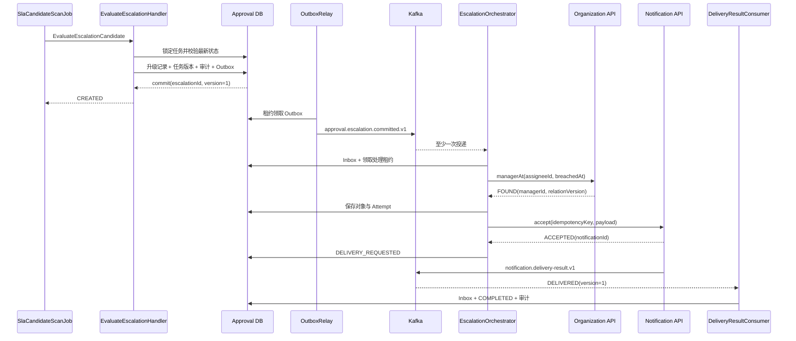
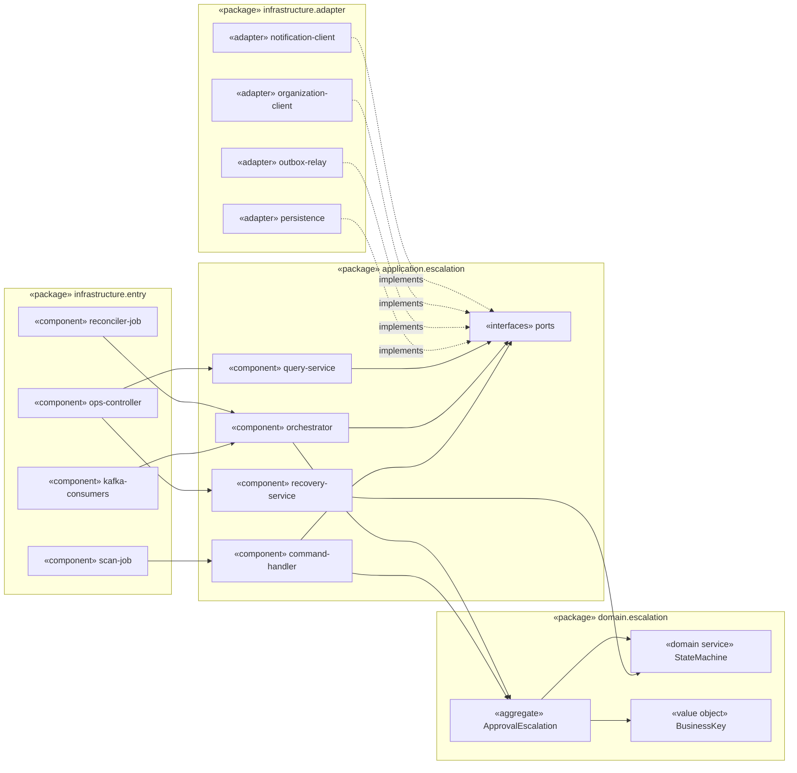
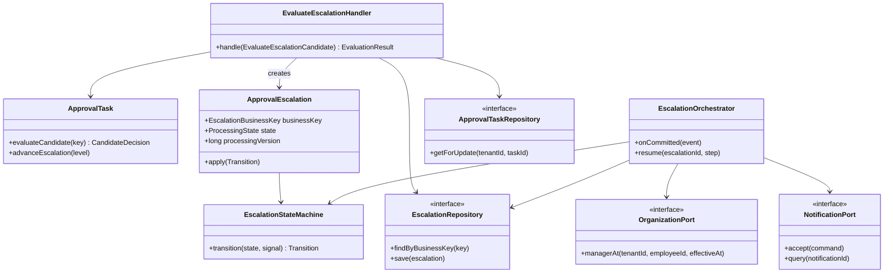
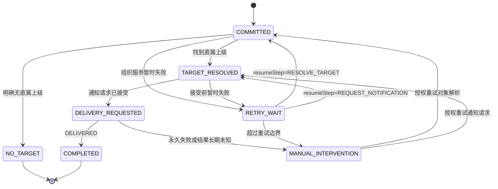
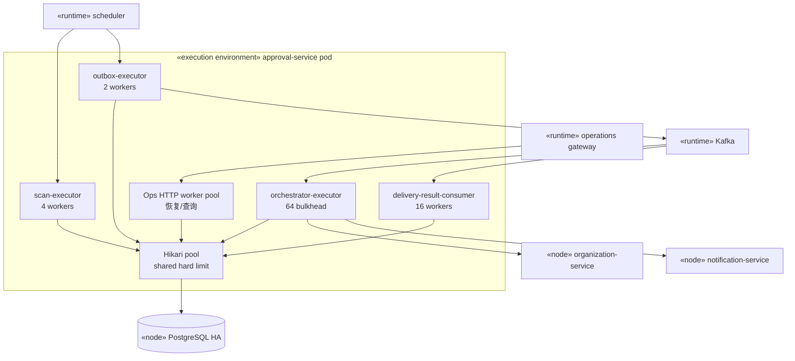
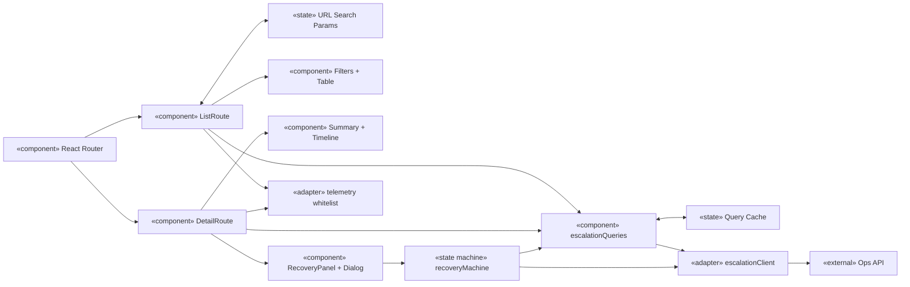
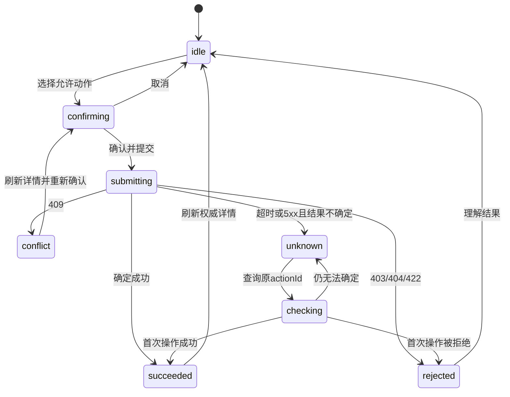

# Implementation Design

> 黄金样例说明：本文与 `business-design.golden.md`、`solution-design.golden.md` 使用同一需求。文中的仓库结构、技术栈和既有代码事实是为 fixture 固化的已验证输入，用于展示“开发人员无需重新设计即可进入 TDD”的实现设计深度，不代表当前插件仓库本身采用这些技术。

## 1. 概述

### 1.1 目的与读者

本文把方案设计中的 SLA 自动升级能力落实为可编码的实现设计，供以下角色评审和执行：

- 后端开发：按实现点修改代码、数据库和运行配置；
- 前端开发：按页面状态、组件职责和 API 契约实现处置工作台；
- 测试开发：直接提取单元、契约、组件和端到端测试；
- 代码评审者：核对实现是否保持系统级不变量；
- SRE 与安全评审者：核对容量、观测、权限、回退和数据保护。

本文不重新决定业务规则、服务所有权、页面信息结构或跨服务一致性策略。发现上游约束不可实现时，必须升级为设计问题，不能在代码中静默改写。

### 1.2 实现范围

| 实现单元 | 类型 | 本次变更 | 不在本单元处理 |
|---|---|---|---|
| `approval-service` | Java 后端服务 | 候选扫描、升级事务、Outbox/Inbox、升级编排、对账、运维查询与恢复 API | 通知渠道投递、浏览器交互 |
| `notification-service` | Java 后端服务 | SLA 模板映射、幂等请求、交付结果事件 | 升级事实判定、组织关系解析 |
| `service-contracts` | 共享契约构建单元 | 升级事件、通知结果事件、组织查询和运维 API Schema | 服务内部实体、数据库模型 |
| `approval-ops-web` | React 前端应用 | 列表、详情、时间线、恢复确认、冲突与未知结果处理 | 业务状态推导、权限最终判定 |

### 1.3 已验证工程事实

| 事实编号 | 工程事实 | 实现影响 |
|---|---|---|
| EF-01 | `approval-service` 使用 Java 21、Spring Boot 3.3、PostgreSQL 16、Flyway 和 Kafka；包根为 `com.acme.approval` | 新代码沿用 Spring 事务和现有模块边界 |
| EF-02 | `approval_task` 已有 `tenant_id`、`task_id`、`state`、`version`、`next_sla_deadline_at`，但扫描器使用 Offset 分页并直接写 `timed_out` | 修改扫描入口并扩展任务投影，不并行保留两套超时写入 |
| EF-03 | 现有 `DomainEventOutboxRepository` 支持同事务写 Outbox，但没有租约领取和发布确认字段 | 复用序列化与 Topic 路由，扩展领取协议 |
| EF-04 | 现有 Kafka 消费基类只保证手工提交 Offset，没有业务 Inbox | 增加事务内 Inbox 去重，不能仅依赖 Kafka Offset |
| EF-05 | `notification-service` 已有 `NotificationRequest` 聚合和渠道重试器，但调用方不能提供幂等键 | 扩展请求端点和唯一存储，保留渠道重试所有权 |
| EF-06 | `approval-ops-web` 使用 React 19、TypeScript、React Router、TanStack Query 和公司 Design System | 不引入第二套状态或组件框架 |
| EF-07 | 运维门户使用 SameSite 会话和网关注入的 CSRF Token；前端构建产物由内部 CDN 托管 | 恢复命令接入既有 CSRF 机制，静态资源按内容哈希发布 |

工程事实来自固定的 `CURRENT-SLA-IMPLEMENTATION-2026Q2` 代码勘查记录。若实际代码与表中任一事实不一致，实现前必须更新本文对应设计。

## 2. 上游设计基线与实现追溯

### 2.1 不可改写的设计结论

1. 审批服务拥有升级事实，通知服务拥有渠道交付状态。
2. 升级记录、任务版本、审计和 Outbox 在同一数据库事务内提交。
3. 业务唯一键为 `(tenantId, taskId, slaPolicyVersion, slaDeadlineAt, escalationLevel)`。
4. 组织关系按 `breachedAt` 查询；不能使用当前时间或当前处理人代替。
5. 通知请求被接受前由审批服务重试；接受后由通知服务负责渠道重试。
6. 消息按至少一次投递设计；重复和乱序不能产生第二次业务效果。
7. 功能开关只停止新候选生产，不停止既有 Outbox、编排和回执消费。
8. 工作台以服务端状态为权威，不乐观显示恢复成功；命令携带 `expectedVersion + actionId`。

### 2.2 功能点到实现点映射

| 方案功能点 | 实现点 | 实现单元 | 主要入口 | 变更类型 |
|---|---|---|---|---|
| FP-01 识别逾期任务 | IMP-APP-01 可重放候选扫描 | `approval-service` | `SlaCandidateScanJob.run()` | 修改 |
| FP-02 创建唯一升级事实 | IMP-APP-02 原子提交升级 | `approval-service` | `EvaluateEscalationHandler.handle()` | 新增、修改 |
| FP-02 发布升级事件 | IMP-APP-03 可靠 Outbox 发布 | `approval-service` | `OutboxRelay.tick()` | 修改 |
| FP-03 解析对象并请求通知 | IMP-APP-04 可恢复升级编排 | `approval-service` | `EscalationCommittedConsumer.onMessage()` | 新增 |
| FP-03 接受并交付通知 | IMP-NOTIFY-01 幂等通知受理 | `notification-service` | `NotificationCommandService.accept()` | 修改 |
| FP-03 同步最终交付结果 | IMP-CONTRACT-01 跨服务契约 | `service-contracts` | Avro / OpenAPI Schema | 新增 |
| FP-04 自动对账与人工恢复 | IMP-APP-05 恢复与运维 API | `approval-service` | `EscalationRecoveryService.execute()` | 新增 |
| FP-04 处置工作台 | IMP-WEB-01 查询与恢复闭环 | `approval-ops-web` | `/operations/escalations/*` | 新增 |

### 2.3 代码变更总览

```text
approval-service
├─ application/escalation
│  ├─ EvaluateEscalationHandler.java              [新增]
│  ├─ EscalationOrchestrator.java                 [新增]
│  ├─ EscalationRecoveryService.java              [新增]
│  └─ port/{OrganizationPort,NotificationPort}.java [新增]
├─ domain/escalation
│  ├─ ApprovalEscalation.java                     [新增]
│  ├─ EscalationStateMachine.java                 [新增]
│  └─ EscalationBusinessKey.java                  [新增]
├─ infrastructure/escalation
│  ├─ SlaCandidateScanJob.java                    [修改]
│  ├─ persistence/*                               [新增]
│  ├─ messaging/*                                 [新增/修改]
│  └─ ops/*                                       [新增]
└─ db/migration/V2026_07_30_01__sla_escalation.sql [新增]

notification-service
├─ application/NotificationCommandService.java    [修改]
├─ domain/NotificationRequest.java                 [修改]
├─ infrastructure/SlaTemplateMapper.java           [新增]
└─ db/migration/V2026_07_30_02__idempotency.sql    [新增]

service-contracts
├─ events/approval.escalation.committed.v1.avsc    [新增]
├─ events/notification.delivery-result.v1.avsc     [新增]
├─ openapi/approval-escalation-ops.v1.openapi.json  [新增]
├─ openapi/notification-command.v1.openapi.json     [修改]
└─ openapi/organization-history.v1.yaml             [修改]

approval-ops-web
└─ src/features/escalations
   ├─ routes/*                                     [新增]
   ├─ components/*                                 [新增]
   ├─ api/*                                        [新增]
   ├─ model/*                                      [新增]
   └─ telemetry/*                                  [新增]
```

删除项：

- 删除 `SlaTimeoutMarker.markTimedOut()` 及扫描器对 `approval_task.timed_out` 的写入；
- 数据库字段 `timed_out` 本版本只停止读写，不立即删除；
- 禁止保留从列表行直接执行恢复操作的旧实验入口。

### 2.4 实现级架构视图索引

本文采用“视图回答问题”，而不是以图数量判断质量。方案设计给出系统级4+1视图，本文把受影响部分细化到可编码边界：

| 实现视图 | 关闭的问题 | 位置 |
|---|---|---|
| 跨单元时序图 | 一次升级如何穿过事务、消息和外部调用 | 3.1 |
| 后端包/组件依赖图 | 入口、应用、领域和适配器如何依赖 | 4.1 |
| 核心类图 | 聚合、状态机、应用服务和端口如何协作 | 4.2 |
| 状态机图 | 哪些信号可以引起哪些状态变化 | 4.7.1 |
| 运行资源拓扑 | 调度、消费、线程池、连接池和外部节点如何部署 | 4.9 |
| 前端组件与数据流图 | 路由、Query、状态机、组件和API如何协作 | 7.2 |
| 前端恢复状态机 | 冲突和未知结果如何保持确定行为 | 7.5 |

## 3. 跨实现单元的目标执行路径

### 3.1 正常路径



### 3.2 事务和幂等边界

| 边界 | 原子写入 | 稳定重复键 | 重放后的结果 |
|---|---|---|---|
| 候选提交 | 任务、升级、审计、Outbox | `EscalationBusinessKey` | 返回首次 `escalationId` |
| Outbox 发布 | 租约/尝试/确认状态 | `eventId` | 可以重复发布同一事件 |
| 升级事件消费 | Inbox、租约、状态版本 | `eventId` | 已处理事件直接确认 |
| 组织查询合并 | 对象、关系版本、Attempt、状态 | `escalationId + stepVersion` | 相同结果不追加第二次状态变化 |
| 通知受理 | 通知请求、首次请求摘要 | `idempotencyKey` | 返回首次 `notificationId` |
| 通知结果消费 | Inbox、状态、Attempt、审计 | `eventId + deliveryVersion` | 重复忽略，旧版本拒绝 |
| 人工恢复 | 操作结果、状态、审计 | `tenantId + actionId` | 返回首次操作结果 |

## 4. 实现单元：`approval-service`

### 4.1 单元上下文与模块边界

领域包不能依赖 Kafka、HTTP Client、Spring Scheduler 或 JPA Entity。应用层编排领域对象和端口，基础设施层实现数据库、消息、HTTP 和调度。所有状态变化都必须调用 `EscalationStateMachine`，消费者、对账和人工恢复不得各自实现状态规则。

下图采用 UML 组件/包依赖语义，以 Mermaid 可渲染形式表示“使用”和“实现”关系：



禁止依赖：`domain` 不引用 Spring/JPA/Kafka/HTTP 类型；`application` 不引用具体 Adapter；入口组件不直接操作 Repository 或数据库 Entity。

### 4.2 核心类型与不变量

```java
public record EscalationBusinessKey(
    TenantId tenantId,
    TaskId taskId,
    SlaPolicyVersion slaPolicyVersion,
    Instant slaDeadlineAt,
    EscalationLevel level
) {}

public record EvaluateEscalationCandidate(
    EscalationBusinessKey key,
    long observedTaskVersion,
    ScanId scanId
) {}

public sealed interface EvaluationResult {
    record Created(EscalationId id, long version) implements EvaluationResult {}
    record Existing(EscalationId id, long version) implements EvaluationResult {}
    record CandidateInvalid(TaskState latestState) implements EvaluationResult {}
    record SnapshotChanged(long latestTaskVersion) implements EvaluationResult {}
}
```

核心协作类图：



类图只展示影响事务和状态正确性的关键协作，不罗列 DTO、配置类和简单 Mapper。Repository、外部端口是应用层接口，JPA 与 HTTP 实现在基础设施层。

领域对象必须持续满足：

- `businessKey` 创建后不可变；
- `processingVersion` 每次有效状态变化加一；
- `COMPLETED`、`NO_TARGET` 不再离开终态；
- `notificationId` 只能在通知服务接受请求后设置，设置后不可替换；
- `targetId` 与 `organizationRelationVersion` 同时为空或同时存在；
- 每次外部调用都有不可变 Attempt；不能覆盖失败历史；
- 外部调用不在数据库事务和处理租约内执行。

### 4.3 物理数据结构

#### 4.3.1 表与索引

```sql
create table approval_escalation (
  tenant_id              varchar(64)  not null,
  escalation_id          uuid         not null,
  task_id                 uuid         not null,
  sla_policy_version      varchar(32)  not null,
  sla_deadline_at         timestamptz  not null,
  escalation_level       smallint     not null,
  processing_state       varchar(32)  not null,
  processing_version     bigint       not null,
  breached_at             timestamptz  not null,
  target_id               varchar(64),
  relation_version        varchar(64),
  notification_id         varchar(64),
  next_attempt_at         timestamptz,
  resume_step             varchar(32),
  lease_owner             varchar(96),
  lease_expires_at        timestamptz,
  created_at              timestamptz  not null,
  updated_at              timestamptz  not null,
  primary key (tenant_id, escalation_id),
  constraint uq_escalation_business
    unique (tenant_id, task_id, sla_policy_version, sla_deadline_at, escalation_level)
);

create index ix_escalation_recovery
  on approval_escalation (processing_state, next_attempt_at, escalation_id)
  where processing_state in ('COMMITTED', 'TARGET_RESOLVED',
                             'DELIVERY_REQUESTED', 'RETRY_WAIT');

create index ix_escalation_ops_list
  on approval_escalation (tenant_id, processing_state, updated_at desc, escalation_id);
```

`approval_task` 增加：

```sql
alter table approval_task
  add column tenant_bucket smallint,
  add column current_escalation_level smallint not null default 0,
  add column next_escalation_level smallint,
  add column sla_policy_version varchar(32);

create index ix_task_sla_seek
  on approval_task
    (tenant_bucket, next_sla_deadline_at, task_id)
  where state = 'PENDING' and next_sla_deadline_at is not null;
```

`tenant_bucket = murmur3(tenant_id) & 255` 在任务创建时计算，已有开放任务由迁移作业分批回填。扫描查询显式带 `tenant_bucket`，不得使用无法命中部分索引的通用 Repository 方法。

#### 4.3.2 Outbox、Inbox 与 Attempt

| 表 | 主键/唯一键 | 关键字段 | 删除或归档 |
|---|---|---|---|
| `domain_event_outbox` | `event_id` | `aggregate_id`、`event_type`、`schema_version`、`payload`、`lease_*`、`published_at`、`attempt_count` | 发布确认且超过 30 天后归档 |
| `consumer_inbox` | `(consumer_name, event_id)` | `received_at`、`processed_at`、`payload_hash` | 超过消息最大重放窗口加 7 天后删除 |
| `escalation_attempt` | `(tenant_id, attempt_id)` | `escalation_id`、`step`、`request_key`、`result_category`、`started_at`、`finished_at` | 与升级审计共同保留 365 天 |
| `escalation_action` | `(tenant_id, action_id)` | `escalation_id`、`expected_version`、`action_type`、`result`、`result_version` | 365 天 |

Inbox 的 `payload_hash` 用于检测同一 `eventId` 携带不同内容。发生冲突时隔离消息并触发安全告警，不能把它当作普通重复。

### 4.4 实现点 IMP-APP-01：可重放候选扫描

#### 4.4.1 当前实现与具体改动

| 当前符号 | 当前行为 | 本次改动 |
|---|---|---|
| `SlaTimeoutScanJob.execute()` | Offset 分页，扫描后直接更新 `timed_out=true` | 改为按 Bucket + Seek 游标产生候选命令 |
| `ApprovalTaskRepository.findTimedOut()` | 加载完整任务实体 | 新增只读取必要字段的 `SlaCandidateProjection` |
| `SlaTimeoutMarker.markTimedOut()` | 无版本条件写任务 | 删除调用；字段进入停止读写阶段 |
| `sla.timeout.scan-lock` | 单个全局锁 | 替换为 256 个 Bucket 短租约 |

#### 4.4.2 查询与批处理算法

```java
interface SlaCandidateQuery {
    List<SlaCandidateProjection> seek(
        int tenantBucket,
        Instant scanUpperBound,
        CandidateCursor after,
        int limit
    );
}

record CandidateCursor(Instant deadlineAt, TaskId taskId) {}
```

单次扫描：

1. 记录不可变 `scanUpperBound = clock.instant()`，本轮所有页面共用。
2. 尝试领取 Bucket 租约，租约 90 秒，每处理一页续租；失去租约立即停止取新页。
3. SQL 按 `(next_sla_deadline_at, task_id)` 升序 Seek，每页最多 500 条。
4. 对每条投影构造命令并提交 Handler；`Created`、`Existing`、`CandidateInvalid` 都属于确定结果。
5. `SnapshotChanged` 和暂时性数据库错误不推进当前记录之后的游标；下轮允许重放整页。
6. 整页全部形成确定结果后，提交新的 Bucket 水位线。

```sql
select tenant_id, task_id, version, sla_policy_version,
       next_sla_deadline_at, next_escalation_level
from approval_task
where tenant_bucket = :bucket
  and state = 'PENDING'
  and next_sla_deadline_at <= :upperBound
  and (next_sla_deadline_at, task_id) > (:afterDeadline, :afterTaskId)
order by next_sla_deadline_at, task_id
limit :limit;
```

背压控制读取 Outbox 未发布数量和数据库写延迟：

| 条件 | 页大小 | 每 Bucket 并发 | 扫描间隔 |
|---|---:|---:|---:|
| 正常 | 500 | 4 | 60 秒 |
| Outbox > 50,000 或写延迟 p95 > 200 ms | 250 | 2 | 60 秒 |
| Outbox > 100,000 或写延迟 p95 > 400 ms | 100 | 1 | 120 秒 |

参数通过类型化配置加载，非法值使应用启动失败；运行时调整必须同时记录审计事件和指标标签版本。

#### 4.4.3 失败与测试行为

| 行为编号 | Given | When | Then |
|---|---|---|---|
| UT-SCAN-01 | 同一页处理后进程在水位提交前崩溃 | 下轮重放 | Handler 返回既有升级，不产生第二条记录 |
| UT-SCAN-02 | 读取候选后任务完成 | 提交命令 | 返回 `CandidateInvalid(COMPLETED)` |
| UT-SCAN-03 | 页面中第 200 条发生暂时数据库错误 | 批处理结束 | 不越过失败记录推进水位 |
| UT-SCAN-04 | Bucket 租约处理期间过期 | 下一页开始 | 停止取页，已提交命令不回滚 |
| UT-SCAN-05 | Outbox 超过 100,000 | 下一调度周期 | 页大小和并发降至保护值 |

### 4.5 实现点 IMP-APP-02：原子提交唯一升级事实

#### 4.5.1 应用入口和事务传播

```java
@Transactional
public EvaluationResult handle(EvaluateEscalationCandidate command) {
    ApprovalTask task = taskRepository.getForUpdate(
        command.key().tenantId(), command.key().taskId());
    return escalationFactory.evaluate(task, command)
        .fold(this::returnRejection, this::persistNewEscalation);
}
```

`getForUpdate` 使用任务行锁并校验租户。它与任务完成、撤回和终止命令使用相同锁顺序：先 `approval_task`，再 `approval_escalation`，避免相反顺序形成死锁。

事务内按顺序执行：

1. 读取最新任务并验证 SLA 快照、级别和截止时间。
2. 若任务已进入冻结终态，返回 `CandidateInvalid`，不写数据。
3. 若快照与候选不同，返回 `SnapshotChanged`，由扫描器重新发现。
4. 查询业务唯一键；存在时返回原 `escalationId`。
5. 创建 `ApprovalEscalation(COMMITTED, version=1)`。
6. 推进任务 `currentEscalationLevel`、计算下一截止时间并增加任务版本。
7. 追加升级审计。
8. 写 `approval.escalation.committed.v1` Outbox。
9. 提交事务后返回 `Created`。

唯一约束冲突表示另一个事务已经提交。捕获约束名 `uq_escalation_business` 后，在新只读事务中按业务键查询并返回 `Existing`；其他约束错误不能归类为重复请求。

#### 4.5.2 状态竞争结果

| 锁定任务时的状态 | 候选是否匹配最新快照 | 结果 | 写入 |
|---|---|---|---|
| `PENDING` | 是 | `Created` 或 `Existing` | 首次请求写四类记录 |
| `PENDING` | 否 | `SnapshotChanged` | 无 |
| `COMPLETED/WITHDRAWN/TERMINATED` | 任意 | `CandidateInvalid` | 无 |
| 未找到或跨租户 | 任意 | `NotFound` | 安全审计，不暴露对象存在性 |

#### 4.5.3 TDD切片

第一组测试只驱动 `EscalationFactory` 的纯领域判定；第二组使用 PostgreSQL Testcontainer 验证任务锁、唯一约束和四类写入原子性；第三组并发执行完成命令和升级命令，验证只能出现以下两种提交序列：

- 完成先提交：任务完成，无升级事实；
- 升级先提交：升级事实保留，任务随后完成。

不存在“任务完成但只写了部分升级记录”或“升级事实因随后完成而被删除”的第三种结果。

### 4.6 实现点 IMP-APP-03：可靠 Outbox 发布

`OutboxRelay.tick()` 每 500 ms 运行，使用 `FOR UPDATE SKIP LOCKED` 领取最多 200 条记录。领取事务只写 `lease_owner`、`lease_expires_at` 和 `attempt_count`，随后释放事务再发布 Kafka。

```text
NEW --领取--> LEASED --Broker ACK--> PUBLISHED
 ^               |
 |               +--超时/进程崩溃--> 租约过期后重新领取
 +--发布失败------+ 
```

- Kafka Key 使用 `tenantId + ":" + escalationId`，只保证同一升级的分区内顺序；
- Producer 启用幂等发送，但业务仍按重复消息设计；
- Broker ACK 后以 `eventId + leaseOwner` 条件更新 `published_at`；
- ACK 成功而确认写入失败时允许重发；
- 单条事件超过 1 MiB 在发布前隔离并告警，正常事件不得包含审批正文。

### 4.7 实现点 IMP-APP-04：可恢复升级编排

#### 4.7.1 状态转换



`EscalationStateMachine.transition(current, signal)` 是唯一状态转换入口。非法转换抛出 `IllegalTransition` 并保留原状态；消费者把它记录为代码缺陷告警，而不是重试外部调用。

#### 4.7.2 消费和端口

```java
interface OrganizationPort {
    ManagerResult managerAt(TenantId tenantId, EmployeeId employeeId,
                            Instant effectiveAt, TraceId traceId);
}

interface NotificationPort {
    AcceptanceResult accept(SlaEscalationNotification command);
    DeliveryQueryResult query(NotificationId notificationId);
}
```

消费流程：

1. 在短事务中插入 Inbox。已存在且 Hash 相同则直接确认；Hash 不同则隔离。
2. 按 `escalationId + processingVersion` 领取 60 秒处理租约。
3. 提交事务后调用当前步骤对应的外部端口，超时均为 2 秒。
4. 新事务重新加载升级并校验租约令牌和版本。
5. 追加 Attempt，调用状态机合并结果，写审计和必要 Outbox。
6. 提交后确认 Kafka Offset；提交前崩溃允许整条消息重放。

组织结果映射：

| 端口结果 | 状态动作 | 是否自动重试 |
|---|---|---|
| `FOUND` 且租户、生效区间、非自环校验通过 | 保存目标与关系版本，进入 `TARGET_RESOLVED` | 否 |
| `NOT_FOUND` | 进入 `NO_TARGET` | 否 |
| `HISTORY_NOT_AVAILABLE` | 进入 `MANUAL_INTERVENTION` | 否 |
| `INVALID_RELATION` | 安全告警并进入 `MANUAL_INTERVENTION` | 否 |
| `THROTTLED/TEMPORARY_FAILURE/TIMEOUT` | 进入 `RETRY_WAIT` | 是 |

通知受理前重试间隔为 1、5、30 分钟，加入 ±20% Jitter；累计 24 小时后进入人工处置。每次重试复用：

```text
idempotencyKey =
  sha256(tenantId | escalationId | targetId | "APPROVAL_SLA_ESCALATION_V1")
```

`ACCEPTED` 和 `ALREADY_ACCEPTED` 都保存首次 `notificationId` 并进入 `DELIVERY_REQUESTED`。返回不同 `notificationId` 或 `IDEMPOTENCY_CONFLICT` 时进入人工处置并触发 P1 数据一致性告警。

#### 4.7.3 通知结果合并

通知结果消费者先以 `eventId` 去重，再比较 `deliveryVersion`：

- 小于或等于已保存版本：忽略状态变化，重复指标加一；
- 大于当前版本：验证允许的通知状态转换后合并；
- `DELIVERED`：升级进入 `COMPLETED`；
- 永久失败：进入 `MANUAL_INTERVENTION`；
- 暂时状态：只更新时间线，不由审批服务重试渠道。

### 4.8 实现点 IMP-APP-05：对账、查询与人工恢复

#### 4.8.1 对账

`EscalationReconciler` 使用与在线消费者相同的状态机和端口。它按 `processing_state + next_attempt_at + escalation_id` Seek，最多领取 100 条，不允许直接执行任意 SQL 状态修复。

| 停滞状态 | 条件 | 恢复动作 |
|---|---|---|
| `COMMITTED` | 五分钟无活动租约 | 重新进入对象解析 |
| `TARGET_RESOLVED` | 五分钟无接受结果 | 用同一幂等键重试 |
| `DELIVERY_REQUESTED` | 24 小时无终态 | 按 `notificationId` 查询通知结果 |
| `RETRY_WAIT` | `nextAttemptAt <= now` | 按 `resumeStep` 恢复 |

#### 4.8.2 运维 API 内部结构

```text
EscalationOpsController
├─ EscalationQueryService
│  ├─ EscalationListQuery
│  └─ EscalationDetailAssembler
└─ EscalationRecoveryService
   ├─ RecoveryAuthorizer
   ├─ EscalationStateMachine
   └─ ActionResultRepository
```

Controller 从认证上下文取得允许租户，不接受客户端扩权。`403` 与不存在对象统一映射为 `404`，响应体使用相同错误码 `RESOURCE_NOT_AVAILABLE`。

恢复命令：

```java
record RecoveryCommand(
    EscalationId escalationId,
    long expectedVersion,
    UUID actionId,
    RecoveryAction action,
    String reason
) {}
```

执行顺序：

1. 校验 CSRF、身份、租户范围和 `escalation:recover` 权限。
2. 以 `(tenantId, actionId)` 查询历史结果；存在则直接返回。
3. 锁定升级记录并比较 `expectedVersion`。
4. 由状态机计算允许动作；不能执行返回 `422 ACTION_NOT_ALLOWED`。
5. 写 `escalation_action=PENDING`、状态变化和审计。
6. 同事务把操作结果更新为 `SUCCEEDED` 并提交。
7. 响应丢失时，客户端按 `actionId` 查询首次结果。

版本不一致返回 `409 VERSION_CONFLICT`，响应携带最新 `version`、`state`、`updatedAt` 和 `allowedActions`，但不自动执行原动作。

#### 4.8.3 查询模型与性能

列表使用专用 SQL Projection，不加载 Attempt 和审计。默认最近 24 小时，最大查询跨度 31 天，每页 50 条，最大 200 条。游标由排序字段和 `escalationId` 组成，经服务端签名后返回，不能被客户端解码为人员信息。

详情分两次内部查询但使用同一个只读事务快照：

1. 升级事实、版本、允许动作和下一自动行为；
2. 最近 200 条时间线、Attempt 与脱敏诊断字段。

任一关键事实查询失败则整个详情失败；仅 Trace 外链生成失败时返回 `diagnosticsAvailable=false`，前端禁用恢复面板。

### 4.9 配置、观测与资源预算

运行资源拓扑把方案设计的物理视图细化到同一审批实例内的执行器、连接预算和消息消费关系：



Pod可以水平扩展，正确性依赖数据库唯一约束、租约和Inbox，不依赖实例内单例。图中的Worker数是默认并发上限，不是固定Pod数量；连接池总预算必须覆盖最坏并发但不能把外部调用持有在数据库连接内。

| 配置项 | 默认值 | 约束 |
|---|---:|---|
| `sla.scan.period` | 60 s | 30–300 s |
| `sla.scan.page-size` | 500 | 50–1000 |
| `sla.scan.bucket-concurrency` | 4 | 1–16 |
| `sla.outbox.batch-size` | 200 | 10–500 |
| `sla.orchestrator.max-concurrency` | 64 | 8–128 |
| `sla.external.timeout` | 2 s | 500 ms–5 s |
| `sla.recovery.max-age` | 24 h | 1–72 h |

独立资源池：

- 扫描器最多使用数据库连接池的 15%；
- Relay 最多 10%；
- Orchestrator 合并事务最多 20%，外部调用使用独立 64 并发 Bulkhead；
- Ops 查询最多 15%，恢复命令与正常审批命令共用事务池但有独立限流器。

必须产生以下低基数指标：

- `sla_candidate_lag_seconds{bucketBand}`；
- `sla_escalation_commit_total{result}`；
- `sla_outbox_oldest_unpublished_seconds`；
- `sla_orchestration_stage_age_seconds{stage}`；
- `sla_external_call_total{dependency,resultCategory}`；
- `sla_recovery_action_total{action,result}`。

日志只记录 `tenantHash`、`escalationId`、状态、Attempt 分类和 Trace ID，不记录审批正文、人员姓名、通知正文或完整组织路径。

### 4.10 迁移、发布与回退

1. 发布契约和数据库 Expand 迁移。
2. 回填 `tenant_bucket`、SLA 策略版本和下一升级级别；每批 5,000 条，数据库延迟超过 200 ms 暂停。
3. 部署能读新字段但关闭候选生产的审批服务。
4. 部署通知服务和新消费者。
5. 验证 Outbox、Inbox、权限、指标和工作台只读查询。
6. 按内部租户、1%、10%、50%、100% 开启候选生产。
7. 一个完整发布周期后停止旧 `timed_out` 读写；字段物理删除另立迁移。

回退只关闭新候选生产。Relay、Orchestrator、通知结果消费者和查询必须继续处理已成立升级；数据库 Expand 结构和新事件消费者在兼容窗口内保留。

## 5. 实现单元：`notification-service`

### 5.1 实现点 IMP-NOTIFY-01：幂等通知受理

#### 5.1.1 当前实现与改动

现有 `NotificationCommandService.accept(request)` 每次生成新 `notificationId`，无法识别调用方重试。本次增加调用方幂等键和请求摘要：

```sql
alter table notification_request
  add column caller varchar(64),
  add column idempotency_key varchar(128),
  add column request_hash char(64);

create unique index uq_notification_idempotency
  on notification_request (tenant_id, caller, idempotency_key);
```

受理算法：

1. 校验调用方服务身份、租户、模板白名单和字段长度。
2. 对规范化请求计算 `requestHash`；不包含 `traceId`。
3. 尝试插入请求和初始渠道任务。
4. 唯一冲突时读取首次记录：
   - Hash 相同：返回 `ALREADY_ACCEPTED` 和首次 `notificationId`；
   - Hash 不同：返回 `IDEMPOTENCY_CONFLICT`，不覆盖首次请求。
5. 提交后由既有渠道重试器投递；审批服务不参与渠道重试。

### 5.2 模板和数据最小化

`SlaTemplateMapper` 只接受契约字段：

| 输入字段 | 模板用途 | 日志策略 |
|---|---|---|
| `displayTaskRef` | 展示受控任务编号 | 仅记录 Hash |
| `breachedAt` | 展示 SLA 违约时间 | 可记录 |
| `level` | 展示升级级别 | 可记录 |
| `approvalRoute` | 生成站内链接 | 只允许相对路由 |
| `recipientId` | 确定接收人 | 不进入业务日志 |

任意 HTML、绝对 URL、脚本协议或未声明模板变量都在受理前拒绝。通知正文不写入审批事件或运行指标。

### 5.3 交付结果

渠道状态每次有效变化使 `deliveryVersion` 加一，并通过本地 Outbox 发布 `notification.delivery-result.v1`。重复发送同一状态不增加版本。事件只使用稳定 `reasonCategory`，供应商原始错误保留在通知服务受限诊断存储。

关键测试：

| 行为编号 | 场景 | 断言 |
|---|---|---|
| UT-NOTIFY-01 | 相同幂等键、相同请求重试 | 返回首次 ID，只存在一条渠道任务 |
| UT-NOTIFY-02 | 相同幂等键、不同接收人 | 返回冲突，不覆盖首次请求 |
| UT-NOTIFY-03 | 渠道重试三次后成功 | 只发布单调版本结果，不重复创建请求 |
| UT-NOTIFY-04 | 绝对 URL 或脚本协议 | 请求被拒绝，无持久化 |
| CT-NOTIFY-01 | 结果事件序列化 | 与 Schema Registry 当前及上一消费者版本兼容 |

## 6. 实现单元：`service-contracts`

### 6.1 实现点 IMP-CONTRACT-01：跨服务契约

共享构建单元只存放跨边界 Schema 和生成配置，不包含 Java 领域对象。服务内部模型通过显式 Mapper 转换，避免契约类型反向控制领域。

#### 6.1.1 升级已提交事件

```json
{
  "eventId": "uuid",
  "eventType": "approval.escalation.committed.v1",
  "occurredAt": "instant",
  "tenantId": "string",
  "escalationId": "uuid",
  "taskId": "uuid",
  "slaPolicyVersion": "string",
  "slaDeadlineAt": "instant",
  "breachedAt": "instant",
  "escalationLevel": "int",
  "taskVersion": "long",
  "traceId": "string"
}
```

`eventId` 标识一次提交事件；`escalationId` 标识业务事实，两者不能互换。事件不包含审批正文、处理人姓名或组织路径。

#### 6.1.2 同步 API 与代码映射

OpenAPI 文件定义外部可见契约，本节只说明契约如何落到代码，避免在文档中复制整份 Schema。

本样例涉及接口变更，因此提供机器可读定义：

- [approval-escalation-ops.v1.openapi.json](implementation-design-assets/contracts/approval-escalation-ops.v1.openapi.json)：新增的工作台查询和恢复API；
- [notification-command.v1.openapi.json](implementation-design-assets/contracts/notification-command.v1.openapi.json)：修改后的通知幂等受理API；
- `organization-history.v1.yaml`：复用组织服务已有契约，不在本实现单元复制。

| API | 接入代码 | 应用入口 | 关键实现责任 |
|---|---|---|---|
| `GET /internal/organization/managers:resolve` | `OrganizationHttpAdapter` | `OrganizationPort.managerAt()` | 2秒超时、结果分类、租户和生效区间复核 |
| `POST /internal/notifications` | `NotificationController` | `NotificationCommandService.accept()` | 请求Hash、幂等唯一约束、首次结果返回 |
| `GET /internal/operations/escalations` | `EscalationOpsController.list()` | `EscalationQueryService.list()` | 授权租户、筛选规范化、签名游标、脱敏Projection |
| `GET /internal/operations/escalations/{id}` | `EscalationOpsController.detail()` | `EscalationQueryService.detail()` | 权威版本、时间线、诊断完整性和允许动作 |
| `POST /internal/operations/escalations/{id}/actions` | `EscalationOpsController.execute()` | `EscalationRecoveryService.execute()` | CSRF、重新授权、`actionId`幂等、版本校验 |
| `GET /internal/operations/escalation-actions/{actionId}` | `EscalationOpsController.actionResult()` | `EscalationRecoveryService.findResult()` | 只返回首次操作的确定结果或`UNKNOWN` |

每个入口通过生成的Contract DTO接收和返回数据，再由显式Mapper转换为应用命令或查询；Controller不能直接传递JPA Entity，也不能自行实现状态判断。

校验分四层落地：OpenAPI生成代码处理类型、格式和长度；Controller处理认证、CSRF与请求大小；应用服务处理租户、权限、状态和版本；数据库唯一约束处理最终并发竞争。前端不得解析自由文本决定行为。

#### 6.1.3 兼容性规则

- 同一主版本只追加有默认值的可选字段；
- 枚举增加值前，消费者必须具备 `UNKNOWN` 分支；
- 字段不能改名、复用或改变时间语义；
- 破坏性变化发布新事件名或 `/v2` API；
- CI 对当前 Schema 与生产登记版本执行向后兼容检查；
- 生成代码的变更必须随契约源文件一起评审，禁止手改生成物。

## 7. 实现单元：`approval-ops-web`

### 7.1 工程事实与设计边界

工作台复用运维门户外壳、认证会话、Design System、错误边界和遥测 SDK。Solution Design 的低保真页面、信息优先级与状态矩阵是正式输入；本节只决定组件、客户端状态、数据访问、焦点、可访问性和构建实现。

不得：

- 在客户端根据 Attempt 或日志推导业务状态；
- 把 `allowedActions` 当作最终授权；
- 将升级详情、人员标识、通知标识或原因写入 URL、Local Storage、日志或埋点；
- 在请求返回确定结果前显示成功；
- 因实现方便把版本冲突与结果未知合并成通用失败。

### 7.2 目标代码结构与职责

```text
src/features/escalations
├─ routes
│  ├─ EscalationListRoute.tsx
│  ├─ EscalationDetailRoute.tsx
│  └─ escalationRouteSchema.ts
├─ components
│  ├─ EscalationFilters.tsx
│  ├─ EscalationTable.tsx
│  ├─ EscalationSummary.tsx
│  ├─ EscalationTimeline.tsx
│  ├─ RecoveryPanel.tsx
│  ├─ RecoveryConfirmDialog.tsx
│  ├─ VersionConflictNotice.tsx
│  └─ UnknownResultNotice.tsx
├─ api
│  ├─ escalationClient.ts
│  ├─ escalationQueries.ts
│  └─ escalationErrors.ts
├─ model
│  ├─ escalationView.ts
│  ├─ recoveryMachine.ts
│  └─ redaction.ts
└─ telemetry/escalationTelemetry.ts
```

路由组件只负责 URL 解析、Query 组合和页面级错误边界；展示组件不直接发请求；恢复状态集中在 `recoveryMachine`，不能分散在对话框、按钮和 Toast 中。

前端组件与数据流：



权威业务状态只沿 `Ops API → Client → Query Cache → Route/Component` 单向进入页面。恢复动作沿 `RecoveryUI → recoveryMachine → Client` 提交，确定结果产生后由状态机使详情Query失效；展示组件不能绕过状态机直接调用API。

### 7.3 API 类型与运行时校验

```ts
type EscalationState =
  | "COMMITTED"
  | "TARGET_RESOLVED"
  | "DELIVERY_REQUESTED"
  | "RETRY_WAIT"
  | "MANUAL_INTERVENTION"
  | "NO_TARGET"
  | "COMPLETED"
  | "UNKNOWN";

interface EscalationDetail {
  escalationId: string;
  displayTaskRef: string;
  state: EscalationState;
  version: number;
  updatedAt: string;
  timeline: TimelineItem[];
  nextAutomaticAction?: NextAction;
  allowedActions: RecoveryAction[];
  diagnosticsAvailable: boolean;
}
```

OpenAPI 生成静态类型；网络边界再使用生成的运行时 Schema 校验。未知枚举映射为 `UNKNOWN`，页面展示“当前版本无法识别此状态”并禁用恢复，不得崩溃或猜测终态。

### 7.4 路由、查询与客户端状态

| 状态 | 所有者 | 保存位置 | 失效条件 |
|---|---|---|---|
| 筛选、排序、游标 | 路由 | URL Search Params | 用户修改或离开 Feature |
| 列表与详情快照 | 服务端 | TanStack Query 内存缓存 | 30 秒、窗口聚焦、恢复完成、权限变化 |
| 当前选中项 | 路由 | Path Param | 返回列表 |
| 操作原因 | 组件 | 页面内存 | 取消、成功、关闭详情 |
| `actionId`、提交阶段 | `recoveryMachine` | 页面内存 | 取得确定结果后 |
| 身份与租户范围 | 门户/服务端 | 不复制 | 会话或权限变化 |

列表 Query Key 使用服务端规范化后的非敏感筛选。筛选变化时取消旧请求，并用单调 `requestSequence` 防止不支持取消的旧响应覆盖新结果。

详情 Query 使用：

```ts
{
  staleTime: 30_000,
  gcTime: 5 * 60_000,
  refetchOnWindowFocus: true,
  retry: (count, error) => error.kind === "temporary" && count < 2
}
```

`401` 不自动重试；恢复命令不由 Query Library 自动重试，避免生成新的 `actionId`。

### 7.5 恢复操作状态机



`actionId` 在进入 `confirming` 时生成，在 `submitting → unknown → checking` 全程保持不变。版本冲突后，旧动作结束；用户基于新详情再次确认时生成新的 `actionId`。

### 7.6 组件交互与页面状态

#### 7.6.1 列表

- `EscalationFilters` 使用语义化 form 元素，提交后一次性更新 URL，避免每次按键发请求；
- `EscalationTable` 行本身不作为唯一交互入口，首列提供可聚焦详情链接；
- 状态由图标、文本和辅助说明共同表达，不只使用颜色；
- 分页使用“上一页/下一页”和服务端游标，不展示虚假的总页数；
- 空结果保留筛选摘要，并区分“没有匹配记录”与无权限页面。

#### 7.6.2 详情和时间线

- 主标题包含脱敏任务编号和升级级别；
- `EscalationSummary` 首屏展示状态、停滞时长、当前恢复责任和下一自动动作；
- `EscalationTimeline` 按服务端顺序渲染，Attempt 诊断默认折叠；
- `RecoveryPanel` 只有在详情、时间线和诊断可用时才允许操作；
- Trace 链接由服务端返回受控地址，使用新窗口打开并标明行为。

#### 7.6.3 错误映射

| API 结果 | 组件行为 | 焦点与播报 |
|---|---|---|
| `INVALID_FILTER` | 保留其他筛选，标记对应字段 | 焦点到第一个错误字段并关联说明 |
| `AUTH_REQUIRED` | 进入统一认证，返回后重新查询 | 页面标题说明会话已过期 |
| `RESOURCE_NOT_AVAILABLE` | 使用统一无权限/不可见页面 | 不播报对象标识 |
| `VERSION_CONFLICT` | 保留原因，关闭忙碌态，刷新详情 | 焦点到冲突标题；Live Region 播报状态已变化 |
| `ACTION_NOT_ALLOWED` | 展示稳定原因并刷新允许动作 | 焦点到恢复面板错误摘要 |
| `THROTTLED` | 显示可重试时间 | 倒计时不每秒播报 |
| 超时/`5xx` | 进入结果未知，不显示成功 Toast | 焦点到“尚未确认操作结果” |

### 7.7 可访问性与响应式实现

- 页面使用一个 h1 标题，区域标题保持层级连续；
- 加载状态使用 `aria-busy`，不把 Skeleton 逐项暴露给读屏；
- 状态变化通过受控 `aria-live="polite"` 区域播报一次；
- 确认框打开后焦点进入标题，关闭后回到触发按钮；
- 冲突或未知结果出现时焦点移到对应标题，不自动触发操作；
- 表格在 200% 缩放下允许横向滚动，首列和操作入口不被裁剪；
- 视口小于 1024 px 时详情改为“摘要 → 时间线 → 恢复面板”单列，不改变信息顺序；
- Design System 无满足语义的组件时，先补齐组件库能力，不在 Feature 内复制不可访问控件。

### 7.8 安全、遥测与构建

安全：

- API Client 自动附加网关提供的 CSRF Token；Token 不进入日志；
- 所有服务端文本按纯文本渲染，禁止 `dangerouslySetInnerHTML`；
- CSP 为 `default-src 'self'`，脚本使用构建 Hash，不允许内联脚本；
- URL 只允许状态、时间、排序、游标和脱敏任务编号；
- 复制诊断信息前调用 `redaction.ts` 白名单序列化。

遥测只记录：

```text
route, loadOutcome, stateCategory, actionType, resultCategory,
durationBucket, frontendVersion, correlationId
```

不记录 `tenantId`、`escalationId`、人员标识、通知标识、原因和 API 响应体。

构建：

- `/operations/escalations` 使用路由级动态加载；
- Feature Chunk gzip 预算 180 KiB，超出时 CI 失败；
- 静态资源文件名包含内容 Hash，HTML 入口 `no-cache`；
- CDN 同时保留当前和上一稳定版本；
- API 主版本不兼容时页面保持只读并隐藏恢复面板。

### 7.9 前端 TDD 与验证

| 层级 | 关键测试 |
|---|---|
| 纯函数 | URL 规范化、错误映射、状态文案、脱敏、未知枚举 |
| 状态机 | 成功、冲突、拒绝、未知结果查询；验证 `actionId` 生命周期 |
| 组件 | 加载、空、局部失败、无权限、时间线、恢复面板禁用条件 |
| 契约 | OpenAPI 当前和上一兼容版本；运行时 Schema 拒绝畸形响应 |
| 浏览器 E2E | 告警深链、筛选返回、确认、重复点击、409、超时后查询原操作 |
| 可访问性 | axe 自动扫描；键盘、读屏、200% 缩放人工流程 |
| 性能 | 正常公司网络列表/详情可交互 p95 ≤ 2 秒 |

组件测试必须断言“未知结果不出现成功样式或成功文案”，不能只断言请求函数被调用。

## 8. 跨单元失败行为

| 故障 | 代码检测点 | 状态/数据结果 | 恢复所有者 |
|---|---|---|---|
| 扫描进程崩溃 | Bucket 租约过期 | 当前页重放，无重复升级 | `approval-service` |
| 升级事务回滚 | 事务异常指标 | 四类写入均不存在 | 下一扫描周期 |
| Broker ACK 后确认失败 | Outbox 租约过期 | 同一事件重发 | Relay + Inbox |
| 组织服务超时 | `OrganizationPort` 分类 | `RETRY_WAIT` + Attempt | Orchestrator |
| 通知请求响应丢失 | 同一幂等键重试 | 返回首次 Notification ID | 两服务共同契约 |
| 通知结果乱序 | `deliveryVersion` 比较 | 旧结果不覆盖新状态 | 审批消费者 |
| 工作台详情局部失败 | Detail Assembler 标志 | 可读但禁用恢复 | 用户重试查询 |
| 恢复响应丢失 | `actionId` 结果查询 | 显示确定结果或保持未知 | 前端 + Ops API |
| 新前端调用旧 API | 契约版本探测 | 只读，恢复入口隐藏 | 前端发布回退 |

## 9. 开发实施与 TDD 交接

### 9.1 垂直切片顺序

| 切片 | 首个失败测试 | 最小实现 | 完成标准 |
|---|---|---|---|
| VS-01 唯一升级事实 | 并发候选只产生一条升级 | 领域判定、表、事务 Handler | 重复、竞态、回滚集成测试通过 |
| VS-02 可重放扫描 | 页重放不丢不重 | Seek 查询、Bucket 租约、背压 | 峰值数据扫描容量达标 |
| VS-03 可靠事件 | ACK 丢失后重发仍只处理一次 | Outbox Relay、Inbox | 故障注入演练通过 |
| VS-04 对象解析 | 按 `breachedAt` 得到历史上级 | 状态机、组织端口、重试 | 结果分类和超时测试通过 |
| VS-05 通知闭环 | 响应丢失不产生第二请求 | 幂等受理、结果事件 | 契约及乱序测试通过 |
| VS-06 运维只读 | 授权人员可解释停滞状态 | Query API、列表与详情 | 权限、脱敏、性能通过 |
| VS-07 安全恢复 | 冲突和未知结果不误报成功 | Recovery API、前端状态机 | E2E 与可访问性通过 |

每个切片必须同时提交生产代码、自动化测试、Schema/迁移和必要观测；不得先批量建立空类，再把行为推迟到最后。

### 9.2 文件级交接

开发任务不能仅引用章节标题。每个任务至少携带：

- 实现点编号和上游功能点；
- 明确的新增、修改、删除文件；
- 首个失败测试及完成标准；
- 需要保持的不变量；
- 依赖的 Schema 或数据库迁移；
- 可独立回退或必须共同发布的边界。

### 9.3 评审阻断条件

出现以下任一情况不得进入编码或合并：

- 需要开发人员自行决定业务唯一键、状态转换或事务边界；
- 仅列出类名、技术名词或设计模式，没有说明调用和数据如何变化；
- 前端只描述页面组件，没有定义加载、冲突、未知结果和焦点行为；
- 重试未标明责任方、稳定键、次数边界和最终出口；
- 数据变更没有索引、唯一约束、迁移和回退路径；
- 测试只能验证“方法被调用”，不能证明业务结果和副作用；
- 新实现改变上游不可改写结论但没有升级评审。

## 10. 开放事项

本文没有尚未关闭的实现阻断项。以下数值允许在性能验证后调整，但不得改变语义：

- Bucket 数量、批次和并发；
- 连接池与线程池具体大小；
- 前端 Chunk 预算；
- Retry Jitter 的具体随机分布。

调整必须附容量或性能证据，并同步配置约束、告警阈值和测试基线。

## 11. 参考资料

- `business-design.golden.md`：业务规则、参与者、UCD 研究与业务概念原型；
- `solution-design.golden.md`：4+1 架构视图、系统责任、接口、状态、低保真页面和质量属性；
- `REQ-SLA-BASELINE-1.0`：已批准需求及验收标准；
- `CURRENT-SLA-IMPLEMENTATION-2026Q2`：既有代码、数据库和运行事实勘查；
- `UCD-SLA-001`：用户研究、故障处置 walkthrough 和原型评审；
- 事件平台 Schema Registry、至少一次投递和 Topic ACL 规范；
- 公司 Design System、WCAG 2.2 AA、安全编码和前端遥测规范。
