# 审批任务 SLA 自动升级方案设计

## 1. 概述

### 1.1 目的与范围

本文档设计审批任务超过 SLA 后的自动升级能力，覆盖逾期候选识别、升级事实创建、上级责任人解析、通知交付、异常恢复、处置工作台和审计追踪。设计结果作为审批服务、通知服务、运维前端的 Implementation Design，以及交互细化、Test Design、上线实施和生产运维的输入。

本次范围包括：

- 对处于可升级状态且超过 SLA 截止时间的审批任务进行周期性识别；
- 在审批服务内创建全局可追踪且业务上唯一的升级事实；
- 按任务发生 SLA 违约时的组织关系解析升级接收人；
- 可靠请求通知服务完成交付，并持续跟踪最终结果；
- 为重复扫描、状态竞态、依赖失败、消息重放和滚动升级定义确定行为；
- 建立查询、指标、告警、对账和面向授权运维人员的处置工作台。

本次不包含：

- SLA 规则配置界面和审批流程建模能力重构；
- 组织架构维护、代理关系和跨组织升级策略；
- 短信、邮件、站内信等通知渠道内部的路由和供应商选择；
- 审批服务内部类、方法、物理 DDL 和逐文件实现步骤。

### 1.2 系统定位与目标读者

审批服务是审批任务状态和升级事实的权威所有者；组织服务是人员上下级关系的权威所有者；通知服务是渠道投递过程和投递结果的权威所有者。自动升级能力协调三个既有系统，但不改变它们的数据所有权。

目标读者包括方案架构师、审批与通知模块设计人员、前端与交互设计人员、开发、测试、SRE、安全与可访问性评审人员和变更审批人员。读者应能仅依赖本文档理解目标态如何运行、关键机制为何成立，以及下游不得改变的系统级约束。

### 1.3 方案摘要

方案把处理过程分为两个边界：

1. **事务内建立业务事实**：审批服务重新校验任务最新状态，在同一数据库事务内创建唯一升级记录、推进任务升级级别、写入审计记录和 Outbox 事件。
2. **事务外完成可恢复副作用**：升级编排器消费事件，按违约时间解析直属上级，向通知服务提交幂等通知请求，并根据交付结果结束、重试或转人工处置。

调度扫描只产生候选，不直接认定升级成功；通知失败不回滚已经成立的升级事实。通过稳定业务键、乐观并发控制、事务 Outbox、消费 Inbox、通知幂等键、单一重试责任和对账任务保证重复执行与故障恢复。

## 2. 特性需求概述

### 2.1 确认的需求基线

本黄金样例使用以下已确认需求作为设计输入：

| 需求编号 | 需求内容 | 验收结果 |
|---|---|---|
| REQ-SLA-001 | 可升级审批任务超过任务创建时固化的 SLA 截止时间后，应在五分钟内被识别 | 正常负载下，99% 的逾期任务在截止时间后五分钟内形成候选 |
| REQ-SLA-002 | 同一任务、SLA 策略版本、升级级别和截止时间只能形成一个有效升级事实 | 重复扫描和并发提交不产生第二个升级记录 |
| REQ-SLA-003 | 升级事实创建前任务已完成、撤回或终止时不得升级；创建后任务完成不能删除历史升级事实 | 竞态场景具有唯一、可审计的最终结果 |
| REQ-SLA-004 | 升级对象是 SLA 违约发生时任务当前处理人的直属上级 | 组织关系查询使用 `breachedAt` 作为生效时间 |
| REQ-SLA-005 | 通知最终必须进入“已送达、无需通知或人工处置”之一，不允许永久停留在未知状态 | 所有未完成状态都有自动恢复或人工出口 |
| REQ-SLA-006 | 全链路保持租户隔离，不在事件、日志和指标中泄露审批正文或无关组织信息 | 跨租户访问被拒绝，敏感信息符合最小化原则 |
| REQ-SLA-007 | 能够在不停机滚动升级期间安全启用和回退 | 新旧实例共存时不产生重复升级或不可消费事件 |
| REQ-SLA-008 | 授权运维人员能够在处置工作台定位停滞升级、理解处理时间线，并安全执行允许的恢复动作 | 列表、详情、异常状态和高危操作均有确定交互；越权、版本冲突和未知提交结果不会产生误导性成功反馈 |
| NFR-SLA-001 | 规模基线为 120 万活跃任务，峰值五分钟内 3 万个 SLA 违约；故障恢复时允许五倍瞬时消费压力 | 扫描、事件发布和消费容量通过基线与五倍恢复压力验证 |
| NFR-SLA-002 | 健康依赖条件下，95% 的升级在违约后五分钟内进入通知服务，99% 在十分钟内进入 | 指标可直接计算端到端延迟并用于 SLO 告警 |
| NFR-SLA-003 | 升级审计保留 365 天，运行日志不保存审批正文和通知正文 | 保留、脱敏和删除策略通过安全检查 |
| NFR-SLA-004 | 处置工作台在公司支持的桌面浏览器中可由键盘和读屏软件完成查询、理解状态及恢复操作 | 核心流程满足 WCAG 2.2 AA；正常网络下列表和详情可交互时间 p95 不超过 2 秒 |

### 2.2 需求功能点清单

| 功能点 | 关联需求 | 主要变更类型 | 设计目标与边界 | 详细设计位置 |
|---|---|---|---|---|
| FP-01 识别逾期审批任务 | REQ-SLA-001、NFR-SLA-001 | 修改 | 从“写超时标志”调整为可重复、可限流的候选识别，不认定升级事实 | 4.3.1 |
| FP-02 创建唯一升级事实 | REQ-SLA-002、REQ-SLA-003、REQ-SLA-007 | 新增、修改 | 原子创建升级记录、任务状态、审计和待发布事件，关闭并发竞态 | 4.3.2 |
| FP-03 解析升级对象并请求通知 | REQ-SLA-004、REQ-SLA-005、REQ-SLA-006 | 新增 | 按违约时间解析直属上级，幂等请求通知并跟踪结果 | 4.3.3 |
| FP-04 监控、对账与人工恢复 | REQ-SLA-005、REQ-SLA-008、NFR-SLA-002、NFR-SLA-003、NFR-SLA-004 | 新增 | 发现停滞状态，自动恢复或由授权人员通过处置工作台安全处置 | 4.3.4 |

### 2.3 功能点关系

FP-01 可以重复产生同一任务的候选请求。FP-02 是升级是否成立的唯一判定点，只有它成功提交后才能进入 FP-03。FP-03 负责外部副作用，不得反向修改升级是否成立。FP-04 观察前三个功能点产生的状态和事件，只能恢复既有升级处理，不能绕过 FP-02 创建新的升级事实。

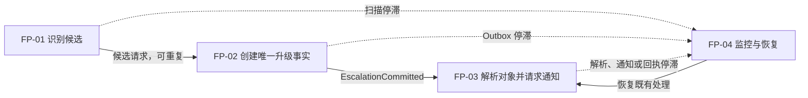

### 2.4 设计约束与前提

- 审批任务创建时已经固化 `slaPolicyVersion`、各升级级别的 `slaDeadlineAt` 和初始升级级别；运行中修改 SLA 策略不追溯改变既有任务。
- 审批服务已有不可变的任务处理人变更历史，能够按时间点确定当时生效的处理人；如果该历史不完整，本特性不得以任务当前处理人代替。
- 审批数据库支持本地 ACID 事务、唯一约束和乐观版本字段。
- 现有消息平台提供至少一次投递，不承诺全局有序。
- 组织服务支持按 `employeeId + effectiveAt` 查询直属上级，并返回关系版本；如果该能力尚未上线，它是本特性的阻断依赖。
- 通知服务支持调用方提供幂等键，并异步发布最终交付结果。
- 所有跨服务调用都携带服务身份、租户标识、Trace ID 和调用来源。

## 3. 需求场景与影响分析

### 3.1 核心场景

| 场景 | 触发与前置条件 | 预期结果 |
|---|---|---|
| S-01 正常升级 | 任务处于 `PENDING`，超过 SLA，存在有效直属上级，依赖健康 | 创建一次升级事实，通知请求被接受，最终记录送达 |
| S-02 重复扫描 | 多个扫描实例或重跑批次命中同一任务 | 所有请求返回同一 `escalationId`，只有一个有效升级事实 |
| S-03 完成竞态 | 扫描发现逾期后，任务与升级命令并发完成 | 先提交者决定结果；完成先提交则不升级，升级先提交则保留升级审计 |
| S-04 无升级对象 | 违约时间点没有直属上级 | 升级进入 `NO_TARGET`，记录依据，不猜测或跨层级查找其他人员 |
| S-05 组织服务暂时失败 | 查询超时、限流或返回暂时错误 | 进入受控重试，不重复创建升级或通知 |
| S-06 通知服务暂时失败 | 请求未被通知服务接受 | 由升级编排器重试同一幂等请求 |
| S-07 通知渠道失败 | 通知服务已接受，但渠道投递失败 | 通知服务按渠道策略恢复并发布最终结果；审批侧不同时重试渠道 |
| S-08 消息重复或乱序 | 事件总线重复投递、旧回执晚到 | Inbox 和状态版本拒绝重复或过期状态变化 |
| S-09 滚动升级 | 新旧审批实例和消费者同时运行 | 旧版本忽略可选字段，新消费者先部署，生产开关后开启 |
| S-10 人工恢复冲突 | 运维人员打开详情后，自动恢复或另一操作者先推进状态 | 页面不覆盖新状态，提示数据已变化并刷新允许操作，原操作不产生第二次业务效果 |

### 3.2 当前系统与问题

当前审批服务包含 `approval_task` 任务表和周期扫描任务。扫描器按 `slaDeadlineAt` 找出超时任务后直接写入 `timedOut=true`，没有独立升级实体，也不产生可靠领域事件。

当前机制存在以下问题：

- 扫描批次重跑会重复命中同一任务，`timedOut` 无法区分不同升级级别和 SLA 周期；
- 扫描读取与写入之间没有重新校验任务版本，可能与完成或撤回操作竞态；
- 没有“升级事实”与“通知副作用”的边界，无法证明业务状态和通知请求一致；
- 通知由人工或临时代码触发，没有稳定幂等键和最终状态；
- 组织查询只记录调用结果，不保留关系生效时间和关系版本，事后难以解释通知对象；
- 无法查询某次升级停在哪个步骤，也没有统一对账和恢复入口。
- 没有处置工作台；运维人员必须在日志、数据库查询和临时脚本之间切换，无法从一个受控入口判断当前状态、允许操作和提交结果。

当前态关系如下：

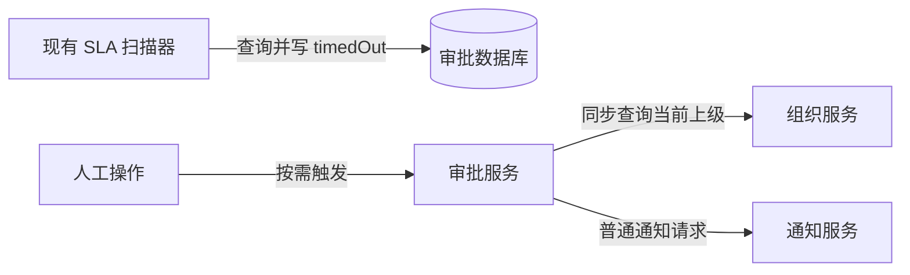

### 3.3 影响范围

| 对象 | 当前状态 | 本次变化 | 保持不变 |
|---|---|---|---|
| 审批服务 | 扫描器直接写超时标志 | 新增候选扫描、升级领域处理、Outbox、升级编排、查询与恢复能力 | 审批任务仍由审批服务拥有 |
| 审批数据库 | 只有任务超时信息 | 新增升级记录、处理尝试、Inbox/Outbox 和索引 | 与审批状态同库事务边界不变 |
| 组织服务 | 提供组织查询 | 扩展或确认按生效时间查询契约，调用量增加 | 组织关系所有权不变 |
| 通知服务 | 支持普通通知 | 新增 SLA 升级通知类型、幂等请求和交付结果事件 | 渠道路由和供应商管理不变 |
| 消息平台 | 传递既有业务事件 | 新增升级已提交和通知结果主题 | 至少一次投递语义不变 |
| 运维体系 | 无升级专项监控 | 新增延迟、积压、重试、终态和人工处置监控 | 现有日志、指标和 Trace 平台不变 |
| 运维前端 | 没有升级处置界面 | 在既有内部运维门户新增升级列表、详情、时间线和受控恢复操作 | 沿用门户登录、租户授权、导航外壳和设计系统 |

### 3.4 方案比较

| 方案 | 一致性 | 可用性影响 | 恢复能力 | 主要代价 | 结论 |
|---|---|---|---|---|---|
| 审批事务内同步查询组织并发送通知 | 业务状态与外部副作用无法原子提交 | 组织或通知故障直接扩大审批事务 | 调用超时后的结果不确定 | 实现表面简单，运行风险高 | 不采用 |
| 提交升级后由独立任务扫描未通知记录 | 升级事实可一致，但轮询状态与恢复语义需要自建 | 外部依赖不影响审批事务 | 可恢复，但延迟和重复处理控制复杂 | 增加数据库扫描压力 | 不采用 |
| 本地事务 Outbox + 异步编排 | 升级事实与待发布事件原子一致 | 外部依赖与审批事务隔离 | 支持重放、对账和确定状态 | 增加 Outbox、Inbox 和运维成本 | 采用 |

## 4. 特性/功能实现原理

### 4.1 总体方案

#### 4.1.1 目标态架构

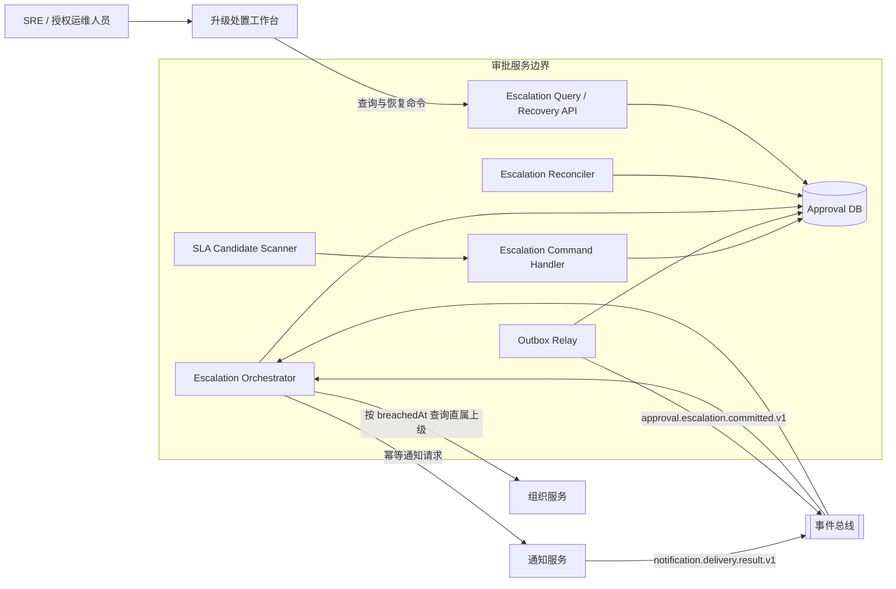

#### 4.1.2 组件职责

| 组件 | 责任 | 明确不承担 |
|---|---|---|
| SLA Candidate Scanner | 分片、分页发现可能逾期的任务；按背压信号控制扫描速度 | 不改变升级状态，不查询组织，不发送通知 |
| Escalation Command Handler | 重新校验任务；原子创建升级事实、任务变化、审计和 Outbox | 不等待外部服务，不判断通知是否成功 |
| Outbox Relay | 发布已提交且尚未确认的 Outbox；维护发布租约和结果 | 不改变升级业务状态 |
| Escalation Orchestrator | 消费升级事件；解析对象；请求通知；处理通知结果；推进处理状态 | 不创建第二个升级事实，不修改组织数据 |
| Escalation Reconciler | 发现超时未推进、发布停滞和回执缺失；触发同一业务动作恢复 | 不绕过幂等约束，不直接伪造完成结果 |
| Query / Recovery API | 提供查询、重试、终止重试和人工确认入口 | 不允许删除升级历史或更改业务唯一键 |
| 升级处置工作台 | 提供列表、详情、时间线、状态解释和受控恢复交互；只展示服务端允许的动作 | 不在客户端推导权限或业务终态，不直接访问数据库 |
| 组织服务 | 按指定生效时间解析直属上级并返回关系版本 | 不管理审批升级状态 |
| 通知服务 | 接受幂等通知请求，执行渠道投递，发布最终结果 | 不决定是否应该发生升级 |

#### 4.1.3 核心处理原则

- **候选与事实分离**：扫描结果允许重复和过期，只有 Command Handler 在最新任务状态上提交的升级记录才是业务事实。
- **事实与副作用分离**：升级事实不依赖组织和通知服务可用；通知失败不会撤销已发生的 SLA 违约。
- **单一所有者**：审批服务拥有升级处理状态，通知服务拥有渠道交付状态，双方通过带版本的事件同步结果。
- **重试责任唯一**：通知请求被接受前由升级编排器重试；接受后由通知服务负责渠道重试，审批侧只等待结果或对账。
- **可重复执行**：扫描、命令、事件消费、通知请求、对账和人工恢复都使用稳定标识，重复执行不产生新的业务效果。

### 4.2 4+1 架构视图

#### 4.2.1 场景视图

核心场景由四个阶段组成：

1. 扫描器发现 `state=PENDING` 且 `slaDeadlineAt <= now` 的候选任务。
2. Command Handler 基于最新任务版本决定创建、返回既有升级或拒绝候选。
3. 编排器基于升级事件解析违约时点的直属上级，并提交幂等通知。
4. 通知结果事件或无目标结论使升级进入终态；异常由重试、对账或授权人员在处置工作台完成受控恢复。

正常、重复扫描、完成竞态、依赖失败等场景的具体行为分别在 4.3 对应功能点中定义。任何场景都不得绕过 FP-02 直接进入通知。

#### 4.2.2 逻辑视图

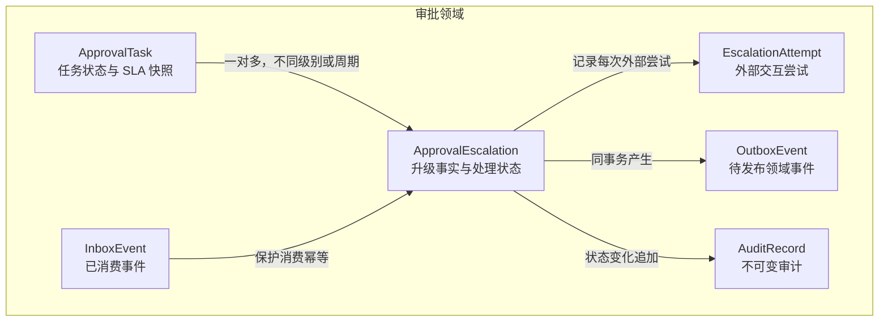

`ApprovalTask` 保存任务状态、当前处理人、SLA 快照和当前升级级别。`ApprovalEscalation` 表示一次已经成立的业务升级，并独立记录后续通知处理状态。升级状态不能反向决定任务是否完成；任务完成也不能删除升级历史。

处置工作台不保存第二份升级状态。列表筛选、分页游标和当前选中项属于客户端导航状态；升级事实、时间线、允许操作和状态版本均由 Query / Recovery API 提供。页面每次执行恢复动作前都使用详情返回的最新 `expectedVersion`，客户端显示状态不能成为操作授权依据。

#### 4.2.3 进程视图

扫描器、Outbox Relay 和升级编排器均可多实例运行：

- 扫描器使用稳定分片和 Seek 分页，不依赖单实例互斥；
- FP-02 依靠数据库事务、任务版本和升级唯一键解决并发，而不是依赖扫描器去重；
- Relay 使用短租约领取 Outbox，同一事件可能重复发布；
- 编排器使用 `eventId` Inbox 和 `escalationVersion` 拒绝重复或过期事件；
- 每个升级在同一时刻只允许一个有效处理租约，租约过期后可以被其他实例恢复；
- 外部调用不持有数据库事务和处理租约，调用结果通过幂等键重新合并。

#### 4.2.4 开发视图

| 代码仓/构建单元 | 新增或受影响的服务级组件 | 依赖方向 |
|---|---|---|
| `approval-service` | `sla-scanner`、`escalation-domain`、`outbox-relay`、`escalation-orchestrator`、`escalation-ops` | 领域组件不依赖通知或组织客户端实现；编排组件通过端口调用外部服务 |
| `approval-ops-web` | 升级列表页、详情与时间线、恢复操作面板、API Client、前端监控 | 页面依赖稳定运维 API 和既有设计系统；不依赖审批服务内部实体或数据库模型 |
| `notification-service` | SLA 通知模板适配、幂等请求处理、交付结果事件发布 | 渠道适配层依赖通知领域，不反向依赖审批模型 |
| `service-contracts` | 升级事件、通知结果事件和组织查询契约 | 只包含稳定跨服务契约，不包含服务内部实体 |

Implementation Design 可以调整服务内部模块命名，但不得合并升级事实与通知交付所有权，也不得把组织、通知调用放回审批事务。

#### 4.2.5 物理视图

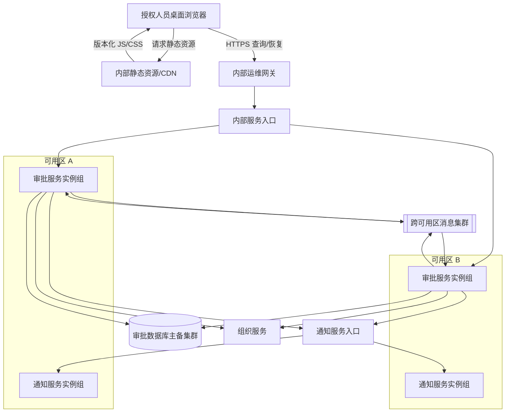

扫描、Relay 和编排器与审批服务共同部署，但使用独立线程池、连接池预算和并发配额。处置工作台作为既有内部运维门户的独立前端构建单元发布到内部静态资源平台，通过运维网关访问 Ops API，不获得数据库或服务网络直连。任一可用区失效时，另一可用区可以继续扫描、消费和提供运维查询；业务正确性不依赖实例或浏览器本地状态。数据库和消息集群沿用既有跨可用区高可用能力。

### 4.3 功能点设计

#### 4.3.1 FP-01 识别逾期审批任务

##### 关联需求与设计目标

关联 REQ-SLA-001 和 NFR-SLA-001。目标是在峰值规模下及时发现候选，同时保证扫描可重跑、可水平扩展，并且不会因为候选过期或重复而改变业务状态。

##### 当前设计

现有扫描器以时间范围分页查询任务并直接设置 `timedOut=true`。分页使用 Offset，任务状态变化会导致页漂移；多实例通过粗粒度分布式锁互斥，锁失效后可能重叠扫描。扫描更新没有携带读取到的任务版本，因此不能明确处理完成竞态。

##### 本次变更

- 将扫描器输出从“超时状态写入”改为内部 `EvaluateEscalationCandidate` 命令；
- 使用 `(tenantBucket, slaDeadlineAt, taskId)` Seek 游标分页；
- 允许多个实例按固定 `tenantBucket` 分片并行扫描；
- 删除扫描器对任务状态的直接更新和全局分布式锁；
- 保持扫描只读取必要字段，不加载审批正文。

##### 目标态设计

扫描周期为一分钟。每个实例领取若干 `tenantBucket` 的短租约，按以下步骤执行：

1. 按任务上的 `nextSlaDeadlineAt` 投影读取水位线之后、截止时间不晚于 `scanUpperBound` 且状态可能升级的任务，单批最多 500 条。投影只用于高效发现候选，最终规则以任务的 SLA 分级快照为准。
2. 为每条候选构造命令：

   | 字段 | 语义 |
   |---|---|
   | `tenantId` | 任务所属租户，参与所有后续授权和唯一性判断 |
   | `taskId` | 审批任务稳定标识 |
   | `observedVersion` | 扫描时看到的任务版本，仅用于诊断和快速识别变化 |
   | `slaPolicyVersion` | 任务创建时固化的 SLA 策略版本 |
   | `slaDeadlineAt` | 当前下一升级级别快照中的稳定截止时间 |
   | `escalationLevel` | 本次需要建立的升级级别 |
   | `scanId` | 扫描批次标识，只用于追踪，不参与业务唯一性 |

3. 将命令提交给本服务内的 Command Handler。命令可以同步批量提交，但每个候选独立返回业务结果。
4. 只有当整页命令均被接受处理或形成确定业务结果后，才推进 Seek 水位线。进程崩溃导致整页重放，由 FP-02 保证无重复业务效果。
5. 当 Outbox 未发布积压超过 10 万或数据库写入延迟超过容量基线两倍时，扫描器将批次降为 100、并发降为正常值的 25%；恢复后逐级放量。

扫描器不会因为一次候选被拒绝而把任务永久排除。任务仍处于可升级状态但因版本变化被拒绝时，下一周期可以再次产生候选。

##### 设计影响、约束与风险

审批任务需要支持按 `(tenantBucket, state, nextSlaDeadlineAt, taskId)` 稳定 Seek 查询。Implementation Design 负责确定物理索引、SLA 快照与查询投影的一致更新方式，以及租约实现。Test Design 必须覆盖跨页状态变化、租约失效、页重放、超大租户和背压恢复。

残余风险是单个超大租户在一个 Bucket 内形成热点。首期通过租户哈希后的 256 个 Bucket 和单租户并发上限控制；容量测试不满足目标时再提高 Bucket 数，不在首期引入动态分片。

#### 4.3.2 FP-02 创建唯一升级事实

##### 关联需求与设计目标

关联 REQ-SLA-002、REQ-SLA-003 和 REQ-SLA-007。目标是基于任务最新状态对候选作唯一判定，并保证任务变化、升级记录、审计记录和待发布事件原子一致。

##### 当前设计

当前只有任务上的 `timedOut` 标志，没有升级业务标识、升级级别、处理状态或稳定事件。任务完成和扫描写超时标志分别更新任务，没有针对同一版本的明确竞态规则。

##### 本次变更

- 新增 `ApprovalEscalation` 逻辑实体；
- 在 `ApprovalTask` 上增加当前升级级别和版本化状态变化；
- 新增不可变升级审计和 Outbox 事件；
- 使用任务版本关闭完成、撤回与升级的并发竞态；
- 使用业务唯一键关闭重复扫描和并发升级。

##### 目标态设计

业务唯一键定义为：

```text
(tenantId, taskId, slaPolicyVersion, slaDeadlineAt, escalationLevel)
```

它表达“某租户任务在某次固化 SLA 截止时间下进入某一级升级”，不使用 `scanId`、请求时间或消费者实例等运行标识。

Command Handler 在一个本地数据库事务内执行：

1. 按 `tenantId + taskId` 读取任务，并验证租户、SLA 快照和升级级别与命令一致。
2. 根据最新状态、任务处理人变更历史和 SLA 策略快照判定：
   - `COMPLETED`、`WITHDRAWN`、`TERMINATED`：返回 `CANDIDATE_INVALID`，不写任何记录；
   - `slaDeadlineAt > databaseNow`：返回 `NOT_DUE`；
   - 命令中的升级级别不是任务当前级别之后的下一个应升级级别：返回 `LEVEL_NOT_READY`；
   - 已存在同一业务唯一键：返回既有 `escalationId` 和 `ALREADY_COMMITTED`；
   - 已经进入更高级别：返回对应既有升级和 `SUPERSEDED_BY_HIGHER_LEVEL`；
   - 其他可升级状态：继续创建。
3. 将 `breachedAt` 固定为本级 `slaDeadlineAt`，从处理人变更历史解析该时间点生效的 `assigneeIdAtBreach`。如果历史缺口导致无法唯一确定处理人，返回 `ASSIGNEE_HISTORY_MISSING` 并触发数据质量告警，不猜测当前处理人。
4. 使用“冲突时不写入”的原子插入语义创建初始状态为 `COMMITTED`、版本为 1 的升级记录。业务唯一键已存在时查询并返回既有升级，不依赖会使整个事务进入失败状态的异常后继续执行。
5. 以任务当前版本为条件，把 `currentEscalationLevel` 推进到本级，根据不可变 SLA 快照更新 `nextEscalationLevel` 和 `nextSlaDeadlineAt` 投影，并增加任务版本。没有后续等级时将下一等级和截止时间置空。更新行数为 0 表示任务并发变化，整个事务回滚并重新读取一次：
   - 如果重新读取后为终态，返回 `CANDIDATE_INVALID`；
   - 如果已存在同一升级，返回 `ALREADY_COMMITTED`；
   - 否则返回 `CONCURRENT_MODIFICATION`，等待下一扫描周期重试。
6. 追加 `ESCALATION_COMMITTED` 审计记录，包含任务版本、SLA 快照、违约时间、违约时处理人和业务唯一键。
7. 写入 `approval.escalation.committed.v1` Outbox，事件 ID 在首次事务中生成并保持稳定。
8. 提交事务后返回 `escalationId`、`eventId` 和业务结果。

事务内不调用组织或通知服务。升级记录、任务级别、审计和 Outbox 任意一项失败都会整体回滚。

并发结果如下：

| 并发场景 | 决胜机制 | 最终结果 |
|---|---|---|
| 两个扫描实例同时提交同一候选 | 升级业务唯一约束 | 一个创建，另一个返回同一升级 |
| 任务完成先于升级提交 | 任务状态与版本校验 | 候选失效，不创建升级 |
| 升级先于任务完成提交 | 升级事务先推进任务版本 | 升级保留；完成操作基于新版本继续完成任务 |
| 相邻两个升级级别同时提交 | 任务版本和“只能提交下一应升级级别”规则 | 低级先提交；高级请求最初返回 `LEVEL_NOT_READY`，低级提交后由后续扫描重新判断高级是否到期 |
| 数据库提交结果对调用方未知 | 业务唯一键重新查询 | 重试返回已提交结果，不创建第二条记录 |

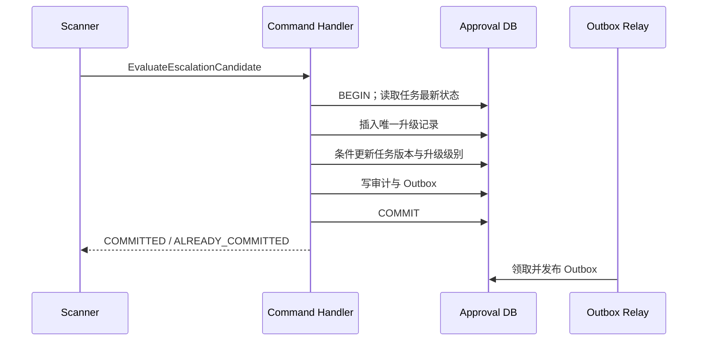

##### 设计影响、约束与风险

任务完成、撤回等既有写路径必须继续使用任务版本，不能绕过并发控制。所有读取升级结果的接口必须把“升级已成立”和“通知已完成”作为两个不同状态呈现。

数据库唯一约束是最终正确性保障，应用层预查询只用于减少冲突。Implementation Design 不得以分布式锁替代唯一约束，也不得把 Outbox 写入移动到事务提交之后。

#### 4.3.3 FP-03 解析升级对象并请求通知

##### 关联需求与设计目标

关联 REQ-SLA-004、REQ-SLA-005 和 REQ-SLA-006。目标是基于违约时点确定升级对象，保证通知请求可重复执行，并使每种依赖结果都进入确定处理状态。

##### 当前设计

现有人工通知使用任务当前处理人同步查询“现在的直属上级”。组织变化后无法说明历史通知对象，调用超时也无法判断是否已经发送。普通通知没有针对升级业务的稳定幂等键和交付结果回传。

##### 本次变更

- 使用 `breachedAt` 查询当时生效的直属上级；
- 新增升级编排状态和外部交互尝试记录；
- 定义通知幂等键、通知接受结果和交付结果事件；
- 明确组织查询、通知接受和渠道交付的重试责任。

##### 目标态设计

###### A. 消费升级事件

编排器消费 `approval.escalation.committed.v1`：

1. 在本地事务内尝试插入 `InboxEvent(eventId)`；已存在则确认消息并结束。
2. 校验事件租户、Schema 版本和对应升级记录。
3. 只有升级处于 `COMMITTED` 且事件版本不旧于当前版本时，领取处理租约。
4. 提交本地事务后开始组织查询，外部调用期间不持有数据库事务。

Inbox 表示消息已经被可靠接纳，不表示对应业务步骤已经完成。重复消息可以确认并结束，因为升级记录中的处理状态、处理租约和 Reconciler 共同负责继续推进；即使消费者在写 Inbox 后崩溃，租约到期后也会从 `COMMITTED` 状态恢复。

###### B. 解析违约时点的直属上级

组织查询请求包含：

| 字段 | 设计语义 |
|---|---|
| `tenantId` | 限定组织边界 |
| `employeeId` | 违约发生时任务处理人 |
| `effectiveAt` | 升级记录中的 `breachedAt` |
| `relationType` | 固定为 `DIRECT_MANAGER` |
| `requestId` | 本次外部尝试标识，用于追踪 |

返回 `managerId`、`relationshipVersion` 和 `effectiveRange`。编排器验证返回租户一致、管理者不等于本人且关系在 `breachedAt` 生效。

- 找到合法直属上级：把升级推进到 `TARGET_RESOLVED`，保存 `managerId`、关系版本和查询证据；
- 明确无直属上级：推进到终态 `NO_TARGET`，不自动越级寻找更高管理者；
- 关系循环或跨租户结果：视为不可重试数据错误，进入 `MANUAL_INTERVENTION` 并触发安全告警；
- 超时、限流和 5xx：进入 `RETRY_WAIT`，按第 7 章策略恢复。

###### C. 请求通知

通知幂等键定义为：

```text
sla-escalation/{tenantId}/{escalationId}/{managerId}/primary
```

通知请求包含模板标识、租户、目标人员、任务显示标识、升级级别、违约时间和审批页面受控链接，不包含审批正文。请求结果分为：

- `ACCEPTED(notificationId)`：通知服务取得后续渠道重试责任，升级进入 `DELIVERY_REQUESTED`；
- `ALREADY_ACCEPTED(notificationId)`：与成功等价；
- `REJECTED_INVALID`：契约或目标不可处理，进入人工处置；
- 超时、限流、5xx：审批编排器使用同一幂等键重试，不能生成新请求。

###### D. 处理交付结果

通知服务发布 `notification.delivery.result.v1`。编排器使用事件 Inbox 去重，并以 `notificationId + deliveryVersion` 保证状态单调：

- `DELIVERED`：升级进入终态 `COMPLETED`；
- `PERMANENT_FAILURE`：进入 `MANUAL_INTERVENTION`，记录渠道错误分类；
- `RETRYING`：只更新可观察信息，不在审批侧发起第二套渠道重试；
- 低于已处理 `deliveryVersion` 的晚到事件：记录乱序指标并忽略。

完整正常时序如下：

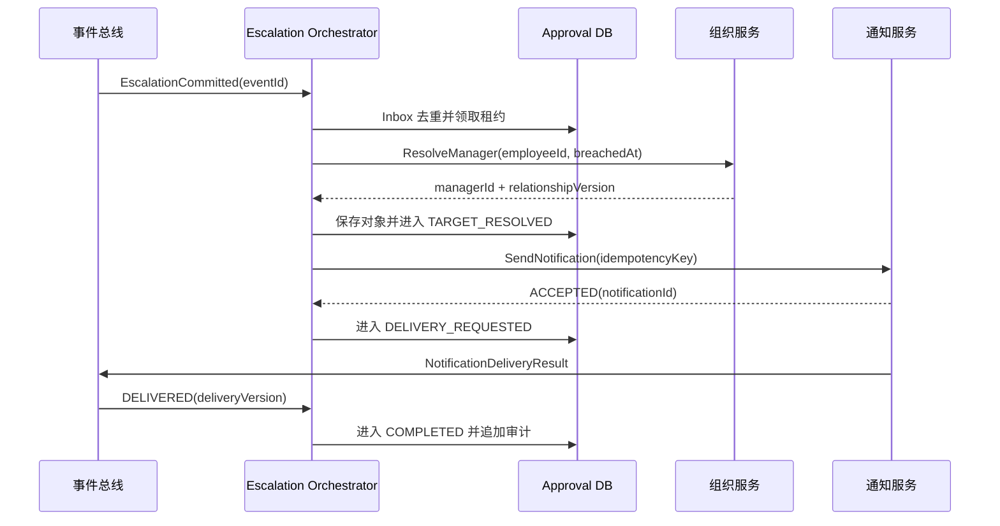

升级处理状态机如下：

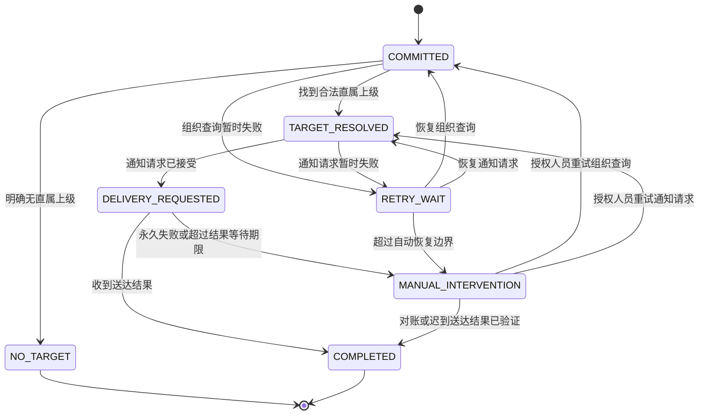

`RETRY_WAIT` 同时保存 `resumeStep`，确保恢复到失败前的确定步骤，而不是重新创建升级事实。

##### 设计影响、约束与风险

组织关系按历史生效时间查询是本方案成立的前提。组织服务无法提供该语义时，不能退化为“查询当前上级”后静默上线，必须回到方案决策。

审批侧和通知侧不得同时对渠道投递重试。通知被接受后的最终结果等待上限为 24 小时；超过后进入人工处置，但迟到的合法送达结果仍可把同一记录从人工处置更新为完成，并追加“迟到回执”审计。

#### 4.3.4 FP-04 监控、对账与人工恢复

##### 关联需求与设计目标

关联 REQ-SLA-005、NFR-SLA-002 和 NFR-SLA-003。目标是让每个非终态升级都能被定位、解释和恢复，避免依赖人工改库或重新创建业务事件。

##### 当前设计

当前系统只能通过普通日志搜索超时任务，没有升级处理状态、停滞检测、统一查询或安全恢复入口。运维门户没有相关页面；操作者需要手工拼接日志和数据库查询，既看不到完整时间线，也无法判断某项恢复操作是否仍然有效。

##### 本次变更

- 新增按处理状态和下一恢复时间查询的对账能力；
- 新增只恢复既有步骤的运维接口；
- 在既有内部运维门户新增升级处置工作台，承载列表、详情、状态时间线和恢复操作；
- 新增升级时间线、关联 Trace 和全量审计；
- 禁止人工删除、修改业务唯一键或直接伪造送达结果。

##### 目标态设计

Reconciler 每分钟检查以下对象：

| 检查对象 | 停滞条件 | 自动动作 | 超过边界后的动作 |
|---|---|---|---|
| Outbox | 已提交两分钟仍未发布确认 | 释放过期租约并重新发布 | 十分钟仍积压触发 P1 告警 |
| `COMMITTED` | 五分钟未完成对象解析且无活动租约 | 重新进入组织查询 | 累计 24 小时转人工处置 |
| `TARGET_RESOLVED` | 五分钟未取得通知接受结果 | 使用同一幂等键重试 | 累计 24 小时转人工处置 |
| `DELIVERY_REQUESTED` | 24 小时没有终态结果 | 向通知服务按 `notificationId` 对账 | 对账仍未知时转人工处置 |
| `RETRY_WAIT` | `nextAttemptAt` 已到且无活动租约 | 按 `resumeStep` 恢复 | 达到步骤重试上限后转人工处置 |

**用户、入口与导航**

处置工作台只面向公司内部桌面浏览器。具有 `escalation:read` 权限的 SRE 和租户运维人员可以从运维门户“审批运行状态 → SLA 升级”进入列表；具有 `escalation:recover` 权限的人员才可能看到恢复动作。租户范围来自登录身份和服务端授权结果，URL 中的租户参数只用于请求目标，不能扩大权限。

列表路由为 `/operations/escalations`，筛选条件同步到 URL，便于在同一权限范围内分享和返回；详情使用 `/operations/escalations/{escalationId}`。页面返回列表时恢复筛选和游标位置，但不在 URL、浏览器存储或埋点中保存人员标识、通知标识和操作原因。

**UCD 依据与可用性目标**

本黄金样例假定正式输入 `UCD-SLA-001` 已完成 4 名 SRE、4 名租户运维人员的情境访谈，以及 3 次历史升级故障处置 walkthrough。研究覆盖告警触发后的定位、状态解释、责任判断和恢复操作，不把研发人员的系统模型直接当成用户心智模型。

| 研究发现 | 设计响应 |
|---|---|
| 操作者通常从告警进入，首先判断“影响哪个租户、停在哪一步、系统还会不会自动恢复” | 列表优先展示租户允许范围、停滞阶段、停滞时长和下一自动动作，不把内部事件 ID 作为首要信息 |
| 现有处置平均需要切换日志、Trace 和数据库查询，时间线难以拼接 | 详情以业务事实摘要和按时间排序的统一时间线为主体，诊断标识按需展开 |
| 操作者最担心在自动恢复刚成功后再次发起高危操作 | 恢复动作放在详情右侧独立区域，提交时使用 `expectedVersion`，冲突后必须刷新并重新确认 |
| 值班人员会使用键盘操作并在高缩放比例下查看页面 | 核心流程必须支持键盘、200% 缩放和读屏状态播报，不使用仅颜色区分状态 |

本轮设计的可用性目标为：

- 操作者从 P1 告警进入后，三分钟内能够找到目标升级、说出停滞阶段、当前恢复责任和下一自动动作；
- 未执行过系统开发的租户运维人员能够根据页面解释 `MANUAL_INTERVENTION` 与“业务失败”的区别；
- 任何参与者都不能在版本冲突或请求结果未知时误判恢复成功；
- 仅使用键盘和读屏软件可以完成筛选、查看时间线、打开确认框、理解错误并安全退出。

用户旅程如下：

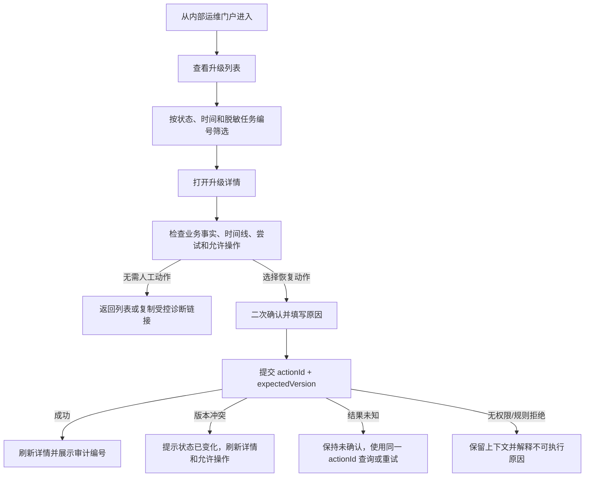

**关键页面线框图**

页面地图保持“列表 → 详情 → 恢复确认/结果”的单向主线；告警深链接可以直接进入详情，但仍通过同一权限检查和状态加载。以下低保真线框图是本 Draft 的评审快照，确定信息结构、操作位置和视觉优先级，不确定最终颜色、字体尺寸和 Design Token。

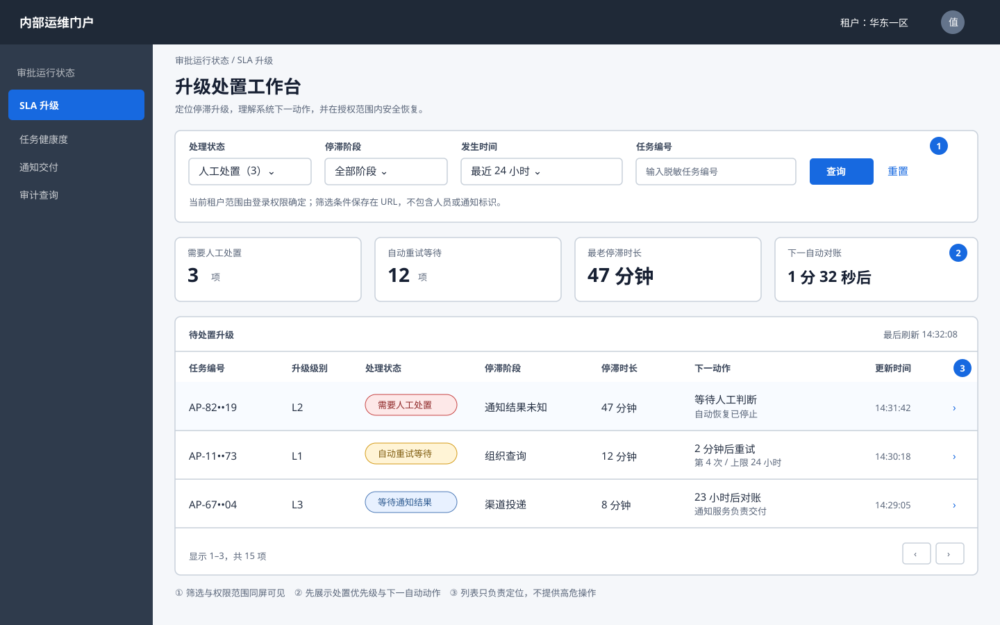

列表页将筛选、总体状态和待处置记录放在同一工作面；行点击进入详情，高危恢复动作不出现在列表中，避免操作者在上下文不足时直接执行。

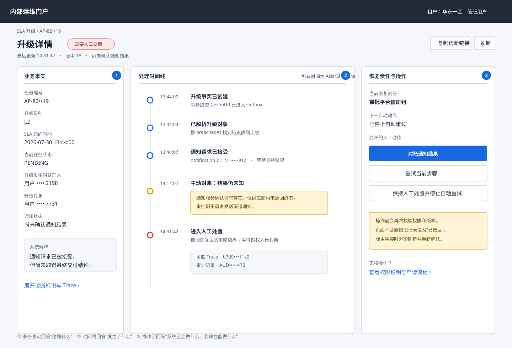

详情页左侧固定业务事实，中部以时间线解释发生了什么，右侧集中呈现自动恢复信息和服务端允许的人工动作。诊断标识折叠在次要区域，不与业务状态竞争视觉优先级。

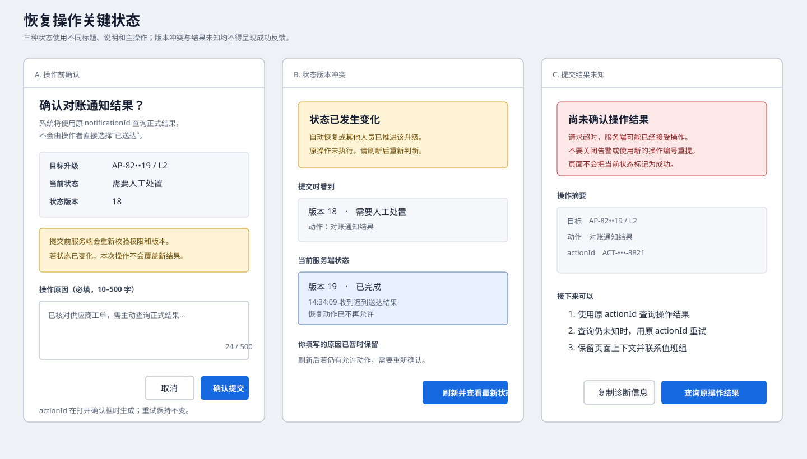

确认框明确对象、当前版本、动作影响和原因；版本冲突与结果未知使用不同标题、说明和主操作，均不显示成功图标或成功文案。

第一轮 walkthrough 曾把“重试当前步骤”放在列表行内，3/8 名参与者在没有查看时间线时就尝试操作，因此该入口被删除。第二轮原型评审中，8/8 名参与者能够定位目标升级，7/8 能在三分钟内正确解释停滞阶段；1 名参与者把“通知结果未知”理解为“通知失败”，因此最终稿将状态文案改为“尚未确认通知结果”，并增加下一自动对账时间。读屏和 200% 缩放仍需在可交互原型完成后验证，属于上线前阻断证据，不在本 Draft 中宣称已经通过。

**页面信息结构**

| 页面/区域 | 展示内容 | 数据来源与交互责任 |
|---|---|---|
| 列表筛选区 | 状态、停滞阶段、发生时间、租户允许范围、脱敏任务编号 | URL 保存非敏感筛选；服务端校验筛选范围并返回规范化条件 |
| 升级列表 | 脱敏任务编号、升级级别、处理状态、停滞时长、下一动作、最后更新时间 | 使用游标分页；切页或重新筛选取消旧请求，旧响应不得覆盖新结果 |
| 业务事实摘要 | 业务唯一键摘要、任务当前状态与违约时状态、升级对象、通知结果 | 详情 API 是权威来源；敏感标识按字段权限脱敏 |
| 状态时间线 | 升级状态变化、Attempt 分类结果、自动与人工动作、关联 Trace | 按服务端序列显示；页面不根据日志自行推导业务状态 |
| 恢复操作面板 | 当前恢复责任、下一自动动作和 `allowedActions` | 服务端返回允许动作；客户端仍在提交时携带状态版本，由服务端再次授权和校验 |
| 诊断信息 | Outbox、Inbox、消息、通知标识和脱敏审计 | 仅具有诊断字段权限的角色可展开；复制操作自动脱敏 |

**界面状态与反馈**

| 状态 | 页面表现 | 用户可执行动作 |
|---|---|---|
| 初始加载 | 保留页面骨架并声明“正在加载升级信息”，焦点不跳到占位区域 | 可以返回门户，不能执行恢复 |
| 空结果 | 显示当前筛选条件和“没有匹配记录”，区分无数据与无权限 | 修改或清除筛选 |
| 正常详情 | 展示服务端版本、最后更新时间、完整时间线和允许动作 | 根据权限和 `allowedActions` 查看或发起操作 |
| 局部数据失败 | 如果诊断 Trace 加载失败，业务事实和时间线仍可阅读，但恢复面板禁用并说明原因 | 重试加载；不得在信息不完整时恢复 |
| 无权限 | 显示无权限页面，不透露对象是否存在、租户、任务或人员信息 | 返回门户或申请权限 |
| 数据已变化 | 收到版本冲突后保留操作者填写的原因，醒目提示自动恢复或其他人员已推进状态 | 刷新详情后重新确认；不得自动重放旧动作 |
| 命令提交中 | 确认按钮进入忙碌状态并禁止重复点击，页面离开前提示结果可能未知 | 等待；不得显示乐观成功 |
| 提交结果未知 | 显示“尚未确认操作结果”和 `actionId` 的受控摘要 | 使用同一 `actionId` 查询结果或重试，不生成新动作 |
| 技术失败 | 保留筛选和非敏感表单内容，错误焦点移到摘要并关联具体字段或操作 | 按错误类型重试；认证失效时重新登录 |

**状态所有权与恢复操作**

升级记录、时间线、版本和 `allowedActions` 始终由服务端拥有。URL 只保存状态、时间范围、排序和游标等非敏感导航状态；查询缓存有效期为 30 秒，窗口重新获得焦点或恢复动作结束后强制刷新。操作原因只保存在当前页面内存中，成功、取消或关闭详情后清除，不写入 Local Storage。

人工恢复操作包括“重试当前步骤”“终止自动重试并保持人工处置”“确认外部已完成后发起正式对账”。执行流程为：

1. 页面使用详情返回的 `allowedActions` 呈现动作，但不把它作为最终授权。
2. 操作者选择动作后，确认对话框展示升级标识、当前状态、动作影响和不可逆边界；原因必填，长度 10—500 个字符。
3. 打开确认框时生成 `actionId`，确认时同时提交 `expectedVersion`。提交期间禁用按钮；网络重试和结果查询复用同一 `actionId`。
4. 服务端再次校验身份、租户、权限、状态版本和动作前置条件。成功后页面刷新权威详情并展示审计编号。
5. `409 VERSION_CONFLICT` 不覆盖新状态，页面保留原因、刷新详情并要求重新确认；`403` 不透露对象信息；`422 ACTION_NOT_ALLOWED` 展示服务端稳定原因分类；超时或 `5xx` 进入“结果未知”，不得显示成功。

所有恢复操作复用原 `escalationId`、事件和通知幂等键。页面不提供“直接置为已送达”、删除升级、编辑业务唯一键或任意状态跳转。

##### 设计影响、约束与风险

对账任务必须与在线消费使用相同状态转换服务，不能形成第二套状态规则。人工操作入口属于高危能力，不能通过通用数据库管理工具替代。Implementation Design 可以在既有设计系统内选择具体组件和像素布局，但不得改变页面状态矩阵、服务端权威状态、无乐观成功、版本冲突和结果未知语义。

## 5. 接口与集成设计

### 5.1 集成关系与责任

| 交互 | 调用方 | 提供方 | 模式 | 正确性责任 |
|---|---|---|---|---|
| 候选评估 | SLA Scanner | Escalation Command Handler | 服务内命令 | Handler 重新校验最新任务 |
| 升级事件发布 | Outbox Relay | 事件总线 | 异步、至少一次 | 审批侧保证可重发，消费方保证幂等 |
| 历史上级解析 | Escalation Orchestrator | 组织服务 | 同步查询 | 组织服务保证历史关系语义，审批侧验证租户和生效区间 |
| 通知请求 | Escalation Orchestrator | 通知服务 | 同步接受、异步交付 | 接受前审批侧重试，接受后通知侧重试 |
| 交付结果 | 通知服务 | 事件总线/审批服务 | 异步、至少一次 | 通知侧保证版本单调，审批侧去重和拒绝旧版本 |
| 运维查询与恢复 | 升级处置工作台 | Query / Recovery API | 浏览器经内部网关同步调用 | 服务端拥有权限、状态和动作判定；客户端负责明确呈现加载、冲突和结果未知 |

### 5.2 升级已提交事件

事件名：`approval.escalation.committed.v1`

| 字段 | 必填 | 语义与约束 |
|---|---|---|
| `eventId` | 是 | 全局唯一，Outbox 重发保持不变 |
| `occurredAt` | 是 | 升级事务提交使用的数据库时间 |
| `tenantId` | 是 | 消费、查询和授权边界 |
| `escalationId` | 是 | 升级事实稳定标识 |
| `escalationVersion` | 是 | 初始为 1，用于拒绝过期事件 |
| `taskId` | 是 | 审批任务稳定标识 |
| `assigneeIdAtBreach` | 是 | 违约发生时任务处理人 |
| `slaPolicyVersion` | 是 | 任务固化的策略版本 |
| `slaDeadlineAt` | 是 | 本次升级业务唯一键组成部分 |
| `breachedAt` | 是 | 固定等于本级 `slaDeadlineAt`，是处理人和组织历史关系查询时间 |
| `escalationLevel` | 是 | 本次升级级别 |
| `traceId` | 是 | 跨异步边界重新建立 Trace |

事件不包含审批标题、正文、表单字段、组织路径或通知内容。

### 5.3 组织关系查询契约

`ResolveDirectManager(tenantId, employeeId, effectiveAt)` 返回以下业务结果：

| 结果 | 含义 | 审批侧处理 |
|---|---|---|
| `FOUND` | 找到在 `effectiveAt` 生效的直属上级 | 验证租户、生效区间和非自环后保存 |
| `NOT_FOUND` | 该时间点明确不存在直属上级 | 进入 `NO_TARGET` |
| `HISTORY_NOT_AVAILABLE` | 组织服务无法覆盖该历史时间 | 不可重试，进入人工处置 |
| `INVALID_RELATION` | 关系循环、跨租户或数据损坏 | 安全告警并进入人工处置 |
| `THROTTLED`、`TEMPORARY_FAILURE` | 暂时不可用 | 按可靠性策略重试 |

超时为两秒。审批侧最多进行三次短重试，之后进入持久 `RETRY_WAIT`，不得在一个消费线程中无限等待。

### 5.4 通知请求与结果契约

通知请求的稳定内容包括：

| 字段 | 语义 |
|---|---|
| `idempotencyKey` | 同一升级、对象和主通知目的的稳定键 |
| `tenantId` | 通知数据及模板租户边界 |
| `recipientId` | 已解析的直属上级 |
| `templateCode` | `APPROVAL_SLA_ESCALATION_V1` |
| `businessRef` | `escalationId`，用于查询和回执关联 |
| `displayTaskRef` | 可展示的受控任务编号，不是数据库主键 |
| `approvalRoute` | 不携带授权能力的审批页面路由；打开页面时重新认证并校验租户和目标人权限 |
| `breachedAt`、`level` | 模板需要的业务事实 |
| `traceId` | 调用追踪 |

通知服务对同一幂等键必须返回同一 `notificationId`。请求内容与首次请求不一致时返回 `IDEMPOTENCY_CONFLICT`，审批侧进入人工处置而不是覆盖首次请求。

通知结果事件包含 `eventId`、`tenantId`、`notificationId`、`businessRef`、`deliveryVersion`、`status`、`reasonCategory`、`occurredAt` 和 `traceId`。`reasonCategory` 使用稳定分类，不传递供应商原始错误或通知正文。

### 5.5 兼容与演进

- 所有事件使用 Schema Registry 管理，已发布字段不改变语义。
- 同一主版本内只能追加可选字段；消费者必须忽略未知字段。
- 破坏性变化发布新事件名，旧主版本至少保留一个完整发布周期。
- 新消费者先部署并验证能够消费但不开启生产；随后发布生产者并按租户启用功能开关。
- 未识别事件主版本进入隔离队列并告警，不能确认后静默丢弃。

### 5.6 运维查询与恢复契约

运维接口只接受强认证的内部身份，并在服务端从身份上下文取得允许访问的租户范围，不能仅信任请求中的 `tenantId`。

查询契约如下：

| 契约 | 关键输入 | 返回与稳定语义 |
|---|---|---|
| 升级列表 | `state`、`stage`、`occurredFrom/To`、脱敏 `taskRef`、`sort`、`cursor` | 返回脱敏摘要、`nextCursor` 和服务端规范化筛选；游标不包含可解码的人员或任务信息 |
| 升级详情 | `escalationId` | 返回业务事实、`version`、`updatedAt`、时间线、Attempt、诊断信息、下一自动动作和 `allowedActions` |
| 操作结果查询 | `actionId` | 返回 `PENDING`、`SUCCEEDED`、`REJECTED` 或 `UNKNOWN`；成功结果包含审计编号和最新升级版本 |

列表和详情响应使用 `Cache-Control: private, no-store`，禁止 HTTP 缓存和持久缓存。前端只能在当前登录页面内存中最多复用 30 秒查询快照，登出、权限变化、窗口重新聚焦或恢复操作完成后立即失效。详情中的 `allowedActions` 只是当前快照，命令提交时服务端必须重新授权并校验版本。前端取消查询请求只停止客户端等待，不取消已经到达服务端的恢复命令。

| 操作 | 关键输入 | 前置条件 | 结果与并发语义 |
|---|---|---|---|
| 查询升级时间线 | `tenantId`、`escalationId` | 具有租户只读运维权限 | 返回脱敏业务事实、状态、Attempt、下一动作和允许操作 |
| 重试当前步骤 | `escalationId`、`expectedVersion`、`actionId`、原因 | 状态为 `MANUAL_INTERVENTION`，具有恢复权限 | 原子校验版本并恢复到 `resumeStep`；重复 `actionId` 返回首次结果 |
| 停止自动重试 | `escalationId`、`expectedVersion`、`actionId`、原因 | 状态为 `RETRY_WAIT`，具有恢复权限 | 进入 `MANUAL_INTERVENTION`，不会取消已被通知服务接受的渠道投递 |
| 对账通知结果 | `escalationId`、`notificationId`、`expectedVersion`、`actionId` | 状态为 `DELIVERY_REQUESTED` 或 `MANUAL_INTERVENTION` | 调用通知查询契约并按正式结果事件的同一规则合并，不允许操作者直接选择“已送达” |

`expectedVersion` 冲突返回最新状态和允许操作，不自动覆盖。所有变更操作都要求二次确认，并把 `actionId`、操作者、原因、前后版本和 Trace 写入不可变审计。

工作台按以下稳定错误分类呈现：

| HTTP/结果 | 业务语义 | 页面行为 |
|---|---|---|
| `400 INVALID_FILTER` | 筛选格式或范围无效 | 定位到对应筛选项，不清空其他条件 |
| `401 AUTH_REQUIRED` | 登录失效 | 跳转统一认证，返回后重新查询，不自动重提恢复命令 |
| `403 FORBIDDEN` / `404 NOT_FOUND` | 无权访问或对象不可见 | 使用相同无权限页面，不泄露对象存在性 |
| `409 VERSION_CONFLICT` | 状态已由自动恢复或其他人员推进 | 保留原因，刷新详情和允许操作，要求重新确认 |
| `422 ACTION_NOT_ALLOWED` | 当前状态不允许所选动作 | 展示稳定原因分类并刷新详情 |
| `429 THROTTLED` | 查询或操作超过配额 | 展示可重试时间；恢复命令复用原 `actionId` |
| 超时或 `5xx` | 提交结果可能未知 | 查询原 `actionId`；不能生成新 ID 或显示乐观成功 |

## 6. 数据设计

### 6.1 逻辑数据模型

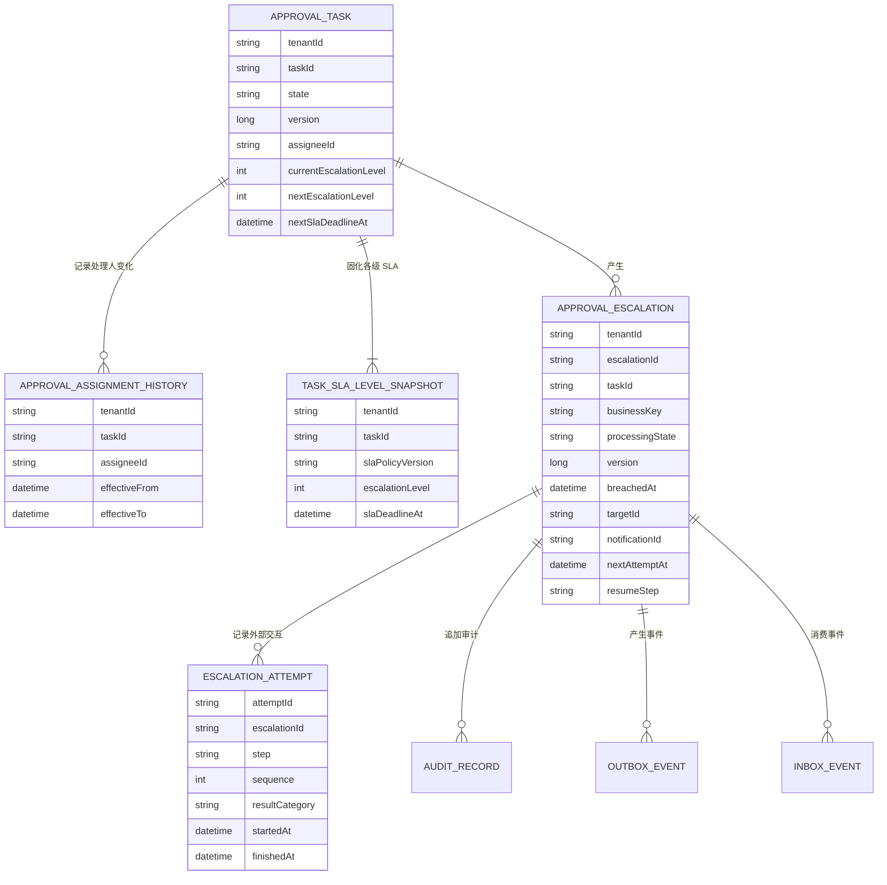

### 6.2 所有权和不变量

必须始终满足：

1. `ApprovalTask` 和 `ApprovalEscalation` 只能由审批服务写入。
2. 任务的 SLA 分级快照创建后不可变；`nextSlaDeadlineAt` 只是当前下一等级的查询投影，必须与快照和 `currentEscalationLevel` 同事务更新。
3. 同一升级业务唯一键最多存在一条 `ApprovalEscalation`。
4. `currentEscalationLevel` 单调递增，任务完成不会把它回退。
5. `assigneeIdAtBreach` 必须来自覆盖 `breachedAt` 的唯一一条处理人历史，不允许使用检测时的当前处理人代替。
6. 升级事实一旦提交不能删除，只能推进处理状态或追加纠正审计。
7. 升级状态版本单调递增；旧消息和旧回执不能覆盖新状态。
8. `COMPLETED`、`NO_TARGET` 是正常终态；`MANUAL_INTERVENTION` 是需要明确责任人的受控暂停态，可以经授权恢复或由迟到的有效结果关闭。
9. 每个外部调用都对应一条 Attempt；Attempt 结果只追加，不覆盖历史。
10. 升级提交事件必须与升级记录同事务产生。

处置工作台的客户端状态遵循：

| 状态 | 所有者 | 生命周期与失效 |
|---|---|---|
| 升级事实、时间线、版本、允许动作 | 审批服务 | 每次详情查询返回权威快照；恢复成功、窗口重新聚焦或缓存超过 30 秒时失效 |
| 筛选、排序、游标、当前选中项 | URL/页面路由 | 只保存非敏感值；退出工作台后可由历史导航恢复 |
| 操作原因 | 页面内存 | 取消、成功或关闭详情时清除；版本冲突时暂时保留供重新确认 |
| `actionId` 与提交状态 | 页面内存和当前请求上下文 | 同一次操作的重试和结果查询保持稳定；确认最终结果后清除 |

客户端不得持久化升级详情、人员标识、通知标识、操作原因或权限结果，不使用 Local Storage 作为业务恢复依据。

### 6.3 一致性和事务边界

| 操作 | 同一事务内的写入 | 事务外行为 |
|---|---|---|
| 创建升级 | 升级记录、任务版本和级别、审计、Outbox | Relay 发布事件 |
| 消费升级事件 | Inbox、处理租约、状态版本 | 查询组织服务 |
| 保存升级对象 | 状态、对象、关系版本、Attempt、审计 | 请求通知 |
| 保存通知接受结果 | `notificationId`、状态、Attempt、审计 | 等待通知结果事件 |
| 处理通知结果 | Inbox、终态、Attempt、审计 | 指标和告警异步导出 |

不使用跨服务分布式事务。外部调用结果通过稳定幂等键和本地状态合并。状态写入失败时，调用方可以重放原请求；外部服务必须返回首次已接受结果。

### 6.4 生命周期、保留和数据修复

- 升级记录、Attempt 和业务审计在线保留 365 天，之后按合规策略归档或删除。
- Inbox 保留时间覆盖消息平台最大重放窗口加七天；Outbox 在确认发布且超过对账窗口后归档。
- 审计不保存审批正文、组织路径和通知正文。
- 对账只能补发既有 Outbox、重试既有步骤或重新查询外部结果，不允许直接把未知状态修改为成功。

### 6.5 数据迁移与回退

采用 Expand–Migrate–Contract：

1. 先增加新逻辑实体、索引和任务可选字段，旧代码保持可运行。
2. 部署能够读取新字段但不生产升级事件的新版本。
3. 部署通知消费者和事件契约。
4. 按内部租户、试点租户、全量租户逐级打开生产开关。
5. 不回填历史 `timedOut` 任务；只处理开关启用后尚未到期或新发生违约的任务。
6. 回退时关闭候选生产，停止创建新升级；已有 Outbox、升级编排和通知结果必须继续处理。
7. 在一个完整保留周期内不删除新字段，物理收缩另行评审。

## 7. 可靠性、可用性与功能安全设计

### 7.1 故障模式与恢复

| 故障 | 影响与系统行为 | 检测 | 恢复责任 | 最终业务结果 |
|---|---|---|---|---|
| 扫描实例崩溃 | 当前页可能重放，不丢失业务事实 | 租约超时、扫描水位停滞 | 其他扫描实例 | FP-02 去重后正常继续 |
| 升级事务失败 | 不产生部分升级和事件 | 数据库错误率、事务回滚指标 | 下一扫描周期 | 重试或保持未升级 |
| 提交成功但调用方超时 | 调用方不知道结果 | 相同业务键再次查询 | Command Handler | 返回既有升级 |
| Outbox 发布失败 | 升级已成立，通知处理延迟 | 未发布年龄和积压 | Relay、Reconciler | 重发同一事件 |
| 消息重复 | 消费可能再次到达 | Inbox 冲突指标 | Orchestrator | 无重复状态变化 |
| 组织服务不可用 | 无法确定升级对象 | 调用错误、Retry Wait 年龄 | Orchestrator | 自动恢复或人工处置 |
| 通知请求结果未知 | 可能已经接受 | 请求超时和对账结果 | 使用相同幂等键重试 | 返回首次 notificationId |
| 通知渠道永久失败 | 升级事实成立但未送达 | 通知结果事件 | 通知服务、最终由审批侧记录 | 人工处置 |
| 结果事件乱序 | 旧结果晚到 | deliveryVersion 回退指标 | Orchestrator | 忽略旧结果 |
| 数据库主备切换 | 扫描和消费短暂停顿 | 数据库可用性监控 | 平台自动恢复 | 租约过期后继续 |
| 工作台查询部分失败 | 诊断信息缺失，操作者可能误判状态 | 前端错误监控、API 分段结果 | 页面保留可读事实但禁用恢复面板 | 重试完整详情后才能操作 |
| 恢复命令响应丢失 | 服务端可能已接受，页面不知道结果 | `actionId` 结果查询和审计 | 工作台使用同一 `actionId` 查询或重试 | 显示确定结果或保持未知，不重复业务动作 |
| 静态资源新旧版本混用 | 页面可能调用不兼容 API | 资源版本、前端启动错误 | 静态资源回退；API 保持兼容 | 旧页面仍可只读，恢复操作在契约不兼容时禁用 |

### 7.2 重试、超时和熔断

| 步骤 | 单次超时 | 短重试 | 持久重试 | 转人工边界 |
|---|---:|---|---|---|
| 组织查询 | 2 秒 | 最多 3 次，100/300/900 ms 抖动退避 | 1、5、15、30 分钟，之后每 30 分钟 | 累计 24 小时 |
| 通知请求接受 | 3 秒 | 最多 2 次，200/800 ms | 1、5、15、30 分钟，之后每 30 分钟 | 累计 24 小时 |
| 通知结果等待 | 不适用 | 不适用 | 24 小时后主动对账一次 | 对账仍未知 |
| Outbox 发布 | 5 秒 | 同一领取周期 3 次 | 租约到期重新领取 | 积压 10 分钟触发人工响应 |

组织和通知分别使用独立熔断器和并发舱壁。熔断打开时不进行内存忙等，直接把升级写入持久重试状态。自动重试总量受租户和依赖双重配额限制，防止依赖恢复时形成重试风暴。

### 7.3 过载与资源保护

- 在线审批请求保留数据库连接池的 70%；扫描、Relay 和编排合计最多使用 30% 的独立预算。
- 扫描并发根据 Outbox 积压、数据库写延迟和组织服务限流信号降低。
- 事件消费恢复采用令牌桶，目标上限 500 条/秒，避免五倍积压压力直接传递给组织和通知服务。
- 单租户最多占全局消费并发的 20%，其余租户保留最低公平份额。
- 指标标签不使用 `taskId`、`escalationId` 等高基数字段。
- 运维查询使用独立读配额；单用户列表请求不超过每秒 5 次、恢复命令不超过每分钟 10 次。前端筛选输入 300 ms 防抖，并取消已被新筛选替代的列表请求。

### 7.4 升级不中断与回退

新消费者必须先于新生产者部署。功能开关按租户控制候选生产，不控制已有事件消费。回退生产版本时，仍保留能读取新状态和处理结果事件的兼容消费者；如果必须回退消费者，则先停生产、清空或隔离新版本事件，并由变更审批确认无不可识别事件。

处置工作台先部署只读列表和详情，确认权限、脱敏和前端监控后再通过服务端能力开关显示恢复操作。静态资源使用内容哈希并保留上一稳定版本；前端回退不改变已提交命令，重新打开页面后通过 `actionId` 和权威详情恢复结果。

### 7.5 功能安全

本特性不控制人身、设备或工业过程，不属于功能安全范围。审批升级延迟可能影响业务时效，但通过 SLO、告警、人工处置和审计管理，不声明安全完整性等级。

## 8. 安全、隐私与韧性设计

### 8.1 资产与信任边界

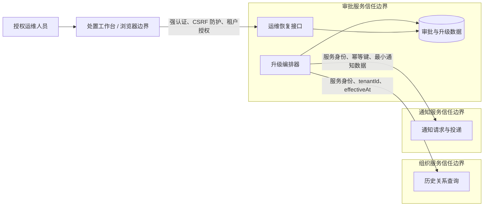

受保护资产包括审批任务存在性、处理人标识、组织关系、升级状态、通知目标、审计记录、运维会话和人工恢复能力。浏览器及其本地存储不属于业务权威边界，前端展示和 `allowedActions` 不能替代服务端授权。

### 8.2 威胁与控制

| 威胁 | 攻击或错误路径 | 设计控制 | 验证 |
|---|---|---|---|
| 跨租户对象引用 | 伪造 `tenantId` 查询其他租户任务或人员 | 每次读取使用租户复合键；服务身份绑定允许租户范围 | 越权集成测试 |
| 事件伪造或篡改 | 非授权生产者发送升级事件 | 主题 ACL、生产者身份、Schema 校验、租户与数据库事实复核 | ACL 与伪造事件测试 |
| 事件重放 | 重放合法事件造成重复通知 | Inbox、业务唯一键、通知幂等键和状态版本 | 重放与乱序测试 |
| 组织关系泄露 | 事件或日志保存完整组织路径 | 只保存目标 ID、关系版本和生效区间；日志脱敏 | 日志扫描与数据检查 |
| 运维权限滥用 | 人工重试或伪造成功 | 最小权限、二次确认、原因、不可变审计；禁止直接置成功 | 权限与审计测试 |
| 通知链接越权 | 转发链接访问审批内容 | 链接不携带 bearer 权限；访问时重新认证并校验租户、目标人与审批权限 | 链接转发测试 |
| 重试放大攻击 | 恶意任务制造依赖洪峰 | 租户配额、熔断、退避、全局舱壁 | 压力与熔断测试 |
| XSS 或不可信错误内容 | 任务引用、原因或依赖错误被作为 HTML 渲染 | 默认文本编码、禁止任意 HTML、严格 CSP、依赖扫描 | 注入与 CSP 测试 |
| CSRF 或重复点击 | 攻击者诱导已登录人员提交恢复动作 | SameSite 会话、CSRF Token、`actionId`、二次确认和服务端版本校验 | CSRF 与重复提交测试 |
| 浏览器数据泄露 | 详情、人员标识或原因写入 URL、本地存储、日志或埋点 | URL 只含非敏感筛选；敏感状态只在内存；前端日志和埋点白名单 | 浏览器存储与遥测检查 |
| 过期页面越权操作 | 权限撤销或状态变化后仍显示旧动作 | 每次命令服务端重新授权；`expectedVersion` 冲突；恢复操作无离线能力 | 权限撤销与并发冲突测试 |

### 8.3 隐私和审计

事件和升级记录不保存审批正文、表单数据和通知正文。`assigneeId`、`managerId` 属于受限人员标识，仅授权业务和运维角色可查询。业务日志只记录脱敏标识摘要；完整标识只存在于受控数据库和审计系统。处置工作台不把详情响应、人员标识、通知标识或操作原因写入 URL、Local Storage、前端日志和行为埋点。

所有创建升级、状态变化、自动重试、人工操作和外部最终结果都追加审计，记录操作者类型、原因、前后状态、关联 Trace 和时间。审计保留 365 天并纳入现有防篡改策略。

## 9. 非功能质量属性设计

### 9.1 质量属性场景

| 属性 | 刺激与环境 | 系统响应 | 可判定目标 | 架构措施 | 验证方式 |
|---|---|---|---|---|---|
| 及时性 | 正常负载下任务到达 SLA 截止时间 | 形成升级并进入通知服务 | 候选识别 99% ≤5 分钟；通知接受 p95 ≤5 分钟、p99 ≤10 分钟 | 分钟级扫描、Seek 分页、异步消费 | 120 万任务容量测试 |
| 唯一性 | 五个扫描实例同时提交同一候选 | 只形成一个升级事实 | 重复升级数为 0 | 业务唯一键、任务版本 | 并发与故障注入测试 |
| 可恢复性 | 数据库提交后消息平台不可用 30 分钟 | 升级保留，恢复后自动发布 | 无人工补数据、无事件丢失 | Outbox、对账、稳定 eventId | 消息平台故障演练 |
| 隔离性 | 单租户瞬时产生全局 50% 的候选 | 其他租户仍可处理 | 其他租户延迟不超过目标两倍 | 租户配额、公平调度 | 多租户压力测试 |
| 可观测性 | 任一升级超过阶段时限 | 能定位停滞步骤和责任 | 五分钟内由告警定位到阶段、依赖和租户 | 状态时间线、阶段指标、Trace | 运维演练 |
| 安全性 | 重放事件或伪造跨租户请求 | 拒绝越权且不重复通知 | 跨租户成功数和重复业务效果为 0 | ACL、租户复核、Inbox、幂等键 | 安全与重放测试 |
| 可演进性 | 新旧版本实例共同运行 | 事件可消费且可安全停产 | 滚动期间无不可识别事件和重复升级 | Schema 兼容、先消费后生产、租户开关 | 混合版本演练 |
| 前端性能 | 运维人员在正常公司网络打开列表或详情 | 页面先呈现结构，再显示权威数据和允许操作 | 列表/详情可交互时间 p95 ≤2 秒；恢复操作反馈 p95 ≤1 秒，不含后台处理 | 路由级拆包、查询并发控制、独立读配额 | 支持浏览器的真实网络性能测试 |
| 可访问性 | 键盘或读屏用户完成筛选、理解状态和恢复确认 | 焦点、名称、状态、错误和动态结果均可感知 | 核心流程满足 WCAG 2.2 AA；无键盘陷阱和仅颜色表达 | 语义结构、焦点管理、Live Region、设计系统组件 | 自动扫描加键盘/读屏人工测试 |
| 前端韧性 | 查询局部失败、认证失效、版本冲突或命令结果未知 | 保留安全上下文，禁用不安全动作并提供确定恢复路径 | 不出现误导性成功；所有未知提交可按原 `actionId` 恢复 | 页面状态矩阵、服务端权威状态、稳定错误分类 | 弱网、取消、冲突和刷新 E2E 测试 |

### 9.2 容量估算

确认峰值为五分钟 3 万次违约，即平均 100 次/秒；按故障恢复五倍压力设计为 500 次/秒。

- 扫描批次 500 条，正常每秒最多提交 200 个候选，恢复阶段逐步放量到 500 个；
- FP-02 每个有效升级产生一次任务更新、一次升级插入、一次审计和一次 Outbox，容量测试按 500 个事务/秒验证；
- 组织和通知依赖分别按 500 次/秒峰值评估，但租户配额和熔断限制实际并发；
- 按年 1000 万次升级估算在线升级、Attempt 和审计容量，保留 365 天；物理存储和索引尺寸由 Implementation Design 基于真实字段长度测算；
- 在线审批数据库延迟在峰值下不得比无升级负载基线增加超过 10%，否则优先降低扫描和恢复速度。

### 9.3 可观测性

必须提供：

- `sla_candidate_scanned_total{tenantTier,result}`
- `escalation_commit_total{result,level}`
- `escalation_stage_duration_seconds{stage,result}`
- `escalation_state_count{state}`
- `outbox_oldest_age_seconds` 与 `outbox_backlog`
- `dependency_request_total{dependency,result}`
- `dependency_circuit_state{dependency}`
- `manual_intervention_count{reasonCategory}`
- `notification_end_to_end_seconds{result}`
- `ops_ui_route_load_seconds{route,result}`
- `ops_ui_api_request_total{operation,resultCategory}`
- `ops_ui_recovery_unknown_total`
- 前端异常监控按发布版本、路由和稳定错误分类聚合，不采集任务、人员、通知或操作原因。

日志以 `traceId`、`eventId`、`escalationId` 的受控哈希关联，不把这些标识作为指标标签。异步事件消费建立新 Span，并通过事件中的 `traceId` 建立 Link。告警必须指向运行手册和当前恢复责任。

### 9.4 可测试性与可维护性

系统级时间判断统一使用可注入时钟，数据库提交时间作为升级事实时间来源。组织和通知端口支持契约测试及故障注入。状态转换集中在一个审批领域组件中，在线消费、对账和人工恢复共同使用，避免三套规则漂移。

处置工作台使用契约测试验证稳定错误映射，使用组件测试覆盖状态矩阵，使用浏览器端到端测试覆盖身份、筛选、详情、确认、冲突和未知结果恢复。可访问性同时执行自动规则扫描和键盘/读屏人工验证；仅有静态截图评审不能替代可操作流程验证。

## 10. 关键技术决策、取舍与风险

### 10.1 决策记录

| 决策 | 选择 | 主要依据 | 代价与限制 |
|---|---|---|---|
| 升级事实所有者 | 审批服务 | 任务状态和升级有效性必须处于同一一致性边界 | 审批服务增加异步编排职责 |
| 可靠事件方式 | 本地事务 Outbox | 业务事实与待发布事件原子一致，不引入分布式事务 | 增加 Relay、对账和存储成本 |
| 组织关系时间语义 | 按 `breachedAt` 查询历史直属上级 | 可重放、可审计，不受处理延迟期间组织变化影响 | 阻断依赖是组织服务必须支持历史查询 |
| SLA 策略变化 | 任务创建时快照策略版本和截止时间 | 保证业务唯一键和时限稳定 | 策略修正不能自动追溯既有任务 |
| 通知一致性 | 升级事实强一致，通知最终一致 | 外部依赖不扩大审批事务和不可用范围 | 用户可能看到短暂通知延迟 |
| 渠道重试所有者 | 通知接受后由通知服务负责 | 避免审批与通知两侧重复重试 | 审批侧依赖结果事件和对账契约 |
| 人工恢复界面一致性 | 服务端权威状态、悲观提交、`expectedVersion + actionId` | 高危操作不能依据过期页面或乐观结果判断成功 | 冲突时需要操作者刷新并重新确认 |
| 前端承载方式 | 复用内部运维门户外壳和设计系统，新增独立 `approval-ops-web` 构建单元 | 沿用登录、导航、可访问性组件和发布能力，同时隔离审批运行代码 | 需要维护前端与 Ops API 的稳定契约 |

### 10.2 已拒绝方案

- 不采用审批事务内同步通知，因为无法原子提交外部副作用，并会把组织、通知可用性引入审批事务。
- 不采用仅依赖消息平台“恰好一次”，因为平台不提供端到端业务唯一性，消费者和外部请求仍需幂等。
- 不复制组织关系到升级事件，因为会形成第二权威来源并扩大敏感信息暴露。
- 不以分布式锁保证唯一升级，因为锁租约失效和网络分区仍需数据库最终约束。
- 不让人工恢复创建新事件，因为这会破坏升级唯一性和审计连续性。
- 不对人工恢复采用乐观成功更新，因为响应超时、权限变化或版本冲突时会向操作者展示错误业务结果。
- 不把详情数据和操作草稿持久化到浏览器，因为它们包含受限运维信息，且本地副本不能作为恢复依据。

### 10.3 风险与验证

| 风险 | 影响 | 缓解 | 上线前证据 |
|---|---|---|---|
| 历史组织关系查询能力不足 | 无法稳定确定升级对象 | 将接口能力设为阻断依赖；契约测试覆盖历史时间 | 组织服务契约和数据覆盖报告 |
| 超大租户扫描热点 | 候选识别延迟 | Bucket 分片、租户限额、Seek 索引 | 最大租户数据集容量报告 |
| 故障恢复形成重试风暴 | 压垮组织或通知服务 | 持久退避、熔断、全局和租户配额 | 30 分钟依赖故障恢复演练 |
| 混合版本事件不兼容 | 隔离队列积压或丢失处理 | 先消费后生产、Schema 兼容检查 | 新旧版本联合演练 |
| 运维人工操作错误 | 重复通知或错误状态 | 限权、二次确认、同一幂等键、不可变审计 | 运维权限与恢复演练 |
| 工作台展示过期或不完整状态 | 操作者基于错误信息执行高危动作 | 服务端返回 `allowedActions` 但提交时重新校验；局部失败禁用操作；版本冲突强制刷新 | 并发恢复、权限撤销、局部加载和弱网 E2E 报告 |
| 前端遥测泄露运维数据 | 任务或人员信息进入第三方或高权限日志 | 埋点白名单、字段脱敏、禁止采集详情响应和原因 | 浏览器存储、网络和遥测扫描报告 |

## 11. 需求分解分配与下游交接

### 11.1 需求—设计—验证关系

| 需求 | 功能点 | 主要设计落点 | 必须验证 |
|---|---|---|---|
| REQ-SLA-001 | FP-01 | Seek 扫描、分片和背压 | 识别延迟、页重放、热点租户 |
| REQ-SLA-002 | FP-02 | 业务唯一键、任务版本和事务 | 并发扫描、未知提交结果、唯一冲突 |
| REQ-SLA-003 | FP-02 | 完成/撤回竞态规则 | 两种提交顺序及审计结果 |
| REQ-SLA-004 | FP-03 | `breachedAt` 历史关系查询 | 组织变更、无上级、关系异常 |
| REQ-SLA-005 | FP-03、FP-04 | 状态机、单一重试责任、对账和人工处置 | 所有失败路径进入确定终态 |
| REQ-SLA-006 | FP-03、FP-04 | 租户复核、最小数据、权限与审计 | 越权、重放、日志泄露 |
| REQ-SLA-007 | FP-02、FP-03 | Schema 兼容、功能开关和回退 | 新旧版本共存和停产继续消费 |
| REQ-SLA-008 | FP-04 | 处置工作台用户旅程、页面状态、权威详情、版本冲突和安全恢复 | 页面状态矩阵、权限、重复提交、冲突、未知结果和可访问性 |

### 11.2 Implementation Design 约束

审批服务 Implementation Design 必须继续细化：

- Seek 查询的物理索引、Bucket 租约和批处理实现；
- 升级、Attempt、Inbox、Outbox 和审计的物理表结构；
- 任务版本、唯一约束和事务传播；
- Relay 领取租约、消息发布确认和对账实现；
- 状态转换组件、外部端口和恢复任务；
- 独立线程池、连接池预算及配置项；
- 运维查询、权限校验和二次确认交互。

通知服务 Implementation Design 必须继续细化幂等请求存储、模板映射、渠道交付状态及结果事件发布。

`approval-ops-web` Implementation Design 必须继续细化：

- 列表、详情、时间线、恢复面板和确认对话框的组件结构；
- 路由、查询取消、30 秒缓存失效、焦点重新获取刷新和错误边界实现；
- `actionId` 生命周期、提交中防重复、版本冲突和结果未知恢复；
- 设计系统组件、响应式细节、键盘焦点、Live Region 和读屏标签；
- 前端 CSP、CSRF 集成、遥测白名单、构建拆包和发布回退。

页面像素布局和视觉 Token 可以在既有设计系统内细化，但不得改变 4.3.4 的页面信息结构、状态矩阵、服务端权威状态、权限边界和恢复语义。

下游不得改变以下系统级结论：

- 审批服务拥有升级事实，通知服务拥有渠道交付；
- 升级事实与 Outbox 同事务；
- 组织关系按 `breachedAt` 查询；
- 业务唯一键组成；
- 通知接受前后重试责任分界；
- 功能开关只停止新生产，不停止既有事件消费；
- 工作台不进行乐观成功更新，所有恢复命令使用 `expectedVersion + actionId` 并由服务端重新授权。

### 11.3 Test Design 重点

测试设计必须覆盖：

- 重复扫描、并发实例、页重放和租约失效；
- 完成、撤回、不同升级级别与升级提交的竞态；
- 数据库提交结果未知、唯一约束冲突和 Outbox 重发；
- 重复、乱序、延迟和未知版本事件；
- 组织历史查询、无上级、跨租户和关系循环；
- 通知接受超时、幂等冲突、渠道永久失败和迟到回执；
- Reconciler 与在线消费并发恢复同一升级；
- 租户隔离、人工权限、审计和敏感数据；
- 工作台初始、加载、空、局部失败、无权限、数据过期、提交中、结果未知和技术失败状态；
- 前端筛选与游标恢复、旧请求取消、重复点击、版本冲突、认证失效、刷新和弱网恢复；
- 键盘、读屏、焦点管理、动态状态播报、支持浏览器兼容和前端性能预算；
- 浏览器存储、CSP、CSRF、XSS、权限撤销和遥测字段白名单；
- 120 万任务、500 次/秒恢复压力和依赖熔断；
- 新旧版本共存、逐租户启用、停产和回退。

### 11.4 上线与运维交接

上线前必须具备：

- 组织历史关系接口契约测试通过；
- 容量、故障恢复和混合版本演练报告；
- 指标、告警、Dashboard 和运行手册；
- 人工恢复权限组、审批流程和审计查询；
- 处置工作台设计系统验收、可访问性报告、前端监控、CSP/CSRF 验证和上一稳定静态资源版本；
- 试点租户名单、放量观察窗口和停止条件。

放量顺序为内部租户、1% 试点租户、10%、50%、100%。处置工作台先开放只读查询，再向内部值班组开放恢复操作，最后按租户运维权限放量。每阶段至少观察一个峰值周期；出现重复升级、跨租户访问、未知事件版本、数据库延迟超过预算、工作台误报成功、前端敏感数据泄露或人工处置持续增长时立即停止放量并关闭对应能力。

本设计不存在尚未关闭的系统级阻断决策。物理索引、连接池数值和代码模块拆分属于下游 Implementation Design，但必须通过本文规定的容量和正确性目标验证。

## 12. 词汇表与参考资料

### 12.1 词汇表

| 术语 | 定义 |
|---|---|
| 候选任务 | 扫描器认为可能满足升级条件、仍需审批服务重新校验的任务 |
| 升级事实 | 经审批服务事务提交、表示一次 SLA 违约升级已经成立的不可删除业务记录 |
| 业务唯一键 | 标识同一任务、策略版本、截止时间和升级级别的稳定组合 |
| Outbox | 与业务事实同事务写入、由 Relay 异步发布的事件记录 |
| Inbox | 消费方用于记录已处理事件并实现消费幂等的记录 |
| 处理状态 | 升级事实成立后，对象解析和通知交付所处的可恢复阶段 |
| `breachedAt` | SLA 违约发生时间，也是历史组织关系的查询时间 |
| 人工处置 | 自动恢复超过边界后，由授权人员在审计约束下处理既有升级 |
| 升级处置工作台 | 内部运维门户中用于查询升级、理解时间线并执行受控恢复的前端应用 |
| 结果未知 | 恢复命令可能已被服务端接受，但客户端尚未取得确定结果，必须使用原 `actionId` 查询或重试 |

### 12.2 参考资料

本黄金样例假定以下资料已经存在并构成正式设计输入：

- 审批任务状态模型与任务版本并发控制规范；
- SLA 策略快照与任务截止时间计算规范；
- 组织服务历史关系查询契约；
- 通知服务幂等请求与交付结果契约；
- `UCD-SLA-001` 升级处置用户研究、故障 walkthrough 和第二轮原型评审记录；
- 事件平台至少一次投递、Schema Registry 和主题 ACL 规范；
- 数据保留、人员标识保护和审计合规规范；
- 审批服务当前容量基线与数据库高可用运行手册；
- 内部运维门户导航、身份集成、设计系统、支持浏览器和 WCAG 2.2 AA 基线。
