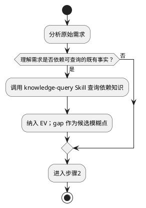
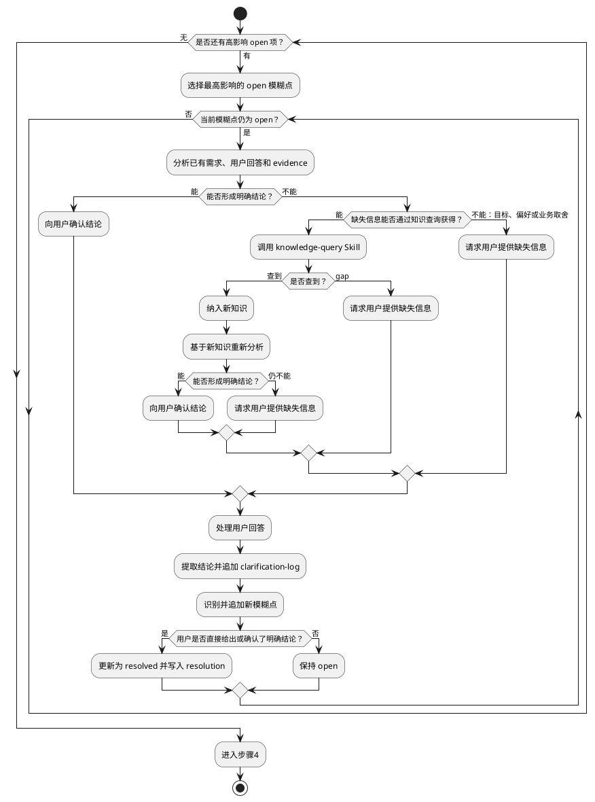
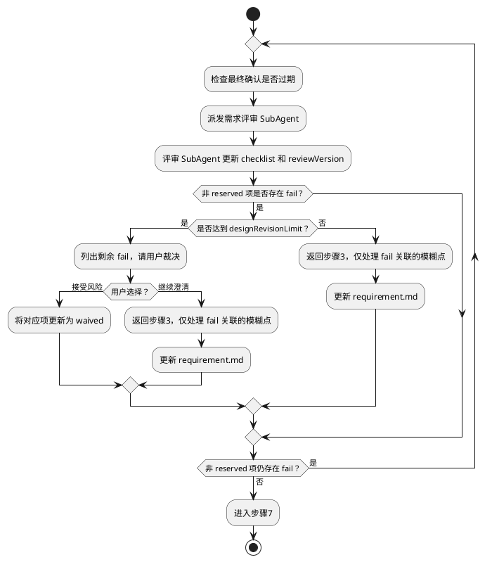

# Feature Clarify — 需求澄清

围绕当前最关键的需求模糊点，动态决定分析、查询知识或询问用户，直到核心需求足以支撑后续设计。

## 步骤0：前置检查与恢复

从活跃任务工作区的 `state.json` 读取任务状态：
- 如果 `state.status !== 'initialized'` 时停止流程。
- 如果 `state.status === 'initialized'` 执行初始化并读取上下文：

```bash
node ${CLAUDE_SKILL_DIR}/../../scripts/feature-clarify.js init <taskPath>
```

随后读取 `inputs/requirement.md`、`evidence/evidence-registry.json`、`evidence/knowledge/EV-*.md` 恢复已确认事实和证据。

## 步骤1：建立初始需求理解

1. 分析原始需求（不写入文件），识别：明确提出了什么、Agent 的关键推断、当前缺口。

### 步骤1a: 按需知识查询



可查询的既有事实包括：已有功能和系统行为、业务规则、历史术语定义，以及理解需求边界所必需的系统上下文。

执行规则：
- 只查询影响需求理解的知识，不在此处展开接口、数据模型或完整影响分析。
- 将相关缺口合并为一次查询，避免逐项派发。
- 查询结果纳入后续分析；未找到的 gap 在步骤2中判断是否形成模糊点。
- 没有查询需求时直接进入步骤2。

## 步骤2：生成模糊点清单

从以下方面识别模糊点，写入 `inputs/ambiguity-backlog.json`：

- 目标不明确 — 核心业务目标和成功标准是什么
- 术语存在多义 — 关键术语有无多种理解
- 用户角色和场景缺失 — 谁在什么情况下使用
- 业务流程不完整 — 主要流程的起点、终点和关键步骤
- 功能边界冲突 — 不同功能之间是否存在矛盾
- 规则和异常路径缺失 — 边界条件和失败路径
- 验收不可验证 — 如何判断需求已满足
- 外部依赖或约束未知 — 平台、系统、环境限制
- 用户前后陈述可能冲突

**`inputs/ambiguity-backlog.json` 结构：**

```json
{
  "ambiguities": [
    {
      "id": "AMB-001",
      "issue": "核心价值的清晰描述",
      "impact": "影响什么决策或设计方向",
      "status": "open",
      "resolution": null
    }
  ]
}
```

仅五个字段：`id`（`AMB-` 前缀 + 三位数字序号）、`issue`（一句话描述模糊点）、`impact`（为什么重要）、`status`（`open` | `resolved` | `deferred`）、`resolution`（status 非 open 时的最终结论）。

## 步骤3：动态澄清模糊点

按以下流程循环处理，直到不存在高影响 `open` 模糊点：



执行约束：
- 模糊点优先级：影响核心目标、产品定位或主场景 → 阻塞多个后续判断 → 错判后返工范围大。
- `knowledge-query` Skill 查到知识后必须重新分析，不得直接将模糊点标记为 resolved。
- 只有用户直接给出明确结论，或确认 Agent 推导的结论后，才能标记为 resolved。
- 用户回答仍不足时保持 open，围绕同一模糊点继续循环；不得直接切换到预设问题。
- 每次用户回答后必须更新 backlog，并追加 `inputs/clarification-log.md`。
- 低影响项可以标记为 deferred 并说明原因；影响用户可见行为、数据一致性或安全性的项不得 deferred。
- 不再要求用户选择需求类型（functional / technical / mixed）；由 Agent 判断需求、技术约束及应延后到设计阶段的内容。
- 每次回答后更新需求理解。评审循环（步骤6）返回时，从此处重新进入，仅处理 fail 项关联的模糊点。

**禁止未经用户回答将模糊点标记为 resolved**

## 步骤4：核心场景完整性检查

使用六维度作为结束前 checklist，逐一确认：

- **businessGoal** — 核心业务目标是否明确？
- **usersAndScenarios** — 用户和主要使用场景是否清晰？能否完整描述至少一条核心用户旅程？
- **functionalScope** — 核心功能范围和非目标是否明确？
- **nonGoalsAndBoundaries** — 明确不做什么？
- **acceptanceCriteria** — 验收条件是否可验证？
- **constraintsAndRisks** — 关键业务规则和约束是否已识别？

发现高影响缺口时，将其加入 ambiguity backlog 并返回步骤3；没有高影响缺口时进入步骤5。

六维度只用于发现遗漏，不决定步骤3中的处理顺序。

## 步骤5：按模板写入需求文档

1. 读取 `skills/feature-clarify/requirement.md` 模板，按 11 章节结构组织需求汇总，写入 `inputs/requirement.md`（**追加**到原始需求下方，**永不覆盖原始需求**）。未明确项保留待补充标记，评审循环中逐步填充。

2. 列出所有 `deferred` 模糊点及延后原因，请用户评审确认是否接受带入设计阶段。

## 步骤6：评审循环



进入每轮评审前执行：
```bash
node ${CLAUDE_SKILL_DIR}/../../scripts/feature-clarify.js check-stale-confirmation <taskPath>
# 若返回 stale: true，表示 requirement.md 在确认后被修改，需重新确认
```
若返回 `stale: true`，表示此前的最终确认已失效，步骤7必须重新请求用户确认。

评审任务：
- 通过 `Agent` 工具派发一次性 SubAgent（`general-purpose` Task），注入 `skills/feature-clarify/reviewer-prompt.md` 行为契约。
- 评审 SubAgent 负责更新 checklist 和递增 reviewVersion。

返工约束：
- 主会话只能针对 fail 项返回步骤3，不得自行修改 checklist。
- `requirement.md` 更新后必须重新派发评审 SubAgent，不得沿用上一轮结果。
- 达到 `state.designRevisionLimit` 后，只有用户可以决定继续澄清或接受风险。
- 用户接受风险时执行：
```bash
node ${CLAUDE_SKILL_DIR}/../../scripts/feature-clarify.js waive-item <taskPath> '<json-payload>'
```

## 步骤7：最终确认与状态推进

若步骤6入口的 check-stale-confirmation 返回 `stale: true`，此处须先向用户说明 `requirement.md` 已过期变更，请求重新确认。

1. 展示需求汇总，用 `confirm_gate` 请求最终确认：
- 用户拒绝: 必须返回步骤3继续澄清
- 用户确认: 在用户确认后执行：
   a. 将「最终确认」章节写入 `inputs/requirement.md`（追加确认时间戳和确认范围）
   b. 更新 checklist confirm-final 为 pass：
   ```bash
   node ${CLAUDE_SKILL_DIR}/../../scripts/feature-clarify.js confirm-final <taskPath>
   ```

2. 执行完整性检查：
```bash
node ${CLAUDE_SKILL_DIR}/../../scripts/feature-clarify.js check-complete <taskPath>
# 返回 { complete: true }
```
- 返回 false → 状态不满足，重新进入步骤6 进行评审循环（此时 checklist confirm-final 已 pass，仅剩真正的质量问题）
- 返回 true → 完整性检查通过，继续下一步

3. 推进状态：
```bash
node ${CLAUDE_SKILL_DIR}/../../scripts/workflows/feature-workflow.js set-task-status <workspaceRoot> clarified
```

## `inputs/clarification-log.md` 结构

步骤3 每次用户回答后追加写入，与 requirement.md 分离：

```text
# 澄清记录

## [时间戳] 问题主题
- **涉及方面:** 需求领域
- **问题:** 向用户提出的问题
- **推荐与理由:** 如有推荐结论及理由
- **候选及来源:** 提供的选项及来源标注
- **用户回答:** 用户的选择或输入
- **结论:** 确认后的需求结论

## [时间戳] 下一个问题主题
...
```
