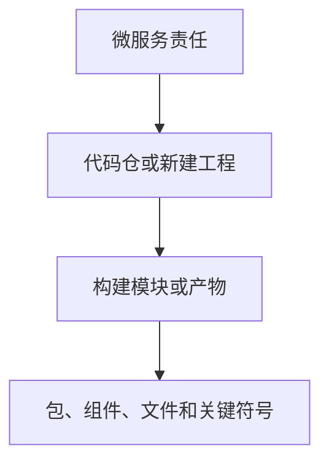
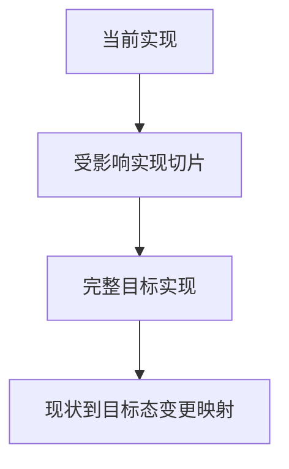

# 实现设计指南

## 专业定位与边界

本 Guide 的专业边界是微服务内部实现，不延伸到跨服务架构或开发任务编排。

实现设计是每个微服务内部的代码级 Detailed Design。它以已确认的 Solution Design 和真实工程事实为输入，把 Solution Design 分配给微服务的责任映射为可编码的完整目标实现切片，关闭编码前必须确定的结构、职责、接口、行为与技术约束。

Solution Design 已确定微服务集合及其新增/存量属性、服务职责、服务间关系、跨服务契约、数据所有权、依赖方向、协作方式、系统级一致性与失败语义，以及系统级质量属性。实现设计承接这些结论，不重新分配服务职责或重定义跨服务架构。调查若表明必须改变上述结论，把问题、工程依据和影响明确升级回 Solution Design。

微服务是逻辑设计单元，代码仓是实现落点。一个微服务可以涉及一个或多个代码仓、构建模块和产物；一个代码仓也可以承载多个模块。实现映射遵循：

每个新增或存量微服务都形成一个完整目标实现。设计描述受影响或新建实现切片的完整目标态，以及从现状到目标态的必要变化，而不是只列代码 Diff。精度可以到模块、包、组件、关键类、关键函数、接口、类型、表、字段和关键调用链；私有方法、局部变量与最终 Diff 留给编码，只要这些自由度不会重新打开关键技术设计。

实现设计产出设计结论，不编写功能代码，也不编排原子开发任务、实施顺序、文件修改步骤、Red–Green–Refactor 增量、验证命令或提交安排。Development Implementation Plan 消费已经关闭的详细设计，只负责拆解和排序。

## 设计场景

新增与存量微服务使用同一套专业责任和产物结构，差异只在工程事实起点。风险和实际影响决定展开深度，场景标签本身不决定篇幅。

### 存量微服务

以真实代码事实建立以下连续映射：

先调查代码仓、构建模块、入口、调用链、状态、持久化、外部依赖、既有测试和合理工程惯例。识别需求直接影响以及为了保持行为、契约或不变量必须处理的关键相邻影响，再区分新增、修改、复用、废弃、保持不变和非目标。

目标实现应保护未改变的存量行为与稳定接缝，把重构限制在交付目标实现所必需的边界内。最终设计以完整目标态为主，变化映射用于解释如何从可信现状到达目标态；文件清单只作为工程定位证据，不能替代结构、行为和约束设计。

### 新增微服务

以 Solution Design 已分配的服务责任和可核验工程基线建立目标实现。工程基线包括新代码仓或工程、标准脚手架、正式技术栈、工程规范、共享组件、经核验的参考服务，以及构建、部署和运行基线。

标准能力引用既有权威基线，差异能力完成详细设计。只引入当前责任和已确认演进约束需要的最简单结构；参考服务用于核验可复用惯例，不作为整套分层、抽象或设计模式的复制源。目标实现同时覆盖首版数据与状态模型、错误与资源边界、标准运行能力、构建部署产物、测试基础，以及从第一个核心行为开始的 TDD 接缝。

## 专业原则

### 正确性与显式契约

关键行为、状态、不变量和失败语义使用可核验的接口、类型与规则表达，不依赖开发者的隐含理解。相同输入和状态应产生确定结果；非确定性来源必须有明确边界。

### 简单设计

选择满足当前需求和已确认演进约束的最简单结构。整体认知复杂度是判断标准：类少或代码短不自动等于简单；没有真实职责或变化点的中间层、扩展框架和抽象会增加成本。

### 正交设计与关注点分离

独立变化的职责尽量独立，核心规则与 I/O、外部副作用和框架细节保持合理隔离。同一规则只有一个权威实现位置；一个变化不应迫使多个无关组件同步修改。

### 高内聚、低耦合与信息隐藏

共同维护同一不变量的状态和行为集中在同一职责边界内。组件只暴露协作所需的最小契约，内部数据结构和实现细节留在边界内部。

### 稳定依赖方向

稳定核心不依赖易变技术细节。外部系统、数据库、时间、随机数和框架通过与真实边界或变化点对应的接缝接入。接口服务于实际协作或隔离目的，而不是机械地与每个类一一对应。

### 可测试与安全重构

核心行为能够通过稳定接口、状态变化或允许的副作用观察；外部依赖和非确定性因素能够隔离。单元测试面向行为与不变量，不绑定私有方法或脆弱调用顺序，使内部重构能够保持行为测试稳定。

### 设计模式按需使用

设计模式是解决真实设计矛盾的候选手段，而不是必备产物。直接实现足够时，“不采用模式”是正式结论。

采用模式时说明：

1. 当前真实矛盾；
2. 预期变化维度；
3. 直接实现不足之处；
4. 模式解决的结构问题；
5. 新增的间接层和认知成本；
6. 与现有合理工程惯例的关系；
7. 对简单性、正交性和可测试性的净影响。

只有收益覆盖复杂度成本时才采用模式。

### TDD 作为实现反馈机制

单元测试是开发实现的基础动作。实现设计定义可由测试驱动的行为、不变量、可观察结果和依赖接缝；Development Implementation Plan 再把这些设计结论组织为 Red–Green–Refactor 增量。具体测试代码、Fixture 和 Mock 在开发过程中形成。

TDD 同时反馈职责、接口和依赖设计：难以通过稳定行为验证的核心逻辑，通常提示边界仍需收敛。测试接缝应保持封装，Mock 需求本身不足以证明新增接口或泄漏内部结构合理。

## 分析透镜

透镜按实际问题选用，用于降低不确定性而非满足固定数量：

- **工程映射**：从微服务责任追踪到代码仓、新工程、构建模块、产物、包、组件、文件和关键符号。
- **职责与依赖**：检查组件职责、稳定边界、依赖方向，以及核心逻辑与副作用的分隔。
- **调用图与代码级时序**：核对入口、调用顺序、分支、同步/异步边界、外部调用和失败传播。
- **数据流与状态转换**：追踪数据获取、校验、转换、输出，以及状态读取、转换和写入。
- **持久化与副作用**：核对模型映射、表、字段、索引、约束、事务边界和外部副作用。
- **接口、类型与不变量**：检查输入输出、错误、空值、创建约束、状态不变量、序列化和模型转换。
- **端口与适配器**：只在真实技术边界、变化点或测试隔离需要时引入接缝。
- **复杂度比较**：比较直接实现与候选设计模式的结构收益、间接层和认知成本。
- **算法与资源**：分析数据结构、时间/空间复杂度、退化行为，以及 I/O、内存、缓存、线程、连接和队列约束。
- **兼容矩阵与混合版本推演**：覆盖 API、事件、数据、配置、依赖和部署版本组合。
- **故障与竞争推演**：推演故障、竞态、取消、超时、重试、重复执行、部分成功和恢复。
- **TDD 行为切片**：从实现职责导出可观察行为、不变量、依赖隔离和测试阶段边界。

图示不是必选产物，不要求每份设计必须包含图示，也不规定图示数量。仅当组件或类关系、调用时序、控制流、数据流或状态转换使用图示能明显降低理解成本时才绘制，并统一使用 Mermaid；禁止使用 ASCII 字符模拟语义图。界面设计、视觉稿等不适合 Mermaid 的内容不强制绘图。

## 必须关闭的代码级决策

以下七类是每个微服务的专业覆盖维度，不是固定提问顺序，也不是七个 Feature 级平铺章节。每类按实际影响展开；“沿用”同样需要核验范围、当前结论、依据和理由。

### 1. 工程事实与实现边界

确定微服务对应的代码仓或新工程、构建模块和产物、受影响包、组件和关键符号。区分直接影响、关键相邻影响、保持不变和非目标，并记录当前设计所依据的真实工程事实。

### 2. 目标结构、职责与设计模式

确定模块和组件职责、依赖方向、核心逻辑与副作用边界、外部依赖适配边界，以及结构的新增、拆分、合并、复用和废弃。界定必要重构，并说明采用或不采用设计模式的理由。

### 3. 接口、类型与不变量

确定公开和关键内部接口、输入输出、错误类型和空值语义；定义适用的 DTO、实体、值对象、枚举和状态类型，以及创建约束、状态不变量、外部/内部/持久化模型转换和兼容要求。

### 4. 控制流、数据流、状态与持久化

确定入口、核心调用顺序、分支和决策点、数据获取/转换/输出、状态读取/转换/写入、同步与异步边界、外部调用，以及正常和失败路径。定义表、字段、索引、约束及 Repository、Mapper、DAO 或文件持久化职责。

### 5. 核心算法与技术质量属性

确定适用的核心算法、数据结构、时间与空间复杂度、边界和退化行为、数据规模，以及批量、流式或增量处理策略。关闭 I/O、内存、缓存、线程、连接、队列、背压、限流、过载保护、安全、审计、时区、精度、字符集和国际化的代码级落点。

### 6. 错误、并发、事务与一致性

确定错误分类、异常转换与传播、取消与超时、重试责任和可重试条件。定义幂等标识、重复执行结果、竞争对象、原子边界、锁或版本控制、事务范围、事务与外部副作用的关系、顺序、部分成功、失败后状态、恢复和补偿。

### 7. 演进、运行与 TDD 交接

确定适用的 API、事件、数据、配置和依赖兼容，新旧与混合版本行为，Schema 和历史数据迁移，回滚、降级与不可逆变化。定义日志、指标、Trace、审计和诊断落点，并交付关键单元行为、TDD 依赖接缝及 Development Implementation Plan 必须遵守的设计约束。

## 高价值矛盾

优先调查会改变边界、行为或返工成本的矛盾：

- Solution Design 责任与真实工程结构不一致，或目标职责超出当前实现范围；
- 局部需求被扩大为无关架构重构；
- 简单设计与过度抽象冲突，或直接实现过度集中而破坏正交性；
- 组件职责与依赖方向冲突；
- 接口契约与实际调用需求冲突，或接口允许破坏关键不变量；
- 职责说明、调用链、数据流和类型边界互不一致；
- 状态模型与持久化约束冲突；
- 事务边界与外部副作用冲突，或重试与幂等策略冲突；
- 并发策略无法保护目标不变量；
- 算法逻辑正确但资源约束无法成立；
- 设计模式与真实变化点或现有工程惯例不匹配；
- 可测试性要求破坏合理封装，或 TDD 行为切片与代码职责不匹配；
- 兼容、迁移和回滚要求互相矛盾；
- 可观测性设计侵入或扭曲核心行为；
- 设计内容退化为文件清单、代码 Diff 或开发任务计划。

架构级矛盾以升级项返回 Solution Design；微服务内部矛盾在实现设计中关闭。

## 风险缩放

每个微服务独立按实际技术影响缩放。Feature 总规模、需求人月、文件数量、新增/存量标签和设计模式数量都不能代替风险判断。

存在实质影响的维度完整展开，尤其是跨模块状态变化、并发或异步执行、事务与外部副作用、不可逆迁移、混合版本、核心算法、资源容量、生产诊断和回滚。局部且行为确定的实现可以简洁表达，但必须留下足以复核结论的工程依据。

没有新增影响时，结论仍包含：

1. 核验范围；
2. 当前结论；
3. 判断依据；
4. 沿用既有设计的理由。

## Checklist 导航

- 始终执行：[implementation-feasibility](../review-checklists/implementation-feasibility.md)、[design-traceability](../review-checklists/design-traceability.md)。
- 存在并发写入、异步执行、共享状态、顺序或重复交付时执行：[concurrency-review](../review-checklists/concurrency-review.md)。
- 存在数据、接口、事件、配置、依赖或部署兼容迁移时执行：[migration-review](../review-checklists/migration-review.md)。
- 新增微服务，或生产运行、诊断、发布、回滚、资源和容量受到实质影响时执行：[operability-review](../review-checklists/operability-review.md)。

## 专业收敛标准

实现设计仅在以下条件全部可核验时收敛：

- Solution Design 确定的每个新增或存量微服务都有设计单元；
- 微服务集合、职责和跨服务契约与 Solution Design 一致，架构级变化已明确升级；
- 每个微服务的工程事实、实现范围和非目标可信；
- 目标结构、职责、稳定边界和依赖方向明确；
- 接口、类型、不变量、控制流、数据流、状态和持久化相互一致；
- 错误、取消、超时、重试、幂等、并发、事务、顺序和副作用组合后行为确定；
- 设计满足正确性、简单性、正交性、高内聚低耦合、稳定依赖和可测试性；
- 设计模式解决真实矛盾，或直接实现更合理的原因已经明确；
- 兼容、迁移、混合版本、回滚和运行观测没有未解释的矛盾；
- 关键实现单元能够转化为合理的 TDD 行为切片；
- Development Implementation Plan 只需拆解和排序，无需重新决定关键详细设计；
- 最终内容可以脱离聊天上下文独立理解。
