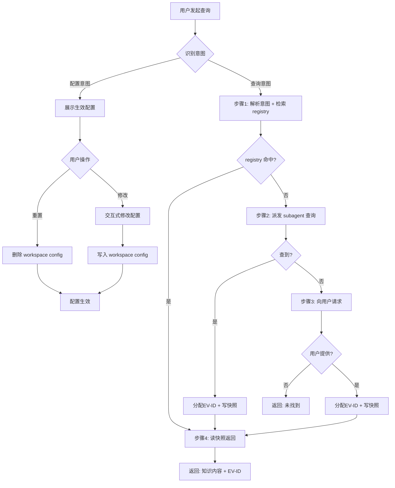

# Knowledge Query — 知识查询

多数据源统一知识查询入口。自动判断配置/查询意图，4 步查询流（registry 检索 → subagent 搜索 → 用户请求 → 快照返回），查询结果以 EV-ID 追踪。

## 处理流程



多数据源默认配置存储在 skill 根目录的 `knowledge-sources.json`，由 `scripts/knowledge-query.js` 管理。

## 配置工作流

配置操作均通过 `node ${CLAUDE_SKILL_DIR}/../../scripts/knowledge-query.js` 执行。

默认数据源及优先级：skill → 本地目录 → 代码仓 → MCP → WebSearch。skill 和本地/代码仓默认启用（需配置具体名称/路径），MCP 和 WebSearch 默认关闭。配置采用两层 fallback（workspace config > skill default），脚本自动处理。

自然语言自动识别配置意图：

- "当前数据源有哪些？" → `node ${CLAUDE_SKILL_DIR}/../../scripts/knowledge-query.js show-config ${CLAUDE_PROJECT_DIR}` 展示生效配置（标注来源：workspace config / skill default）
- "把 data/docs/ 加到本地数据源" → 交互式修改 → `node ${CLAUDE_SKILL_DIR}/../../scripts/knowledge-query.js add-config-item ${CLAUDE_PROJECT_DIR} sources.local.dirs /data/docs` 写入 workspace config
- "禁用 MCP 数据源" → `node ${CLAUDE_SKILL_DIR}/../../scripts/knowledge-query.js update-config ${CLAUDE_PROJECT_DIR} sources.mcp.enabled false`
- "恢复默认数据源配置" → `node ${CLAUDE_SKILL_DIR}/../../scripts/knowledge-query.js reset-config ${CLAUDE_PROJECT_DIR}` 删除 workspace config

交互式修改：展示当前配置 → 逐项询问启用/禁用/加路径/调优先级 → 确认 → 写入。

## 查询工作流

> **配置只读红线**：查询工作流期间，严禁修改`knowledge-sources.json` 数据源配置。修改配置只能发生在用户显式提出配置意图时（"配置工作流"）。

### 步骤1 — 解析意图 + 检索 registry

读取 `evidence-registry.json` + 已有快照摘要（`knowledge/EV-xxx-*.md`）。registry 检索通过 `node ${CLAUDE_SKILL_DIR}/../../scripts/knowledge-query.js next-ev-id ${CLAUDE_PROJECT_DIR}` 获取最新编号，通过 `node ${CLAUDE_SKILL_DIR}/../../scripts/knowledge-query.js read-evidence ${CLAUDE_PROJECT_DIR} <evId>` 读取已有快照摘要。判断是否覆盖本次查询。

- 匹配 → EV-ID 列表 → 跳步骤4
- 未匹配 → 进入步骤2

### 步骤2 — 派发 subagent 多数据源搜索

**派发**：通过 `Agent` 工具派发一次性 `general-purpose` Task，注入 `subagent-prompt.md` 行为契约 + 查询主题。每次派发均为新 Task，不复用。

**等待返回**：子 Agent 自行读配置、按优先级查询可用源，查到后返回 EV-ID；未查到或无可用源则返回 gap 报告。

**主线根据返回结果分流**：

- 返回 EV-ID → 跳步骤4，不再派发新 Agent
- 返回 gap 报告（未找到）→ 进入步骤3

### 步骤3 — 向用户请求

子 Agent 未找到时，向用户请求知识输入。

- **可用 AskUserQuestion 时**：一次问一个 topic，选项覆盖常见答案 + "以上都不是，我来说明"，用户答复后通过 `echo "<知识详情>" | node ${CLAUDE_SKILL_DIR}/../../scripts/knowledge-query.js register-evidence ${CLAUDE_PROJECT_DIR} "<描述>" user "用户提供"` 写入 evidence，跳步骤4
- **不可用 AskUserQuestion 时**（子 Agent 场景）：返回「未找到」+ gap 说明，不阻塞调用方

### 步骤4 — 读快照返回

按 EV-ID 列表通过 `node ${CLAUDE_SKILL_DIR}/../../scripts/knowledge-query.js read-evidence ${CLAUDE_PROJECT_DIR} <evId>` 读取快照。按「返回格式」结构输出知识内容 + EV-ID（供引用追溯）。

## 返回格式（subagent 调用场景的契约）

调用方通过 Agent 派发本 skill 时，返回文本遵循此结构：

```
## 查询结果：<主题>

### 已有证据
- [EV-012] <摘要>：<reliability>
  <内容>

### 本次发现
- [EV-028] <摘要>：<reliability>
  <内容>

### 未找到
（如有）<gap 说明>
```
