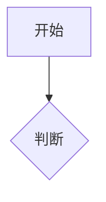
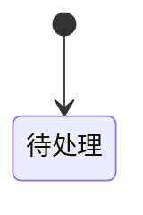

# 业务设计 · Business Design: {{TASK_ID}}

<!-- 元信息见 frontmatter（artifactId/version）。本模板为结构骨架，填具体业务内容，勿留占位符。常见错误/质量标准详见 docs/design/target-design-template-model.md §2。 -->

## 1. 需求背景  <!-- Requirement Context · Gate: QG-BD-001 -->
<!-- 写什么：需求来源、触发原因、上下文；可追溯到输入 -->
- 来源（EV/REQ）：
- 触发原因：

## 2. 业务目标  <!-- Business Objectives -->
<!-- 写什么：可衡量目标，与验收相关 -->
- 目标（REQ/NFR）：

## 3. 干系人与用户角色  <!-- Stakeholders & Roles -->
<!-- 写什么：角色、影响、关注点；覆盖主要使用者与运营/审核方 -->
| 角色 | 描述 | 关注点 | 影响 |
|------|------|--------|------|

## 4. 业务范围  <!-- Scope · Gate: QG-BD-004 -->
<!-- 写什么：In/Out of Scope，边界明确 -->
**In Scope:**
-
**Out of Scope:**

## 5. 当前业务现状  <!-- Current State · Gate: QG-EV-001 -->
<!-- 写什么：存量流程和规则；现状必须有 evidence -->
依据（EV）：

## 6. 目标业务流程  <!-- Target Business Process -->
<!-- 写什么：正常流/异常流/替代流；Mermaid flowchart + 图后说明。小任务可写"不适用，理由：…" -->

## 7. 业务规则清单  <!-- Business Rules · Gate: QG-BD-006 -->
<!-- 写什么：每条规则编号、来源、可验证表达 -->
| BR ID | 规则 | 来源(EV/ASM) | 优先级 | 可验证表达 |
|-------|------|-------------|--------|-----------|

## 8. 决策表  <!-- Decision Table -->
<!-- 写什么：条件组合 → 结果；覆盖关键分支 -->
| 条件1 | 条件2 | → 结果 |
|-------|-------|--------|

## 9. 状态模型  <!-- State Model · Gate: QG-BD-008 -->
<!-- 写什么：业务状态与转移，含异常/终止状态；stateDiagram -->

## 10. 领域术语  <!-- Terminology -->
<!-- 写什么：术语、定义、别名；与知识库一致 -->
| 术语 | 定义 | 别名 |
|------|------|------|

## 11. 输入输出数据  <!-- Input/Output Data -->
<!-- 写什么：业务输入/输出/所有者；数据 owner 明确（不写 DB 设计） -->
| 数据项 | 方向(入/出) | Owner | 说明 |
|--------|-----------|-------|------|

## 12. 验收标准  <!-- Acceptance Criteria -->
<!-- 写什么：可验证条件，可转测试场景 -->
| AC ID | 条件 | 关联 BR |
|-------|------|---------|

## 13. 需求追溯矩阵  <!-- RTM · Gate: QG-TR-001 -->
<!-- 写什么：REQ → BR → AC，无孤儿需求 -->
| REQ | BR | AC | 状态 |
|-----|----|----|------|

## 14. 假设与开放问题  <!-- Assumptions & Open Questions · Gate: QG-ASM-001 -->
<!-- 写什么：ASM 带 confidence/needsConfirmation；高风险需人工确认 -->
| ASM ID | 假设 | confidence | 需确认 |
|--------|------|-----------|--------|

开放问题：
-

## 15. 交接契约（给 solution-design）  <!-- Handoff → SE -->
<!-- 写什么：SE 必须消费的字段 -->
- 业务目标 / 业务规则 / 状态模型 / 验收标准 / 假设：

## 依据汇总  <!-- Evidence References -->
<!-- 全文引用的 EV ID -->
依据：
