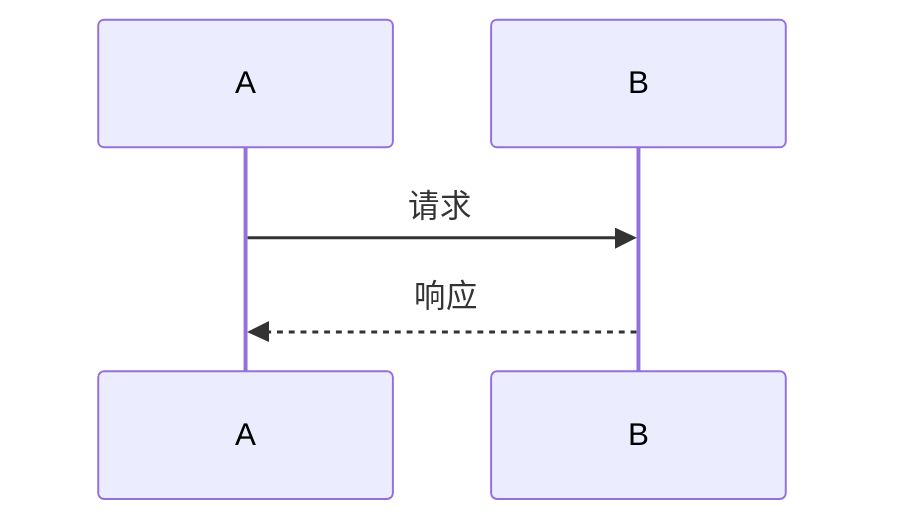
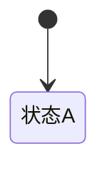

# 实现设计 · Implementation Design: {{TASK_ID}}

<!-- 元信息见 frontmatter。模块/文件影响必须来自 repository evidence（EV-REPO），只记路径/符号/调用关系，不复制大段源码。本阶段只设计，不写代码。质量标准详见 docs/design/target-design-template-model.md §4。 -->

## 1. 实现目标与范围  <!-- Goals & Scope -->
<!-- 写什么：实现边界、非目标；对齐 solution -->
- 目标（DEC）：
- 非目标：

## 2. 模块影响  <!-- Module Impact · Gate: QG-ID-002 -->
<!-- 写什么：MOD ID、模块、影响类型；来自 repo evidence -->
| MOD ID | 模块 | 影响类型 | 依据(EV-REPO) |
|--------|------|---------|--------------|

## 3. 文件影响  <!-- File Impact -->
<!-- 写什么：文件、变更类型、owner；路径可定位 -->
| 文件 | 变更类型(new/modify/delete) | Owner | 说明 |
|------|---------------------------|-------|------|

## 4. 类 / 接口 / 函数设计  <!-- Types & Functions -->
<!-- 写什么：签名、职责、输入输出；可编码 -->
| 名称 | 类型(类/接口/函数) | 签名 | 职责 |
|------|------------------|------|------|

## 5. DTO / Entity / 配置对象  <!-- Data Objects -->
<!-- 写什么：字段、兼容、默认值；数据影响明确 -->
| 对象 | 字段 | 类型 | 兼容性 | 默认值 |
|------|------|------|--------|--------|

## 6. 关键流程时序图  <!-- Sequence Diagram · Gate: QG-ID-006 -->
<!-- 写什么：调用顺序与失败路径；覆盖主要链路 + 图后说明 -->

## 7. 数据流与状态机  <!-- Data Flow & State Machine · Gate: QG-ID-006 -->
<!-- 写什么：数据变化和状态转移；与 solution 一致 -->

数据流说明：

## 8. 算法与规则实现  <!-- Algorithm & Rule Implementation -->
<!-- 写什么：业务规则如何实现；BR 可追溯 -->
| BR ID | 实现方式 | 说明 |
|-------|---------|------|

## 9. DB / API / 配置变更  <!-- DB/API/Config Changes -->
<!-- 写什么：schema/API/config 变更；迁移/回滚 -->
| 变更项 | 类型 | 迁移 | 回滚 |
|--------|------|------|------|

## 10. 错误处理 / 并发 / 事务 / 幂等  <!-- Error/Concurrency/Tx/Idempotency · Gate: QG-ID-009 -->
<!-- 写什么：边界和策略；高风险项不可空 -->
| 项 | 策略 | 说明 |
|----|------|------|
| 错误处理 | | |
| 并发 | | |
| 事务 | | |
| 幂等 | | |

## 11. 日志监控 / 测试钩子  <!-- Observability & Test Seams -->
<!-- 写什么：log/metric/test seam；可验证、可测试 -->
| 类型 | 内容 | 说明 |
|------|------|------|
| 日志 | | |
| 监控指标 | | |
| 测试钩子 | | |

## 12. 回滚策略与风险  <!-- Rollback & Risk -->
<!-- 写什么：回滚、降级、残余风险；owner 明确 -->
- 回滚策略：
- 降级：
| RISK ID | 残余风险 | owner |
|---------|---------|-------|

## 13. 交接契约（给 DEV / test）  <!-- Handoff -->
<!-- 写什么：实现计划输入、测试输入；可派生任务/用例 -->
- 给 DEV（implementation-plan）：文件影响 / 签名 / 迁移回滚 / 测试钩子
- 给 test：实现风险 / 状态机 / 错误路径 / 测试钩子

## 依据汇总  <!-- Evidence References (EV-REPO) -->
依据：
