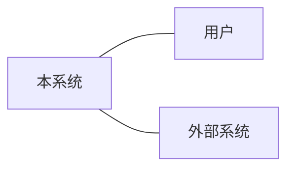
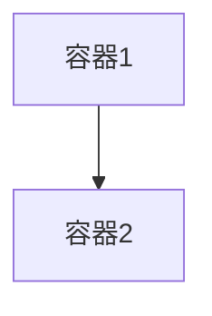
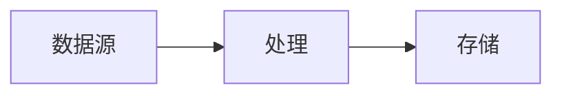

# 方案设计 · Solution Design: {{TASK_ID}}

<!-- 元信息见 frontmatter。本模板为结构骨架，填具体架构内容，勿留占位符。接口/边界声明须可追溯到 EV/DEC。质量标准详见 docs/design/target-design-template-model.md §3。 -->

## 1. 架构目标与约束  <!-- Goals & Constraints -->
<!-- 写什么：目标、约束、非目标；对齐 business -->
- 目标：
- 约束：
- 非目标（DEC）：

## 2. 需求到架构追溯  <!-- Requirement → Architecture -->
<!-- 写什么：REQ/BR → ARCH/API/MOD，无孤儿规则 -->
| REQ/BR | 承接(ARCH/API/MOD) | 说明 |
|--------|-------------------|------|

## 3. 系统上下文 · C4 Context  <!-- C4 Context · Gate: QG-SD-002 -->
<!-- 写什么：系统、用户、外部系统；边界清晰 + 图后说明 -->

## 4. C4 Container / Component  <!-- C4 Container/Component -->
<!-- 写什么：容器/组件、职责、交互；层级不混乱 -->

## 5. 4+1 视图覆盖矩阵  <!-- 4+1 Views · Gate: QG-SD-004 -->
<!-- 写什么：logical/development/process/physical/scenario；中高风险覆盖受影响视图 -->
| 视图 | 是否受影响 | 风险 | 表达方式(图/说明) |
|------|-----------|------|------------------|
| logical | | | |
| development | | | |
| process | | | |
| physical | | | |
| scenario | | | |

## 6. 模块边界  <!-- Module Boundaries -->
<!-- 写什么：模块职责与依赖；单一职责、依赖方向清楚 -->
| 模块 | 职责 | 依赖 |
|------|------|------|

## 7. 接口契约  <!-- Interface Contracts · Gate: QG-API-001 -->
<!-- 写什么：request/response/error/auth/version/兼容性 -->
| API | 方法 | request | response | error | auth | version |
|-----|------|---------|----------|-------|------|---------|

## 8. 数据模型与数据流  <!-- Data Model & Flow · Gate: QG-DATA-001 -->
<!-- 写什么：数据对象、所有权、迁移、回滚 -->

迁移/回滚：

## 9. 集成设计  <!-- Integration -->
<!-- 写什么：同步/异步、超时、重试、幂等；失败路径明确 -->
| 集成点 | 模式 | 超时/重试 | 幂等 | 失败处理 |
|--------|------|----------|------|---------|

## 10. 质量属性场景  <!-- Quality Attributes · Gate: QG-NFR-001 -->
<!-- 写什么：source/stimulus/environment/response/measure；可验证 -->
| NFR ID | 场景(source/stimulus) | 响应 | 度量 |
|--------|----------------------|------|------|

## 11. 安全 / STRIDE  <!-- Security · Gate: QG-SEC-001 -->
<!-- 写什么：trust boundary、威胁、缓解；涉权/PII/外部输入 -->
| 威胁(STRIDE) | 位置 | 缓解 |
|-------------|------|------|

## 12. 架构决策与权衡  <!-- Decisions · Gate: QG-DEC-001 -->
<!-- 写什么：备选、取舍、后果；关键取舍有 DEC ID（落 decisions/） -->
| DEC ID | 决策 | 备选 | 取舍理由 |
|--------|------|------|---------|

## 13. 架构风险  <!-- Architecture Risks -->
<!-- 写什么：RISK、影响、缓解、owner -->
| RISK ID | 风险 | 影响 | 缓解 | owner |
|---------|------|------|------|-------|

> 涉及部署/配置/迁移/数据变更 → 标记触发 CIE。

## 14. 交接契约（给 implementation / test / CIE）  <!-- Handoff -->
<!-- 写什么：下游必须消费的字段 -->
- 给 implementation：模块边界 / 接口契约 / 数据模型 / NFR / 风险
- 给 test：接口契约（契约测试）/ 质量属性场景 / 风险
- 给 CIE（条件触发）：部署 / 迁移项

## 依据汇总  <!-- Evidence References -->
依据：
